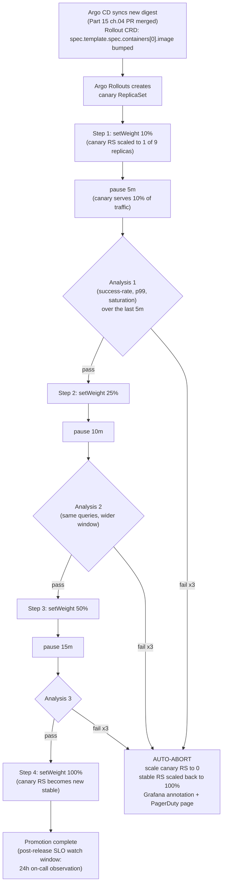

# 15.06 — Progressive delivery in production

> The production deepening of [Part 07 ch.05](../07-delivery/05-progressive-delivery.md):
> an Argo Rollouts canary in **production**, gated by an `AnalysisTemplate`
> querying real Prometheus **SLO metrics** (success-rate, p99 latency,
> saturation), auto-promote on green / auto-rollback on red, **blue-green
> for stateful workloads** where rolling-traffic-shift would split
> writes, **manual pause / resume** as a deliberate intervention surface,
> the SLO-gate handoff between Rollouts and Grafana, and the production
> footguns the dev-cluster demo couldn't surface — the "canary that
> succeeded but the long-tail user broke", canary-as-percentage vs
> canary-as-cohort, and the rollback-to-last-known-good runbook.

**Estimated time:** ~30 min read · ~90 min hands-on
**Prerequisites:** [Part 07 ch.05](../07-delivery/05-progressive-delivery.md) — Rollouts mechanics this chapter productionizes · [Part 11 ch.03](../06-production-readiness/01-observability-metrics.md) — SLOs that define the gate · [Part 15 ch.04](./04-multi-environment-promotion.md) — promotion path the canary lives on

**You'll know after this:** • configure an Argo Rollouts canary gated by an `AnalysisTemplate` over real Prometheus SLO metrics (success-rate, p99 latency, saturation) · • implement auto-promote on green / auto-rollback on red without human intervention · • choose blue-green for stateful workloads where rolling traffic shift would split writes · • design manual pause/resume as a deliberate intervention surface, not a workaround · • debug the production footguns dev-cluster demos hide ("canary succeeded but long-tail user broke", canary-as-percentage vs canary-as-cohort)

<!-- tags: argo-rollouts, slo, day-2, observability, gitops -->

## Why this exists

[Part 07 ch.05](../07-delivery/05-progressive-delivery.md) shipped the
mechanics: Argo Rollouts CRD replaces the Deployment, canary steps with
`setWeight` and `pause`, an `AnalysisTemplate` queries Prometheus, the
rollout auto-aborts on `failureLimit`. The demo was honest: a kind
cluster, a single catalog Pod, errors induced by an env-var flip. The
mechanic works.

In **production** three things change:

1. **The metric IS the SLO.** A demo can pick a Prometheus query that
   captures errors; production must pick a query that captures the
   *service-level objective* the platform commits to ([Part 06 ch.01](../06-production-readiness/01-observability-metrics.md)
   was the SRE-grade observability foundation). A 99.9% availability
   SLO is a 0.1% error budget; a canary that emits 0.2% errors for 5
   minutes is **already 100% over budget for an hour**. The
   `AnalysisTemplate` query must encode the actual SLO, including the
   time window over which it is measured, the percentile latency the
   platform commits to, and the saturation thresholds that predict
   imminent failure (CPU, memory, queue depth).
2. **The traffic is real and adversarial.** Demo traffic is uniform;
   production traffic has cohorts (large customer A, region B, browser
   C). A 10% canary serves a 10% slice of *random* requests by default
   — but the long-tail customer whose query plan takes 2 seconds is
   unevenly distributed, and a 10% canary that successfully serves 999
   out of 1000 normal users while breaking the 1 enterprise customer's
   $50k/month order is a successful rollout *by metrics* and a fired
   account manager *by reality*. The platform's defense — **canary by
   cohort, not just by percentage** — costs more to wire but saves
   careers.
3. **The blast radius compounds with the platform.** A canary that
   takes down the catalog might not just take orders; it might
   cascade: orders retry → orders' DB connection pool fills →
   payments-worker stalls → events backlog grows → recommendations'
   feature serving falls behind. The SLO-gate has to see *upstream*
   and *downstream* signals, not just the canary's own metrics. The
   platform's pattern: each canary's `AnalysisTemplate` queries the
   service's own `RED` metrics **and** the immediate downstream's
   `USE` metrics; either tripping aborts the canary.

This chapter is the production-grade canary made real on the Bookstore
Platform's catalog service: a Rollout CRD shipped via Argo CD ([ch.04](04-multi-environment-promotion.md)),
gated by an `AnalysisTemplate` querying real SLO metrics from the Phase
14-installed managed Prometheus, with auto-rollback wired through to
Grafana annotations and PagerDuty notifications. Blue-green is the
companion pattern for the stateful workloads (CNPG cluster minor-
version bumps, Strimzi Kafka broker rolls) where the canary's "shift
some traffic" model would split data.

## Mental model

**Production progressive delivery is not "canary mechanics"; it is "an
SLO-gated control loop with bounded blast radius and a manual override
that NEVER kills user experience to satisfy the rollout".**

- **Canary = traffic-shift release.** vN serves 100%; vN+1 stands up;
  the controller shifts a *slice* of traffic to vN+1 in steps (10 → 25
  → 50 → 100%), measures SLOs at each step, promotes if green, aborts
  + rolls back if red. The catalog Deployment is the textbook canary
  target — stateless, idempotent reads, horizontal scaling.
- **Blue-green = full-stack swap.** vN and vN+1 both run at full scale
  in parallel; the controller flips the Service from blue to green at
  one instant. Used for stateful workloads where "shift 10% of writes
  to a new schema" would mean *some* writes land in vN's schema and
  *some* in vN+1's — undefined data state. CNPG cluster bumps and
  Strimzi Kafka broker rolls use blue-green for this reason. The trade-
  off: 2x resources during the bake; rollback is instant (flip back).
- **AnalysisTemplate = the SLO encoded as PromQL.** Three queries
  matter: (a) **success-rate** — the inverse of error-rate, gated to
  the canary's traffic (not the stable's); (b) **p99 latency** —
  bounded to the SLO's promised tail; (c) **saturation** — CPU /
  memory / queue depth predicting near-future failure even when
  current errors are zero. All three must pass; any one tripping
  failureLimit times aborts the rollout.
- **Pause-resume is the human override surface.** A canary at 25%
  that has passed analysis can be *paused indefinitely* with `kubectl
  argo rollouts pause`. The traffic stays at 25%; the rollout waits
  for `kubectl argo rollouts promote` (or `abort`). This is the
  surface for: (a) overnight soaks; (b) coordinating with another
  team's deploy; (c) waiting for a customer's incident window to
  close; (d) holding traffic during a black-Friday freeze. The rule:
  **pause does not block subsequent rollouts of OTHER services** —
  only this one waits.
- **Auto-rollback writes a Grafana annotation and a PagerDuty page.**
  Rollback is mechanical (the controller scales canary RS to zero) but
  the human-facing signal is critical: a Grafana annotation marks the
  rollback timestamp on every relevant dashboard; PagerDuty pages the
  on-call. Without the human signal, "auto-rollback" feels like magic
  the team cannot reason about — the [Part 06 ch.01](../06-production-readiness/01-observability-metrics.md)
  observability discipline.

The trap to keep in view: **a successful canary is not a successful
release**. The canary proves the new code doesn't break the 10% of
traffic measured during analysis. It does not prove the new code
handles a Black Friday spike, an enterprise customer's batch job at
midnight UTC, or a feature flag that hasn't been turned on yet (Part 15 ch.08 — feature flags + dark launches, landing in Phase 15c).
Canary is *necessary*, not *sufficient*. The discipline: pair every
canary with a **post-release SLO watch window** (the platform's rule:
24h after 100% rollout, the on-call watches the same dashboards the
canary's AnalysisTemplate queried; any regression triggers a rollback
PR — Part 15 ch.07's pattern).

## Diagrams

### Diagram A — The catalog Rollout: steps, analysis, abort path (Mermaid)



### Diagram B — Canary by percentage vs canary by cohort (ASCII)

```
 CANARY BY PERCENTAGE (the default) ───────────────────────────────────────
                                  10%   25%   50%   100%
   vN  (stable)  ████████████████ 90 │ 75 │ 50 │   0
   vN+1 (canary) ░░░░░░░░░░░░░░░░ 10 │ 25 │ 50 │ 100
                                  └───┴────┴────┘
                                  Random sampling of all users.

   PRO: simple to configure (Istio VirtualService weight, or Argo
        Rollouts' direct ReplicaSet ratio).
   CON: "long-tail breaks for 1 enterprise customer" → false-green.
        The canary measures the average; the enterprise customer's
        bespoke query plan is the outlier the average misses.

 CANARY BY COHORT (the production-grade pattern) ──────────────────────────
   Header: x-canary-cohort
     internal      → 100% canary (employees + integration tests)
     beta-tenants  → 25% canary  (volunteer customer cohort)
     enterprise    → 0% canary   (NEVER until 100% promoted)
     default       → percentage canary (10 → 25 → 50)

   Routing is in the Istio VirtualService:
     match:
       - headers: { x-canary-cohort: { exact: internal } }
         route: [{ destination: catalog, subset: canary, weight: 100 }]
       - headers: { x-canary-cohort: { exact: enterprise } }
         route: [{ destination: catalog, subset: stable,  weight: 100 }]
       - route: [ stable: 90, canary: 10 ]

   PRO: blast-radius IS bounded by cohort. The enterprise customer
        cannot be the canary's victim.
   CON: needs the upstream (storefront / API gateway) to set the
        cohort header — the cohort definition is the API team's contract.

 The platform uses BOTH: percentage canary for the default cohort PLUS
 explicit cohort routing for internal (100% canary) and enterprise
 (0% canary until the rollout completes).
```

## Hands-on with the Bookstore Platform

**Assumed working directory: the guide repo root (`full-guide/`).** This
chapter extends [Part 07 ch.05](../07-delivery/05-progressive-delivery.md)'s
catalog Rollout with the production AnalysisTemplate, blue-green for
CNPG, and the cohort-routing Istio VirtualService. The manifests land
in `examples/bookstore-platform/argocd/rollouts/` (extending the
existing argocd tree).

We will: (0) verify Argo Rollouts + Prometheus + Istio are installed;
(1) ship the production AnalysisTemplate with three SLO queries; (2)
ship the catalog Rollout consuming that AnalysisTemplate; (3) deploy a
new digest and watch a green canary auto-promote; (4) deploy a buggy
digest and watch the canary auto-abort with PagerDuty + Grafana
annotation; (5) demonstrate blue-green for the CNPG cluster bump.

### 0. Prerequisites — Rollouts, Prometheus, Istio, Argo CD

```sh
# Argo Rollouts (Helm; own ns); Prometheus (kube-prometheus-stack from
# Part 06 ch.01 / Part 14 ch.05); Istio (Part 11 ch.04). The Phase 13
# platform-base bootstraps all three.
kubectl get deploy -n argo-rollouts
kubectl get statefulset -n monitoring | grep prometheus
kubectl get deploy -n istio-system | grep istiod
kubectl get application -n argocd | grep bookstore

# The Argo Rollouts kubectl plugin (best UX):
kubectl argo rollouts version
```

### 1. The production AnalysisTemplate — three SLO queries

The AnalysisTemplate is named, reusable, and parameterized by the
service name. Three metrics: success-rate, p99, saturation. Each has
its own `successCondition` and `failureLimit`.

```yaml
# examples/bookstore-platform/argocd/rollouts/analysis-template-slo.yaml
apiVersion: argoproj.io/v1alpha1
kind: AnalysisTemplate
metadata:
  name: bookstore-slo-gate
  namespace: bookstore-platform-acme-books
spec:
  args:
    - name: service-name      # parameter: catalog, orders, payments-worker
    - name: canary-pod-hash   # the canary RS's pod-template-hash label
  metrics:
    # ── SUCCESS RATE — 1 - error-rate, gated to the CANARY's traffic ─────
    - name: success-rate
      interval: 60s
      count: 5                # take 5 samples (5 minutes)
      successCondition: result[0] >= 0.999    # 99.9% SLO
      failureLimit: 2          # 2 failures in 5 = abort
      provider:
        prometheus:
          address: http://prom-stack-kube-prom-prometheus.monitoring.svc:9090
          query: |
            sum(rate(http_requests_total{
              service="{{args.service-name}}",
              pod=~".*-{{args.canary-pod-hash}}-.*",
              status!~"5.."
            }[2m]))
            /
            sum(rate(http_requests_total{
              service="{{args.service-name}}",
              pod=~".*-{{args.canary-pod-hash}}-.*"
            }[2m]))
    # ── P99 LATENCY — the long-tail SLO ──────────────────────────────────
    - name: p99-latency
      interval: 60s
      count: 5
      successCondition: result[0] <= 0.500    # 500ms tail
      failureLimit: 2
      provider:
        prometheus:
          address: http://prom-stack-kube-prom-prometheus.monitoring.svc:9090
          query: |
            histogram_quantile(0.99,
              sum by (le) (
                rate(http_request_duration_seconds_bucket{
                  service="{{args.service-name}}",
                  pod=~".*-{{args.canary-pod-hash}}-.*"
                }[2m])
              )
            )
    # ── SATURATION — CPU near the request limit predicts imminent failure ─
    - name: cpu-saturation
      interval: 60s
      count: 5
      successCondition: result[0] <= 0.85      # < 85% of request
      failureLimit: 2
      provider:
        prometheus:
          address: http://prom-stack-kube-prom-prometheus.monitoring.svc:9090
          query: |
            avg(
              rate(container_cpu_usage_seconds_total{
                pod=~".*-{{args.canary-pod-hash}}-.*",
                container="{{args.service-name}}"
              }[2m])
              /
              kube_pod_container_resource_requests{
                pod=~".*-{{args.canary-pod-hash}}-.*",
                container="{{args.service-name}}",
                resource="cpu"
              }
            )
```

### 2. The catalog Rollout — four steps, analysis between each

```yaml
# examples/bookstore-platform/argocd/rollouts/catalog-rollout.yaml
apiVersion: argoproj.io/v1alpha1
kind: Rollout
metadata:
  name: catalog
  namespace: bookstore-platform-acme-books
spec:
  replicas: 9                  # production scale
  revisionHistoryLimit: 5
  strategy:
    canary:
      canaryService: catalog-canary       # Service routing to canary RS
      stableService: catalog-stable       # Service routing to stable RS
      trafficRouting:
        istio:
          virtualService:
            name: catalog
            routes:
              - primary
      steps:
        - setWeight: 10
        - pause: { duration: 5m }
        - analysis:
            templates:
              - templateName: bookstore-slo-gate
            args:
              - name: service-name
                value: catalog
              - name: canary-pod-hash
                valueFrom:
                  podTemplateHashValue: Latest
        - setWeight: 25
        - pause: { duration: 10m }
        - analysis:
            templates: [{ templateName: bookstore-slo-gate }]
            args:
              - name: service-name
                value: catalog
              - name: canary-pod-hash
                valueFrom:
                  podTemplateHashValue: Latest
        - setWeight: 50
        - pause: { duration: 15m }
        - analysis:
            templates: [{ templateName: bookstore-slo-gate }]
            args:
              - name: service-name
                value: catalog
              - name: canary-pod-hash
                valueFrom:
                  podTemplateHashValue: Latest
      # On abort: scale canary to zero, restore stable to 100%, emit a
      # Grafana annotation via a postRollback hook (the Argo Rollouts
      # `abort` event is what the Phase 13 observability stack
      # listens for; the annotation appears on the catalog SLO dashboard).
      abortScaleDownDelaySeconds: 30
  selector:
    matchLabels: { app: catalog }
  template:
    metadata:
      labels: { app: catalog }
    spec:
      # Pod template is byte-identical to the catalog Deployment in
      # examples/bookstore-platform/app/catalog/. The Rollout REPLACES
      # the Deployment; the template carries forward.
      containers:
        - name: catalog
          # The image bumps via the Kustomize overlay (Part 15 ch.04);
          # the digest is what Argo CD syncs.
          image: 123456789012.dkr.ecr.us-east-1.amazonaws.com/bookstore-platform/catalog@sha256:PLACEHOLDER
          ports: [{ containerPort: 8080 }]
          envFrom:
            - secretRef: { name: catalog-db-credentials }
          # ... (the rest of the Part 13 catalog template — restricted SC,
          # probes, resource requests/limits)
```

The companion Istio `VirtualService` (not shown verbatim — the shape is
in Diagram B) carries the cohort routing: `x-canary-cohort` headers
override the percentage. The platform's storefront sets this header
for internal employees (always canary) and for enterprise tenants
(never canary until 100%).

### 3. Deploy a green digest — watch the canary auto-promote

```sh
# PR-merge → Argo CD syncs → the Rollout's image field updates
kubectl argo rollouts get rollout catalog -n bookstore-platform-acme-books --watch

# Visible output (over ~30 minutes):
#   ✔ Healthy → ✔ Progressing
#   Step 1/8: setWeight 10  → 1/9 replicas canary
#   Step 2/8: paused 5m
#   Step 3/8: analysis bookstore-slo-gate ... ✔ all metrics pass
#   ...
#   Step 8/8: 100% → canary becomes new stable
#   ✔ Healthy

# Verify the Grafana annotation appears on the SLO dashboard:
curl -s "https://grafana.bookstore-platform.example.com/api/annotations?dashboardUID=catalog-slo&from=now-1h" \
  | jq '.[] | { time, text }'
# Expect: { time: <rollout-start>, text: "catalog rollout: abc123 → def456 promoted" }
```

### 4. Deploy a buggy digest — watch the canary auto-abort

For the demo, induce a regression: a new catalog image with
`SIMULATE_5XX=true` env var. The first analysis cycle sees error-rate
spike; failureLimit trips at sample 3; rollout aborts.

```sh
kubectl argo rollouts set image catalog catalog=catalog:buggy -n bookstore-platform-acme-books
kubectl argo rollouts get rollout catalog -n bookstore-platform-acme-books --watch

# Visible output:
#   Step 1/8: setWeight 10  → 1/9 replicas canary
#   Step 2/8: paused 5m
#   Step 3/8: analysis bookstore-slo-gate ...
#     success-rate: 0.85 (THRESHOLD 0.999) ✗ failure 1
#     success-rate: 0.83                    ✗ failure 2 ← failureLimit reached
#   ✘ Aborted: scale canary RS → 0; stable RS → 100%

# Verify PagerDuty incident was opened:
pd incident list | head -1
#   #IxxxYY  catalog-rollout-aborted  Phase 15 ch.10 (incident response)

# Verify the Grafana annotation marks the abort:
curl -s "https://grafana.bookstore-platform.example.com/api/annotations?dashboardUID=catalog-slo&from=now-1h" \
  | jq '.[] | { time, text, tags }'
# Expect: { time: <abort-time>, text: "catalog rollout ABORTED: success-rate 0.85 < 0.999", tags: ["argo-rollouts", "abort"] }
```

### 5. Blue-green for the CNPG cluster bump (stateful workload)

CNPG cluster minor-version bumps cannot be canaried — splitting writes
between two cluster versions corrupts data. The pattern is blue-green:
stand up a *second* CNPG cluster (green) replicating from the first
(blue), wait for replication lag = 0, cut the catalog's
ExternalSecret + Service to green, drop blue.

```yaml
# examples/bookstore-platform/argocd/rollouts/cnpg-bluegreen.yaml
apiVersion: argoproj.io/v1alpha1
kind: Rollout
metadata:
  name: postgres-bluegreen     # operates a Service swap, not a Pod swap
  namespace: bookstore-platform-acme-books
spec:
  strategy:
    blueGreen:
      activeService: postgres
      previewService: postgres-preview
      autoPromotionEnabled: false   # NEVER auto-promote stateful blue-green
      prePromotionAnalysis:
        templates: [{ templateName: cnpg-replication-lag-gate }]
      postPromotionAnalysis:
        templates: [{ templateName: bookstore-slo-gate }]
        args: [{ name: service-name, value: catalog }]
      scaleDownDelaySeconds: 1800   # 30min before tearing blue down
  selector: { matchLabels: { app: postgres-router } }
  template: { ... }   # the Service-router Pod (production: a PgBouncer
                     #   that routes to either blue or green based on a
                     #   labelSelector flip — the BlueGreen strategy
                     #   updates the Service selector, not the Pods)
```

The CNPG-replication-lag-gate analysis polls the green cluster's
`pg_replication_lag` metric until it hits zero; only then is the
prePromotionAnalysis green and the human operator runs
`kubectl argo rollouts promote postgres-bluegreen`. The
postPromotionAnalysis is the same SLO gate the catalog rollout uses —
if the catalog's success-rate degrades after the DB cutover, the
postPromotionAnalysis fails and the rollout reverses (cutting the
Service back to blue).

## How it works under the hood

**Argo Rollouts' controller and the ReplicaSet machinery.** A
Rollout's `spec.template` is a Pod template, exactly like a
Deployment's. The controller creates a ReplicaSet per template-hash
(also like a Deployment) but adds the canary/blue-green orchestration:
which RS is "stable", which is "canary", how to set their replica
counts to match the step weight. The traffic routing (Istio
VirtualService, Nginx Ingress, ALB) is what shifts the actual traffic
percentages — Argo Rollouts patches the routing object as part of each
step. Without traffic routing, the percentage IS the replica ratio
(works on kind; works in production at low scale; not good at high
scale where you want fine-grained percentage control without scaling
to 100 replicas).

**Why the canary-pod-hash matters in the AnalysisTemplate.** The
Prometheus query `pod=~".*-{{args.canary-pod-hash}}-.*"` is what
restricts the metrics to the canary RS only. Without this, the query
sees the average across stable AND canary — and a 10% canary's 80%
success-rate gets averaged with stable's 99.9% to produce 97.9%,
falsely passing a 0.99 threshold. The `valueFrom: podTemplateHashValue:
Latest` is Argo Rollouts injecting the current canary RS's pod-
template-hash label at analysis time; the query filters precisely.

**The "successCondition" expression language.** Argo Rollouts uses
expr-lang ([github.com/expr-lang/expr](https://github.com/expr-lang/expr))
to evaluate `successCondition`. The `result` variable is the
Prometheus query result; `result[0]` is the first (and usually only)
sample. For multi-sample queries, the expression can be
`all(result, # >= 0.999)` (all samples pass) or `len(result) > 0 ? max(result) <= 0.5 : false`
(empty result = fail). The platform's discipline: **always guard for
empty result** — a query that returns no data (Prometheus is down, the
service has zero traffic, the pod-hash doesn't match) MUST evaluate to
failure, not silent pass.

**Auto-rollback's mechanics.** When `failureLimit` is reached, the
controller emits an `Aborted` event and scales the canary RS to zero.
The stable RS, which was scaled down proportionally to make room for
the canary, is scaled back to 100%. The Service / VirtualService is
re-patched to route 100% to the stable RS. Existing connections to
canary Pods are terminated by Pod deletion (Kubernetes Pod termination
respects the Pod's `terminationGracePeriodSeconds`). The whole
rollback completes in `abortScaleDownDelaySeconds` (default 30s); the
Grafana annotation + PagerDuty page fire from a webhook the controller
emits.

**The "long-tail customer broke" pattern, mechanically.** A 10%
canary serves 10% of *requests*, not 10% of *customers*. If customer A
makes 1000 requests per minute and customer B makes 1 request per
minute, the canary serves ~100 of A's requests and ~0.1 of B's. The
analysis sees only A's behavior — a regression that ONLY breaks B is
invisible to the percentage canary. The defense: cohort routing (the
storefront sets `x-canary-cohort: enterprise` for B; the
VirtualService routes B's traffic 100% to stable). The cohort is the
*business unit's blast-radius decision*, not a technical one — the
storefront product team decides which customers are "never canary",
and the platform's VirtualService encodes that decision.

**Why blue-green for stateful workloads.** A CNPG cluster bump from
Postgres 16.1 to 16.2 is a minor version, no SQL incompatibility. A
canary that wrote 10% of new orders to a 16.2 replica and 90% to a
16.1 primary would *work* (no incompatibility) but break logical
replication assumptions — the 16.2 replica's WAL has different
encoding nuances and downstream consumers (Debezium CDC, logical
replicas in other regions) trip. Blue-green stands up an entire 16.2
cluster, replicates ALL data via streaming replication until lag = 0,
flips the Service at one instant. No traffic ever sees a mixed-version
state. The cost: 2x storage + 2x compute during the bake (hours, in
practice); on a 100GB Postgres that is $X for the bake window. Cheaper
than data corruption.

**Pause-resume semantics.** A Rollout in a `pause: {}` step (no
`duration`) waits indefinitely; `kubectl argo rollouts promote
catalog` advances it. A `pause: { duration: 10m }` waits 10m by
default but can be force-promoted earlier or paused-indefinitely with
`kubectl argo rollouts pause catalog`. The state machine is small:
Healthy → Progressing → Paused (or → Aborted); Paused → Progressing
(promote) or Aborted (abort) or back to Paused (force-pause re-
applied). The catalog Rollout's three indefinite pauses for analysis
are the SLO gates; the explicit-duration pauses are the SLO-observation
windows.

**Cohort routing's API contract.** The `x-canary-cohort` header is a
**platform-team-owned contract**. Every service that supports it has
a stable `subset` label and a canary `subset` label on its
Deployment/Rollout; the Istio `DestinationRule` defines the subsets;
the `VirtualService` matches on headers. Adding a new cohort
(`partner`, `internal-test`, `beta-tier-2`) is a `VirtualService`
change committed to GitOps. The header lifecycle is: storefront sets
it at the edge based on a customer attribute; every internal hop
preserves it (the Istio sidecar copies it forward). A service that
strips the header at its hop breaks the contract.

## Production notes

> **In production:** Every Rollout has an `AnalysisTemplate`, never
> "promote on time alone". The "pause 60s then go" pattern in tutorials
> is the dev pattern; production gates on Prometheus, not on
> wall-clock. A rollout without analysis is a slow RollingUpdate — it
> proves nothing. The platform's invariant: a Rollout PR fails CI if
> the spec has no `analysis` steps.

> **In production:** The AnalysisTemplate's queries ARE the SLO. The
> three queries (success-rate, p99, saturation) are the same queries
> the Grafana SLO dashboard renders. The same numbers. The same time
> windows. The same labels. A canary that fails analysis is a canary
> that pushed the service over its SLO budget; a canary that passes
> analysis is one whose effect on the SLO was bounded. This is the
> [Part 06 ch.01](../06-production-readiness/01-observability-metrics.md)
> "SLO is a budget" idea applied at the release surface.

> **In production:** Canary by cohort for high-value customers, never
> just by percentage. The enterprise customer cohort is `x-canary-
> cohort: enterprise` → 100% stable; the internal cohort is `x-canary-
> cohort: internal` → 100% canary; the default cohort gets the
> percentage canary. The storefront API gateway sets the header; the
> platform's discipline is to surface this in the API team's
> onboarding doc. Without cohort routing the canary is a statistical
> rollout, not a controlled one.

> **In production:** Blue-green for stateful workloads, canary for
> stateless. The platform's catalog / orders / payments-worker /
> storefront / recommendations are stateless — canary. The CNPG
> cluster / Strimzi Kafka brokers / Redis Sentinel cluster are
> stateful — blue-green. The Rollout's `strategy` field is the
> choice; the chapter's two examples are the platform's two patterns.

> **In production:** Auto-promote on green, NEVER on stateful.
> `autoPromotionEnabled: true` on a canary is the platform default —
> green analysis advances the rollout automatically. On a blue-green
> for stateful workloads, `autoPromotionEnabled: false` is mandatory:
> a human must explicitly promote (`kubectl argo rollouts promote`)
> after the post-promotion analysis is green. The reason: the
> blue-green flip is irreversible-ish (rollback is "flip back" but
> data written to green won't replicate back to blue if the swap was
> followed by writes). The human is the final gate.

> **In production:** `abortScaleDownDelaySeconds` is the "let
> in-flight requests drain" window. 30s default; raise it for
> long-running requests (the orders service has a 60s checkout
> webhook timeout — set 120s there). Too short and customers see
> connection-reset; too long and a rollback takes minutes. The
> platform's tuning: each service sets it to 2× its 99th percentile
> request duration.

> **In production:** The "successful canary, but customer still
> broke" pattern is the ONLY way to hold release discipline. After
> 100% promotion, the on-call watches the same dashboards the
> AnalysisTemplate queried for 24 hours. Any regression is a
> rollback PR (Part 15 ch.07 — the rollback playbook, landing in Phase 15c). The
> platform's invariant: every release has a named 24h watch owner
> in the merge commit; if the watch owner is on PTO, the release
> waits. This makes "we deployed, it's green, we moved on" the
> failure mode; "we deployed, watched, signed off after 24h" the
> norm.

> **In production:** Grafana annotations + PagerDuty pages on
> auto-rollback are the human-facing signal that makes
> auto-rollback trustworthy. Without them the team feels the
> rollout vanish — which feels like magic the team cannot reason
> about. The Argo Rollouts controller emits `Aborted` and
> `RolloutCompleted` events; the platform's annotation-pusher (a
> small controller in `examples/bookstore-platform/observability/`)
> turns these events into Grafana annotation API calls and
> PagerDuty incident creates.

> **In production:** The post-deploy SLO watch is what catches the
> "deploy worked, soak missed it" bugs. A canary's analysis window
> is ≤30min; bugs that surface at minute-31 (a memory leak that
> takes 45min to OOM, a cron-triggered code path that runs hourly,
> a customer batch job at midnight UTC) are NOT what canary catches.
> The on-call's 24h watch window is the second line of defense; the
> Part 15 ch.07 rollback playbook is the third.

## Quick Reference

```sh
# Inspect a rollout's status (production-grade view, with --watch):
kubectl argo rollouts get rollout catalog -n bookstore-platform-acme-books --watch

# Force-pause indefinitely (e.g. during a freeze):
kubectl argo rollouts pause catalog -n bookstore-platform-acme-books

# Resume after a paused step:
kubectl argo rollouts promote catalog -n bookstore-platform-acme-books

# Abort and roll back manually (NOT a normal operation — Part 15 ch.07
# rollback playbook covers the GitOps way to make it stick):
kubectl argo rollouts abort catalog -n bookstore-platform-acme-books

# Inspect the analysis runs for a rollout (debug a failed canary):
kubectl get analysisruns -n bookstore-platform-acme-books \
  -l rollout=catalog
kubectl describe analysisrun <name> -n bookstore-platform-acme-books

# Verify the AnalysisTemplate compiles (CRD-intrinsic dry-run note):
kubectl apply --dry-run=client \
  -f examples/bookstore-platform/argocd/rollouts/analysis-template-slo.yaml
#   no matches for kind "AnalysisTemplate" → install Argo Rollouts first
#   (Part 07 ch.05's pinned-Helm install path)

# Inspect the Istio routing during a canary:
kubectl get virtualservice catalog -n bookstore-platform-acme-books -o yaml | yq .spec.http
```

The production-canary checklist:

- [ ] Rollout's `analysis` step references an AnalysisTemplate that
      encodes the actual SLO (not a placeholder threshold).
- [ ] AnalysisTemplate queries the canary's pods specifically via
      `pod=~".*-{{args.canary-pod-hash}}-.*"` — never averaged with
      stable.
- [ ] Three metrics: success-rate, p99 latency, saturation. Each with
      `failureLimit ≥ 2` (single-spike noise should not abort).
- [ ] Empty-result guard in every `successCondition` — empty = fail,
      never silent pass.
- [ ] Cohort routing via Istio VirtualService: enterprise cohort
      always stable, internal cohort always canary.
- [ ] `abortScaleDownDelaySeconds` ≥ 2× p99 request duration.
- [ ] `autoPromotionEnabled: true` for stateless services; `false`
      for stateful (blue-green).
- [ ] Grafana annotation + PagerDuty page wired on `Aborted` and
      `RolloutCompleted` events.
- [ ] Post-deploy 24h SLO watch owner named in the merge commit.
- [ ] Pre-merge CI verifies the Rollout spec compiles and references
      live AnalysisTemplates (no dangling `templateName`).

## Test your understanding

> Try each before opening the answer drawer. The act of trying is the exercise; the answer is the check.

1. **Why does the chapter say "a successful canary is not a successful release"?**
   <details><summary>Show answer</summary>

   A canary proves the new code didn't break the 10-50% of traffic measured during analysis windows of 5-15 minutes each. It does not prove the new code handles a Black Friday spike, an enterprise customer's midnight batch job, a cohort the canary didn't sample, or a feature flag not yet flipped. Canary is necessary but not sufficient. The discipline: pair every canary with a **post-release 24h SLO watch window** — the on-call watches the same dashboards the canary's AnalysisTemplate queried; any regression triggers a rollback PR.

   </details>

2. **A team's canary completes successfully, ships 100% of traffic, and immediately gets a P1 from their largest enterprise customer whose nightly batch job times out. Walk through why the canary missed it and what the chapter recommends.**
   <details><summary>Show answer</summary>

   The canary sampled 10% of *random* requests; the enterprise customer's batch job is a small fraction of total volume but a huge fraction of the customer's contract value. Random sampling misses cohort-specific regressions when the cohort is small but high-stakes. The chapter's defence: **canary by cohort, not just by percentage**. Use Istio VirtualService to keep the enterprise cohort *always on stable* during canaries, route only internal/test traffic to the canary, validate against the enterprise cohort separately in staging with a replay of their request shape, then enable cohort exposure as a manual gate after stable's metrics are clean. "10% random + enterprise excluded" is the discipline that saves accounts.

   </details>

3. **For a CNPG cluster minor-version bump, why does the chapter recommend blue-green over canary?**
   <details><summary>Show answer</summary>

   A canary shifts a *slice* of traffic to vN+1 — for a stateful service that means some writes land in vN's schema and some in vN+1's. The data state becomes undefined and impossible to reason about during the bake. Blue-green stands up both versions at full scale in parallel and flips the Service from blue to green at one instant — all writes go to one or the other, never split. The trade-off: 2x resources during the bake, and you need the schema to be forward-and-backward compatible during the flip (chapter 15.07's "forward-compatible schema" discipline). Rollback is instant — flip back.

   </details>

4. **Hands-on extension — apply a Rollout with an AnalysisTemplate that has a typo'd PromQL query (e.g., `success_rate` instead of `sum(rate(...))`). Deploy a new image.**
   <details><summary>What you should see</summary>

   The Rollout's first analysis step runs; the query fails to return data (empty result set or "metric not found"). Argo Rollouts' default behavior on inconclusive analysis is to retry up to `failureLimit`, then abort. The rollout aborts even though the actual code is fine — a broken metric query failed the SLO gate. The chapter's discipline: **pre-merge CI verifies the Rollout spec compiles and references live AnalysisTemplates** with sanity-checked queries. A canary that auto-aborts because of a typo is a worse failure mode than a canary that ships broken code, because the team starts ignoring the auto-aborts.

   </details>

## Further reading

- **Argo Rollouts documentation — Analysis & Progressive Delivery**
  <https://argoproj.github.io/argo-rollouts/features/analysis/>; the
  authoritative reference for AnalysisTemplate / AnalysisRun /
  ClusterAnalysisTemplate, metric providers, expression language.
- **Argo Rollouts — Best Practices**
  <https://argoproj.github.io/argo-rollouts/best-practices/>; the
  upstream team's guidance on choosing canary vs blue-green, sizing
  analysis windows, and integrating with traffic providers.
- **Sloss et al., _Site Reliability Engineering_ ch.4 — SLOs and
  Error Budgets** — the SLO definition this chapter's
  AnalysisTemplate encodes; the error-budget framing of canary
  failure-budget.
- **Sloss et al., _Site Reliability Engineering_ ch.6 — Monitoring
  Distributed Systems** — the RED + USE method this chapter's three
  metrics (success-rate, latency, saturation) implement.
- **Beyer et al., _Site Reliability Workbook_ ch.16 — Canarying
  Releases** — the canary discipline as practiced at Google;
  cohort routing, blast-radius bounding, the "successful canary
  but feature still broke" pattern.
- Part 07 ch.05 — the Argo Rollouts foundations this deepens.
- Part 06 ch.01 — the observability foundation the SLO queries rest
  on.
- Part 15 ch.04 — the GitOps mechanic that fires this canary
  (Argo CD sync of an updated Rollout spec).
- Part 15 ch.07 — the rollback playbook for when canary missed a
  bug that surfaced later.
