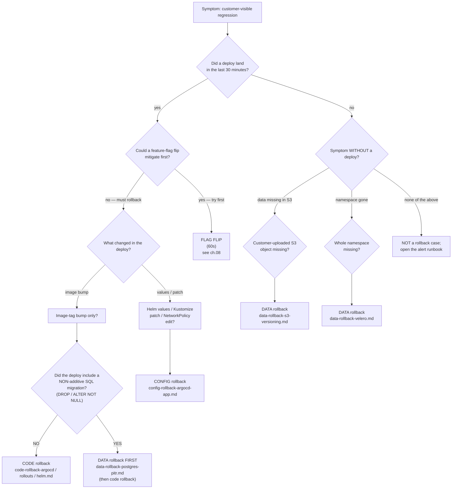
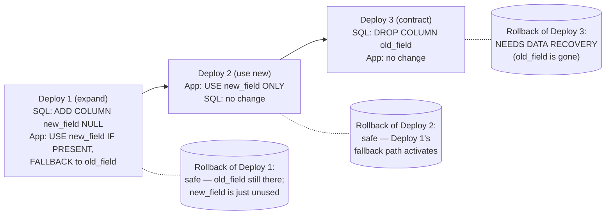

# 15.07 — Rollback playbook

> The production deepening of [Part 07 ch.05](../07-delivery/05-progressive-delivery.md)
> (Argo Rollouts auto-rollback) and [Part 08 ch.02](../08-day-2-operations/02-backup-and-dr.md)
> (backup + DR): the three rollback **layers** every production
> platform needs — **code** (Argo CD / Argo Rollouts / Helm), **data**
> (Postgres PITR / S3 versioning / Velero), **config** (Argo CD
> Application git-revert) — with the **decision tree** that picks the
> right layer per symptom, the **forward-compatible-schema** footgun
> that turns code rollback into data corruption, the **canary-blast-
> radius** trade-off during peak traffic, and the **monthly rollback
> drill** discipline that keeps the runbooks current.

**Estimated time:** ~30 min read · ~90 min hands-on
**Prerequisites:** [Part 15 ch.06](./06-progressive-delivery-in-production.md) — automated canary rollback is the first layer · [Part 08 ch.02](../08-day-2-operations/02-backup-and-dr.md) — backup + DR underpinning data rollback · [Part 14 ch.14](../14-eks-in-production-a-to-z/14-backup-and-restore-velero.md) — Velero that anchors cluster-shaped rollback

**You'll know after this:** • name the three rollback layers (code, data, config) and the tools that own each (Argo CD/Rollouts/Helm, Postgres PITR/S3 versioning/Velero, Argo CD git-revert) · • apply the decision tree that picks the right layer per symptom · • avoid the forward-compatible-schema footgun that turns code rollback into data corruption · • weigh the canary-blast-radius trade-off during peak traffic when deciding "rollback now or pause" · • run the monthly rollback drill that keeps every runbook fresh

<!-- tags: rollback, dr, day-2, argo-rollouts, velero -->

## Why this exists

[Part 07 ch.05](../07-delivery/05-progressive-delivery.md) shipped the
**automated** rollback: an Argo Rollouts AnalysisRun fails three times,
the controller scales the canary ReplicaSet to zero, the stable comes
back. That's the **best case** — a regression caught inside the canary
window, by metrics, before any human is paged. It works for code
regressions that produce visible 5xx or latency signals on the canary
slice.

It does **not** cover the cases that produce most of the rollback
work in production:

1. **Regressions that ride past the canary.** A 0.5% error rate is
   inside the AnalysisTemplate's noise floor; the canary promotes;
   the regression accumulates at 100% over hours. Now you're rolling
   back a fully-promoted release.
2. **Regressions that aren't in the code.** A bad Helm values change.
   A new NetworkPolicy that blocks egress to a backing service. A
   Kustomize patch that drops a critical resource limit. The code
   is fine; the **config** changed.
3. **Regressions that aren't in the cluster.** A bad SQL migration
   that ran ahead of the binary. An app bug that double-charged.
   A user-error `DELETE * FROM orders`. The K8s objects are healthy;
   the **data** is wrong.
4. **Regressions that aren't even Kubernetes.** A bad S3 object
   uploaded by a customer. An accidental S3 prefix delete by an
   internal cleanup script.

Each case has a different rollback tool, a different blast radius, a
different recovery time. The **single biggest cause** of extended
outages is **picking the wrong tool** — running `helm rollback` when
the bad change was a Kustomize patch (no-op; ops keep failing);
running `argocd app rollback` when the bad change was a SQL migration
(now the binary is rolled back AND the data is corrupted because the
old binary can't read the new schema).

This chapter is the **rollback playbook**: the three-layer mental model,
the decision tree, and the runbooks (in `examples/bookstore-platform/
rollback/`) the on-call follows at 3am. [Part 13 ch.12](../13-grand-capstone-bookstore-platform/12-day-2-runbook-on-call-dr-chaos.md)'s
runbook discipline applies; this chapter adds the rollback-specific
runbooks to the tree.

> **In production:** Without this chapter, the team has Argo Rollouts'
> auto-rollback for ~30% of regressions and ad-hoc Slack-driven
> recovery for the other 70%. Ad-hoc recovery means: longer outages,
> data loss from picking the wrong tool, postmortems that name the
> tooling gap that already had an obvious fix.

## Mental model

**Rollback in production = (the right LAYER for the symptom) × (a
runbook structured so the on-call can execute it without thinking) ×
(a monthly drill that proves the runbook still works).** The three
layers are not interchangeable; picking the wrong layer is the most
common rollback failure mode.

- **The three layers — code, data, config.**
  - **Code.** The binary serving traffic regressed; the data is fine;
    the config is fine. **Tool**: Argo CD `app rollback`, Argo Rollouts
    `abort` / `undo`, Helm `rollback`. **RTO**: 30 seconds to 5
    minutes. **Risk**: a forward-only DB migration makes this layer
    insufficient (see the footgun).
  - **Data.** The binary is fine; the config is fine; some mutation
    in Postgres / S3 / a whole namespace is wrong. **Tool**: CNPG
    `Recovery` CR with WAL replay, S3 object-version restore, Velero
    restore. **RTO**: 5 minutes to 4 hours depending on data size +
    PV count. **Risk**: customer-visible downtime + lost writes
    between bad mutation and recovery cut-over.
  - **Config.** The binary is fine; the data is fine; a Helm values
    edit, a Kustomize patch, a NetworkPolicy, a Crossplane
    Composition revision is wrong. **Tool**: git-revert the bad PR +
    Argo CD sync. **RTO**: 2 to 10 minutes (the PR review is the
    bottleneck). **Risk**: Argo CD auto-sync fighting the manual
    revert if the PR doesn't merge cleanly.
- **The decision tree.** The on-call's first 60 seconds is **not**
  "let me dig into the symptom"; it's **"which LAYER is this?"**.
  The decision is symptom-driven (see Diagram A). The full tree
  lives in `examples/bookstore-platform/rollback/README.md`; this
  chapter teaches the shape, not the mechanics.
- **The forward-compatible-schema footgun.** A code release with a
  forward-only DB migration breaks the "code rollback alone" path.
  The mitigation discipline:
  - **Expand-contract migrations.** Phase 1 of the schema change
    ADDS columns / tables; Phase 1 of the code USES the new columns
    if present, falls back to old. Phase 2 of the code switches to
    only-new path; Phase 3 of the schema DROPS old columns. Three
    deploys; each one is independently rollback-safe. The
    discipline costs three deploys but earns "code rollback always
    works".
  - **Pre-flight check.** Every code rollback runbook starts with a
    `git diff` of the migration directory between the bad SHA and
    the rollback target. If empty / additive only: safe. If
    DROP / ALTER / NOT NULL on existing column: stop; data-layer
    rollback is required first (`data-rollback-postgres-pitr.md`).
- **The peak-traffic trade-off.** A canary that's already at 50%
  caught a regression. The choice:
  - **Abort the canary** (the conservative move). Scale canary RS to
    0, stable RS to 100%. The 50% of users currently on the canary
    are briefly served by stable Pods that need to scale up — a
    capacity event during peak. Possible **brown-out** as the stable
    RS scales.
  - **Hold and observe** (the dangerous move). The canary is at 50%;
    the regression is mild; the team bets it won't get worse before
    the next deploy. Sometimes correct; usually a postmortem with
    the action item "we should have rolled back immediately".
  - **The discipline**: pre-stage the stable RS with `minReadySeconds:
    0` + `progressDeadlineSeconds: 600` so the abort doesn't trigger
    capacity issues. The Bookstore Platform's catalog Rollout
    keeps `maxUnavailable: 0` on the stable RS during canary
    (it's never scaled down below 100%; the canary is **additive**).
- **Monthly rollback drills.** Without exercise, every rollback
  runbook is stale within 90 days. The Bookstore Platform's monthly
  DR drill ([Part 13 ch.12](../13-grand-capstone-bookstore-platform/12-day-2-runbook-on-call-dr-chaos.md))
  rotates through:
  - Month 1: code rollback (Argo CD).
  - Month 2: code rollback (Argo Rollouts).
  - Month 3: data rollback (Postgres PITR).
  - Month 4: data rollback (Velero namespace).
  - Repeat.
  - Each drill outputs the three numbers: RTO actual, RPO actual
    (where applicable), human action time. The runbooks not
    exercised in 90 days carry a STALE banner.

The trap to keep in view: **a rollback is not a victory; it's a debt
to repay**. Every rollback is followed by (a) a postmortem and (b) a
forward fix that re-introduces the change without the regression.
Skipping the forward fix means the team has the same release blocked
for weeks; the team's velocity drops; pressure to skip the next
canary builds. The discipline: a rollback opens a ticket; the
ticket is owned; the forward fix is shipped within the same sprint
the rollback happened. Otherwise the rollback was a tax on the team's
future, not a fix.

> **In production:** Rollback ≠ undo. A rollback restores function;
> it does NOT restore time. Customer trust, lost orders, the
> on-call's sleep — none of it is rolled back. The discipline of
> rollback-drills + forward-fixes is what makes the rollback
> tool affordable. A team that needs rollback every week has a CI
> investment problem, not a rollback problem.

## Diagrams

### Diagram A — the rollback decision tree (Mermaid)



### Diagram B — the three layers and their tools (ASCII)

```text
ROLLBACK LAYER        SYMPTOM                                    TOOL                        RTO
─────────────────     ────────────────────────────────────────   ─────────────────────       ───────────
CODE                  bad binary; data fine; config fine         argocd app rollback         30s-2m
                                                                 kubectl argo rollouts       30s-2m
                                                                   abort | undo
                                                                 helm rollback               1-3m
─────────────────     ────────────────────────────────────────   ─────────────────────       ───────────
DATA                  bad data in Postgres                       CNPG Recovery CR            15-90m
                      bad data in S3                             aws s3api copy-object       2-10m
                                                                   (delete-marker)
                      whole namespace gone                       velero restore create       5-30m
─────────────────     ────────────────────────────────────────   ─────────────────────       ───────────
CONFIG                bad Helm values / Kustomize patch          git revert + argocd sync    2-10m
                      bad NetworkPolicy / ResourceQuota          git revert + argocd sync    2-10m
                      bad Crossplane Composition                 git revert + revision-ref   5-20m
─────────────────     ────────────────────────────────────────   ─────────────────────       ───────────

PRE-FLIGHT (every rollback):
  1. Could a feature-flag flip mitigate first? (faster; lower blast radius)
  2. Did the bad release include a forward-only DB migration? (if yes:
     DATA rollback FIRST; CODE rollback alone corrupts data)
  3. What's the blast radius? One tenant / one region / cluster-wide?
```

### Diagram C — the expand-contract migration that makes rollback safe (Mermaid)



## Hands-on with the Bookstore Platform

We exercise the three layers against the Bookstore Platform's catalog
service. The order: (1) prerequisites; (2) walk the decision tree
through a simulated regression; (3) execute a code rollback (Argo
Rollouts); (4) execute a data rollback (CNPG PITR — dry-run);
(5) execute a config rollback (Argo CD git-revert).

### 0. Prerequisites — runbooks, Argo CD, Argo Rollouts, Velero

```sh
# The runbook tree (created in this chapter — Phase 15c artifacts):
ls examples/bookstore-platform/rollback/
# README.md
# code-rollback-argocd.md
# code-rollback-rollouts.md
# code-rollback-helm.md
# config-rollback-argocd-app.md
# data-rollback-postgres-pitr.md
# data-rollback-s3-versioning.md
# data-rollback-velero.md

# Argo CD CLI configured against the platform's Argo CD.
argocd context bookstore-platform-us-east

# Argo Rollouts kubectl plugin.
kubectl argo rollouts version

# Velero CLI configured against the platform's Velero install
# (Part 14 ch.14):
velero version

# CNPG operator running (the platform-base path):
kubectl -n cnpg-system get pods
```

### 1. Walk the decision tree (a simulated regression)

```sh
# A page fires at HH:MM UTC:
# [PAGE] BookstoreCatalogP99Latency
# Region: us-east; Tenant: acme-books; p99 = 1.2s

# Step 1 (60s): when did the last deploy land?
argocd app history bookstore-catalog-us-east --limit 3
# ID  DATE                      REVISION  SOURCE
# 42  2026-05-20 14:22:13 UTC   d8f3c2a   image-tag bump only
# 41  2026-05-20 11:08:51 UTC   a1b2c3d   no changes
# 40  2026-05-19 17:42:09 UTC   9e8d7c6   values.yaml: CPU request

# 42 landed 5 min before the alert. STRONG signal.

# Step 2 (60s): could a flag flip mitigate?
curl -sk https://flagsmith.bookstore-platform.example.com/api/v1/flags/?key=catalog_v2_search_engine
# The bad release enabled meilisearch_v1 for acme-books. A flag flip
# to legacy_postgres_ilike would mitigate.

# Decision: FLIP THE FLAG FIRST. ch.08 runbook.
# (After flag flip, write the rollback PR for the bad image bump.)
```

### 2. Execute a code rollback — the Argo Rollouts path

```sh
# Walk through code-rollback-rollouts.md. The catalog service is a
# Rollout (not a plain Deployment).
kubectl argo rollouts get rollout catalog \
  -n bookstore-platform-acme-books
# Status:        Paused
# Strategy:      Canary; Step 4/8; SetWeight 25
# Images:        ghcr.io/acme/catalog:v1.5.0 (stable)
#                ghcr.io/acme/catalog:v1.5.1 (canary)

# AnalysisRun status?
kubectl -n bookstore-platform-acme-books get analysisrun \
  -l rollouts-pod-template-hash=$(kubectl argo rollouts get rollout catalog \
    -n bookstore-platform-acme-books -o json \
    | jq -r '.status.currentPodHash')

# If the AnalysisRun caught it, the rollout is already Degraded; the
# controller already scaled canary RS to 0. Otherwise:

kubectl argo rollouts abort catalog -n bookstore-platform-acme-books
# rollout 'catalog' aborted

# Wait for stable.
kubectl argo rollouts get rollout catalog \
  -n bookstore-platform-acme-books -w

# Verify metric recovery.
kubectl -n monitoring exec -ti prom-stack-kube-prom-prometheus-0 -- \
  promtool query instant http://localhost:9090 \
  'histogram_quantile(0.99, sum by (le) (rate(http_request_duration_seconds_bucket{service="catalog"}[5m])))'
# Expect: drops below 0.5 within 2-3 minutes.
```

### 3. The data-rollback dry-run — Postgres PITR via CNPG

The full procedure is destructive (creates a recovered cluster +
cuts over the application). We **dry-run** the discovery + planning
phases here; the destructive steps belong in the monthly DR drill.

```sh
# Step 1: identify the affected cluster.
kubectl -n cnpg-system get clusters

# Step 2: identify the target time. Suppose the regression at HH:MM
#   wrote bad rows for 5 minutes; the safe target is HH:MM - 1 minute.

# Step 3: confirm PITR is even possible for this target.
kubectl -n cnpg-system get cluster bookstore-platform-cnpg-orders \
  -o jsonpath='{.status.firstRecoverabilityPoint}{"\n"}'
# 2026-05-15T12:00:00Z
# If target > firstRecoverabilityPoint -> PITR is possible.

# Step 4 (DRY-RUN; do NOT apply): the Recovery YAML.
cat <<EOF > /tmp/recovery-dry-run.yaml
apiVersion: postgresql.cnpg.io/v1
kind: Cluster
metadata:
  name: bookstore-platform-cnpg-orders-recovered-dryrun
  namespace: cnpg-system
spec:
  instances: 1                  # dry-run: 1 instance; prod = 3
  storage: { size: 100Gi, storageClass: gp3-encrypted }
  bootstrap:
    recovery:
      source: bookstore-platform-cnpg-orders-cold
      recoveryTarget: { targetTime: "2026-05-20 13:43:00.000000+00" }
  externalClusters: [...]
EOF

# Validate the YAML (don't apply):
kubectl apply --dry-run=server -f /tmp/recovery-dry-run.yaml
# The full procedure (apply + cut over) is in
# data-rollback-postgres-pitr.md.
```

### 4. The config-rollback exercise — `git revert` + Argo CD sync

```sh
# Suppose PR a1b2c3d landed a bad ResourceQuota change:
# resourcequota-catalog.yaml: cpu: 10 -> 2
# Effect: catalog Pods OOM-evicted because they can't scale.

# Step 1: locate the bad PR.
git -C ./bookstore-platform-config log --oneline -n 5 main

# Step 2: revert.
git -C ./bookstore-platform-config checkout -b revert-resourcequota
git -C ./bookstore-platform-config revert a1b2c3d
git -C ./bookstore-platform-config push origin revert-resourcequota
gh pr create --title "Revert: catalog ResourceQuota cpu cap" \
  --body "Reverts a1b2c3d (caused evictions)."

# Step 3: merge (admin-merge if P0; standard if P1).

# Step 4: Argo CD picks up auto-sync in <60s.
argocd app get bookstore-platform-tenant-acme-books
# Sync Status: Synced from <revert-SHA>

# Step 5: verify.
kubectl -n bookstore-platform-acme-books describe resourcequota
# Used  cpu: 5     Hard: 10  -> old quota back
```

### 5. The monthly drill

Add to the platform's monthly DR cadence (Part 13 ch.12):

```sh
# Add a rollback exercise to the script.
cat >> examples/bookstore-platform/runbooks/dr-drill-script.sh <<'EOF'

# Monthly rollback drill: pick ONE runbook, exercise it in a non-prod
# tenant, time the three phases (detect / decide / mitigate), record
# the result in dr-drill-YYYY-MM.md.

exercise_runbook() {
  local target=$1
  echo "[$(date +%T)] DRILL: exercising $target"
  case "$target" in
    code-rollback-rollouts)
      bash exercises/exercise-rollouts-abort.sh ;;
    data-rollback-postgres-pitr)
      bash exercises/exercise-pitr-dry-run.sh ;;
    config-rollback-argocd-app)
      bash exercises/exercise-config-revert.sh ;;
    data-rollback-velero)
      bash exercises/exercise-velero-restore.sh ;;
  esac
}
EOF
```

## How it works under the hood

**The three layers, expressed mechanically.**

The **code** layer rolls back what's on the running Pods. Argo CD
`app rollback` re-syncs the Application against a previous Application
revision (history record); the manifests + the image tag from that
revision get applied; the Deployment / Rollout controller rolls Pods
to the old image. **Argo Rollouts** `abort` is faster than `app
rollback` because the stable ReplicaSet is **already alive** — the
abort scales the canary RS to 0 and the stable to full count. **Helm
rollback** re-applies the chart's rendered manifests from the
previous release's stored Secret; the same Pod-roll semantics.

The **data** layer rolls back what's on disk. **CNPG PITR** stands up
a NEW cluster from a base backup + replays WAL up to the target
timestamp; the application is repointed at the new cluster. **S3
versioning** does not even copy data — deleting a delete-marker re-
exposes the previous object version. **Velero restore** re-applies
the Kubernetes objects in the backup and **separately** restores PV
data via CSI VolumeSnapshots (a Velero `--restore-volumes=true`
flag); the workloads come up against pre-restored disks.

The **config** layer rolls back what's in git. `git revert` creates a
new commit that undoes the bad PR's changes (NOT a `reset` —
`revert` preserves history). Argo CD's auto-sync picks up the new
commit and applies the diff (which is the inverse of the bad change).
Crossplane's twist: a `Composition` revision is immutable; `git
revert` makes a NEW revision; the existing XRs still reference the
old revision and must be patched to roll over to the reverted
revision.

**Why the three layers don't substitute for each other.** A code
rollback does not restore deleted rows. A data rollback does not
restore a deleted Deployment. A config rollback does not restore the
binary version on the Pods (it just restores the YAML that selects
the binary). The decision tree's value is forcing the on-call to
identify which layer the regression IS, not which one is fastest to
type. Picking the wrong layer is fast and ineffective; picking the
right layer is the rollback.

**The forward-compatible-schema discipline.** Every Bookstore Platform
migration ships in the **expand-contract** shape (see Diagram C). The
CI gate enforces:

- Migrations may add columns, tables, indexes (always safe).
- Migrations may add NOT NULL constraints **only** if the column has
  a default.
- Migrations may NOT drop columns, drop tables, rename columns,
  change column types in a single deploy. Those changes are
  three-deploy sequences.

The CI rule is encoded in `examples/bookstore-platform/ci/migration-
lint.sh` (Part 15 ch.02 / ch.05). PRs that violate it can override
with a `migration-incompatible: true` annotation **plus** explicit
sign-off from the platform team **plus** the runbook in
`data-rollback-postgres-pitr.md` updated for the specific recovery
path. The discipline is **not** "never break the rule"; it's "every
break is a deliberate, audited decision".

**Peak-traffic abort capacity planning.** The Bookstore Platform's
Rollout strategy keeps the stable RS at 100% throughout the canary
(the canary is **additive**, not replacing). The cluster therefore
needs **canary-percentage** extra capacity during a canary
(typically 10-25%). Cluster autoscaler + Karpenter cover this on EKS
(Part 14 ch.09); on resource-constrained kind clusters, the canary
is sized smaller. The capacity preserves the **abort safety**: an
abort doesn't scale up stable; stable is already at 100%.

## Production notes

> **In production:** **The forward-compatible-schema is the deepest
> rollback footgun.** A "we rolled back the code; the app crashed
> because it can't read the migrated schema" event is the most-cited
> production-rollback failure mode. The remedy is process: the
> expand-contract pattern; the CI migration linter; the PR template
> that asks "is this rollback-safe?". Teams that ship this discipline
> earn confident rollbacks; teams that don't carry rollback as a
> brittle, fearful operation.

> **In production:** **The "rollback during peak" judgement call.**
> A regression noticed at 14:00 UTC (US peak); the choice is
> rollback-now (5 min of capacity-shift brown-out) or hold-until-off-
> hours (3 hours of degraded service). The default: **rollback-now
> for any P0 / P1**; **hold-until-off-hours for P2 only**. The
> conservative move (rollback) tends to look reckless in the moment
> and correct in the postmortem; the reckless move (hold) tends to
> look reasonable in the moment and disastrous in the postmortem.

> **In production:** **Rollback drills monthly; the rollback runbooks
> are the most-drift-prone.** A code-rollback runbook from 90 days
> ago references an Argo CD version with a different `app rollback`
> flag set. A data-rollback runbook references a CNPG version with
> a different `Recovery` CR shape. The monthly DR drill ([Part 13
> ch.12](../13-grand-capstone-bookstore-platform/12-day-2-runbook-on-call-dr-chaos.md))
> rotates a rollback runbook in; each drill outputs a "did the
> runbook work?" verdict and an updated copy.

> **In production:** **The "we'll roll forward instead" anti-pattern.**
> The pressure during an incident is to ship a hotfix forward
> (5 minutes of CI + the fix is "done") rather than roll back
> (2 minutes; the bad commit is still in HEAD). Roll-forward feels
> productive; rollback feels like failure. **Discipline**: rollback
> first, always; the hotfix (if any) follows as a CLEAN PR after the
> regression is mitigated. The "rolled forward and the hotfix had
> its own bug" double-incident is the worst-case the discipline
> defends against.

> **In production:** **Argo CD auto-sync vs manual rollback.** Auto-
> sync is the GitOps default; it fights manual `argocd app rollback`
> because the rollback isn't in git. The team's pattern: every
> rollback in production starts with `argocd app set --sync-policy
> none`, finishes with a git-revert PR + `argocd app set --sync-
> policy automated`. The discipline trades operator-attention for
> a clean GitOps state; without it, the cluster looks rolled-back
> for ~60 seconds before auto-sync reapplies the bad revision.

> **In production we did not build:** automated rollback-decision
> support (a controller that reads symptoms and recommends a layer)
> — the failure mode of bad automated advice is worse than a slower
> manual decision; cross-layer atomic rollback (code + data + config
> in one command) — each layer needs independent verification;
> application-tier "soft" rollback via Istio `VirtualService` weight
> shift — cache-invalidation and version-skew handling are too
> application-specific to bundle; and rollback-to-arbitrary-revision
> beyond Argo CD's history limit — for older revisions the procedure
> is `git checkout <SHA> + argocd app sync --revision <SHA>`,
> documented in the runbooks but not the default path.

## Quick Reference

```sh
# CODE — Argo CD
argocd app set <APP> --sync-policy none
argocd app rollback <APP> <HISTORY_ID>
# Wait for Healthy; then git-revert; then re-enable auto-sync.

# CODE — Argo Rollouts
kubectl argo rollouts abort <ROLLOUT> -n <NS>          # mid-flight canary
kubectl argo rollouts undo  <ROLLOUT> -n <NS>          # finished canary
kubectl argo rollouts get   <ROLLOUT> -n <NS> -w       # verify

# CODE — Helm (raw release outside Argo CD)
helm history <RELEASE> -n <NS>
helm rollback <RELEASE> <REVISION> -n <NS> --wait --timeout 5m

# DATA — Postgres PITR (CNPG)
kubectl apply -f - <<<'(see data-rollback-postgres-pitr.md Step 3b)'
# Watch:
kubectl -n cnpg-system get clusters <RECOVERED> -w

# DATA — S3 versioning
aws s3api list-object-versions --bucket <B> --prefix <K>
aws s3api delete-object --bucket <B> --key <K> --version-id <DELETE-MARKER-VERSION>

# DATA — Velero
velero restore create <NAME> --from-backup <BACKUP> --restore-volumes=true --wait

# CONFIG — git revert
git checkout -b revert-<DESC>
git revert <BAD-SHA>
git push origin revert-<DESC>
gh pr create
# After merge:
argocd app sync <APP> --prune
```

The runbooks live in `examples/bookstore-platform/rollback/`. The
decision tree is in `examples/bookstore-platform/rollback/README.md`.
Drill them monthly.

## Test your understanding

> Try each before opening the answer drawer. The act of trying is the exercise; the answer is the check.

1. **The chapter calls the rollback layer choice (code / data / config) the on-call's "first 60 seconds." Why is picking the wrong layer often worse than not rolling back at all?**
   <details><summary>Show answer</summary>

   Picking the wrong layer compounds the incident. Examples from the chapter: running `helm rollback` when the bad change was a Kustomize patch — the rollback is a no-op, ops keep failing, the on-call wastes 20 minutes trying variants of the wrong tool. Running `argocd app rollback` when the bad change was a forward-only SQL migration — the binary rolls back to vN, but the schema is at vN+1, the old binary can't read the new schema, the service is fully down. Running `helm rollback` to undo a config change while the data-layer issue continues — the symptoms keep firing, the team's confidence drops, the next escalation is "we don't know what's wrong." The discipline: classify the symptom layer first, then execute the matched runbook; never spray multiple rollback tools at the symptom.

   </details>

2. **A code rollback's first step in the chapter's runbook is `git diff` on the migration directory. You inherit an incident where someone already ran `argocd app rollback` on a service that had a forward-only `ALTER TABLE ... DROP COLUMN` migration. The pod CrashLoops with column-not-found errors. What's the recovery?**
   <details><summary>Show answer</summary>

   You're in the canonical "rollback when migration already ran" trap. The schema is at vN+1 (column dropped), the binary is at vN (expecting the column). Two options: (1) **roll forward** — re-deploy vN+1 binary (since it's compatible with the new schema) and accept the regression that caused the original rollback, while you build a fix; or (2) **data-layer rollback first** — restore the database from PITR or a Velero snapshot taken before the migration ran, then roll the binary back. Option 1 is fastest if vN+1's regression isn't catastrophic; option 2 is correct if vN+1's regression was data-corrupting. The chapter's discipline: the pre-flight `git diff` of the migration directory exists to prevent this exact situation — if the diff has `DROP` or `NOT NULL`, the runbook says "stop; data-layer rollback required first."

   </details>

3. **A canary catches a regression at 50%. The on-call has two options: abort immediately (capacity event as stable scales up) or hold and observe. What's the chapter's stance, and what's the prevention?**
   <details><summary>Show answer</summary>

   Abort immediately is the safe move; hold-and-observe is "usually a postmortem with the action item 'we should have rolled back immediately.'" The capacity-event risk is real — if stable was scaled down to 50% to make room for the canary, scaling back up to 100% is a sudden burst. The chapter's prevention: keep stable RS at 100% during canary (`maxUnavailable: 0`), making the canary purely *additive*. The catalog Rollout in the example tree uses this pattern — the canary is extra capacity, not a replacement; aborting at 50% just scales the canary RS to zero without touching stable. The trade-off: 1.5x resources during canary, but rollback is instant and capacity-event-free.

   </details>

4. **The chapter says "a rollback is not a victory; it's a debt to repay." What's the discipline that turns a rollback into a complete operation rather than a partial fix?**
   <details><summary>Show answer</summary>

   Every rollback opens a ticket; the ticket is owned by a specific engineer; the forward fix (the same change, without the regression) ships within the same sprint as the rollback. Skipping the forward fix means: (1) the team has the same release blocked indefinitely; (2) velocity drops because each new attempt at the change feels riskier; (3) pressure to skip the next canary builds because "canary slows us down." The complete operation is rollback → postmortem with action items → forward fix → re-deploy with stricter analysis → verify. The chapter's mantra: rollback restores function; it does not restore time. Customer trust, lost orders, the on-call's sleep — none of those are rolled back. The forward-fix is what pays the debt.

   </details>

5. **Hands-on extension — apply a Helm chart that overrides a Deployment's `resources.limits.memory` to `64Mi` (intentionally too low). Roll it out, watch pods OOMKill, then practice the config-layer rollback runbook.**
   <details><summary>What you should see</summary>

   Pods start, immediately get OOMKilled, restart, OOMKill, enter CrashLoopBackOff. The symptom: code is fine, data is fine, *config* changed — wrong layer for `argocd app rollback` or `helm rollback` if the chart values lived in Git. The right tool: `git revert <BAD-SHA>` in the GitOps repo + Argo CD sync. RTO measured from "PR opens" to "pods stable" should be 2-10 minutes (the PR review is the bottleneck — drill it on a non-prod cluster to remove friction). The lesson: the symptom (CrashLoop) doesn't tell you the layer; the *change* that introduced it does. Always check what changed in the last 30 minutes before picking the rollback tool.

   </details>

## Further reading

- **[Argo CD docs — "Rollbacks"](https://argo-cd.readthedocs.io/en/stable/user-guide/auto_sync/#temporarily-toggling-auto-sync)** —
  the official "disable auto-sync; rollback; revert; re-enable"
  pattern this chapter codifies.
- **[Argo Rollouts docs — "Aborts & Rollbacks"](https://argo-rollouts.readthedocs.io/en/stable/features/restart/#abort-a-rollout)** —
  the canonical `abort` / `undo` reference.
- **[Helm docs — `helm rollback`](https://helm.sh/docs/helm/helm_rollback/)** —
  the release ledger + rollback semantics + the CRDs-not-rolled-back
  footgun.
- **[CloudNativePG — "Recovery"](https://cloudnative-pg.io/documentation/current/recovery/)** —
  the `Recovery` CR + WAL replay + `targetTime` / `targetXID` /
  `targetName` reference.
- **[Velero — "Restore"](https://velero.io/docs/main/restore-reference/)** —
  restore-volumes; restore-policy; namespace-mappings; storage-class-
  mappings.
- **[Google SRE Book ch.16 — "Tracking Outages"](https://sre.google/sre-book/tracking-outages/)** —
  the postmortem-after-rollback discipline this chapter assumes.
- **[Martin Fowler — "Parallel Change" (expand-contract)](https://martinfowler.com/bliki/ParallelChange.html)** —
  the schema-migration pattern that makes rollback safe.
- **[Aaron Patterson — "We Are Going to Be OK"](https://railsconf2019.confbookmark.com/talks/we-are-going-to-be-ok)** —
  the deep "production database migrations" talk; the source of much
  of this chapter's footgun list.
