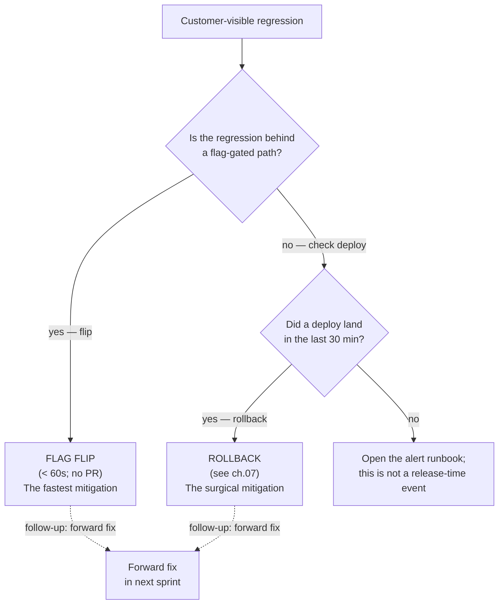

# 15.08 — Feature flags and dark launches

> Decoupling **deploy** from **release**: a binary that ships dark
> (the new code is in production but disabled by a flag), then a
> targeted flag flip rolls the feature to a subset, then a wider
> subset, then 100%. The four flag use-cases — **dark launch**,
> **canary by cohort**, **A/B experiment**, **kill switch**.
> Provider trade-offs: **Flagsmith** (self-hosted; the v2 default),
> **LaunchDarkly** (SaaS; data-residency cost), **Unleash** (self-
> hosted alternative), **OpenFeature** (the SDK abstraction). The
> stale-flag accumulation footgun; flags vs config; the < 60-second
> kill-switch use case as the most-valuable flag.

**Estimated time:** ~30 min read · ~60 min hands-on
**Prerequisites:** [Part 15 ch.07](./07-rollback-playbook.md) — rollback is the alternative this chapter decouples deploy from · [Part 15 ch.06](./06-progressive-delivery-in-production.md) — canary that flags complement, not replace · [Part 11 ch.01](../11-advanced-production-patterns/10-platform-engineering.md) — release-vs-deploy framing

**You'll know after this:** • understand why decoupling deploy from release unlocks the four flag use-cases — dark launch, canary by cohort, A/B experiment, kill switch · • choose between Flagsmith (self-hosted v2 default), LaunchDarkly (SaaS, data-residency cost), Unleash (self-hosted alt), OpenFeature (SDK abstraction) · • implement a <60-second kill switch as the most-valuable flag use case · • avoid stale-flag accumulation through a flag-cleanup cadence · • distinguish a flag from a config and keep each in the right system

<!-- tags: feature-flags, day-2, app-cicd, gitops, observability -->

## Why this exists

[Part 15 ch.07](07-rollback-playbook.md) shipped the rollback
playbook for the cases where deploy + release are **the same act**:
the binary lands; the new behaviour is on; if it's bad, you roll
back. That model is unavoidable for some changes (a security patch;
a perf fix that has no dark-launch path). But it has three structural
costs:

1. **The rollback window is the regression window.** Every regression
   means real customer impact while you mitigate. Even with Argo
   Rollouts' 10% canary, 10% of customers see the bug.
2. **The deploy IS the change.** You can't separate "ship the code"
   from "turn on the feature". Coordinating a launch (marketing +
   customer comm + the engineering team) requires aligning to the
   deploy window — pressure on the deploy schedule that the team
   pays for in 3am pages.
3. **The kill switch problem.** A bad feature in production needs
   to disable in **seconds**, not the **minutes** of a rollback. A
   payment-processor outage; a recommendation model showing
   inappropriate items; a compliance hold. Rollback is too slow.

**Feature flags decouple deploy from release.** The code ships dark
(the flag is OFF; the new code is unreachable). The release is a
**flag flip** — a configuration change, not a code change. The
release window is independent of the deploy window. The kill switch
is "flag flip OFF" — < 60 seconds, no redeploy.

This chapter is the production discipline of feature flags on the
Bookstore Platform: the **Flagsmith** install (self-hosted; the v2
default for data residency), the **OpenFeature** SDK abstraction
(vendor lock-in defence), the four use cases the platform actually
ships, and the stale-flag governance discipline that keeps flag-debt
manageable.

> **In production:** Without feature flags, every release is a
> rollback-or-no-rollback bet. With them, releases become **gradual
> reveals**: code ships safely; flags flip incrementally;
> regressions disable in seconds. The cost is operational
> complexity (a flag service to operate; flag debt to manage); the
> benefit is a fundamentally different release shape that turns
> "release day" from a high-anxiety event into a routine
> configuration change.

## Mental model

**Feature flags are the layer between "the code is in production"
and "the customer sees the new behaviour". The two events are
decoupled by a runtime check; the runtime check is configurable
without redeploy; the configuration is versioned, audited, and
observable.**

- **Flags vs config.** A **flag** is a runtime conditional whose
  truth value can change without a deploy. A **config** value is a
  parameter the binary reads at startup (or on SIGHUP) — it
  re-deploys to change. The boundary is a judgement call:
  - If you'll **flip it more than once a quarter** → flag.
  - If it has **per-tenant / per-user overrides** → flag.
  - If a **kill-switch use case** applies → flag.
  - Otherwise → config (Helm values; ConfigMap).
  - The flag-everything anti-pattern: putting your DB hostname in a
    flag. Don't. Flags ARE config that needs to change fast; config
    that doesn't doesn't need a flag service.
- **The four use cases.**
  1. **Dark launch.** Code ships disabled; flag flips it on for a
     subset (internal users → beta tenants → 10% → 50% → 100%).
     The release IS the flag rollout, not the deploy.
  2. **Canary by cohort.** A finer-grained version of Part 15 ch.06's
     traffic-percentage canary: flag-gated cohorts (internal,
     beta-tenants, enterprise) get different versions of the code-
     path. Catches the "long-tail enterprise customer breaks even
     though average is fine" failure that traffic-percentage canary
     misses ([Part 15 ch.06 Diagram B](06-progressive-delivery-in-production.md)).
  3. **A/B experiment.** Multivariate flag (33/33/33 split); each
     variant is a different code path; outcomes (conversion, latency,
     revenue) are measured. Time-boxed; ends with a decision.
  4. **Kill switch.** The flag IS the disable. Default ON
     (feature works); flip OFF (feature disabled, graceful
     degradation). < 60 seconds end-to-end.
- **Provider trade-offs (the v2 view).**
  | Provider       | Cost              | Operational load          | Data residency |
  |----------------|-------------------|---------------------------|----------------|
  | **Flagsmith**  | self-host compute | Postgres + 2 Pods         | yes (default for EU tenants) |
  | **LaunchDarkly** | $300+/mo at 10K MAU | none                  | LD's data plane (US-EAST default) |
  | **Unleash**    | self-host compute | Postgres + 2 Pods         | yes |
  | **OpenFeature**| SDK abstraction (free) | provider needs to exist | n/a |
  - The v2 default: **Flagsmith** behind **OpenFeature**. The SDK
    abstraction means swapping providers is a config change, not a
    code change — the team can move to LaunchDarkly later if SaaS
    becomes the right trade-off.
- **Targeting — per-user vs per-tenant vs per-percentage.** Flags
  support three targeting strategies; the right one depends on the
  use case:
  - **Per-user**: "this individual user gets the new behaviour".
    For dogfooding (the team's own user IDs); for high-touch
    enterprise customers ("turn it on for acme-corp's CEO only").
  - **Per-tenant**: "all users in tenant X". The most common shape
    for multi-tenant platforms; lets a tenant opt-in / opt-out.
  - **Per-percentage**: "10% of all identities (deterministic hash)".
    For statistical sampling — A/B tests; gradual rollouts that
    don't care which 10%, just consistent which 10%.
  - **Combination**: "internal + beta-tenants + 10% of enterprise"
    is the realistic Bookstore Platform pattern.
- **Kill switches are the most-valuable flag.** A team often
  thinks they need a flag for the "future cool feature"; the team
  ACTUALLY needs a flag for the "thing that goes wrong tomorrow".
  The Bookstore Platform's `kill_switch_checkout` and
  `kill_switch_recommendations` are the most-used flags by far —
  they sit at default ON for months, then save a 3am incident with
  one click.
- **Default-on-failure.** Every flag call passes a SAFE default. The
  default is what happens if the flag service is unreachable. For
  kill switches, the default is "feature enabled" — i.e. the flag
  service being DOWN does NOT disable every kill-switched feature
  (which would make the flag service a SPOF for the product).

The trap to keep in view: **flags accumulate**. A flag has three
states: "actively rolling out" → "rolled out at 100%" → "should be
removed". Most flags get stuck at state 2; the codebase fills with
`if flags.Bool("featureXyz")` branches that are always true; every
code path doubles in cost-to-test. The Bookstore Platform's defence
is the **30-day stale-flag policy**: every flag has an owner +
expected-removal date; the weekly report names stale flags; an
expired flag becomes a tech-debt ticket the platform team chases.

> **In production:** Flag-debt is the discipline failure that bites
> back hardest. A codebase with 500 flags is a codebase no one can
> reason about. Aggressive flag retirement is what separates teams
> that use flags effectively from teams that drown in them.

## Diagrams

### Diagram A — deploy vs release: the four use cases (Mermaid)

```mermaid
flowchart TB
    subgraph "WITHOUT FLAGS"
      d1["Deploy code v1.5.1"] --> r1["RELEASE IS DEPLOY<br/>(every user gets new behaviour)"]
    end
    subgraph "WITH FLAGS"
      d2["Deploy code v1.5.1<br/>(flag OFF; new code dark)"]
      f1["Flip flag: internal=true"]
      f2["Flip flag: beta_tenants=true"]
      f3["Flip flag: percentage_split_10=true"]
      f4["Flip flag: default=true (100%)"]
      d2 --> f1 --> f2 --> f3 --> f4
    end
    subgraph "KILL SWITCH"
      live["Feature live at 100%"]
      bad["Regression detected"]
      kill["Flip kill switch OFF<br/>(< 60s)"]
      fix["Forward fix"]
      live --> bad --> kill --> fix
    end
```



### Diagram B — when which flag use-case (ASCII)

```text
USE CASE                  PURPOSE                                    LIFETIME
─────────────────         ────────────────────────────────────────   ──────────
Dark launch               Decouple deploy from release               weeks
                          New feature ships dark, ramps to 100%
─────────────────         ────────────────────────────────────────   ──────────
Canary by cohort          Catch enterprise / long-tail bugs that     days-weeks
                          % canary misses                            (per release)
─────────────────         ────────────────────────────────────────   ──────────
A/B experiment            Measure variant performance; pick winner   days
                          based on data                              (time-boxed)
─────────────────         ────────────────────────────────────────   ──────────
Kill switch               Emergency disable in < 60 seconds          permanent
                          Default ON; flip OFF when needed

LIFETIME RULE:
  Dark launch + A/B → REMOVE within 30 days of completion
  Canary by cohort → REMOVE per release
  Kill switch      → KEEP indefinitely (re-evaluate annually)
```

### Diagram C — flag flip vs rollback decision (Mermaid)



## Hands-on with the Bookstore Platform

We install Flagsmith, register a flag, integrate the catalog Go
service via OpenFeature, and exercise the four use cases. The order:
(1) prerequisites; (2) install Flagsmith via Helm; (3) seed the
sample flag config; (4) wire the catalog SDK; (5) exercise dark
launch, kill switch, A/B.

### 0. Prerequisites — Flagsmith chart, Vault secrets, the Go service

```sh
# The platform-base path has installed (Part 15 ch.05):
#  - Vault + ESO
#  - CNPG (Flagsmith's Postgres lives here)
#  - kube-prometheus-stack
kubectl -n external-secrets get pods
kubectl -n cnpg-system get pods
kubectl -n monitoring get pods

# The Flagsmith Helm values are at:
ls examples/bookstore-platform/feature-flags/flagsmith-helm-values.yaml
```

### 1. Install Flagsmith

```sh
# Pin the chart version + image tags (see flagsmith-helm-values.yaml).
helm repo add flagsmith https://flagsmith.github.io/flagsmith-charts/
helm repo update

# Provision the Postgres database (Bookstore Platform pattern: a
# `Database` CR on the platform's CNPG cluster).
cat <<EOF | kubectl apply -f -
apiVersion: postgresql.cnpg.io/v1
kind: Database
metadata: { name: flagsmith, namespace: cnpg-system }
spec:
  cluster: { name: bookstore-platform-cnpg-shared }
  name: flagsmith
  owner: flagsmith
EOF

# ExternalSecret to pull the Flagsmith DB credentials from Vault.
cat <<EOF | kubectl apply -f -
apiVersion: external-secrets.io/v1beta1
kind: ExternalSecret
metadata: { name: flagsmith-api-secrets, namespace: flagsmith }
spec:
  refreshInterval: 1h
  secretStoreRef: { name: vault-platform, kind: ClusterSecretStore }
  target: { name: flagsmith-api-secrets }
  data:
    - secretKey: DATABASE_URL
      remoteRef: { key: kv/feature-flags/flagsmith/database, property: url }
    - secretKey: DJANGO_SECRET_KEY
      remoteRef: { key: kv/feature-flags/flagsmith/django, property: secret_key }
EOF

# Install.
helm upgrade --install flagsmith flagsmith/flagsmith \
  --version 0.39.1 \
  --namespace flagsmith \
  --create-namespace \
  --values examples/bookstore-platform/feature-flags/flagsmith-helm-values.yaml \
  --wait
kubectl -n flagsmith get pods
```

### 2. Bootstrap the sample flag config

```sh
# Port-forward the Flagsmith API.
kubectl -n flagsmith port-forward svc/flagsmith-api 8000:8000 &
FLAGSMITH_API_URL=http://localhost:8000/api/v1

# Authenticate; create the project + environment; import the sample
# flags. The Flagsmith CLI / API supports JSON import:
TOKEN=$(curl -s -X POST $FLAGSMITH_API_URL/auth/login/ \
  -d '{"email":"platform@bookstore-platform.example.com","password":"..."}' \
  | jq -r '.key')

curl -s -X POST $FLAGSMITH_API_URL/projects/1/environments/1/featurestates/import/ \
  -H "Authorization: Token $TOKEN" \
  -H "Content-Type: application/json" \
  -d @examples/bookstore-platform/feature-flags/sample-flag-config.json
# Flagsmith returns: { "imported": 6, "skipped": 0, "errors": [] }

kill %1   # stop port-forward
```

### 3. Wire the catalog Go service via OpenFeature

```sh
# The integration code is in examples/bookstore-platform/feature-
# flags/catalog-go-sdk-integration.md. Build the catalog with the
# flag SDK:
cd examples/bookstore-platform/app/catalog
go get github.com/open-feature/go-sdk
go get github.com/Flagsmith/flagsmith-go-client/v3
go get github.com/open-feature/go-sdk-contrib/providers/flagsmith/pkg

# Set the env vars (the Bookstore catalog Deployment template).
kubectl -n bookstore-platform-acme-books set env deployment/catalog \
  FEATURE_FLAG_PROVIDER=flagsmith \
  FLAGSMITH_API_URL=http://flagsmith-api.flagsmith.svc:8000/api/v1/ \
  FLAGSMITH_ENV_KEY=<from-vault-ESO>
```

### 4. Exercise dark launch — the `catalog_v2_search_engine` flag

```sh
# Initial state: flag default OFF; only internal_users segment sees
# the new engine. Test as an internal user:
curl -sH "x-user-id: alice@bookstore-platform.example.com" \
  https://api.bookstore-platform.example.com/v1/catalog/search?q=kubernetes \
  | jq '.engine'
# "meilisearch_v1"

# Test as an external user:
curl -sH "x-user-id: bob@external.example.com" \
  https://api.bookstore-platform.example.com/v1/catalog/search?q=kubernetes \
  | jq '.engine'
# "legacy_postgres_ilike"

# Ramp to 10% of all users (via the Flagsmith UI or API):
# PATCH /api/v1/projects/1/environments/1/featurestates/<FEATURESTATE-ID>/
#   { "feature_segment": "percentage_split_10", "enabled": true }

# Now 10% of users see meilisearch_v1; 90% see legacy.

# Monitor the metric:
kubectl -n monitoring exec -ti prom-stack-kube-prom-prometheus-0 -- \
  promtool query instant http://localhost:9090 \
  'sum by (engine) (rate(catalog_search_total[5m]))'
# Expected: ~10% on meilisearch_v1, ~90% on legacy.

# Watch the SLOs of the meilisearch_v1 path; if green for 24h, ramp
# to 50%; if 24h more, ramp to 100%; remove the flag after 30 days
# of 100%.
```

### 5. Exercise the kill switch — `kill_switch_checkout`

```sh
# Default: ON (= checkout works).
curl -sX POST https://api.bookstore-platform.example.com/v1/checkout \
  -H "x-user-id: bob@external.example.com" \
  -d '{...cart...}'
# 200 OK

# Suppose Stripe is having an outage. Disable checkout:
# Flagsmith UI: kill_switch_checkout -> default_enabled FALSE
# OR via API:
curl -sX PATCH $FLAGSMITH_API_URL/projects/1/environments/1/featurestates/<FEATURESTATE-ID>/ \
  -H "Authorization: Token $TOKEN" \
  -d '{"enabled": false}'

# Within 60s (the SDK refresh interval), the flag flip propagates.
# Re-test:
curl -sX POST https://api.bookstore-platform.example.com/v1/checkout \
  -H "x-user-id: bob@external.example.com" \
  -d '{...cart...}'
# 503 Checkout temporarily disabled — see status page

# When Stripe recovers, flip it back:
curl -sX PATCH $FLAGSMITH_API_URL/projects/1/environments/1/featurestates/<FEATURESTATE-ID>/ \
  -H "Authorization: Token $TOKEN" \
  -d '{"enabled": true}'

# < 60s end-to-end. No deploy. No PR. No rollback.
```

### 6. Exercise A/B — the recommendations model

```sh
# Three variants: v2 (current), v3 (new), control (no recommendations).
# Flagsmith multivariate flag with 34/33/33 split.

# Simulate 10K requests with different user IDs:
for i in $(seq 1 10000); do
  curl -s -H "x-user-id: user-$i" \
    https://api.bookstore-platform.example.com/v1/recommendations \
    > /dev/null &
  [[ $((i % 100)) -eq 0 ]] && wait
done
wait

# Check the metric (the conversion-rate Prometheus query):
kubectl -n monitoring exec -ti prom-stack-kube-prom-prometheus-0 -- \
  promtool query instant http://localhost:9090 \
  'sum by (variant) (rate(recommendation_click_total[5m])) /
   sum by (variant) (rate(recommendation_impression_total[5m]))'
# v2: 0.045 (4.5% CTR)
# v3: 0.058 (5.8% CTR)  <- variant winning
# control: 0.025 (2.5%) <- baseline

# After 2 weeks: declare v3 the winner; ramp v3 to 100%; remove flag.
```

### 7. The stale-flag audit (weekly)

```sh
# The platform team runs a weekly audit script (the script lives in
# examples/bookstore-platform/feature-flags/scripts/audit-stale.sh;
# not bundled in Phase 15c; this is a sketch).
cat <<'EOF' > /tmp/audit-stale.sh
#!/usr/bin/env bash
# Lists flags with default_enabled=true AND no segment overrides AND
# created > 30d ago — candidates for removal.
TOKEN=$(...)
curl -s $FLAGSMITH_API_URL/projects/1/environments/1/featurestates/ \
  -H "Authorization: Token $TOKEN" \
  | jq -r '.results[] | select(.enabled == true and .feature_segment == null and (.created_date | fromdateiso8601) < (now - 2592000)) | "\(.feature.name)"'
EOF

# Sample output: lists `catalog_v2_search_engine` once it's been at
# 100% for 30+ days. The platform team opens a PR to REMOVE the
# flag from the code (delete the `if flags.Bool(...)` branch) AND
# the Flagsmith config.
```

## How it works under the hood

**The OpenFeature abstraction.** OpenFeature is a vendor-neutral SDK
specification (CNCF). Each provider (Flagsmith, LaunchDarkly,
Unleash, ConfigCat, ...) ships a Go (or Java, Python, JS, ...) module
that implements the OpenFeature `Provider` interface. The Bookstore
catalog imports **OpenFeature's** client; the provider is registered
at startup with a single call (`openfeature.SetProvider(...)`).
Swapping providers is a one-line config + a Pod restart — no
application code change.

The trade-off: the OpenFeature SDK has a smaller feature set than
each vendor's native SDK. Vendor-specific features (LaunchDarkly's
"experiment results" API; Flagsmith's "real-time updates via SSE")
require breaking the OpenFeature abstraction. The v2 platform's
discipline: stick to OpenFeature unless the vendor-specific feature
is unambiguously needed; otherwise the vendor lock-in defeats the
point of the abstraction.

**Flagsmith's local-evaluation mode.** Flagsmith offers two SDK modes:

- **Remote evaluation**: every flag check calls the Flagsmith API.
  Simple but every check is a network round-trip; bad for high-QPS
  services like catalog.
- **Local evaluation**: the SDK pulls the **environment definition**
  (all flags, all segments, all rules) every 60 seconds and
  evaluates flags **in-process**. Sub-millisecond; tolerant of brief
  Flagsmith API outages.

The Bookstore Platform's default: **local evaluation** for every
service except the admin UI (where remote is fine because QPS is
low). The SDK caches the environment definition; if Flagsmith goes
down, the cached definition is used until it expires (typically 5
minutes by default in the SDK).

**The default-on-failure invariant.** Every flag call has the shape:

```go
val := flags.Bool(ctx, "key", DEFAULT_VALUE, eval)
```

If the provider fails (network error; flag not found; type
mismatch), the SDK returns `DEFAULT_VALUE`. The application logic
is built around the default: `default = safe`. The discipline:

- For **dark-launch** flags, default is OFF (the feature is hidden;
  fail-safe is "don't show users an untested code path").
- For **kill-switch** flags, default is ON (the feature works;
  fail-safe is "don't disable a working feature because the flag
  service is down").
- For **A/B-experiment** flags, default is the **control** variant
  (the safe baseline; not the new code).

**Audit + observability.** Every Flagsmith flag flip is recorded
(who, when, value before/after) and exposed via the Flagsmith API.
The Bookstore Platform pulls the audit feed into the observability
pipeline:

```sh
# Prometheus scrape of the Flagsmith audit endpoint:
curl http://flagsmith-api:8000/metrics
# flagsmith_audit_event_count{event_type="featureflag.updated"} 42
```

A Grafana panel shows "flag flips in the last 24h" overlaid on the
incident timeline; a postmortem can ask "did anyone flip a flag
during the incident window?".

**Real-time vs polling.** The OpenFeature SDK + Flagsmith local-
evaluation polls every 60s. A kill switch therefore propagates in
0-60 seconds (average 30s). For faster propagation:

- **Flagsmith server-sent events (SSE)** — sub-second; requires the
  SDK to keep a persistent connection (cost: one connection per Pod
  per service).
- **Cache-bust signal** — the operator hits a webhook on every flag
  flip; the webhook drops a `ConfigMap` annotation that triggers a
  Pod rolling update. Hacky but works without SSE.

The v2 default: 60s polling. SSE is the path forward when sub-60-
second kill-switch latency becomes a customer-facing SLA.

## Production notes

> **In production:** **Flag-debt is the most-cited regret of
> teams that adopted feature flags.** A team that starts with 10
> flags has 50 within a year; the codebase fills with `if
> flags.Bool(...)` branches that are always true; engineers spend
> review time mentally reasoning about flag combinations. The
> defence: a hard policy with teeth — flags older than 30 days at
> 100% are auto-tagged for removal; the platform team's weekly
> review tracks flag retirement rate; flag-debt is a sprint-level
> metric.

> **In production:** **The "I'll add a flag, just in case" anti-
> pattern.** Engineers under-pressure-to-ship will wrap small
> changes in flags to "have a kill switch if it breaks". 95% of
> those flags never flip; they pollute the codebase forever. The
> discipline: a flag has a **named owner**, an **expected
> behaviour at 100%**, and an **expected removal date** at
> creation. No flag without all three; CI rejects the PR otherwise.

> **In production:** **Kill switches MUST default to safe-on-
> failure.** A kill switch that defaults to "OFF if flag service
> down" makes the flag service a single point of failure for the
> whole product. The bad shape: kill-switch `enabled` defaulting
> to `false`. The right shape: kill-switch `enabled` defaulting to
> `true`; flipping the flag to `false` disables; Flagsmith outage
> leaves features WORKING.

> **In production:** **Flag-flip during incident — the discipline
> of `#bookstore-platform-status`.** A kill-switch flip is fast and
> low-risk, but it's still a production change. Every flag flip
> during an incident MUST post to `#bookstore-platform-status` with
> the incident ID + the flag + the reason. Without this, "did
> someone flip a flag during the incident?" becomes a postmortem-
> archaeology question.

> **In production:** **The "flag flipped without thinking" antipattern.**
> A user flips a flag in the Flagsmith UI to "see what happens" in
> prod. The flag is now in a state that wasn't reviewed. Mitigation:
> Flagsmith's role-based access control gates production flag flips
> to a small set of users (the platform-team + on-call); the dev /
> staging environments are open to engineers.

> **In production:** **The "I'll use flags instead of canaries"
> anti-pattern.** A team replaces Argo Rollouts canary with a flag-
> based rollout. The trade-off:
> - **Flag rollouts** are good for FEATURE rollouts (visible to
>   users); they DON'T test infrastructure / capacity (the new code
>   is running on 100% of Pods regardless of the flag's percentage).
> - **Canary rollouts** test infrastructure (10% of Pods are the
>   new version; if the new version is leaky, 10% of capacity
>   degrades).
> Both have a place: canary at the infrastructure layer + flag at
> the feature layer is the production-grade shape.

> **In production we did not build:** distributed-tracing-aware flag
> evaluation (OpenFeature SDK hooks can emit flag evaluation spans to
> Tempo/Jaeger; the Bookstore Platform wires Prometheus only);
> per-region flag overrides (Flagsmith supports this via one
> environment per region, but nine environments are not exhaustively
> covered); flag-based blue-green (Argo Rollouts blue-green is the
> better tool — it handles service-selector swap + Pod lifecycle);
> a formal A/B-testing analysis pipeline (impressions + conversions
> + significance testing are outside platform scope); and an
> auto-retirement bot that opens PRs removing stale `if flags.Bool`
> branches (the v2 ships the audit script; humans open the PR).

## Quick Reference

```sh
# Install Flagsmith (pinned)
helm upgrade --install flagsmith flagsmith/flagsmith \
  --version 0.39.1 \
  --namespace flagsmith --create-namespace \
  --values examples/bookstore-platform/feature-flags/flagsmith-helm-values.yaml \
  --wait

# Pull the sample flags
curl -X POST $FLAGSMITH_API_URL/projects/1/environments/1/featurestates/import/ \
  -d @examples/bookstore-platform/feature-flags/sample-flag-config.json

# Flag flip via API
curl -X PATCH $FLAGSMITH_API_URL/projects/1/environments/1/featurestates/<FEATURESTATE-ID>/ \
  -H "Authorization: Token $TOKEN" \
  -d '{"enabled": false}'

# Wait for SDK refresh (default: 60s).
# Verify via metric: catalog_flag_evaluation_count{flag="...", result="..."}
```

The OpenFeature SDK integration is in
`examples/bookstore-platform/feature-flags/catalog-go-sdk-
integration.md`. The Flagsmith install is in
`examples/bookstore-platform/feature-flags/flagsmith-helm-
values.yaml`. The sample flag config is in
`examples/bookstore-platform/feature-flags/sample-flag-config.json`.
The four use cases — dark launch, canary by cohort, A/B, kill
switch — are exercised in Hands-on.

## Test your understanding

> Try each before opening the answer drawer. The act of trying is the exercise; the answer is the check.

1. **The chapter says feature flags "decouple deploy from release." What does that buy you that Argo Rollouts canary doesn't?**
   <details><summary>Show answer</summary>

   Argo Rollouts decouples *traffic* from *deploy* — but the new behavior is on for whatever slice gets the canary. Feature flags decouple *behavior* from *deploy*: the code ships dark (flag OFF, new path unreachable for everyone), the release is a flag flip that doesn't redeploy. This buys (1) release windows independent of deploy windows — marketing/customer comm can align with a Tuesday flag-flip, not a deploy schedule; (2) sub-60-second kill switches when something goes wrong (no redeploy required); (3) per-cohort releases (internal → beta tenants → 10% → 100%) without traffic-shifting infrastructure. Argo Rollouts is the *traffic* layer; flags are the *behavior* layer; both compose.

   </details>

2. **You discover a feature flag has been at 100% for 8 months. Removing it from the codebase requires deleting code paths that have been dead for 7 months. What's the chapter's stance on this situation and what's the prevention?**
   <details><summary>Show answer</summary>

   "Flag stuck enabled in prod" is the canonical flag-debt failure. Every flag has three states: "actively rolling out" → "rolled out at 100%" → "should be removed." Most flags get stuck at state 2 — the rollout finished, nobody decommissioned, the codebase accumulates `if flags.Bool(...)` branches that are always true, every code path doubles in cost-to-test. The chapter's defence: a **30-day stale-flag policy** with every flag having an owner + expected-removal date; the weekly report names stale flags; an expired flag becomes a tech-debt ticket the platform team chases. The discipline is "aggressive flag retirement separates teams that use flags effectively from teams that drown in them." For this one specific 8-month case: open a PR removing the flag and the dead branch, force-merge with an explicit changelog entry, ship through the normal deploy lifecycle.

   </details>

3. **Why does the chapter recommend the kill switch's default-on-failure value be "feature enabled" rather than "feature disabled"?**
   <details><summary>Show answer</summary>

   If the default-on-failure is "feature disabled," then the flag service becomes a single point of failure for the product — every kill-switched feature breaks whenever Flagsmith is unreachable, including transient network blips. "Feature enabled" makes the kill switch fail open: if the flag service is down, features stay on (the normal behavior); only when the flag service is up AND the kill switch has been flipped does the feature disable. The kill switch is a *deliberate* off-button, not an *accidental* off-button. The trade-off: in the rare case where the flag service is down AND you need to kill a feature, you have to redeploy with the flag's default flipped — a slower path, but only in the corner case.

   </details>

4. **A team picks LaunchDarkly because "we don't want to operate Flagsmith." Six months later they need to comply with EU data-residency rules. What's the chapter's advice and how does OpenFeature help?**
   <details><summary>Show answer</summary>

   LaunchDarkly's data plane defaults to US-East; EU data residency requires their dedicated EU instance or a different provider. The chapter's pre-emptive defence is **OpenFeature** — the vendor-neutral SDK abstraction. If the team's code uses OpenFeature client calls (`client.BooleanValue(...)`) instead of LaunchDarkly's SDK directly, swapping providers from LaunchDarkly → Flagsmith (self-hosted, in-region) is a *config change*, not a code change. Without OpenFeature, the same migration is a multi-week refactor touching every flag call site. The chapter's v2 default — Flagsmith behind OpenFeature — is what makes the residency problem a 1-day fix rather than a quarter-long project.

   </details>

5. **Hands-on extension — wire a kill switch into a stateless code path, flip it OFF, watch traffic respond. Then deliberately make Flagsmith unreachable (kubectl scale flagsmith --replicas=0) and observe behavior with kill switch at "feature enabled" default.**
   <details><summary>What you should see</summary>

   With Flagsmith reachable, flipping the flag OFF propagates to clients within the SDK refresh interval (default 60s); the gated code path is unreachable, requests bypass it cleanly. With Flagsmith unreachable AND default-on-failure set to "feature enabled," clients use the cached previous value until cache expiry, then fall back to the safe default ("feature enabled") — service keeps working. If the default had been "feature disabled" the flag service outage would have killed every kill-switched feature simultaneously. The lesson: defaults matter more than the flag values themselves; pick them so flag-service failures degrade gracefully rather than catastrophically.

   </details>

## Further reading

- **[OpenFeature documentation](https://openfeature.dev/)** —
  the vendor-neutral SDK abstraction. The Bookstore Platform's
  default; the right choice for any new flag adoption.
- **[Flagsmith documentation](https://docs.flagsmith.com/)** — the
  self-hosted provider the v2 ships with.
- **[LaunchDarkly: Feature Management](https://launchdarkly.com/blog/)** —
  the de-facto SaaS provider; their blog has the deepest content on
  flag governance (especially "[The Cost of Feature Flags](https://launchdarkly.com/blog/the-cost-of-feature-flags/)").
- **[Unleash documentation](https://docs.getunleash.io/)** — the
  open-source self-hosted alternative.
- **[Martin Fowler — "Feature Toggles"](https://martinfowler.com/articles/feature-toggles.html)** —
  the canonical reference on flag types (release toggles vs
  experiment toggles vs ops toggles vs permission toggles); the
  source of much of this chapter's mental model.
- **[Google SRE Workbook ch.16 — "Canarying Releases"](https://sre.google/workbook/canarying-releases/)** —
  the SRE-perspective on dark launches + canary cohorts.
- **[Facebook Engineering — "Gatekeeper"](https://www.facebook.com/notes/facebook-engineering/scaling-gatekeeper/267194023919/)** —
  the original "flag at FB scale" post; foundational reading.
