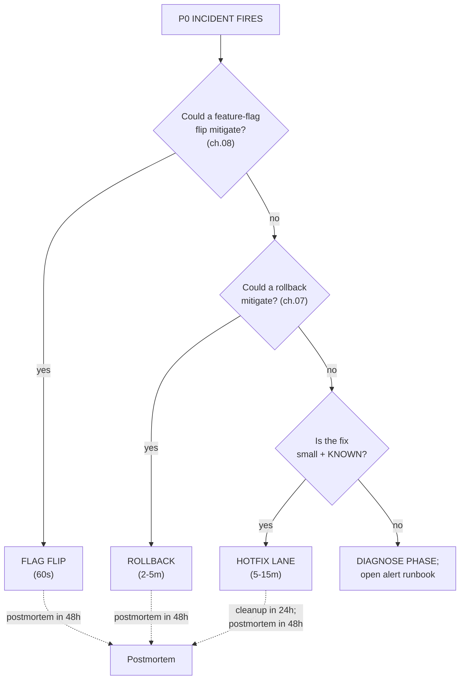
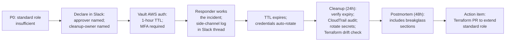

# 15.09 — Hotfix workflow and breakglass

> The **emergency lane**: when [ch.02](02-application-cicd-pipelines.md)'s
> normal CI/CD pipeline (lint → test → scan → cosign sign → push →
> Argo CD sync) is too slow to mitigate a P0, you need a fast path
> that ships in 5-15 minutes. The discipline: branch-protection bypass
> via repo admin; CI **fast-path** that keeps `scan` but skips the
> slow integration suite; a **breakglass IAM role** with full admin
> + 1-hour TTL + every action audited to CloudTrail; **post-incident
> cleanup** (rotate credentials, drift-check Terraform, review
> CloudTrail) within 24 hours; postmortem within 48 hours. The
> "hotfix became normal" anti-pattern and why the team's quarterly
> review counts hotfix PRs by author.

**Estimated time:** ~30 min read · ~60 min hands-on
**Prerequisites:** [Part 15 ch.02](./02-application-cicd-pipelines.md) — normal-flow CI you'll fast-path around · [Part 15 ch.07](./07-rollback-playbook.md) — rollback is the alternative when hotfix is wrong · [Part 14 ch.13](../14-eks-in-production-a-to-z/13-runtime-defense-and-container-security.md) — runtime audit trail that backstops breakglass

**You'll know after this:** • configure a CI fast-path that keeps `scan` but skips the slow integration suite for P0 mitigation in 5-15 minutes · • design a breakglass IAM role with full admin + 1-hour TTL + every action audited to CloudTrail · • execute the post-incident cleanup checklist (rotate credentials, drift-check Terraform, review CloudTrail) within 24 hours · • write the hotfix postmortem within 48 hours and surface the root cause that needed the hotfix · • measure the "hotfix became normal" anti-pattern via quarterly hotfix-PR-by-author review

<!-- tags: hotfix, incident-response, security, day-2, ci-cd -->

## Why this exists

[ch.02](02-application-cicd-pipelines.md) shipped the normal-flow
CI/CD pipeline for the Bookstore Go services: lint, unit tests,
integration tests, Trivy scan, cosign sign, push to ECR, Argo CD
sync. End-to-end: 25-45 minutes. That is **the right speed for the
99% case**: every change reviewed, every test green, every signed
image traceable to a SHA.

A **P0 incident** is the 1% case. Production is down for ≥ 50% of
customers; or data loss; or safety/regulatory. The clock starts when
the page fires. The team's options:

1. **Rollback** ([ch.07](07-rollback-playbook.md)) — 2-5 minutes for
   code; the right choice when a rollback target exists.
2. **Flag flip** ([ch.08](08-feature-flags-and-dark-launches.md)) —
   < 60 seconds for kill switches; the right choice when the
   regression is flag-gated.
3. **Hotfix forward** — required when neither of the above works
   (the fix is a forward change; no rollback target; not flag-gated).

This chapter is the **third path**. It is **deliberately uncomfortable**:
it bypasses the gates the team set up for good reasons; it consumes
audit-trail debt that must be paid back; it accumulates technical
debt that must be cleaned up. The discomfort is the **feature** —
the right shape for an emergency lane is one the team chooses NOT
to use 99% of the time.

> **In production:** Without a documented hotfix workflow, P0
> incidents either (a) get hotfixed informally — engineers SSH-into
> CI runners, force-pushes happen, audit trails go dark, secrets
> rotate out of band — or (b) drag on for hours while the normal
> pipeline runs. Both outcomes hurt; the right answer is a
> **disciplined emergency lane** that ships fast AND preserves the
> audit trail AND is followed by mandatory cleanup.

## Mental model

**The hotfix workflow is the slowest acceptable emergency lane. It is
SLOWER than rollback (which is < 5 min); it is SLOWER than flag flip
(which is < 1 min); it is FASTER than normal CI (which is > 25 min)
because it drops the slowest gates while keeping the safety-critical
ones. Every gate dropped is named; every drop is justified; every
drop is restored on the cleanup PR.**

- **The four-gate decision.** A P0 incident triggers four
  sequential questions:
  1. **Could a flag flip mitigate?** → Use flag flip ([ch.08](08-feature-flags-and-dark-launches.md)); 60 seconds. No hotfix.
  2. **Could a rollback mitigate?** → Use rollback ([ch.07](07-rollback-playbook.md)); 2-5 minutes. No hotfix.
  3. **Is the fix small + known?** → Hotfix lane. Continue.
  4. **Is the fix unknown?** → Open the alert runbook; this is still
     the diagnose phase, not the mitigate phase.
- **The CI fast-path.** The normal pipeline runs ~25-45 minutes; the
  fast-path runs in 5-8 minutes by dropping the slow gates:
  - **KEPT**: lint (gofmt; 30s), unit tests for the changed package
    only (2 min), Trivy scan (1 min), build + cosign sign + push
    (3 min). The scan is the non-negotiable — a hotfix that ships
    a CVE is a security event in addition to the original incident.
  - **DROPPED**: full integration test suite (15 min); E2E browser
    tests (10 min); performance regression tests (5 min); soak
    tests. These re-run on the cleanup PR.
- **Branch-protection bypass.** Main has required-reviewer + required-
  status-check rules. The hotfix bypass uses GitHub's `--admin` merge
  option, available to the `@platform-admins` team. Every admin merge
  posts to `#bookstore-platform-audit`; the **approver** is named
  in the Slack declaration; the audit trail is preserved even when
  the gate is bypassed.
- **The breakglass IAM role.** Some hotfixes need AWS permissions
  beyond the standard platform-engineer role (an IRSA lockout; a
  Crossplane controller in a bad state; a need to delete a
  managed resource via the AWS API directly). The breakglass role:
  - **Full admin** on the services the platform uses (EC2, EKS, S3,
    RDS, IAM, KMS, Route 53, CloudWatch, Secrets Manager).
  - **1-hour TTL** via Vault's AWS auth method. After expiry,
    credentials auto-rotate; the role is unusable until reassumed.
  - **Audit-trail-protected**: explicit Deny on CloudTrail
    Stop/Delete/Update; explicit Deny on Organizations/Billing;
    explicit Deny on destroying the audit + backup buckets. Even
    "full admin" cannot tamper with the audit log.
  - **Assumption gate**: Vault AWS auth method requires MFA;
    assumption posts an alert to `#bookstore-platform-audit`.
- **Post-incident cleanup (within 24 hours).** Every hotfix
  accumulates **three kinds of debt**:
  - **Test debt**: the test that would have caught the bug. The
    cleanup PR adds it.
  - **Audit debt**: the CloudTrail log for the breakglass session
    must be reviewed; any unexpected actions investigated; secrets
    touched must be rotated.
  - **Terraform drift debt**: the breakglass session may have
    created resources outside Terraform. The drift-check
    ([Part 14 ch.07](../14-eks-in-production-a-to-z/07-infrastructure-cicd-and-drift.md))
    either imports them or deletes them.
- **Postmortem (within 48 hours).** Standard postmortem template
  ([Part 13 ch.12](../13-grand-capstone-bookstore-platform/12-day-2-runbook-on-call-dr-chaos.md))
  + hotfix-specific sections:
  - Why was a hotfix needed? (the answer "CI was slow" is **not** a
    root cause; the root cause is the test gap that let the bug
    through.)
  - Could the incident have been a rollback / flag flip?
  - Was the breakglass role used? (If yes: cleanup checklist
    completed?)
  - What changes prevent the next occurrence?
- **The quarterly review.** The team's quarterly review counts:
  - Hotfix PRs per author. > 4 per quarter is a code-yellow
    conversation. > 8 is a code-red conversation about pipeline
    speed / process gaps.
  - Breakglass assumptions per quarter. The target is **zero**;
    > 2 means the standard role has a gap; the fix is a Terraform
    PR adding the missing permissions.

The trap to keep in view: **the hotfix lane is the path of least
resistance**. A team that hits friction on the normal pipeline (slow
tests; flaky CI; strict review process) will pressure-test the
hotfix lane until "hotfix" is the default. The defence is **the
quarterly review with named numbers**: a team whose hotfix-PR rate
is rising knows something is wrong, even when no individual hotfix
felt wrong.

> **In production:** A team that ships > 1 hotfix per week has a CI
> investment problem, not a hotfix workflow problem. The fix is
> unsexy: parallelise tests, cache dependencies, remove flakes,
> shorten the integration suite. The hotfix workflow is the
> **escape hatch**, not the highway; if it becomes the highway, the
> team has lost the discipline that makes the highway safe.

## Diagrams

### Diagram A — the four-gate decision tree (Mermaid)



### Diagram B — the hotfix CI fast-path vs normal flow (ASCII)

```text
NORMAL FLOW (~30 min)                 HOTFIX FAST-PATH (~6 min)
─────────────────────────             ─────────────────────────
1. lint              30s     KEPT     lint              30s
2. unit tests        3m      KEPT     unit (changed pkg) 2m
3. integration tests 15m     DROPPED  ─
4. E2E tests         10m     DROPPED  ─
5. perf regression   5m      DROPPED  ─
6. Trivy scan        1m      KEPT     Trivy scan         1m
7. build             1m      KEPT     build              1m
8. cosign sign       30s     KEPT     cosign sign        30s
9. push to ECR       1m      KEPT     push to ECR        1m
10. Argo CD sync     1m      KEPT     Argo CD sync       1m
─────────────────────────             ─────────────────────────
TOTAL: ~30 min                        TOTAL: ~6 min

RE-RUN on the cleanup PR (within 24h):
  3. integration tests
  4. E2E tests
  5. perf regression
```

### Diagram C — the breakglass session lifecycle (Mermaid)



## Hands-on with the Bookstore Platform

We walk through a simulated P0 hotfix end-to-end: declaration, fix,
fast-path CI, admin merge, Argo CD sync, verification, cleanup,
postmortem. Then we exercise the breakglass role separately (against
a dev cluster; the prod role assumption is the chaos-game-day exercise).

### 0. Prerequisites — fast-path CI workflow, Vault AWS auth, audit channel

```sh
# The fast-path workflow lives in the bookstore-platform repo:
ls .github/workflows/hotfix-fastpath.yml
# (Phase 15a defines the normal pipeline; the fast-path is its
# stripped-down sibling — see Quick Reference for the diff.)

# Vault AWS auth method is configured (Phase 15-R Terraform):
vault read aws/config/lease
# lease: 1h; lease_max: 4h

# The breakglass role exists and is mapped to the right IAM ARN.
vault read aws/roles/breakglass-emergency
# arn: arn:aws:iam::123456789012:role/breakglass-emergency

# Slack channels:
# #bookstore-platform-status  -- declarations + customer comm
# #bookstore-platform-audit   -- admin merges + breakglass events
```

### 1. Declare the hotfix

```sh
# In #bookstore-platform-status:
cat <<EOF
DECLARING HOTFIX — INC-2026-05-20-001 P0
  Symptom: catalog 500s on every search for tenants with
           pagination_size > 50 (regression in v1.5.1)
  Approver: @alice (SRE Lead)
  Cleanup-owner: @bob (catalog tech-lead)
  Expected merge ETA: HH:MM+10 UTC
EOF
```

### 2. Write the fix

```sh
# Branch off main; ONE concern; the smallest possible diff.
git checkout -b hotfix/INC-2026-05-20-001-catalog-pagination

# Surgical fix (a one-line nil-check):
cat <<'EOF' >> internal/search/service.go
//        + if len(opts.SortKeys) == 0 {
//        +     opts.SortKeys = []string{"score"}
//        + }
EOF

git diff
git commit -m "hotfix(catalog): nil-deref on missing SortKeys

INC-2026-05-20-001
approver: @alice
cleanup: @bob will open follow-up PR within 24h."
git push origin hotfix/INC-2026-05-20-001-catalog-pagination
```

### 3. Open the PR + label as hotfix

```sh
gh pr create \
  --title "HOTFIX: INC-2026-05-20-001 catalog nil-deref on missing SortKeys" \
  --body "P0 incident.
Approver: @alice
Cleanup-owner: @bob
Cleanup PR: <follows within 24h>
Postmortem: <follows within 48h>

Smallest possible fix; single-line nil-check before deref."

# Adding the `hotfix` label triggers the fast-path workflow.
gh pr edit <PR_NUMBER> --add-label hotfix

# Watch the fast-path checks:
gh pr checks <PR_NUMBER> --watch
# lint                        pass    25s
# unit-changed-package        pass    1m45s
# trivy-scan                  pass    52s
# build-cosign-push           pass    3m15s
# Total: ~6 minutes.
```

### 4. Admin-merge + Argo CD sync

```sh
# Approver (@alice in this drill) does the admin-merge:
gh pr merge <PR_NUMBER> --admin --squash
# Audit log entry posts to #bookstore-platform-audit:
#   "@alice merged PR #4321 (HOTFIX:...) via admin bypass"

# Argo CD auto-syncs within ~60s; force the sync to skip the wait.
argocd app sync bookstore-catalog-us-east --prune
argocd app wait bookstore-catalog-us-east --health --sync
# Application Healthy + Synced.
```

### 5. Verify recovery

```sh
# Symptom metric (the 5xx rate that paged):
kubectl -n monitoring exec -ti prom-stack-kube-prom-prometheus-0 -- \
  promtool query instant http://localhost:9090 \
  'sum(rate(http_requests_total{service="catalog",code=~"5.."}[5m])) /
   sum(rate(http_requests_total{service="catalog"}[5m]))'
# Expect: drops below 0.01 within 2-3 minutes.

# Customer-facing smoke test:
curl -s https://api.bookstore-platform.example.com/v1/catalog/search?q=kubernetes&pagination_size=100 \
  | jq '.results | length'
# 100  (expected; the bug was 0 because of the nil-deref)

# Status-page update + Slack mitigated message.
```

### 6. Cleanup PR (within 24 hours)

```sh
# The cleanup-owner (@bob) opens the follow-up.
git checkout -b cleanup/INC-2026-05-20-001-catalog-tests

# Add the regression test that would have caught the bug.
cat <<'EOF' > internal/search/service_test.go
func TestSearch_MissingSortKeys(t *testing.T) {
    s := NewService(...)
    opts := SearchOptions{} // SortKeys not set
    res, err := s.Search(context.Background(), opts)
    require.NoError(t, err)
    require.NotNil(t, res)
}
EOF

# Add a Kyverno policy (Tier 4 - optional) preventing the bug-class.
git push origin cleanup/INC-2026-05-20-001-catalog-tests
gh pr create \
  --title "Cleanup: INC-2026-05-20-001 catalog hotfix - tests + docs" \
  --body "Follows hotfix #4321 in INC-2026-05-20-001.
Includes:
- Regression test for the nil-deref.
- Inline documentation explaining the missing-SortKeys path.

Reviewers: standard flow; no bypass."

# This PR runs the FULL pipeline (no fast-path):
gh pr checks <CLEANUP_PR>
# lint                pass
# unit-tests          pass
# integration-tests   pass    (the slow piece; 15 min)
# e2e-tests           pass    (10 min)
# perf-regression     pass    (5 min)
# trivy-scan          pass
# build-cosign-push   pass

# Standard review (1+ reviewers); merge through the normal flow.
```

### 7. Postmortem (within 48 hours)

```sh
cp examples/bookstore-platform/runbooks/postmortem-template.md \
   examples/bookstore-platform/runbooks/INC-2026-05-20-001.md
$EDITOR examples/bookstore-platform/runbooks/INC-2026-05-20-001.md

# Hotfix-specific sections (template additions):
cat <<EOF
## Hotfix-specific sections

**Why was a hotfix needed?**
- The regression manifested on enterprise tenants only (pagination_size > 50).
- Rollback would have lost ~10 minutes of post-deploy normal traffic.
- The fix was a known single-line change; the hotfix lane was faster
  than rollback + re-deploy.

**Could the incident have been a flag flip / rollback?**
- Flag flip: NO; the bad code path was not flag-gated.
- Rollback: YES; it would have worked. The team chose hotfix to avoid
  the post-rollback re-deploy cycle. POSTMORTEM DECISION: in
  retrospect, rollback would have been the right call;
  documented in action items below.

**Was the breakglass role used?** NO.

**Action items:**
- [ ] @bob: ship the cleanup PR (DONE; merged at 2026-05-21 09:14 UTC).
- [ ] @charlie: review whether the integration-test suite COULD have
  caught the bug; if yes, the gap is "test was missing"; if no,
  the gap is "we test integration in a too-narrow way".
- [ ] @platform-team: update the hotfix runbook to make "rollback
  first" explicit when a rollback target exists.
EOF
```

### 8. Exercise the breakglass role (dry-run in dev)

```sh
# In #bookstore-platform-status:
# "DECLARING BREAKGLASS DRY-RUN — DRILL-2026-05-20
#  Approver: @alice
#  Cleanup-owner: @bob
#  Cluster: dev only"

# Assume the role via Vault.
ROLE_CREDS=$(vault read -format=json aws/sts/breakglass-emergency \
  | jq -r '.data')
export AWS_ACCESS_KEY_ID=$(echo $ROLE_CREDS | jq -r '.access_key')
export AWS_SECRET_ACCESS_KEY=$(echo $ROLE_CREDS | jq -r '.secret_key')
export AWS_SESSION_TOKEN=$(echo $ROLE_CREDS | jq -r '.security_token')

# Confirm the identity.
aws sts get-caller-identity
# {
#   "UserId": "AROA...:alice",
#   "Account": "123456789012",
#   "Arn": "arn:aws:sts::123456789012:assumed-role/breakglass-emergency/alice"
# }

# Run a couple of safe ops in dev (the drill exercises the role; the
# prod role assumption is for real incidents).
aws ec2 describe-vpcs --region us-east-1 | head
aws s3 ls s3://bookstore-platform-assets-dev | head

# Wait for the session to expire (1 hour) OR explicitly revoke:
vault lease revoke aws/sts/breakglass-emergency/...

# Run the cleanup checklist (see
# examples/bookstore-platform/hotfix/cleanup-after-breakglass.md):
aws cloudtrail lookup-events \
  --lookup-attributes "AttributeKey=UserName,AttributeValue=alice" \
  --start-time "2026-05-20T13:00:00Z" \
  --end-time   "2026-05-20T14:00:00Z" \
  --output table
# Captures everything the role did; saved to S3 for the postmortem.

# Drift check.
cd examples/bookstore-platform/terraform/clusters/dev
terraform plan -out=/tmp/post-breakglass-drift.plan
# Inspect for any unexpected changes.
```

## How it works under the hood

**The fast-path workflow.** The GitHub Actions workflow is a copy of
the normal-flow workflow with the slow steps `if:` -gated on the
`hotfix` label:

```yaml
# .github/workflows/hotfix-fastpath.yml (sketch)
name: Hotfix Fast-Path
on:
  pull_request:
    types: [labeled]
jobs:
  fastpath:
    if: github.event.label.name == 'hotfix'
    runs-on: ubuntu-22.04
    steps:
      - uses: actions/checkout@v4
      - run: ./scripts/ci-lint.sh
      - run: ./scripts/ci-unit-changed.sh        # only the touched package
      - run: ./scripts/ci-scan.sh                # Trivy; non-negotiable
      - run: ./scripts/ci-build-cosign-push.sh   # signed image to ECR
      - run: ./scripts/ci-argocd-sync-trigger.sh
```

The normal workflow has the same steps PLUS the slow integration /
E2E / perf steps. The cleanup PR re-runs the normal workflow.

**Branch-protection bypass mechanics.** GitHub's branch-protection
rules expose a "Allow specified actors to bypass required pull
requests" checkbox; the Bookstore Platform repo lists the
`@platform-admins` team. `gh pr merge --admin` uses the GitHub API
endpoint `PUT /repos/{owner}/{repo}/pulls/{pr}/merge` with the
`merge_method=squash` parameter; the API requires the `admin` scope
+ the actor to be in the bypass list. Every admin merge generates a
GitHub Audit Log entry (visible to repo admins + the org's security
team); the Bookstore Platform configures a GitHub App to post these
to `#bookstore-platform-audit`.

**The breakglass role's Vault wiring.** Vault's AWS secrets engine
generates **STS credentials** on-demand against a configured IAM
role. The Bookstore Platform's config (Phase 15-R Terraform):

```text
vault path        aws/config/root         (AWS IAM user with sts:AssumeRole privilege)
vault path        aws/roles/breakglass-emergency
                  ├─ credential_type: assumed_role
                  ├─ role_arns: ["arn:aws:iam::...:role/breakglass-emergency"]
                  └─ default_ttl: 3600 (1 hour)
                     max_ttl: 14400 (4 hours; the role cannot exceed)
```

A user assumes the role via:

```text
vault read aws/sts/breakglass-emergency
# Returns: access_key, secret_key, security_token, lease_id, lease_duration: 3600
```

The MFA gate is configured at the Vault auth layer (the user must
authenticate to Vault with an MFA-enrolled identity provider).
Vault's auth/MFA configuration is in
`examples/bookstore-platform/terraform/vault/auth-userpass-mfa.tf`.

**The trust policy and the permissions policy together.** Two IAM
policies define the breakglass role:

- **Permissions policy** (`examples/bookstore-platform/hotfix/
  breakglass-iam-policy.json`): what the role can DO. Full admin
  on most services; explicit Deny on CloudTrail-tampering and
  Organizations / Billing.
- **Trust policy** (separate document, in Terraform): who can
  ASSUME the role. The Vault AWS auth method's IAM user is the
  only allowed principal; MFA is required at the STS layer
  (`sts:MultiFactorAuthPresent: true`); session duration is
  capped at 3600.

The TTL is enforced **twice**: Vault's lease (3600s) + IAM's
DurationSeconds (3600). Defense in depth: if Vault's lease tracking
fails, the underlying IAM credentials still expire.

**Cleanup vs forgetting — the half-life of orphaned resources.** A
breakglass session that creates an IAM user, a temporary EC2
instance, an S3 bucket — those resources have **no built-in
expiration**. The cleanup checklist
(`examples/bookstore-platform/hotfix/cleanup-after-breakglass.md`)
is the **only** thing that removes them. A team that skips cleanup
accumulates "ghost resources" — unattributable IAM users from 6
months ago; EC2 instances no one remembers creating; S3 buckets
with bad permissions.

**The "breakglass became normal" anti-pattern's mechanics.** Every
breakglass assumption posts a PagerDuty alert + a Slack message in
`#bookstore-platform-audit`. The quarterly review:

1. Counts assumptions per quarter (the team-level KPI).
2. Reads the postmortem for each.
3. Cross-references the postmortem's "what would have made
   breakglass unnecessary?" action items.
4. Checks: was the action item shipped?

If the same team assumes breakglass 4 times in a quarter and the
postmortems list the same gap each time, the gap is real. The
quarterly review treats this as a process bug, not a people bug —
the team gets the time + tooling to fix the gap.

## Production notes

> **In production:** **The "hotfix became normal" anti-pattern is the
> #1 signal that the team's pipeline investment is overdue.** If your
> team ships > 1 hotfix per week, the pipeline is too slow / too
> flaky to trust; the team has rationally chosen the fast-path as
> default. The quarterly review's metric (hotfix PRs per author)
> is the canary; > 4 per quarter for any individual is a code-yellow
> conversation. The fix is **CI investment**, not "be more careful".

> **In production:** **The "I used breakglass and forgot to clean
> up" footgun.** The breakglass role auto-rotates credentials at TTL
> expiry; the artifacts the breakglass session created (IAM users,
> snapshots, EC2 instances, S3 buckets) persist forever. The 24-
> hour cleanup checklist (`examples/bookstore-platform/hotfix/
> cleanup-after-breakglass.md`) is non-negotiable; the platform
> team's audit MUST sign it off.

> **In production:** **Skipping `scan` on the fast-path is a
> security event.** The temptation: a Trivy scan failed with a
> false-positive CVE; the team wants to bypass. **NO**. The fast-
> path keeps `scan` for a reason — a hotfix that ships a CVE is a
> security incident piled on the original P0. If the scan is
> wrong, fix the scanner / the CVE allowlist, then re-run the
> fast-path. The total delay is 10-15 minutes; faster than the
> security postmortem the bypass would have triggered.

> **In production:** **Breakglass assumptions during incidents
> require an APPROVER, not just an actor.** A single-person
> breakglass is a security event. The Slack declaration's
> "Approver: @alice" line is not ceremony; it's the **two-person
> rule** in operational form. The responder + the approver are
> jointly accountable for the session's blast radius.

> **In production:** **The hotfix lane is the ESCAPE HATCH, not
> the HIGHWAY.** The discipline a senior platform engineer brings
> to a P0 is "could this be a rollback?" before "let me hotfix
> this". Junior engineers gravitate toward hotfix because forward
> momentum feels productive; rollback feels like failure. The
> mentorship is the discipline transfer — "rollback first; hotfix
> only when rollback won't work".

> **In production:** **The breakglass policy's explicit Deny on
> CloudTrail Stop/Delete is the audit-trail's last line of
> defence.** A "full admin" policy without this Deny lets the
> breakglass user disable the audit trail — at which point the
> postmortem becomes archaeology. The Deny statement
> (`examples/bookstore-platform/hotfix/breakglass-iam-policy.json`'s
> `DenyCloudTrailManagement` SID) is the most-important line in
> the policy.

> **In production we did not build:** a formal change-management
> board (CAB) — GitHub PR review serves as the change-management
> record; ITIL-style CABs layer on top for HIPAA / PCI-DSS regulated
> shops; auto-revert on hotfix metric regression via Argo Rollouts
> AnalysisRun — hotfixes are rare enough that per-hotfix manual
> verification is fine, but high-frequency hotfix shops should invest
> here; sealed audit-log replication to a separate AWS Organizations
> sub-account — the v2 documents but doesn't implement; a
> Kubernetes-native breakglass `ClusterRole` time-limited via
> TokenRequest — the v2 platform gates K8s admin through the
> standard `cluster-admin` binding backed by Vault's Kubernetes auth
> method; and full session recording for breakglass sessions — the
> v2 relies on the Slack thread + CloudTrail combination.

## Quick Reference

```sh
# DECLARE in #bookstore-platform-status:
#   "DECLARING HOTFIX — INC-<ID> P0
#    Approver: <HANDLE>
#    Cleanup-owner: <HANDLE>"

# BRANCH + FIX
git checkout -b hotfix/INC-<ID>-<DESC>
# ... surgical fix; ONE concern; <50 lines preferred
git commit -m "hotfix: ..."
git push origin hotfix/INC-<ID>-<DESC>

# OPEN PR; add `hotfix` label
gh pr create --title "HOTFIX: ..." --body "..."
gh pr edit <PR> --add-label hotfix
gh pr checks <PR> --watch       # ~6 minutes

# APPROVER admin-merges
gh pr merge <PR> --admin --squash

# SYNC Argo CD
argocd app sync <APP> --prune
argocd app wait <APP> --health --sync

# VERIFY metric recovered

# CLEANUP PR within 24h (full pipeline)
git checkout -b cleanup/INC-<ID>-tests
# ... add regression test; docs; Kyverno policy
gh pr create

# POSTMORTEM within 48h
cp examples/bookstore-platform/runbooks/postmortem-template.md \
   examples/bookstore-platform/runbooks/INC-<ID>.md

# (BREAKGLASS, only when standard role can't do it)
vault read aws/sts/breakglass-emergency       # MFA required
# ... do the work; keep a side-channel log in Slack thread
# After: cleanup-after-breakglass.md (24h);
#        postmortem includes breakglass sections.
```

The full procedure lives in `examples/bookstore-platform/hotfix/
HOTFIX-RUNBOOK.md`. The breakglass IAM policy is in
`examples/bookstore-platform/hotfix/breakglass-iam-policy.json`. The
post-breakglass cleanup checklist is in
`examples/bookstore-platform/hotfix/cleanup-after-breakglass.md`.

## Test your understanding

> Try each before opening the answer drawer. The act of trying is the exercise; the answer is the check.

1. **The chapter calls the four-gate decision (flag flip → rollback → hotfix → diagnose) the first 60 seconds of incident response. Why is this order load-bearing?**
   <details><summary>Show answer</summary>

   The order is from fastest to slowest mitigation: flag flip (60s) → rollback (2-5min) → hotfix (5-8min CI fast path) → diagnose (open-ended). Each subsequent step is slower and consumes more discipline-debt to execute, so you only take it if the prior step doesn't apply. A team that jumps to "hotfix" without first asking "could a flag flip mitigate?" wastes the 60-second option in favor of a 5-minute one — every saved minute is customer impact avoided. Diagnose is the last resort because you're explicitly admitting you don't yet know the fix; that's the longest path and the one with the most uncertainty.

   </details>

2. **An on-call engineer SSHs into a CI runner, manually pushes a hotfix image bypassing CI, applies it via `kubectl set image`, and silences the alert. Production is fixed. What broke from the chapter's perspective and what's the recovery?**
   <details><summary>Show answer</summary>

   The "hotfix that broke audit trail" scenario. The action sequence violated three disciplines simultaneously: (1) bypassed CI signing, so the image is unsigned — Kyverno verifyImages should have rejected it (and didn't, meaning either the policy isn't enforcing in prod or admission was bypassed too); (2) bypassed GitOps, so the cluster state drifted from Git — Argo CD will fight the manual change at next sync; (3) bypassed the audit trail, so there's no record of who did what when. The chapter's discipline: use the hotfix lane (CI fast-path: lint + unit + Trivy scan + cosign sign + push + Argo CD sync, 5-8 min) — it bypasses the SLOW gates while keeping the safety-critical ones. Recovery: open the cleanup PR within 24h that codifies the change in Git, run the drift-check to import or delete any orphan resources, rotate any secrets the engineer touched, write the postmortem explaining why the disciplined hotfix lane wasn't used.

   </details>

3. **The breakglass IAM role has "full admin" but explicit Deny on CloudTrail stop/delete. Why is the deny specifically on the audit log?**
   <details><summary>Show answer</summary>

   The audit log is the only record of what the breakglass user did. If the breakglass role could stop CloudTrail, an attacker (or a mistaken operator) could disable logging, do anything, and there'd be no forensic trail. The same logic applies to deleting the audit/backup buckets, modifying Organizations/Billing, and any other "tamper with the auditor" capability. The discipline: even "full admin" cannot tamper with the audit log. The trade-off: a real emergency where CloudTrail itself is misbehaving (extremely rare) requires escalation outside breakglass to root-account access, which has its own controls. The chapter's pattern guarantees that every breakglass action is recoverable in postmortem.

   </details>

4. **A team's hotfix-PR rate goes from 2/quarter to 6/quarter. What does the chapter say is the right response, and what's the wrong response?**
   <details><summary>Show answer</summary>

   **Wrong response**: tighten the hotfix process to make it harder to use (more gates, more approvals). This is treating the symptom — engineers will route around the friction. **Right response**: treat the rate as a signal that the normal CI pipeline has a problem. The fix is unsexy: parallelize tests, cache dependencies (Go modules + Docker buildx GHA cache), remove flakes, shorten the integration suite. > 4 hotfixes/quarter per author is a "code-yellow" conversation; > 8 is "code-red conversation about pipeline speed / process gaps." The hotfix lane is the escape hatch, not the highway; if it becomes the highway, the team has lost the discipline that makes the highway safe.

   </details>

5. **Hands-on extension — execute the hotfix lane runbook against a synthetic P0 in a test cluster (a deliberately broken catalog deploy). Time it end-to-end and capture every artifact required for the postmortem.**
   <details><summary>What you should see</summary>

   The CI fast-path takes ~5-8 minutes (lint 30s + unit tests for changed package 2min + Trivy 1min + build/sign/push 3min). The Argo CD sync runs in seconds with the webhook. Total mitigation from page-fired to alert-cleared should be ~10-12 minutes if the team has drilled it. Required artifacts: (1) the hotfix PR with the explicit "P0 hotfix" label and a link to the incident ticket; (2) Slack declaration in `#bookstore-platform-audit` with the `@platform-admins` approver named; (3) cosign signature in Rekor for the hotfix image; (4) the cleanup PR opened within 24h that restores the dropped tests and adds the missing test that would have caught the bug. The drill exposes runbook gaps — every "where's the breakglass procedure?" moment is a runbook revision.

   </details>

## Further reading

- **[Google SRE Book ch.8 — "Release Engineering"](https://sre.google/sre-book/release-engineering/)** —
  the foundational separation of "deploy" from "release" + the
  emergency-change discipline.
- **[Atlassian — "Incident Management"](https://www.atlassian.com/incident-management/incident-response)** —
  the incident-response model the Bookstore Platform's hotfix
  declaration shape borrows from.
- **[Vault AWS Secrets Engine](https://developer.hashicorp.com/vault/docs/secrets/aws)** —
  the STS-credentials-on-demand mechanism the breakglass role
  uses.
- **[AWS — CloudTrail best practices](https://docs.aws.amazon.com/awscloudtrail/latest/userguide/best-practices-security.html)** —
  the audit-trail tamper-resistance the policy's `DenyCloudTrailManagement`
  SID protects.
- **[GitHub — "Protected branches" + Bypass](https://docs.github.com/en/repositories/configuring-branches-and-merges-in-your-repository/managing-protected-branches/about-protected-branches)** —
  the admin-merge mechanism the hotfix lane uses.
- **[Honeycomb — "Operating with Confidence"](https://www.honeycomb.io/blog/incidents-incident-response-deeply-different)** —
  the case for "rollback first; hotfix only when forced" the
  chapter codifies.
- **[Rosso et al., *Production Kubernetes* ch.14 — Application
  Considerations]** — the "production-readiness checklist" the
  hotfix workflow assumes as a baseline.
