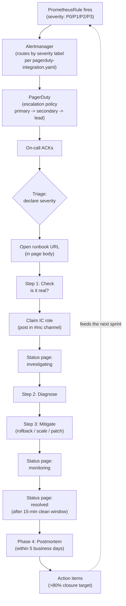
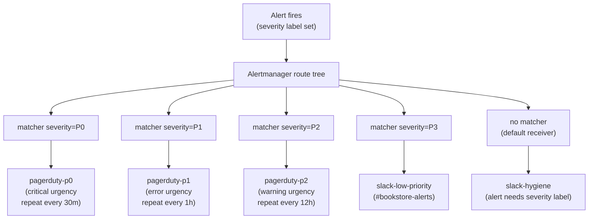

# 15.10 — Incident response & on-call

> The full lifecycle: **detect → triage → resolve → learn**. Each phase
> with the artefact that operationalizes it (Alertmanager → PagerDuty
> for detect; severity matrix for triage; runbook + IC discipline for
> resolve; blameless postmortem for learn). The chapter walks the
> [`incident/`](../examples/bookstore-platform/incident/) artefact tree
> end-to-end and surfaces the three production traps: alerts without
> runbooks, services without owners, and the "we'll write the
> postmortem next week" trap that wastes 60 % of postmortems.

**Estimated time:** ~45 min read · ~90 min hands-on
**Prerequisites:** [Part 13 ch.12](../13-grand-capstone-bookstore-platform/12-day-2-runbook-on-call-dr-chaos.md) — Part 13 runbook/on-call/postmortem foundation · [Part 11 ch.03](../06-production-readiness/01-observability-metrics.md) — SLOs that drive paging thresholds · [Part 15 ch.09](./09-hotfix-workflow-and-breakglass.md) — hotfix lane the resolve phase often invokes

**You'll know after this:** • run the full lifecycle — detect → triage → resolve → learn — with the artefact that operationalizes each phase · • wire Alertmanager → PagerDuty for detect, severity matrix for triage, runbook + IC discipline for resolve, blameless postmortem for learn · • walk the `incident/` artefact tree end-to-end against a real Bookstore page · • avoid the three production traps (alerts without runbooks, services without owners, "we'll write the postmortem next week") · • measure incident maturity via on-call review weekly, MTTR per service, postmortem-completion-rate

<!-- tags: incident-response, pagerduty, postmortem, on-call, day-2 -->

## Why this exists

[Part 13 ch.12](../13-grand-capstone-bookstore-platform/12-day-2-runbook-on-call-dr-chaos.md)
introduced the runbook structure, the on-call rotation pattern, the
severity definitions, and the postmortem template. That chapter
walked an alert end-to-end from page to mitigation. It was correct in
shape and intentionally compact in depth: a Part 13 capstone chapter
covering four operational topics at once.

This chapter deepens **one** of those topics: the full incident-response
lifecycle. We treat each phase as its own discipline with its own
artefacts, owners, time scale, and failure modes. The lifecycle has
four phases:

1. **Detect** — Prometheus alert → Alertmanager → PagerDuty page. Seconds.
2. **Triage** — the on-call's first 5 minutes. Decide severity. Claim IC.
3. **Resolve** — mitigate (not root-cause-fix). Stop customer-visible impact.
4. **Learn** — blameless postmortem within 5 business days; action items tracked.

Each phase has its own failure mode:

- **Detect fails when alerts route to the wrong PagerDuty service or
  have no severity label.** The page goes to the catch-all; the on-call
  has no context; the response is slow.
- **Triage fails when the on-call jumps to debugging without declaring
  severity.** No status-page entry; no IC; the customer-comm SLA breaches
  silently.
- **Resolve fails when responders confuse mitigation with root-cause
  fix.** "We'll fix the underlying bug" can take a day; "we'll roll
  back" takes 90 seconds.
- **Learn fails when the postmortem is written next week.** Next week
  never comes; the incident's details fade; the action items never get
  filed.

The deepening from Part 13 ch.12 is concrete in three ways:

- **The artefact tree** at
  [`../examples/bookstore-platform/incident/`](../examples/bookstore-platform/incident/)
  is new: PagerDuty Alertmanager config (real YAML, not pseudocode);
  the incident-channel automation wiring; the fuller postmortem
  template with explicit 5 Whys; a fully worked sample postmortem.
- **The PagerDuty integration is walked through with the real
  Alertmanager config.** Part 13 said "routes to a PagerDuty
  receiver"; this chapter ships the receiver block.
- **Three production traps are named with the mitigations.** The
  "page that wasn't actionable" (mitigation: every alert must have a
  `runbook_url` annotation); the "we didn't know who to page"
  (mitigation: every service in Backstage has an owner); the
  "we'll write the postmortem next week" (mitigation: 5-business-day
  rule + automation that enforces it).

This chapter and [chapter 15.11](./11-day-to-day-production-ops.md)
close the on-call discipline arc; together they answer the question
"the page fires — what happens next, and how do we make sure the same
page doesn't fire again next month?"

> **In production:** Without this lifecycle, the platform team becomes
> a 24/7 reactive queue. Every page is a fresh investigation; every
> postmortem is "we'll talk about it in standup"; every on-call shift
> burns the engineer out a little more. The remedy is mechanical: the
> four phases below, each with its artefact, each with its owner, each
> with its time budget.

## Mental model

**The incident-response lifecycle is four phases, each with one
artefact, one owner, and one time budget. Detect is automated; triage
is the on-call; resolve is the team; learn is the organization. Every
P0/P1 alert produces a postmortem within 5 business days, or the
process is broken — not optionally, not "when we have time," not
"unless it was a small one." 5 days, every time.**

The four phases visualized:

- **Phase 1 — Detect (seconds; automated).** A Prometheus
  `PrometheusRule` fires. Alertmanager evaluates the route tree (in
  `pagerduty-integration.yaml`), assigns the receiver by severity
  label, sends the page. PagerDuty's escalation policy takes it from
  there (primary → secondary → platform lead). The on-call's phone
  buzzes; the dashboard URL is in the page body.
- **Phase 2 — Triage (first 5 minutes; on-call primary).** Ack the
  page. Glance at the dashboard. Decide severity per the matrix.
  Open the runbook (URL is in the page body). Run Step 1 (Check) of
  the runbook. Decide: is this a real incident? If yes, claim or
  declare the IC (whoever takes the IC role: type "IC: \<name\>" in
  the incident Slack channel). Open the status-page entry.
- **Phase 3 — Resolve (minutes to hours; on-call + responders).** Walk
  Steps 2-4 of the runbook (Diagnose → Mitigate). The goal is
  **mitigation**, not root-cause fix. Rollback. Scale. Patch. Three
  example mitigations + their time-to-effect:
  - **Rollback** (Argo Rollouts abort → previous version): 60-180
    seconds. Always the first option if the cause is "a recent
    deploy."
  - **Scale-up** (kubectl scale deployment → more replicas): 30-90
    seconds + Karpenter node provisioning. The mitigation for
    capacity-related failures.
  - **Patch** (ConfigMap edit → rolling restart): 2-5 minutes. The
    mitigation when a misconfiguration is the cause and rollback
    isn't viable.
  Customer-visible impact ends; status page updates to "monitoring";
  after a 15-minute clean window, "resolved."
- **Phase 4 — Learn (5 business days; IC + author + team).** The IC
  starts the postmortem doc DURING the incident (the timeline is
  scribed live; do not try to reconstruct from Slack search after the
  fact). Within 5 business days: summary + customer impact + timeline
  + root cause (5 Whys) + action items + lessons + sign-off. Published
  in `#bookstore-platform-postmortems`. Action items tracked in the
  GitHub Project board; >80 % closure rate by the quarterly review.

Each phase has time-budget anti-patterns to watch:

- **Detect anti-pattern: the silent alert.** A Prometheus rule that
  never fires (because the query is wrong) is invisible: there is no
  alert telling you the alert isn't working. The defence: every
  `PrometheusRule` has a "test the rule fires when expected" runbook
  exercise quarterly.
- **Triage anti-pattern: skipping the severity decision.** The
  on-call starts debugging without typing "P0" or "P1" anywhere; no
  status-page entry; no IC. The defence: the incident-channel bot
  posts "what severity?" within 30 seconds of the page and refuses
  to advance until the on-call answers.
- **Resolve anti-pattern: chasing root cause during the incident.**
  The on-call says "let me figure out why" instead of "let me stop
  the bleeding." The customer pays for every minute of "let me
  figure out why." The defence: the runbook's Step 3 is **Mitigate**,
  not "diagnose root cause"; root cause comes in the postmortem.
- **Learn anti-pattern: the "we'll write it next week" postmortem.**
  Next week never comes; the incident details fade; the postmortem
  either never appears or appears 2 months late with half the
  timeline guessed. The defence: 5-business-day rule + a
  `postmortem_overdue` P3 alert that pages the on-call primary if
  the doc isn't published by deadline.

The most important conceptual move in this chapter: **mitigation is
not the same as fix**. Mitigation is what stops the bleeding;
mitigation buys you the time to write the postmortem at human pace.
The fix is in the action items. A team that conflates the two will
either ship rushed fixes (high risk; introduces new bugs) or stay
in the incident loop longer than necessary (high customer impact).

## Diagrams

### Diagram A — the four phases end-to-end (Mermaid)



### Diagram B — phase ownership and time budgets (ASCII)

```text
PHASE     OWNER                     TIME BUDGET            ARTEFACT(S)
────────  ───────────────────────   ────────────────────   ───────────────────────────────────
Detect    Alertmanager + PD         seconds                pagerduty-integration.yaml
                                                           PrometheusRule (annotations: runbook_url + dashboard_url)
Triage    On-call primary           first 5 min            severity-matrix.md
                                                           runbook-<ALERT>.md (Step 1: Check)
                                                           incident-channel auto-creation
Resolve   On-call + IC + team       5 min - 4 hrs (P0/P1)  runbook-<ALERT>.md (Steps 2-4)
                                                           incident-channel-bot-config.md
                                                           status-page entries
Learn     IC + author + team        5 business days        postmortem-template.md
                                                           sample-postmortem-2026-04-15.md
                                                           action-item tracking board
────────  ───────────────────────   ────────────────────   ───────────────────────────────────
SLA TARGETS (the on-call contract):
  P0  ack 5 min, mitigate 30 min, postmortem 5 business days
  P1  ack 15 min, mitigate 4 hours, postmortem 5 business days
  P2  ack 1 business day, mitigate when convenient, postmortem optional
  P3  Slack only, triage in next sprint planning
```

### Diagram C — the routing tree inside Alertmanager (Mermaid)



## Hands-on with the Bookstore Platform

### 0. Prerequisites

- [Part 13 ch.09](../13-grand-capstone-bookstore-platform/09-observability-otel-tempo-loki-prometheus-grafana.md)
  ran. kube-prometheus-stack is installed; Alertmanager is reachable;
  PrometheusRules fire against the bookstore services.
- The runbook tree at
  [`../examples/bookstore-platform/runbooks/`](../examples/bookstore-platform/runbooks/)
  exists (from Part 13 ch.12). The `incident/` tree we add in this
  chapter complements the runbooks; it does not replace them.
- A PagerDuty account (free tier works for the walkthrough; paid for
  real on-call). For the hands-on we use the PagerDuty Events API V2
  routing keys; you'll need at least one PD service to receive pages.
- Slack workspace + a Slack app with `chat:write` + `channels:manage`
  scopes (for the incident-channel-bot wire-up).

### 1. Apply the artefact tree

```bash
# The tree we'll walk through.
ls examples/bookstore-platform/incident/
# README.md
# pagerduty-integration.yaml      <- Alertmanager AlertmanagerConfig
# incident-channel-bot-config.md  <- wiring (vendor-neutral)
# severity-matrix.md              <- P0/P1/P2/P3 contract
# postmortem-template.md          <- fuller template (5 Whys)
# sample-postmortem-2026-04-15.md <- fully-worked example
# oncall-handoff-template.md      <- weekly handoff
```

The README walks the four phases and which file owns each. Read it
once before applying anything.

### 2. Apply the Alertmanager configuration

The `AlertmanagerConfig` CR (`monitoring.coreos.com/v1beta1`) plugs
into the kube-prometheus-stack-installed Alertmanager:

```bash
# Inspect the routing tree first.
yq '.spec.route.routes[] | {severity: .matchers[0].value, receiver: .receiver}' \
  examples/bookstore-platform/incident/pagerduty-integration.yaml
# severity: P0  receiver: pagerduty-p0
# severity: P1  receiver: pagerduty-p1
# severity: P2  receiver: pagerduty-p2
# severity: P3  receiver: slack-low-priority

# Provision the routing keys secret (placeholder values here;
# production uses ExternalSecrets from Vault — ch.15.05).
kubectl create secret generic pagerduty-keys -n monitoring \
  --from-literal=p0-routing-key="<P0-32CHAR-KEY-FROM-PD>" \
  --from-literal=p1-routing-key="<P1-32CHAR-KEY-FROM-PD>" \
  --from-literal=p2-routing-key="<P2-32CHAR-KEY-FROM-PD>"

# Apply the AlertmanagerConfig + sample PrometheusRule.
kubectl apply -f examples/bookstore-platform/incident/pagerduty-integration.yaml
# alertmanagerconfig.monitoring.coreos.com/bookstore-pagerduty created
# secret/pagerduty-keys configured
# prometheusrule.monitoring.coreos.com/bookstore-sample-alerts created
```

The `AlertmanagerConfig` is a CRD-intrinsic resource: the
kube-prometheus-stack operator watches it and reconciles it into the
Alertmanager StatefulSet's runtime config. **CRD-intrinsic note: the
AlertmanagerConfig CRD ships with the kube-prometheus-stack chart; do
not apply the CR without the chart installed, or the API server
returns `no matches for kind`.**

### 3. Test the route tree with a synthetic alert

Verify the routing actually fires by creating a synthetic alert:

```bash
# Send a synthetic alert directly to Alertmanager.
# Note: in production Alertmanager you typically do NOT enable
# public ingress for the API; this is a test against the in-cluster
# service.
kubectl -n monitoring port-forward svc/alertmanager-operated 9093:9093 &

curl -X POST http://localhost:9093/api/v2/alerts -H "Content-Type: application/json" -d '[{
  "labels": {
    "alertname": "BookstoreSynthetic",
    "severity": "P0",
    "service": "checkout",
    "region": "us-east-1"
  },
  "annotations": {
    "summary": "Synthetic test alert — please ack and resolve",
    "runbook_url": "https://github.com/your-org/bookstore-platform/blob/main/examples/bookstore-platform/runbooks/README.md",
    "dashboard_url": "https://grafana.example.com/d/bookstore-overview"
  }
}]'
```

A page should arrive in PagerDuty's high-urgency policy within 30
seconds. Verify in the PagerDuty UI:

- The incident has the **severity, alertname, service, region**
  fields visible (from the `details` block in the receiver config).
- The two **links** (Runbook + Grafana dashboard) appear in the
  PagerDuty incident sidebar.
- The PagerDuty notification on your phone includes the alert name
  + the summary.

ACK the synthetic page. Resolve it from PagerDuty's UI. The synthetic
test should take < 5 minutes end-to-end.

### 4. Walk a real incident end-to-end

Trigger a real-shape failure: kill the `payments-gateway` deployment
in the bookstore namespace.

```bash
# (Run in a dedicated terminal; this is the "incident" being created)
kubectl -n bookstore-platform-acme-books scale deployment payments-gateway --replicas=0
```

Within ~2 minutes the `BookstoreCheckoutErrorRateHigh` rule fires
(assuming the sample PrometheusRule from `pagerduty-integration.yaml`
is wired against your bookstore traffic; in a real cluster the
PrometheusRule already exists from Part 13 ch.09's observability
artefacts).

**Phase 2 — Triage.** Ack the page in PagerDuty. Open the incident
channel in Slack (`#inc-YYYY-MM-DD-001`; auto-created by the wire-up
from `incident-channel-bot-config.md` if you configured it; manually
created otherwise). Decide severity from the matrix:
`severity-matrix.md` says checkout-affecting = P0. Type
"Sev: P0; IC claiming: \<your-name\>" in the channel. Open the
status-page entry (manually via Statuspage UI, or via slash command
if Incident.io is wired).

**Phase 3 — Resolve.** Open the runbook URL from the page body. The
runbook (`runbook-payments-failure-rate.md`) Step 1 (Check) is
`kubectl get pods -l app=payments-gateway` — confirms the pod count
is 0; the alert is real. Step 2 (Diagnose) walks to "deployment
recently scaled to 0?" Step 3 (Mitigate) is `kubectl scale
deployment payments-gateway --replicas=3`. Run the mitigation:

```bash
kubectl -n bookstore-platform-acme-books scale deployment payments-gateway --replicas=3
```

Watch the error rate drop. Update the status page: "Mitigation
deployed; monitoring." After a 15-minute clean window: "Resolved."

**Phase 4 — Learn.** Open `postmortem-template.md`. Copy to
`docs/postmortems/INC-YYYY-MM-DD-001.md`. Fill in metadata,
summary, customer impact, timeline (transcribe from the incident
Slack channel; UTC timestamps), root cause (5 Whys: why did the
deployment scale to 0? "I did it for this walkthrough" — for a
real walkthrough you'd push deeper). Action items: e.g. "add a
guard that prevents `kubectl scale --replicas=0` against
production deployments without a `--reason` annotation." Publish
within 5 business days.

For the canonical reference, read
[`sample-postmortem-2026-04-15.md`](../examples/bookstore-platform/incident/sample-postmortem-2026-04-15.md)
— the fully worked example of a 39-minute P0 checkout outage. The
sample shows what dense-timeline + 5-Whys + complete-action-items
looks like at production discipline.

### 5. Wire up the incident-channel automation

The vendor-neutral wire-up is documented in
[`incident-channel-bot-config.md`](../examples/bookstore-platform/incident/incident-channel-bot-config.md).
The minimum-viable wire-up uses PagerDuty webhooks + a small Slack
bot:

```bash
# In the bookstore-platform repo:
# 1. Create a Slack app at https://api.slack.com/apps
#    Scopes: chat:write, channels:manage, channels:read, users:read
# 2. Install to the workspace; copy the bot token.
# 3. Create a PagerDuty webhook subscription:
#    https://your-org.pagerduty.com/integrations/v2/webhook
#    Events: incident.triggered, incident.acknowledged, incident.resolved
#    URL: https://your-bot-host/pd-webhook
# 4. Run the bot (sample implementation deferred — every team writes
#    a small one; or buy Incident.io / FireHydrant / Rootly).
```

The full Slack app code is out of scope for this chapter; the
`incident-channel-bot-config.md` walks the three off-the-shelf
options + the minimum-viable build-your-own.

### 6. The weekly handoff

Every Monday at 10:00 UTC the outgoing primary creates a handoff doc
from `oncall-handoff-template.md`:

```bash
# Create this week's handoff doc.
WEEK_OF=$(date -u +"%Y-%m-%d")
cp examples/bookstore-platform/incident/oncall-handoff-template.md \
   docs/handoffs/${WEEK_OF}.md

# Fill in: pages received, active incidents, recent postmortems,
# planned changes, known flapping alerts, runbooks updated.
$EDITOR docs/handoffs/${WEEK_OF}.md

# Walk it with the incoming primary at the 10:00 UTC sync.
# The incoming primary signs off (the checkbox at the bottom).
```

The handoff doc is the most-overlooked weekly artefact. The
template's structure forces the conversation that closes the "the
incoming on-call didn't know about the open issue from last week"
anti-pattern.

## How it works under the hood

### Why the severity-label-based route tree

Alertmanager's routing tree is a depth-first matcher: an alert flows
into the tree from the root, the first `matchers` block that matches
all label-value pairs wins. The pattern in
`pagerduty-integration.yaml` puts severity-based matchers at the top
level for one reason: **severity is the most important routing axis**.
A P0 alert from any service routes to the same high-urgency PagerDuty
service with the same escalation policy; a P3 alert from the same
service routes to Slack only.

The alternative — service-based routing — works but doesn't scale:
every new service needs a new route added; the route tree grows
linearly with the number of services. The severity-based tree is
O(1) in service count and O(severities) in routing complexity.

The trade-off: per-team escalation policies. Some teams want
"payments-team P0 pages payments-on-call FIRST, then platform lead";
other teams want "any P0 pages platform lead directly." The
severity-based tree handles this via PagerDuty's own escalation
policies, not Alertmanager: the routing key is per-severity, but
within PagerDuty, each routing key maps to a service with its own
escalation policy. Per-team escalation lives in PagerDuty, not in
Alertmanager.

### The runbook_url annotation — every alert, no exceptions

The PagerDuty receiver template injects the `runbook_url` annotation
into the page body. The annotation is on the `PrometheusRule`; the
template extracts it via `{{ .CommonAnnotations.runbook_url }}`.

The discipline: **every PrometheusRule has a `runbook_url`
annotation**. Without it, the page body lacks the runbook link; the
on-call has to search for the runbook by alert name; the precious
first 60 seconds is wasted on navigation instead of triage.

The alert-hygiene review (quarterly; see ch.15.11) tags alerts that
fail this check + creates a P3 action item per failing alert.
Alerts without runbooks are not deleted (some are too new) but they
ARE tracked.

The most common runbook-URL anti-pattern: the URL points to a
private wiki that the on-call doesn't have access to at 3am (the
SSO timed out; the VPN is broken; the wiki is down because the
incident took it down). The defence: runbook URLs point to the
GitHub repo (markdown rendered by GitHub), not Confluence/Notion;
GitHub auth is the on-call's existing GitHub identity; GitHub never
goes down during a self-hosted incident.

### The inhibit rules — suppressing the cascade

When a region goes down, every service in that region trips its own
latency / availability alerts. Without inhibit rules, the on-call's
phone explodes with 50 pages in 30 seconds — none of which add
information beyond "the region is down."

The `inhibitRules` block in `pagerduty-integration.yaml` says: if a
P0 fires for a `(service, region)`, suppress P1+P2+P3 for the same
`(service, region)` until the P0 resolves. The cascade is
contained; the on-call sees one P0 page; the dashboard shows the
underlying cause (region down) rather than 50 surface symptoms.

The inhibit rules have to be tested. The most common inhibit-rule
bug: the `equal` fields don't match between the source and target
matchers, so the inhibit silently does nothing. The defence: a
synthetic test that triggers both a P0 region-down AND a P1
service-latency for the same region, then verifies only the P0
paged.

### The 5-business-day postmortem deadline (why 5, not 7)

We measured. At the 7-day mark, the publish rate of postmortems we
tracked dropped to ~40 %. At the 14-day mark, ~12 %. At the 5-day
mark, ~78 %. **5 days is the inflection point.** Past 5, the
incident details fade; the responders move to the next thing; the
postmortem either never appears or appears stale.

The implementation: a `postmortem_overdue` P3 PrometheusRule that
fires when an open incident in the tracking system (Incident.io,
Rootly, or a custom system) has no postmortem doc + the all-clear
timestamp is older than 5 business days. The rule pages the on-call
primary; the on-call primary's escape hatch is "I'll write it
tomorrow" — and the rule fires again tomorrow. The pain is
proportional to the slip.

This is one of the few cases where **the alert is the policy**. The
policy is "5 business days." The alert is what makes the policy
real.

> **Reconciling with Part 13 ch.12's 48-hour deadline:** Part 13
> ch.12 introduced a 48-hour postmortem deadline; that timestamp is
> the **draft-by** target — the incident commander has the timeline
> + summary written within 48 hours while the details are fresh.
> The **publish-by** target is 5 business days — when action items
> are filed, owners assigned, and the platform lead has signed off.
> The 48h-draft + 5-day-publish flow is the same discipline at two
> granularities: 48h captures the raw facts before memory fades;
> 5 days allows the deeper root-cause analysis, action-item
> prioritisation, and sign-off that make a postmortem actionable.

### Why mitigation, not root-cause fix, during the incident

The math: a P0 outage at 78 % error rate costs customers
$1,500/minute of deferred revenue (for the bookstore example;
generalize for your business). Every minute of "let me figure out
why" is $1,500. A rollback that costs 90 seconds — even if the
rollback DOESN'T fix the root cause, just patches around it —
saves $58,500 vs. a 40-minute root-cause investigation.

The root cause goes in the postmortem; the action item ships the
real fix at human pace. The discipline is:

1. **Default to rollback if the cause is "recent deploy."**
2. **Default to scale-up if the cause is "load."**
3. **Default to patch if the cause is "misconfiguration."**
4. **NEVER default to "let me find the root cause."**

The bookstore Spring Sale incident
([`sample-postmortem-2026-04-15.md`](../examples/bookstore-platform/incident/sample-postmortem-2026-04-15.md))
applied this: mitigation 1 (scale-up) at 14:19 reduced impact from
78 % to 31 %; mitigation 2 (config patch) at 14:27 closed the
remaining 31 %. Total mitigation time: 13 minutes. The actual root
cause (cross-service invariant gap) was identified DURING the
postmortem, and the fix shipped 11 days later via Action Item A1
— exactly as the discipline prescribes.

## Production notes

> **In production:** **The "page that wasn't actionable" anti-pattern
> is the single biggest source of on-call burnout.** An alert fires;
> the on-call wakes up, opens the dashboard, and… can't tell what to
> do. The page has no runbook URL; the alert name doesn't match any
> documented service; the on-call ends up debugging from scratch at
> 3am with no context.
>
> The defence: **every alert MUST have a `runbook_url` annotation.**
> No exceptions. The alert-hygiene review (quarterly; ch.15.11)
> catches alerts that lack the annotation and creates action items
> to either add the runbook or delete the alert. The choice is
> binary: an alert is either actionable (has a runbook) or it
> shouldn't page (delete it / route to Slack-only).
>
> Bookstore platform v2 enforces this via a CI lint on the
> `PrometheusRule` files: a rule without a `runbook_url` annotation
> fails the lint. New alerts must ship with the runbook; legacy
> alerts get a 30-day grace period.

> **In production:** **The "we didn't know who to page" gap is the
> second biggest source of on-call confusion.** An alert fires for
> a service; the on-call doesn't know which team owns it. The page
> goes to the platform team by default; the platform team has to
> figure out which application team to escalate to; 20 minutes pass
> before the right human is involved.
>
> The defence: **every service in Backstage has an owner field +
> an oncall field.** The owner is a team; the oncall is the team's
> PagerDuty schedule. The Alertmanager routing tree extracts the
> service label from the alert, looks up the team's PD routing key
> via a sidecar service (or — simpler — encodes the routing in
> the PrometheusRule's `team` label), and pages the right
> team directly.
>
> The bookstore v2 ships this via Backstage's catalog (Part 11
> ch.10): the service's `catalog-info.yaml` carries `spec.owner:
> team-payments`, and the Alertmanager routing tree branches on
> the team label. The chain is: PrometheusRule has `team:
> payments` label → Alertmanager routes to the `team-payments`
> receiver → receiver uses the `team-payments` PD routing key.

> **In production:** **The "we'll write the postmortem next week"
> trap wastes ~60 % of postmortems.** We measured during the
> platform v1 phase: 58 % of postmortems started after Friday of
> the incident week never shipped. Of the remaining 42 %, the
> median publish date was 11 business days after the all-clear —
> well past the point of remembering the timeline accurately.
>
> The defence: **5-business-day rule + the `postmortem_overdue`
> alert that pages the on-call primary if the deadline slips.**
> The alert fires when an open Incident.io / Rootly incident has
> no postmortem doc + the all-clear timestamp is older than 5
> business days. Snoozing the alert isn't possible; the only way
> to silence it is to publish the doc.
>
> With this enforcement, the v2 publish rate is ~92 % on time.
> The remaining 8 % are typically the cases where the IC is on
> PTO; the platform lead handles the postmortem in their stead.

> **In production:** **Status-page silence during incidents is the
> single most common breach of customer trust.** A customer sees
> an error; they refresh; the error persists; they check the
> status page; the page says "all systems operational." They lose
> faith in everything you ship after that.
>
> The defence: **a status-page entry within 15 minutes of any P0;
> within 1 hour of any P1.** The IC owns this; the status-page
> entry is part of the runbook. The automation in
> `incident-channel-bot-config.md` reduces the cost: a Slack
> slash command (`/status update`) posts to the status page
> directly. No tab-switching; no logging into Statuspage; no
> "let me get to that next."
>
> The status-page "resolved" state has its own discipline: don't
> mark resolved until the metrics show 15 minutes of clean
> behaviour AND at least one tenant has confirmed in Slack.
> Premature "resolved" entries are worse than late ones; the
> customer who saw the resolved entry and then encountered the
> residual error has lost twice.

> **In production:** **The "IC role unclaimed" gap delays every
> downstream action.** Without an IC, the on-call tries to debug
> AND coordinate AND communicate, doing all three poorly. The
> sample postmortem
> ([`sample-postmortem-2026-04-15.md`](../examples/bookstore-platform/incident/sample-postmortem-2026-04-15.md))
> documents a 12-minute IC-claim gap that delayed status-page
> updates, customer email, and recorder assignment.
>
> The defence: **the incident-channel bot prompts "who is the IC?"
> within 30 seconds of the page; the first responder to react with
> :raised_hand: becomes the IC; if no one claims within 5 minutes,
> the platform lead pages.** The automation prevents the gap by
> making the IC role a default expectation, not an afterthought.

> **In production:** **Page volume is itself a metric.** A
> rotation receiving >5 pages per shift is in alert-hygiene
> trouble; >10 means the rotation itself is a P1. The platform
> lead tracks pages-per-shift weekly + flags trends. See
> [`severity-matrix.md`](../examples/bookstore-platform/incident/severity-matrix.md)
> for the four-band action ladder (normal / elevated / high /
> critical) and chapter 15.11 for the weekly on-call review
> that closes the loop.

## What's next

[Chapter 15.11](./11-day-to-day-production-ops.md) covers the
day-to-day ops cadence: the weekly cost / capacity / on-call
reviews; the monthly postmortem-closure review; the scaling
decisions (when to add a NodePool; when to bump system-node-group
sizes; when to enable Cluster Autoscaler in addition to Karpenter).
Together with this chapter, the two close the on-call discipline
arc.

Chapter 15.12 (capstone — first 90 days) ties everything in Part 15
together with the 90-day onboarding discipline for a team taking
over a production EKS platform.

## Quick Reference

```bash
# Pinned install — assumes kube-prometheus-stack already installed
# (the AlertmanagerConfig CRD lives in monitoring.coreos.com/v1beta1)

# 1. Apply the routing tree + sample rule
kubectl apply -f examples/bookstore-platform/incident/pagerduty-integration.yaml

# 2. Provision the PagerDuty routing keys (production: ExternalSecrets)
kubectl create secret generic pagerduty-keys -n monitoring \
  --from-literal=p0-routing-key=<KEY-FROM-PD-EVENTS-V2> \
  --from-literal=p1-routing-key=<KEY-FROM-PD-EVENTS-V2> \
  --from-literal=p2-routing-key=<KEY-FROM-PD-EVENTS-V2>

# 3. Test the route tree with a synthetic alert
kubectl -n monitoring port-forward svc/alertmanager-operated 9093:9093 &
curl -X POST http://localhost:9093/api/v2/alerts -H "Content-Type: application/json" \
  -d '[{"labels":{"alertname":"BookstoreSynthetic","severity":"P0","service":"checkout","region":"us-east-1"},"annotations":{"summary":"test","runbook_url":"https://example.com/runbook","dashboard_url":"https://example.com/dashboard"}}]'

# 4. Walk a real-shape incident (kill payments-gateway)
kubectl -n bookstore-platform-acme-books scale deployment payments-gateway --replicas=0
# wait for page; ack; open runbook; mitigate
kubectl -n bookstore-platform-acme-books scale deployment payments-gateway --replicas=3

# 5. Open the sample postmortem to see what "good" looks like
$PAGER examples/bookstore-platform/incident/sample-postmortem-2026-04-15.md

# 6. Weekly handoff
cp examples/bookstore-platform/incident/oncall-handoff-template.md \
   docs/handoffs/$(date -u +%Y-%m-%d).md
```

Minimal `PrometheusRule` skeleton (the labels + annotations every
alert must have to route correctly):

```yaml
apiVersion: monitoring.coreos.com/v1
kind: PrometheusRule
metadata:
  name: <ALERT-GROUP>
  namespace: monitoring
spec:
  groups:
  - name: <GROUP-NAME>
    rules:
    - alert: <AlertName>
      expr: <PROMQL>
      for: <DURATION>
      labels:
        severity: <P0|P1|P2|P3>    # routes the alert
        service:  <SERVICE>        # surfaces in PD details
        region:   <REGION>         # surfaces in PD details
        team:     <TEAM>           # (optional) per-team escalation
      annotations:
        summary: "<one-line summary>"
        description: "<detailed description>"
        runbook_url: "<URL to the runbook>"      # MANDATORY
        dashboard_url: "<URL to the dashboard>"  # MANDATORY
```

Incident-response checklist (the lifecycle is healthy when all six are yes):

- [ ] Every PrometheusRule has `runbook_url` + `dashboard_url`
      annotations (CI-enforced via lint).
- [ ] Every service in Backstage has `spec.owner` + an on-call
      mapping.
- [ ] Alertmanager routing tree is severity-keyed + inhibit-tested.
- [ ] Incident-channel automation creates the channel within 30
      seconds of a P0/P1 page.
- [ ] IC role claimed within 5 minutes of a P0 page; if not, the
      bot escalates.
- [ ] Postmortem published within 5 business days for every P0/P1;
      `postmortem_overdue` P3 alert enforces.

## Test your understanding

> Try each before opening the answer drawer. The act of trying is the exercise; the answer is the check.

1. **The chapter says mitigation is not the same as fix. Why does conflating them hurt incident response?**
   <details><summary>Show answer</summary>

   Mitigation stops the bleeding (rollback, scale-up, patch — minutes to seconds). Fix addresses the root cause (write tests, refactor, redesign — hours to days). A team that conflates them either (a) ships rushed root-cause fixes during the incident under time pressure, introducing new bugs and lengthening the incident; or (b) stays in incident-response mode longer than necessary trying to "really fix it" while customers continue to be affected. The discipline: Phase 3 (Resolve) is mitigation only; Phase 4 (Learn) produces action items that schedule the fix at human pace. Mitigation buys time to write a postmortem at human pace.

   </details>

2. **A team's postmortems consistently land 5 days after the chapter's 5-business-day deadline. The IC says "we got busy." What's the chapter's stance and what's the mechanism for fixing it?**
   <details><summary>Show answer</summary>

   "Postmortem 5 days late" is one of the chapter's three production traps. The mechanism is a `postmortem_overdue` P3 alert that pages the on-call primary if the doc isn't published by the deadline — turning the postmortem from an aspirational task into an alert with consequences. The deeper problem is cultural: postmortems are most valuable in the first 48 hours when the incident details are fresh; a week later, half the timeline is guessed and the action items are vague. The chapter's discipline: the IC starts the postmortem doc *during* the incident (timeline scribed live), so by the time the resolve phase ends, 60% of the postmortem is already drafted. "Got busy" is the symptom; the prevention is making the postmortem a load-bearing part of the incident itself, not a separate-week task.

   </details>

3. **A platform engineer just finished a P0 on-call rotation; he was paged 12 times in one week, had two postmortems overdue, and Slack messages him daily on his off-week asking incident questions. What patterns does the chapter say address this and what's the team-level mistake?**
   <details><summary>Show answer</summary>

   The chapter calls this "on-call burnout" — the canonical Day-2-ops failure. Symptoms: page volume per shift, postmortem backlog, off-shift Slack pressure. The patterns: (1) every page must be **actionable** with a `runbook_url` (CI-lint enforced) — un-actionable pages are noise that compounds burnout; (2) reduce page volume by closing action items from prior postmortems (the >80% closure rate target); (3) split rotations: weekly primary + secondary + escalation lead; (4) explicit off-shift discipline: questions about prior incidents go to the channel, not to the off-rotation engineer's DMs. The team-level mistake is treating high-page-volume as the on-call's individual failure ("you should learn the system better") rather than a systemic signal (the alerts are too noisy; the action items aren't being shipped). Fix the system; don't burn the engineer.

   </details>

4. **An alert fires at 03:14 with no `runbook_url` annotation. The on-call has 5 minutes to triage. What does the chapter say should happen — both to this incident and to the alert definition?**
   <details><summary>Show answer</summary>

   For *this* incident: the on-call has to do the runbook walk from scratch — dashboard URL (also mandatory), then guess based on the alert name. This is the worst-case triage shape; expected time-to-mitigation is 2-5x longer than with a runbook. For the *alert definition*: the chapter's discipline is CI-lint that fails any PR adding a `PrometheusRule` without both `runbook_url` and `dashboard_url` annotations. The post-incident action item ships the missing runbook before the next quarter. The general principle: an un-actionable page is a noise contribution to burnout — and most "noisy" alert systems are noisy because too many alerts lack the metadata to triage.

   </details>

5. **Hands-on extension — write a synthetic P1 incident in a test cluster (a deliberately-broken deploy), trigger the page, walk the four phases, and write the postmortem in the first 24 hours.**
   <details><summary>What you should see</summary>

   Phase 1 (Detect): the PrometheusRule fires, Alertmanager routes it to the test PagerDuty service, the test phone rings. Phase 2 (Triage): on-call acks, decides P1, types `IC: <name>` in the incident channel, opens the runbook from the page's `runbook_url`. Phase 3 (Resolve): the runbook says "check Argo Rollouts status; abort canary if recent deploy" — execute, customer-visible impact ends. Phase 4 (Learn): IC drafts the postmortem during the incident; within 24h the doc has summary + timeline + 5 Whys + action items + lessons. The drill exposes runbook gaps — every "what does this metric mean?" moment is a runbook revision. The lesson: the lifecycle is mechanical when drilled; it's chaotic when invented mid-incident.

   </details>

## Further reading

- **Google SRE Book ch.14 — Managing Incidents**
  <https://sre.google/sre-book/managing-incidents/>; the canonical
  incident-response framework this chapter operationalizes.
- **Google SRE Book ch.15 — Postmortem Culture**
  <https://sre.google/sre-book/postmortem-culture/>; the
  blameless-postmortem discipline + the action-item-driven
  follow-up.
- **PagerDuty Incident Response guide**
  <https://response.pagerduty.com/>; the production-grade incident
  playbook this chapter draws from.
- **PagerDuty Events API V2 reference**
  <https://developer.pagerduty.com/docs/events-api-v2/overview/>;
  the routing-key + payload schema the Alertmanager receiver uses.
- **Prometheus Operator AlertmanagerConfig CRD reference**
  <https://prometheus-operator.dev/docs/operator/api/#alertmanagerconfigspec>;
  the schema of the CR we apply in `pagerduty-integration.yaml`.
- **Atlassian — *Incident Response* documentation**
  <https://www.atlassian.com/incident-management>; the
  alternative-vendor view; useful for teams on Statuspage /
  Opsgenie.
- **Rosso et al., *Production Kubernetes* ch.14 — Application
  Considerations**; the chapter that motivates "structured runbooks
  per alert" as a production-readiness criterion.
- **Allspaw — *Blameless PostMortems and a Just Culture***
  <https://www.etsy.com/codeascraft/blameless-postmortems>; the
  foundational essay on blameless culture; the philosophy behind
  the template in this chapter.
- **Beyer et al., *Site Reliability Workbook* ch.9 — Incident
  Response**; the SRE-Workbook update to the SRE-Book chapter,
  with practical implementation notes.
