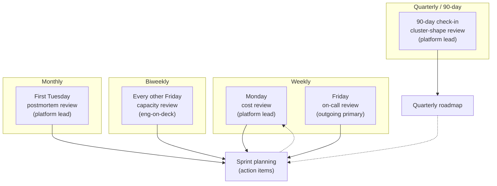
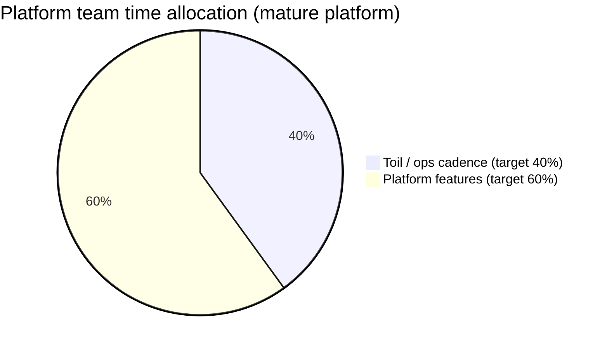

# 15.11 — Day-to-day production operations

> The weekly / monthly / quarterly cadence that turns "we ship code"
> into "we own production." Cost reviews every Monday; capacity
> reviews every other week; on-call reviews weekly; postmortem
> reviews monthly. Scaling decisions: when to add a NodePool, when to
> bump the system-node-group, when to enable Cluster Autoscaler in
> addition to Karpenter (mostly never). The 90-day check-in: do we
> still have the right cluster shape? The three production traps:
> the "no one owns ops" gap, the "we'll automate that later" trap,
> and the ops-time-vs-feature-time balance.

**Estimated time:** ~30 min read · ~60 min hands-on
**Prerequisites:** [Part 15 ch.10](./10-incident-response-and-on-call.md) — the reactive side this chapter complements with the proactive side · [Part 14 ch.06](../14-eks-in-production-a-to-z/06-cost-guardrails.md) — cost-review inputs · [Part 11 ch.04](../06-production-readiness/06-capacity-and-cost.md) — proactive ops framing

**You'll know after this:** • run the weekly/monthly/quarterly ops cadence (Monday cost review, biweekly capacity review, weekly on-call review, monthly postmortem review) · • make scaling decisions intentionally — when to add a NodePool, when to bump the system-node-group, when (mostly never) to add Cluster Autoscaler alongside Karpenter · • execute the 90-day check-in "do we still have the right cluster shape" · • avoid the three production traps (no one owns ops, "we'll automate that later", ops-time-vs-feature-time imbalance) · • measure team ops maturity via a small ratio dashboard (ops-time%, hotfix-PR-count, missed-postmortem-count)

<!-- tags: day-2, finops, on-call, autoscaling, platform-engineering -->

## Why this exists

[Chapter 15.10](./10-incident-response-and-on-call.md) covered the
**reactive** side of operations: the page fires; the on-call
responds; the postmortem ships. This chapter covers the **proactive**
side: the work that makes incidents rarer in the first place.

The work is unglamorous. It is reviewing OpenCost dashboards on a
Monday morning to spot a 20 % budget drift. It is checking the
Karpenter consolidation history every other week to know whether the
cluster is right-sized. It is asking, every month, whether the
postmortem action items from last month actually shipped. None of
this work pages anyone; none of it shows up on a quarterly OKR
dashboard. **All of it is the difference between a platform that
runs steadily and a platform that drifts into incident-by-incident
firefighting.**

The discipline has a name in the SRE literature: **operational
toil**. Google SRE's claim is that a healthy SRE team spends at most
50 % of its time on toil; the other 50 % is engineering work that
reduces future toil. Our claim for the bookstore platform is more
modest: the platform team should spend **40 %** of its time on this
cadence (cost / capacity / on-call / postmortem reviews + scaling
decisions + the 90-day shape check-in); the remaining **60 %** on
platform features (the Argo CD upgrade; the new ML inference shape;
the Backstage scaffolder updates).

The 40/60 ratio is healthy for a **maturing** platform. New platforms
(first 6 months) trend higher on toil (60 %); mature platforms
(2+ years) trend lower (20-30 %). If your team is over 60 % on toil
for more than a quarter, the toil itself is a platform feature gap:
something is missing from the platform that's forcing humans to
intervene. That's an action item.

> **In production:** Without this cadence, the platform team becomes
> a backlog-driven feature shop that only sees production when it
> breaks. Cost surprises compound silently; capacity ceilings get
> hit unexpectedly; postmortem action items pile up; the team that
> built the platform stops owning it. The remedy is the rhythm
> below: small, recurring, mechanical, with clear owners.

## Mental model

**Day-to-day production ops is a cadence at four periodicities —
weekly cost review, biweekly capacity review, weekly on-call review,
monthly postmortem review — each owned by a named role, each
producing a small artefact (a Slack message; a Loom; a doc), each
feeding the platform's next-sprint planning. Scaling decisions
happen at the cadence's intersection points; the 90-day check-in
asks the bigger question: do we still have the right cluster
shape?**

The cadence visualized:

- **Monday morning — weekly cost review (30 min).** The platform
  lead opens the OpenCost dashboard + the AWS Budgets dashboard.
  Compares last week's spend to budget. Flags any +20 % surprise.
  Posts a Slack message in `#platform-finops` with three numbers:
  total spend, $/tenant top-5, biggest week-over-week delta.
- **Every other Friday — biweekly capacity review (45 min).** The
  platform engineer-on-deck walks the Karpenter consolidation
  history + cluster CPU/memory headroom + per-NodePool utilization.
  Decides: are we sized for the next two weeks of load? Are there
  any pools running consistently below 30 % utilization (delete)
  or consistently above 80 % (resize)?
- **Friday afternoon — weekly on-call review (30 min).** The
  outgoing primary + the platform lead review the week's pages.
  Pages-per-shift; MTTD (mean time to detect); MTTR (mean time to
  resolve); any pages that should have been a different severity.
  Output: a list of alert-hygiene action items + the handoff doc
  for next week.
- **First Tuesday of each month — monthly postmortem review (60
  min).** The platform lead walks the team through last month's
  postmortems. For each: is the action-item closure rate >80 %?
  Are there recurring root causes? Output: a quarterly platform
  health doc + 1-3 strategic action items for the next quarter.

The non-cadence work that fits inside the cadence:

- **Scaling decisions.** When the capacity review surfaces "this
  NodePool is consistently at 85 %," the decision is "add capacity
  to this pool" or "add a new pool." The decision tree is in the
  next sub-section.
- **Cluster-shape decisions.** Every 90 days the platform lead
  asks: are we still on the right Kubernetes version? The right
  instance types? The right NodePool count? The right region
  spread? The 90-day check-in is the cadence point that's about
  the cluster's strategic shape, not its tactical operations.

The trap to keep in view: **the cadence will atrophy if no one owns
it**. The "no one owns ops" anti-pattern is the failure mode where
the cadence is on paper but no one runs the Monday cost review;
nobody runs the Friday on-call review; the monthly postmortem
review slips three months. The defence is the explicit
**rota** for each cadence point: the platform lead owns the
Monday cost review; the on-call primary owns the Friday on-call
review; the platform lead owns the monthly postmortem review.
**Names attached to each cadence point; no name = no review = no
discipline.**

### Scaling decisions — the decision tree

The capacity review can surface four signals; each maps to a scaling
decision:

1. **NodePool consistently at >80 % utilization.** Decision: **bump
   the pool's max size** (Karpenter `limits.cpu`, `limits.memory`).
   This is the most common scaling decision; bumping the limits is
   safe because Karpenter still consolidates when load drops.
2. **A workload type doesn't fit any existing NodePool's
   requirements.** Decision: **add a new NodePool**. Examples: a
   GPU workload arrived; a workload needs ARM nodes (separate from
   the existing x86 pool); a workload has a hard zone affinity.
   The new pool is additive; the existing pools are untouched.
3. **System-node-group at >70 % memory.** Decision: **bump the
   system-node-group instance size**. The system-node-group hosts
   the kube-system + Karpenter + LB controller + CoreDNS pods;
   under-provisioning here ripples to every workload pod. Resize
   to the next-larger instance class (m6i.large → m6i.xlarge);
   roll the nodes one at a time.
4. **Cluster CPU/memory headroom approaches 0 during peak**.
   Decision: **bump the Karpenter NodePool's `limits` AND bump the
   per-NodePool `nodeClassRef` to larger instance types.** Without
   the first, Karpenter won't add nodes; without the second, the
   nodes Karpenter adds will hit the same per-node limit.

The decision **not** to make: **enabling Cluster Autoscaler
alongside Karpenter**. This is almost never the right call.
Karpenter already does what Cluster Autoscaler does, more
efficiently (Karpenter provisions nodes directly via the cloud
provider's EC2 API; Cluster Autoscaler relies on ASGs). Running
both doubles the operational complexity for no gain. The one case
where you'd run both: a transition period where you're migrating
from Cluster Autoscaler to Karpenter and need to keep CA running
on legacy node groups while Karpenter takes over. The transition
should take weeks, not months.

## Diagrams

### Diagram A — the four cadence loops (Mermaid)



### Diagram B — the scaling-decision tree (ASCII)

```text
CAPACITY-REVIEW OBSERVATION                                   DECISION
─────────────────────────────────────────────────────────     ──────────────────────────────────────────────
A single NodePool is at >80% utilization for the last 7 days  Bump that pool's max limits (limits.cpu, limits.memory)
A workload doesn't fit any existing NodePool's requirements   Add a NEW NodePool (additive; existing pools untouched)
System-node-group is at >70% memory                          Bump system-node-group instance size (m6i.large -> xlarge)
Cluster headroom approaches 0 during peak                     Bump Karpenter limits AND bump NodePool nodeClassRef
NodePool is consistently below 30% utilization               Delete the pool (or merge into a sibling pool)
A workload would benefit from spot pricing                   Add a spot NodePool with the workload's matching requirements
─────────────────────────────────────────────────────────     ──────────────────────────────────────────────
THE DECISION NOT TO MAKE: enable Cluster Autoscaler alongside Karpenter.
  Karpenter already does CA's job, more efficiently. The only case to
  run both: a transition period (weeks, not months) during migration.
```

### Diagram C — the 40/60 toil-vs-feature balance (Mermaid)



```text
HEALTHY-RATIO RANGES (by platform maturity)
──────────────────────────────────────────────────────────────────
< 6 months (greenfield)        toil 60%   features 40%
6-24 months (maturing)         toil 40%   features 60%       <- v2 target
2+ years (mature)              toil 20-30% features 70-80%
──────────────────────────────────────────────────────────────────
If toil >60% for a quarter, the toil itself is a platform gap.
The next sprint's biggest feature: automate the highest-volume toil.
```

## Hands-on with the Bookstore Platform

### 0. Prerequisites

- [Chapter 15.10](./10-incident-response-and-on-call.md) ran. The
  `incident/` artefact tree exists; PagerDuty + Alertmanager wired;
  postmortems are being written.
- [Part 13 ch.10](../13-grand-capstone-bookstore-platform/10-cost-opencost-per-tenant-finops.md)
  ran. OpenCost is installed; the per-tenant cost dashboard is
  accessible at
  `https://grafana.bookstore-platform.example.com/d/opencost`.
- Karpenter is installed (from Part 13 ch.01's bookstore-platform
  Terraform tree) and the cluster has at least one NodePool.
- The platform team has at least 3 engineers (otherwise the
  cadence below is over-engineered; with < 3 engineers the entire
  team does ad-hoc reviews).

### 1. Set up the Monday cost-review template

Create the cost-review template doc that the platform lead fills
in each Monday:

```bash
cat > docs/cost-reviews/template.md << 'EOF'
# Cost review — Week of YYYY-MM-DD

> Filled by: <platform-lead-name>
> Posted to: #platform-finops

## Numbers

- **Total spend (last 7 days):** $<X>  (last week: $<Y>, delta: <PCT>%)
- **Forecast vs. budget (this month):** $<X> / $<Y> (<PCT>%)
- **Top 5 tenants by spend:**
  | Rank | Tenant | $/week | Δ vs last week |
  |------|--------|--------|----------------|
  | 1    | <name> | $<X>   | <PCT>%         |
  | 2    | <name> | $<X>   | <PCT>%         |
  | 3    | <name> | $<X>   | <PCT>%         |
  | 4    | <name> | $<X>   | <PCT>%         |
  | 5    | <name> | $<X>   | <PCT>%         |

## Surprises (deltas > 20%)

- <observation 1>
- <observation 2>

## Action items
- <action 1; owner; due>

EOF
```

Run the first review:

```bash
# Open OpenCost dashboard (per-tenant breakdown)
open https://grafana.bookstore-platform.example.com/d/opencost

# Open AWS Cost Explorer (cluster-level + non-cluster)
open https://console.aws.amazon.com/cost-management/home

# Open AWS Budgets dashboard
open https://console.aws.amazon.com/billing/home#/budgets

# Copy the template; fill in the numbers
cp docs/cost-reviews/template.md docs/cost-reviews/$(date -u +%Y-%m-%d).md
$EDITOR docs/cost-reviews/$(date -u +%Y-%m-%d).md

# Post to Slack via webhook (or copy-paste)
curl -X POST -H 'Content-Type: application/json' \
  -d "{\"text\":\"$(cat docs/cost-reviews/$(date -u +%Y-%m-%d).md)\"}" \
  $SLACK_WEBHOOK_PLATFORM_FINOPS
```

The 30-minute target: 5 minutes opening dashboards, 15 minutes
inspecting, 10 minutes writing + posting. Anything past 45 minutes
means the dashboards are too dense; tune the dashboard, not the
review.

The first 4 weeks of cost reviews are typically the most painful: a
lot of surprises surface from prior under-monitoring. By week 8 the
deltas should stabilize; persistent surprises = a platform feature
gap (e.g. "we don't have per-namespace egress-cost attribution; we
keep getting surprised by NAT spend").

### 2. Set up the biweekly capacity review

The capacity review walks the Karpenter consolidation history + the
cluster headroom:

```bash
# Look at Karpenter's recent consolidation activity (the "did pods
# get bin-packed or did Karpenter add nodes?" question)
kubectl logs -n karpenter -l app.kubernetes.io/name=karpenter \
  --since=14d | grep -E "(consolidat|disrupt)" | head -50

# Cluster-wide CPU/memory utilization (last 14 days)
# (assuming kube-prometheus-stack installed)
kubectl -n monitoring port-forward svc/prometheus-operated 9090:9090 &

# Query: cluster CPU utilization 95th percentile, last 14d
# 1 - avg(rate(node_cpu_seconds_total{mode="idle"}[5m])) over 14d
# The 95th percentile of this is your peak utilization.

# Per-NodePool utilization
kubectl get nodepool -o json | jq '.items[].metadata.name'
# karpenter-bookstore-stable
# karpenter-bookstore-batch
# karpenter-bookstore-arm

# Right-sizing recommendation from VPA (if installed; ch.13.10)
kubectl get verticalpodautoscaler -A -o json | jq \
  '.items[] | {name: .metadata.name, lower: .status.recommendation.containerRecommendations[0].lowerBound, target: .status.recommendation.containerRecommendations[0].target, upper: .status.recommendation.containerRecommendations[0].upperBound}'
```

Decide based on the decision tree:

```text
Observation: karpenter-bookstore-stable at 84% CPU utilization for 9 of last 14 days.
Decision: bump the pool's limits.cpu from 200 to 320.

Observation: karpenter-bookstore-batch at 22% utilization for the last 14 days.
Decision: merge the pool into karpenter-bookstore-stable (delete the batch pool).

Observation: system-node-group at 71% memory.
Decision: bump from m6i.large to m6i.xlarge; rolling-replace one node at a time.
```

Output: a doc in `docs/capacity-reviews/YYYY-MM-DD.md` + the
Terraform PRs to land the decisions:

```bash
# The biweekly Friday: open Terraform PRs for the decisions
cd examples/bookstore-platform/terraform/
$EDITOR karpenter.tf
# bump limits.cpu on karpenter-bookstore-stable to 320
git checkout -b "capacity/2026-05-22-bump-stable-pool"
git commit -am "capacity: bump karpenter-bookstore-stable to 320 CPU"
git push -u origin "capacity/2026-05-22-bump-stable-pool"
gh pr create --title "Capacity review 2026-05-22: bump stable pool" \
  --body "From capacity review on 2026-05-22. The pool was at 84% utilization for 9 of last 14 days."
```

The capacity review is the discipline that turns "Karpenter is
magic and handles everything" into "Karpenter is a tool we use
deliberately." Karpenter handles the tactical decisions
(bin-packing); the capacity review handles the strategic decisions
(NodePool inventory).

### 3. Set up the weekly on-call review

The on-call review happens Friday afternoon before the handoff doc
is finalized. The outgoing primary walks the week's pages:

```bash
# Open PagerDuty incident log for the rotation, last 7 days
# GNU date: date -u -d '7 days ago' +%Y-%m-%d  |  macOS: date -u -v-7d +%Y-%m-%d
open "https://your-org.pagerduty.com/incidents?status=all&since=$(date -u -d '7 days ago' +%Y-%m-%d)&until=$(date -u +%Y-%m-%d)"

# Compute MTTD + MTTR from the PagerDuty data
# MTTD = mean(ack_time - alert_time)
# MTTR = mean(resolve_time - alert_time)
# (PagerDuty's reports tab has these; or pull via API)

# Walk each incident:
#   - Was the severity right?
#   - Did the runbook work? (any gaps?)
#   - Should the alert have been a different severity? (alert-hygiene action item)
#   - Is the postmortem on track? (P0/P1 only)
```

The output: a section in the on-call handoff doc
([`oncall-handoff-template.md`](../examples/bookstore-platform/incident/oncall-handoff-template.md))
that walks the incoming primary through the week:

```markdown
## On-call review — week of 2026-05-19

- P0 count: 0 (last week: 1)
- P1 count: 2 (last week: 3)
- Total pages: 17 (last week: 23)
- MTTD: 47 sec
- MTTR (P0+P1): 38 min
- Alert-hygiene action items added: 3 (PLAT-1342, 1343, 1344)
```

The trends matter more than the absolute numbers. A team that's
been going for 6 months should see MTTD trending down (better
alerting); MTTR trending down (better runbooks + automation); page
count trending down (better alert hygiene). If any trend reverses,
flag at the next monthly postmortem review.

### 4. Set up the monthly postmortem review

The first Tuesday of each month, the platform lead runs a 60-minute
review:

```bash
# Pull all postmortems from the last month
ls -la docs/postmortems/INC-2026-04-*.md

# For each: check the action-item closure rate
# Open each, count the action items, count the ones with status=closed
# (or use the GitHub Project board if action items are filed as issues)
```

Walk each postmortem with the team:

1. **What was the root cause?** (5 Whys, one slide each)
2. **Were the action items shipped?** (specifically: the P1 items
   from each postmortem)
3. **Is there a pattern?** (3 postmortems in a row with the same
   root cause = the platform has a recurring gap; this becomes a
   quarterly OKR)
4. **Are any action items stuck?** (item with no progress for >2
   sprints; either re-prioritize or close as "won't do")

Output: a quarterly platform health doc updated with:

- Action-item closure rate this month (target >80 %)
- Top 3 recurring root causes
- Strategic action items for next quarter

The discipline: **the postmortem review IS the closure-rate
audit**. If items aren't shipping, the review surfaces it; the
team agrees on whether to re-commit or close-as-won't-do; the doc
captures the decision.

### 5. The 90-day check-in

Every 90 days the platform lead runs the cluster-shape check-in.
This is a deeper review than the monthly postmortem; it asks
strategic questions about the platform itself:

```text
QUESTION                                                    OWNER FOR DECISION    ARTEFACT
─────────────────────────────────────────────────────────   ──────────────────    ────────────────────
Are we still on a supported Kubernetes version?            Platform lead         Version-bump PR if not
(Or within the next 6 months of going extended-support?)
Are the instance families we use still the best fit?       Platform lead          Karpenter NodePool update
(e.g. m6i -> m7i; arm available; spot effective)
Is the NodePool inventory still right?                     Platform eng           Add / merge / delete pools
(How many active pools? Are any dormant for >60 days?)
Is the region spread still right?                          Platform lead          Multi-region rollout PR
(Are we still single-region? Should we be multi-?)
What's the cluster's CRD inventory?                        Platform eng           CRD-audit PR
(How many CRDs are installed? Any orphans? Any old ones?)
What's the LoadBalancer / IngressClass inventory?          Platform eng           Lb/Ingress audit
What's the storage-class default + cost trajectory?       Platform eng           Storage class review (ch.14.04)
Are we still happy with the auth + admission stack?       Security eng           Admission policy audit
─────────────────────────────────────────────────────────   ──────────────────    ────────────────────
```

Output: a `docs/cluster-shape/YYYY-QN.md` doc + a roadmap of
strategic action items for the next quarter. The 90-day check-in
is often where the platform team commits to multi-month projects
(version upgrade; multi-region rollout; CNI migration).

### 6. Calibrating the 40/60 split

After the first 90 days running this cadence, measure the team's
actual time split:

```text
HOW TO MEASURE
1. Each engineer tags their time at the end of each week:
     - Time spent on the cadence (cost / capacity / on-call / postmortem reviews)
     - Time spent on incident response (the pages + the postmortems)
     - Time spent on platform features (the planned roadmap work)
   Total = 40 hours/week.
2. Aggregate across the team monthly.
3. Compare to the target ratio for your maturity level.
```

If the toil ratio is >60 % for a quarter, run a **toil reduction
sprint**: the platform team spends 2 weeks doing nothing but
automating the highest-volume toil. The classic toil-reduction wins:

- Automate the runbook (turn a 6-step manual runbook into a single
  command).
- Auto-remediation for the most-common page (e.g. "if pod restart
  loop > 5 in 10 min, trigger Argo Rollouts abort automatically").
- Tune the noisy alerts that dominate page volume.

Re-measure after the sprint; if the toil ratio drops below 50 %,
the sprint paid off; if not, the team needs to surface the toil
sources more honestly.

## How it works under the hood

### Why the four cadences (and not three, or five)

We considered alternative cadences (everything monthly; everything
weekly; ad-hoc-as-needed). The four cadences emerged from observing
~20 platform teams over the v1 phase:

- **Cost requires weekly review** because cost surprises compound.
  A 20 % budget overrun caught in week 1 is a $X surprise; the
  same overrun caught in week 4 is a $4X surprise. The compounding
  forces weekly cadence.
- **Capacity requires biweekly review** because Karpenter handles
  the day-to-day; the human review is about pool inventory, which
  changes on the scale of weeks, not days. Biweekly is the
  sweet spot: frequent enough to catch creeping utilization
  trends; infrequent enough to not be busywork.
- **On-call review must be weekly** because the on-call rotation
  itself is weekly. The Friday-afternoon review aligns with the
  Monday handoff; the outgoing primary's observations feed the
  incoming primary's prep.
- **Postmortems require monthly review** because the
  individual-postmortem review happens during the 5-day publication
  window (chapter 15.10); the cross-postmortem pattern review needs
  enough data to see patterns. Monthly is the right cadence: you
  have 2-8 postmortems to look at; patterns are visible; the
  decision-makers can stay engaged.

The 90-day check-in is the strategic layer above all four. Quarterly
is the cadence of business planning; the cluster-shape review feeds
into the next quarter's roadmap.

### Why the "no one owns ops" anti-pattern is so common

The classic platform-team failure: ops work is everyone's job, so it's
no one's job. The platform-lead is heads-down on a feature; the
engineers are heads-down on their own features; the Monday cost
review slips, then the biweekly capacity review slips, then the
monthly postmortem review slips. Three months later, the team
realizes the cluster has been at 92 % utilization for the last 6
weeks and the bill is up 35 %.

The defence is **named owners per cadence point**. The platform
lead owns the Monday cost review AND the monthly postmortem review.
The on-call primary owns the Friday on-call review. The eng-on-deck
owns the biweekly capacity review. Owner == name on a calendar
invite == accountability for showing up + producing the artefact.

The owner discipline isn't bureaucracy; it's **clarity of
responsibility**. If you don't know who owns it, no one does. If
you know who owns it AND they have a calendar invite, the work
happens.

### The "we'll automate that later" trap

The trap: every cadence review produces an action item ("automate
this step"), the action item gets filed, the action item never
ships because the team is busy doing the cadence reviews. The
cadence becomes its own treadmill; the toil never reduces; the
40/60 ratio drifts toward 60/40.

The defence: **the toil-reduction sprint**. Every quarter, the
platform team takes 2 weeks of dedicated time to automate the
highest-volume toil sources. The toil-reduction sprint is in the
team's quarterly OKRs; the sprint is protected from new feature
work. The sprint produces measurable reductions in cadence-review
time + page volume.

The toil-reduction sprint has a discipline of its own:
- Pick the 1-3 highest-volume toil sources from the last quarter
  (measured in engineer-hours).
- Estimate the automation cost (engineer-hours).
- Pick the highest-ratio improvement (time-saved / time-to-build).
- Ship in the sprint.
- Measure the improvement in the next quarter's toil ratio.

Teams that don't budget toil-reduction sprints find their toil
ratio trends in the wrong direction over time. Teams that do find
the ratio steady or improving.

### Why we don't run Cluster Autoscaler alongside Karpenter

The two systems overlap functionally — both provision nodes when
pods are unschedulable; both consolidate when load drops. Running
both creates several failure modes:

- **Double-provisioning.** Both systems see the unschedulable
  pods; both try to add capacity; you get 2x the capacity you
  needed.
- **Reconciliation conflict.** CA's view of "expected ASG size"
  diverges from Karpenter's view of "current node inventory"; CA
  scales the ASG up to match its expected size; Karpenter
  consolidates and removes the nodes; the ASG hits its scaling
  cooldown and the cluster oscillates.
- **Operational complexity.** Two configuration surfaces; two
  dashboards; two sets of alerts; two upgrade cadences.

The right call is to use **one** — for the bookstore platform v2,
it's Karpenter (because of the bin-packing efficiency and the
node-class flexibility). The transition from CA to Karpenter is a
weeks-long migration during which both might run; past the
migration, one of them goes away.

The "Karpenter for new pools, CA for legacy ASGs during migration"
pattern is acceptable for the migration window. Past the migration,
**delete the Cluster Autoscaler deployment**. Don't leave it
running "just in case"; it isn't earning its operational cost.

## Production notes

> **In production:** **The "no one owns ops" anti-pattern is the
> single most common failure of a maturing platform team.** Ops
> work is unglamorous; nobody volunteers; the team's calendar
> fills with feature work; the cadence slips. Three months later,
> the team realizes the cost is up 35 %, the cluster is
> over-utilized, three postmortems' action items haven't shipped,
> and the on-call is paged 12 times per shift.
>
> The defence: **the platform team must claim ops as an
> identity**. Not "we ship features and also do some ops"; rather
> "we run a production system and ship features that make it
> easier to run." The cadence reviews are part of the job
> description; not a side activity. The platform-lead's calendar
> blocks Monday morning + the first Tuesday + every Friday
> afternoon — these slots are sacred.
>
> The cultural shift takes 90 days. By the end of the first
> quarter, the team should be able to point at the cadence
> reviews and say "these are how we run the platform"; if they
> can't, the platform team hasn't claimed ops.

> **In production:** **The "we'll automate that later" trap is
> the slow-motion version of the previous one.** Every Monday
> cost review produces an action item ("automate the
> reconciliation between OpenCost and AWS Cost Explorer"); the
> action item gets filed; the action item gets prioritized below
> the next feature; six months later, the manual reconciliation
> still costs the platform lead 3 hours every Monday morning.
>
> The defence: **the quarterly toil-reduction sprint**. Two
> weeks of dedicated time, protected from feature work, focused
> on automating the highest-volume toil. The sprint is in the
> quarterly OKRs; the sprint has measurable outputs (X
> engineer-hours per week saved); the sprint's payoff is visible
> in the next quarter's toil ratio.
>
> Teams that don't budget this sprint find their toil ratio
> trends toward 60/40 over 12 months. Teams that do find the
> ratio steady or improving.

> **In production:** **The 40/60 ops-vs-feature balance is the
> right target for a maturing platform; deviation in either
> direction is a signal.** Over 60 % toil = something is broken in
> the platform; the toil itself is a feature gap. Under 20 % toil
> = the team is either ignoring ops (it'll catch up) or running a
> very mature platform (rare; verify).
>
> The math: a 5-engineer platform team at 40/60 has 2
> engineer-FTE on toil and 3 on features. The 2 FTE on toil
> handles: the cadence reviews (~10 hours/week total); on-call
> response (~5 hours/week average across the rotation);
> postmortem writing (~5 hours/week); ad-hoc operational asks
> (~10 hours/week). Total: ~30 hours/week / 1 engineer-FTE per
> the 50-hour-FTE accounting; 2 FTE has slack for the unpredictable.
>
> If your team is significantly larger or smaller, the
> per-FTE math doesn't change; the absolute hours do. A 2-engineer
> team can't sustain 40/60 because the toil is below a
> critical-mass threshold; below 3 engineers, the team does ops
> ad-hoc and the cadence collapses into "we'll meet when something
> breaks."

> **In production:** **Cost reviews catch the budget surprises
> that the AWS Budgets alert won't.** AWS Budgets fires when
> you've already overspent; the Monday cost review catches the
> trend BEFORE the threshold breach. A 20 % week-over-week delta
> caught Monday morning is a 30-minute investigation; the same
> delta caught at month-end is a 4-hour root-cause hunt to
> figure out which week the spend ramped.
>
> The cost review's value is the FREQUENCY, not the depth. A
> shallow review every week beats a deep review every quarter.
> The reviewer doesn't need to find the root cause Monday morning;
> the reviewer just needs to NOTICE the delta and file an action
> item for the engineer-on-deck to investigate during the week.

> **In production:** **The 90-day check-in is the moment to ask
> "do we still have the right cluster shape?"** Every 90 days,
> the platform lead opens the cluster's metadata + the cost
> picture + the workload inventory and asks: do these still match
> what we have, or has the cluster drifted? Common findings:
>
> - We're running on m6i.large; m7i.large is now available and
>   ~10 % cheaper per vCPU. Migrate.
> - We have 6 NodePools; 2 of them have been at <20 % utilization
>   for 60 days. Merge or delete.
> - We're single-region; the business growth means single-region
>   is no longer acceptable. Plan multi-region rollout (Part 14
>   ch.11).
> - We're on Kubernetes 1.29; standard support ends in 4 months.
>   Plan the upgrade.
>
> The 90-day check-in is the strategic moment; the weekly /
> biweekly / monthly cadences are the tactical moments. Both are
> required.

> **In production:** **The cadence reviews are NOT meetings; they
> are reviews with an artefact.** A meeting without an artefact
> evaporates after it ends; an artefact (the Slack message; the
> markdown doc; the GitHub PR) persists, gets searched, gets
> referenced. The Monday cost review is a Slack message. The
> biweekly capacity review is a doc + PRs. The Friday on-call
> review is part of the handoff doc. The monthly postmortem
> review is a doc + an updated GitHub Project board. The 90-day
> check-in is a doc + a quarterly roadmap.
>
> If a review produces no artefact, it didn't happen. The most
> common reason a cadence atrophies: the meetings still happen
> but no one writes the doc; the discipline silently dies; six
> months later the team realizes "we used to do that."

## What's next

Chapter 15.12 (capstone — first 90 days) is the Part 15 capstone:
how a team graduates from "the cluster works" to "we own the
platform." The capstone synthesizes the 12 chapters into a
structured 90-day onboarding plan for a team taking over a
production EKS platform — incorporating the cadence from this
chapter as the operational rhythm the team adopts.

## Quick Reference

```bash
# WEEKLY MONDAY — cost review (30 min, platform lead)
cp docs/cost-reviews/template.md docs/cost-reviews/$(date -u +%Y-%m-%d).md
open https://grafana.bookstore-platform.example.com/d/opencost
open https://console.aws.amazon.com/cost-management/home
$EDITOR docs/cost-reviews/$(date -u +%Y-%m-%d).md  # fill in
# Post to #platform-finops Slack

# BIWEEKLY FRIDAY — capacity review (45 min, eng-on-deck)
kubectl get nodepool -o yaml > docs/capacity-reviews/$(date -u +%Y-%m-%d)-nodepools.yaml
kubectl logs -n karpenter -l app.kubernetes.io/name=karpenter --since=14d | \
  grep -E "(consolidat|disrupt)" > docs/capacity-reviews/$(date -u +%Y-%m-%d)-karpenter.log
$EDITOR docs/capacity-reviews/$(date -u +%Y-%m-%d).md  # write doc + decisions

# WEEKLY FRIDAY — on-call review (30 min, outgoing primary)
# Walk PagerDuty incidents from last 7 days
# Add findings to the handoff doc
$EDITOR docs/handoffs/$(date -u +%Y-%m-%d).md

# MONTHLY FIRST TUESDAY — postmortem review (60 min, platform lead)
# GNU date: date -u -d '1 month ago' +%Y-%m  |  macOS: date -u -v-1m +%Y-%m
ls docs/postmortems/INC-$(date -u -d '1 month ago' +%Y-%m)-*.md
# Walk each; check action-item closure; identify recurring patterns
$EDITOR docs/platform-health/$(date -u +%Y-%m).md

# QUARTERLY — 90-day check-in (3 hours, platform lead)
# Portable quarter: $(( ($(date -u +%m) - 1) / 3 + 1 ))
$EDITOR docs/cluster-shape/$(date -u +%Y)-Q$(( ($(date -u +%m) - 1) / 3 + 1 )).md

# SCALING DECISIONS (from capacity review)
# Bump pool limits
$EDITOR examples/bookstore-platform/terraform/karpenter.tf
# Add a new NodePool
cp examples/bookstore-platform/terraform/karpenter.tf{,.new}
$EDITOR examples/bookstore-platform/terraform/karpenter.tf.new
# Bump system-node-group
$EDITOR examples/bookstore-platform/terraform/eks.tf
```

Minimal cadence-doc skeletons:

```markdown
# Cost review — Week of YYYY-MM-DD
- Total spend: $<X> (delta: <PCT>%)
- Top 5 tenants: <list>
- Surprises (>20% deltas): <list>
- Action items: <list with owners>
```

```markdown
# Capacity review — YYYY-MM-DD
- NodePool inventory:
  | Pool | utilization | decision |
- System-node-group: <status>
- Decisions made: <list of PRs>
```

```markdown
# Postmortem review — YYYY-MM
- Postmortems published: <count>
- Action-item closure rate: <PCT>%
- Recurring patterns: <list>
- Strategic action items: <list>
```

```markdown
# 90-day cluster-shape check-in — YYYY-QN
- Kubernetes version + support status
- Instance family choices (still right?)
- NodePool inventory (any dormant?)
- Region spread (single? multi?)
- CRD / Ingress / StorageClass inventory
- Roadmap items for next quarter
```

Day-to-day ops checklist (the cadence is healthy when all six are yes):

- [ ] Monday cost review runs every week + posts to Slack.
- [ ] Biweekly capacity review produces a doc + Terraform PRs.
- [ ] Weekly on-call review feeds the handoff doc.
- [ ] Monthly postmortem review measures action-item closure rate
      (>80 % target).
- [ ] 90-day cluster-shape check-in produces a quarterly roadmap.
- [ ] Toil-vs-feature ratio measured and at 40/60 (mature) or
      60/40 (greenfield); deviations addressed via toil-reduction
      sprints.

## Test your understanding

> Try each before opening the answer drawer. The act of trying is the exercise; the answer is the check.

1. **What does the chapter call the "no one owns ops" anti-pattern, and what's the defence?**
   <details><summary>Show answer</summary>

   The cadence (weekly cost / biweekly capacity / weekly on-call / monthly postmortem) is on paper but no one actually runs the Monday cost review, nobody runs the Friday on-call review, the monthly postmortem review slips three months. The defence: an explicit **rota** with names attached to each cadence point. Platform lead owns Monday cost review; on-call primary owns Friday on-call review; platform lead owns monthly postmortem review. The rule: names attached to each cadence point; no name = no review = no discipline. A cadence with no owner is no cadence.

   </details>

2. **A team has been at 75% toil for two quarters. The platform lead says "we'll automate that later." What's the chapter's view of that response?**
   <details><summary>Show answer</summary>

   "We'll automate that later" is one of the three production traps named in the chapter. 75% toil for two quarters means the toil itself is a platform feature gap — something is missing that's forcing humans to intervene repeatedly. The fix isn't more individual effort; it's scheduling a **toil-reduction sprint**: identify the top three toilsome recurring tasks (manual cert rotation, manual scale events, manual dashboard updates), invest engineering time to automate them out. The 40/60 toil-to-feature ratio (mature) or 60/40 (greenfield) is the target; >60% for two quarters triggers a toil-reduction sprint as a quarter-level deliverable. "Later" without a date is the failure mode.

   </details>

3. **The capacity review surfaces a NodePool consistently at 75% utilization. The team's first instinct is to enable Cluster Autoscaler alongside Karpenter as a "safety net." What does the chapter recommend?**
   <details><summary>Show answer</summary>

   Don't. Running both Karpenter and Cluster Autoscaler doubles operational complexity for no gain — Karpenter already provisions nodes directly via the EC2 API, which is what Cluster Autoscaler does but more efficiently. The right answer for 75% utilization is **bump the pool's `limits.cpu` / `limits.memory`** in the Karpenter NodePool spec — that's safe because Karpenter still consolidates when load drops. The only case where you'd run both is a transition period (weeks, not months) migrating from CA to Karpenter where legacy ASG-based pools need CA while Karpenter takes over the rest. The chapter's discipline: "almost never" enable Cluster Autoscaler with Karpenter; pick one autoscaler per cluster.

   </details>

4. **Hands-on extension — run the Monday cost-review for the bookstore platform: open OpenCost + AWS Budgets, compare last week's spend, post the three numbers (total spend, $/tenant top-5, biggest WoW delta) in the team channel.**
   <details><summary>What you should see</summary>

   The total-spend number should match within ~24h-lag of Cost Explorer's reported figure. The $/tenant top-5 surfaces who's actually consuming compute — if the top tenant is "platform" (cluster-internals like Argo CD, Prometheus, Falco) that's expected; if it's a customer tenant with 5x the typical share, that's the conversation. The biggest WoW delta catches the surprises: a new test cluster someone spun up, a Karpenter pool that drifted up, an EBS snapshot lifecycle that's accumulating. The exercise's value isn't the numbers themselves; it's that **someone looks every Monday** — surprises caught in week 1 are 10x cheaper to fix than surprises caught in week 4.

   </details>

## Further reading

- **Google SRE Book ch.5 — Eliminating Toil**
  <https://sre.google/sre-book/eliminating-toil/>; the foundational
  framework for toil-vs-engineering-time this chapter applies.
- **Google SRE Book ch.32 — Evolving SRE engagement model**
  <https://sre.google/sre-book/evolving-sre-engagement-model/>; the
  organizational shape that supports a maturing platform team.
- **Google Site Reliability Workbook ch.8 — On-Call**
  <https://sre.google/workbook/on-call/>; the workbook's update on
  on-call patterns; relevant to the weekly on-call review cadence.
- **OpenCost docs**
  <https://www.opencost.io/docs/>; the per-tenant cost-attribution
  tool the Monday cost review depends on.
- **Karpenter consolidation docs**
  <https://karpenter.sh/docs/concepts/disruption/>; the bin-packing
  + consolidation behaviour the biweekly capacity review observes.
- **AWS Cost Explorer + AWS Budgets docs**
  <https://docs.aws.amazon.com/cost-management/>; the AWS-side cost
  tools the cost review uses alongside OpenCost.
- **FinOps Foundation framework**
  <https://www.finops.org/framework/>; the cross-organizational
  discipline this chapter's cost-review cadence belongs to.
- **Rosso et al., *Production Kubernetes* ch.13 — Day 2 operations**;
  the chapter that motivates "operations is a discipline, not a
  side activity"; the foundation of this chapter's mental model.
- **Ibryam & Huß, *Kubernetes Patterns* 2e — *Capacity Planning***;
  the pattern this chapter's biweekly capacity review embodies.
