# 15.12 — Capstone: the first 90 days running production

> **synthesizing chapters 15.01–15.11 into a structured 90-day plan
> for a team taking over a production Bookstore Platform v2.** Eleven
> prior chapters each shipped one capability of the application change
> discipline: the PR-to-production lifecycle, application CI/CD, image
> signing, multi-environment promotion, production secrets, progressive
> delivery, the rollback playbook, feature flags, the hotfix workflow,
> incident response, and the day-to-day ops cadence. None of them is
> the **operational story of a team taking over the platform**. This
> chapter is that story: the bridge from "the system works today" to
> "WE own the system." Three 30-day phases — Inherit + Stabilize, Own
> + Improve, Mature + Optimize — each with a concrete checklist keyed
> to the Part 14 + Part 15 chapter that teaches it, against the actual
> Bookstore Platform v2 codebase.

**Estimated time:** ~60 min read · ~half-day hands-on
**Prerequisites:** [Part 15 ch.01-11](./01-pr-to-production-lifecycle.md) — the eleven disciplines this chapter synthesizes · [Part 14 ch.17](../14-eks-in-production-a-to-z/17-cross-region-dr-account-baseline-90-day-runbook.md) — Part 14's parallel 90-day runbook for platform ops · [Part 13 ch.12](../13-grand-capstone-bookstore-platform/12-day-2-runbook-on-call-dr-chaos.md) — the platform whose application-change discipline you now own

**You'll know after this:** • synthesize Parts 15.01-15.11 into one structured 90-day plan instead of eleven isolated disciplines · • drive the bridge from "the system works today" to "WE own the system" across three 30-day phases (Inherit + Stabilize → Own + Improve → Mature + Optimize) · • map each phase checklist item to the Part 14 + Part 15 chapter that teaches it, against the actual Bookstore Platform v2 codebase · • measure ownership maturity via concrete artefacts (first solo deploy, first solo postmortem, first solo rollback drill, first cost-review chair) · • design the team's 90-day plan as a clone-able document instead of tribal knowledge

<!-- tags: day-2, on-call, postmortem, platform-engineering, pr-workflow -->

## Why this exists

The eleven previous chapters of Part 15 built **disciplines**:
[ch.15.01](./01-pr-to-production-lifecycle.md) named the
PR-to-production lifecycle; [ch.15.02](./02-application-cicd-pipelines.md)
shipped the application CI pipeline; [ch.15.03](./03-image-signing-and-provenance.md)
shipped image signing + SBOM provenance; [ch.15.04](./04-multi-environment-promotion.md)
shipped multi-environment promotion; [ch.15.05](./05-production-secrets-vault-eso.md)
shipped Vault + ESO + secret rotation; [ch.15.06](./06-progressive-delivery-in-production.md)
shipped Argo Rollouts canary + blue-green with SLO gates;
[ch.15.07](./07-rollback-playbook.md) shipped the rollback playbook
across code + data + config; [ch.15.08](./08-feature-flags-and-dark-launches.md)
decoupled deploy from release with feature flags;
[ch.15.09](./09-hotfix-workflow-and-breakglass.md) shipped the
emergency-change procedure; [ch.15.10](./10-incident-response-and-on-call.md)
shipped detection → triage → resolution → postmortem;
[ch.15.11](./11-day-to-day-production-ops.md) shipped the weekly /
monthly ops cadence. **Each one is a capability.** None of them is
what a team that just inherited the platform on Monday morning
actually does next.

A team that just took over an EKS production cluster faces a paradox:
**everything WORKS today, but the team has no idea how or why.** The
previous owner is in handover meetings; the runbooks exist but have
never been read by anyone on this team; the on-call rotation includes
people who would not know what to do if it paged them tonight. The
first 90 days is the bridge from "the system works" to "WE own the
system." Without an explicit plan, two failure modes dominate:

1. **Firefighting becomes the default.** The new team triages whatever
   pages first, which is whatever is loudest, which is whatever the
   previous owner had been tolerating because they knew how to make
   it shut up. The team accumulates operational debt at a rate that
   compounds for years.
2. **The previous owner never actually leaves.** Every "small
   question" the new team has goes back to the previous owner; the
   handoff drags on for a year; ownership is in name only; the
   previous team's senior engineers cannot move to their next project.

This chapter is the plan that defeats both. It is **not the runbook
for any one incident** (that is [ch.15.10](./10-incident-response-and-on-call.md));
it is **the runbook for the team's first 90 days**. It is
**opinionated** (three 30-day phases with a 6-8-item checklist each)
because opinionated plans get done; vague plans stay on the wiki.
The plan applies to the **specific Bookstore Platform v2 codebase**;
the structure transfers to any production platform.

[Part 14 ch.17](../14-eks-in-production-a-to-z/17-cross-region-dr-account-baseline-90-day-runbook.md)
closed Part 14 with the 90-day **production-readiness** runbook for
the EKS infrastructure (Terraform state, account baseline, cross-
region DR rehearsal). That chapter is about **infrastructure
operability**. This chapter is the **application-change** analog:
once the infrastructure is operable, the team that ships **changes**
against it needs its own 90-day onboarding. The two compose; both
must succeed; this chapter is the second half.

> **In production:** Without this chapter, Part 15 is **eleven
> chapters of capability with no operational on-ramp**. The
> capabilities exist; the team that just inherited them has no
> structured way to acquire competence in them. Every platform
> handoff that fails fails the same way: the receiving team learns
> the platform incident by incident, never builds proactive muscle,
> and is still in "Day 1" energy a year later. The 90-day plan is
> the structure that turns inherited capability into rehearsed
> ownership.

## Mental model

**The first 90 days of owning a production platform is a three-phase
cognitive arc: Inherit + Stabilize (Day 1-30) → Own + Improve (Day
31-60) → Mature + Optimize (Day 61-90). Each phase ends with a
falsifiable competence gate ("Could I X tonight without help?"). Each
checklist item maps to a specific Part 14 or Part 15 chapter so the
reader has a single document to study, not a folder to graze. The
calendar is opinionated; the gates are non-negotiable.**

- **Days 1-30 — Inherit + Stabilize.** Goal: read what already
  exists; shadow the on-call; build the mental map. The team is
  **passive**: they consume the runbooks, observe incidents handled
  by the previous owner, verify what backups exist by reading the
  Velero schedule (not yet drilling them). The Day-30 gate:
  **"Could I ack a P1 page at 3am and start the triage tree without
  paging someone else?"** YES means proceed to Phase 2; NO means
  another two weeks in Phase 1 before declaring readiness.

- **Days 31-60 — Own + Improve.** Goal: run the procedures the
  previous owner used to run. The team **acts**: they ack synthetic
  pages, write their first training postmortem, rotate one secret
  end-to-end, promote one change through dev → staging → prod without
  supervision. They make their first low-stakes mistakes (a Helm
  values typo caught by the staging deploy; a missed approval gate
  that Argo CD honors; a rollback drill that takes 12 minutes
  instead of the runbook-promised 5). The Day-60 gate: **"Could I
  run a production release without supervision?"** YES means proceed;
  NO means another two weeks of supervised releases.

- **Days 61-90 — Mature + Optimize.** Goal: lead, not just execute.
  The team **leads**: they run a chaos game-day on staging (they
  invoke the chaos AND lead the response), they conduct the first
  real cost review with shipped optimization commits, they document
  three new runbooks from incidents the previous owner never wrote
  up because they were "obvious," they conduct their first DR drill.
  The Day-90 gate: **"Could I bring on a new team member and onboard
  them without involving the previous owner?"** YES means the
  handoff is complete; the previous owner exits the escalation path.

- **Each phase = 6-8 specific actionable items keyed to chapters.**
  The checklist is **not "read the docs"**; each item names a
  concrete artifact (a runbook in `examples/bookstore-platform/`, a
  Terraform variable in the cluster tree, a GitHub Actions workflow
  in `examples/bookstore-platform/ci/`) plus the Part 14 or Part 15
  chapter that teaches it plus the verification proof (the
  `kubectl` output, the OpenCost dashboard panel, the postmortem
  filename) the team produces. Done means proof, not feeling.

- **The "tribal knowledge tax" — every day costs.** Every day the
  previous owner is still available as an escalation, the inheriting
  team accumulates **dependency**: their muscle memory becomes
  "ask the previous owner," not "consult the runbook." The 90-day
  plan is also **a knowledge-transfer deadline**: on Day 90 the
  previous owner stops being a pager target. If at Day 90 the team
  cannot handle a P0 alone, the handoff is incomplete and the plan
  needs another iteration; the previous owner's continued
  availability is **diagnosed**, not extended by default.

- **Why shadowing comes BEFORE acking pages.** A new on-call's
  first instinct, given a page, is "what's broken?". That is the
  wrong question for the first 30 days. The right question is
  "how do we triage?" — which is **process**, not **diagnosis**.
  Shadow weeks teach the process: the IC reads the runbook out
  loud, the new team-member follows along, learning the **shape**
  of triage (open the runbook, run the Check commands, escalate at
  the right threshold) without yet bearing the cognitive load of
  "is this the bug I think it is?". Acking pages live without
  the process baked in is how new on-calls flail at 3am.

- **Why the postmortem comes BEFORE the chaos game-day.** A chaos
  game-day produces a failure on purpose; the **write-up** of that
  failure is the artifact that creates organisational learning. A
  team that runs a chaos game-day before they know how to write a
  postmortem produces a fire drill, not a learning experience.
  Phase 2 introduces the postmortem (against a low-stakes synthetic
  failure); Phase 3 introduces the chaos game-day (against the
  staging environment). Order matters.

The trap to keep in view: **a 90-day plan written and not executed
becomes a 90-day plan that ages**. A wiki page titled "90-day
onboarding" untouched for six months silently obsoletes; the team
proudly cites it during the next handoff as if it described what
actually happened. The defense: the plan is a **living document**
with **explicit week-by-week check-ins**; if a checklist item slips
two weeks, the plan slips, not the item. [Part 13 ch.12](../13-grand-capstone-bookstore-platform/12-day-2-runbook-on-call-dr-chaos.md)
introduced the "runbooks decay" rule; the analog here is **plans
decay**.

## Diagrams

### Diagram A — the 90-day arc (Mermaid)

```mermaid
flowchart TB
    start["Day 0<br/>handoff begins<br/>team inherits cluster"]

    subgraph p1["Days 1-30 — Inherit + Stabilize"]
        s1["read runbooks<br/>(ch.15.01 - ch.15.11)"]
        s2["shadow on-call<br/>(ch.15.10)"]
        s3["verify backups exist<br/>(Part 14 ch.14)"]
        s4["audit alert routing<br/>(ch.15.10)"]
        g1{{"Day-30 gate<br/>Could I ack a P1<br/>page at 3am?"}}
    end

    subgraph p2["Days 31-60 — Own + Improve"]
        o1["ack synthetic page<br/>(ch.15.10)"]
        o2["write training postmortem<br/>(ch.15.10)"]
        o3["rotate one secret<br/>(ch.15.05)"]
        o4["promote one change solo<br/>(ch.15.04 + ch.15.06)"]
        g2{{"Day-60 gate<br/>Could I run a release<br/>without supervision?"}}
    end

    subgraph p3["Days 61-90 — Mature + Optimize"]
        m1["lead chaos game-day<br/>(Part 13 ch.12)"]
        m2["first cost review<br/>(ch.15.11)"]
        m3["write 3 new runbooks<br/>(ch.15.10)"]
        m4["first DR drill<br/>(Part 14 ch.17)"]
        g3{{"Day-90 gate<br/>Could I onboard a new<br/>team member alone?"}}
    end

    review["90-day review<br/>present to platform team<br/>postmortems + runbooks +<br/>cost wins + incidents handled"]
    owned["Day 91+<br/>team owns the platform<br/>previous owner exits<br/>escalation path"]

    start --> s1
    s1 --> s2 --> s3 --> s4 --> g1
    g1 -->|"yes"| o1
    g1 -->|"no"| s2

    o1 --> o2 --> o3 --> o4 --> g2
    g2 -->|"yes"| m1
    g2 -->|"no"| o4

    m1 --> m2 --> m3 --> m4 --> g3
    g3 -->|"yes"| review --> owned
    g3 -->|"no"| m4
```



### Diagram B — day-bucket × deliverable × chapter × verification proof (ASCII)

```text
PHASE       DAY      DELIVERABLE                              CHAPTER REF            VERIFICATION PROOF
─────       ─────    ─────────────────────────────────────    ─────────────────      ────────────────────────────────────────
Inherit     1-3      cluster access verified                  Part 14 ch.02          kubectl get nodes returns ready nodes
Inherit     3-7      lifecycle + CI/CD pipeline traced        ch.15.01 + ch.15.02    one PR walked end-to-end, screenshots in wiki
Inherit     7-14     runbooks read; promotion path mapped     ch.15.04 + ch.15.07    wiki page: "the bookstore-platform release flow"
Inherit    14-21     shadow on-call for one rotation          ch.15.10               on-call shadow log, 3+ pages observed
Inherit    21-28     alert routing audit + backup audit       ch.15.10 + Part 14 ch.14  test page received; velero get backups clean
Inherit    28-30     Day-30 review meeting                    this chapter           gate answered yes; written sign-off
─────       ─────    ─────────────────────────────────────    ─────────────────      ────────────────────────────────────────
Own        31-35     ack first synthetic page solo            ch.15.10               synthetic incident closed, response < target
Own        35-40     write first training postmortem          ch.15.10               postmortem file in runbooks/postmortems/
Own        40-45     rotate one secret end-to-end             ch.15.05               vault rotation log + pod restart confirmed
Own        45-50     promote one change dev->staging->prod    ch.15.04 + ch.15.06    Argo CD UI shows Synced; Rollout AnalysisRun pass
Own        50-55     drill the rollback playbook              ch.15.07               argo rollouts undo executed in <5min on staging
Own        55-60     Day-60 review meeting                    this chapter           gate answered yes; written sign-off
─────       ─────    ─────────────────────────────────────    ─────────────────      ────────────────────────────────────────
Mature     61-65     first cost review with optimizations     ch.15.11               OpenCost report + at least 1 cost-reduction PR
Mature     65-70     write 3 new runbooks from real incidents Part 13 ch.12          3 new files in runbooks/, each <alert,check,...>
Mature     70-75     lead chaos game-day on staging           Part 13 ch.12          chaos CR applied, postmortem written, AIs tracked
Mature     75-80     first DR drill (kind or cloud)           Part 14 ch.17          dr-drill-log.md entry with RTO/RPO numbers
Mature     80-85     close 3 action items from prev incidents ch.15.10 + ch.15.11    PRs merged for AIs, tickets closed
Mature     85-90     90-day review presentation               this chapter           slide deck delivered to platform team
─────       ─────    ─────────────────────────────────────    ─────────────────      ────────────────────────────────────────
Day 91+    handoff complete; previous owner is reference, not pager target
```

## Hands-on with the Bookstore Platform

This walks a representative team-member's first 90 days against the
**actual Bookstore Platform v2 codebase** at
[`../examples/bookstore-platform/`](../examples/bookstore-platform/).
The team in this hands-on consists of two engineers (the realistic
minimum for an inheriting team); the dates are illustrative starting
on a notional Monday.

### Day 1 — Clone the repo; verify cluster access; meet the previous owner

```bash
# Day 1, hour 1 — the new owner clones the platform repo
git clone <PLATFORM-REPO-URL> bookstore-platform
cd bookstore-platform/examples/bookstore-platform
cat README.md | less
# (the README points at terraform/, helm/, ci/, runbooks/, ml/, ...)

# Day 1, hour 2 — verify the inheriting team has cluster access
# The previous owner has already added the new team's IAM principals
# to the EKS access entries (the IAM-driven model from Part 14 ch.02).
aws eks update-kubeconfig \
  --name <CLUSTER-NAME> \
  --region <REGION> \
  --profile <NEW-OWNER-AWS-PROFILE>

kubectl get nodes
# Expected: nodes return Ready
# If error: the IAM access entry is missing; this is the FIRST
# escalation to the previous owner and they should fix it within
# the hour. Day 1 cannot proceed without cluster access.

# Day 1, hour 3 — the handoff meeting
# The previous owner walks: where the runbooks live, the on-call
# rotation, the most-frequent alerts of the last 90 days, the
# operational lessons that AREN'T in any runbook ("the cron at
# 02:00 UTC sometimes restarts the payments pods; harmless").
# The new owner takes notes; nothing is acted on today.
```

The new owner ends Day 1 with: cluster access verified, a notebook
full of unwritten tribal knowledge, and zero changes shipped. **This
is the correct Day 1.** Acting on Day 1 is how the new owner ships
a change without context and discovers an alert routing they didn't
know existed.

### Day 7 — Trace one production PR end-to-end through the CI/CD pipeline

```bash
# By Day 7 the new owner has read ch.15.01 (the PR-to-production
# lifecycle), ch.15.02 (application CI/CD), and ch.15.03 (image
# signing). The exercise: pick the most recent merged PR to the
# bookstore-storefront service and trace every stage of its journey.

# Find the most recent merged PR
gh pr list --state merged --limit 1 \
  --json number,title,mergedAt,headRefName
# {"number":1247,"title":"checkout: handle Stripe webhook retries",...}

# Step 1: Read the PR. What did it change? What tests were added?
gh pr view 1247

# Step 2: Find the CI run that built the merge commit
MERGE_SHA=$(gh pr view 1247 --json mergeCommit -q .mergeCommit.oid)
gh run list --commit "$MERGE_SHA"
# Expected: lint, test, scan, build, cosign-sign, push-ecr stages
# all green. (The CI pipeline from ch.15.02.)

# Step 3: Find the image cosign signed
COMMIT_SHORT=$(echo "$MERGE_SHA" | cut -c1-7)
cosign verify \
  --certificate-identity-regexp ".*" \
  --certificate-oidc-issuer https://token.actions.githubusercontent.com \
  <ECR-REPO>/bookstore-storefront:"$COMMIT_SHORT"
# Expected: cosign verifies the signature; the keyless flow from
# ch.15.03 worked.

# Step 4: Find the Argo CD Application that picked up the image
kubectl -n argocd get applications.argoproj.io \
  -l app.kubernetes.io/instance=bookstore-storefront
# Note the targetRevision; confirm it matches the merge commit.

# Step 5: Find the Argo Rollout that progressed the change
kubectl -n bookstore-platform get rollouts bookstore-storefront \
  -o yaml | yq '.status.canary.weights'
# Expected: 0% -> 25% -> 50% -> 100% over the canary duration from
# ch.15.06; each step gated by an AnalysisRun against the SLO metric.

# Step 6: Find the AnalysisRun and its result
kubectl -n bookstore-platform get analysisruns \
  -l rollout=bookstore-storefront --sort-by=.metadata.creationTimestamp \
  | tail -3
# Expected: AnalysisRun(s) with phase=Successful

# Step 7: Confirm the change is the rollout's stableRS today
kubectl -n bookstore-platform describe rollout bookstore-storefront \
  | grep -E "Current Pod Hash|Stable Pod Hash"
# Expected: Current == Stable; the canary completed; this PR is in prod.
```

The new owner ends Day 7 with: a complete mental model of one
change's path from PR to production. **The next day, they pick a
different service and repeat.** Tracing two more PRs builds the
pattern; by Day 14 they can describe the pipeline shape without
referring to the docs.

### Day 14 — Shadow on-call for one rotation; the IC reads from the runbook YOU follow

```bash
# Day 14 is the first day of a shadow week. The new owner is paired
# with the previous owner's IC for one full on-call rotation
# (typically Monday-Monday). The convention: when a page fires, the
# IC reads the runbook OUT LOUD; the new owner follows in the
# checked-out repo, executing the commands in their own terminal
# against a side-by-side window. The IC narrates the WHY.

# Example: a page fires for "PaymentsHighLatency" mid-week.
# The IC opens the runbook (ch.15.10):
cd runbooks
cat payments-high-latency.md
# Step 1: Check — is it real? (60s)
#   kubectl -n bookstore-platform top pods -l app=payments
#   curl https://grafana.../d/payments-slo
# Step 2: Diagnose — which dependency? (Stripe? DB? Kafka?)
#   kubectl -n bookstore-platform logs -l app=payments --tail=200 | grep -E "error|timeout"
# Step 3: Mitigate — circuit-break or scale?
# Step 4: Postmortem — within 48h if P0/P1

# The IC walks each step; the new owner runs each command in their
# own terminal; the difference between the two terminals' output is
# the conversation ("why are we filtering by error/timeout and not
# by latency? — because the latency dashboard already told us it's
# slow; we need to know WHY").

# At the end of the rotation (Day 21), the new owner has observed
# 3-7 pages (the bookstore-platform v2 average is ~5/week per ch.15.11),
# each one a guided exercise through the runbook the new owner
# will themselves use on Day 31+.
```

The new owner ends the shadow week with: muscle memory for "open
the runbook first, type commands second." This is the operational
shape ch.15.10 names — **not memorising what's broken, but knowing
the triage process** — installed by repetition.

### Day 30 — Ack a synthetic P2 page; resolve it; write the first postmortem

```bash
# Day 30 is the Day-30 gate. The new owner is now the primary on-call
# for the next rotation; the previous owner is on secondary (still
# escalation-available but not paged first). The first page is
# typically synthetic — the team's on-call lead injects a controlled
# fault (a chaos-mesh pod-kill of one non-critical service) to test
# the rotation. The new owner does not know the page is synthetic
# until after they resolve it.

# Day 30, T+0: page fires
# "PaymentsWebhookBacklog: webhook delivery queue >100 messages for 5min"
# Severity: P2 (degraded, not down)

# Day 30, T+30s: ack the page in PagerDuty
pd-cli incident ack --id <INCIDENT-ID>

# Day 30, T+1m: open the runbook
cat runbooks/payments-webhook-backlog.md
# Step 1: Check (60s): kubectl -n bookstore-platform get pods -l app=payments-webhook
#   Expected: all Ready
#   Actual: one pod in CrashLoopBackOff -- the injected chaos
# Step 2: Diagnose: kubectl logs <pod> -p
#   Output: SIGTERM at <timestamp>; this looks like an OOMKill
# Step 3: Mitigate: kubectl delete pod <pod> (replicas controller
#   will recreate; the queue will drain once 3-of-3 are healthy again)

# Day 30, T+8m: the queue drains; alert clears; incident resolved.

# Day 30, T+30m: the new owner writes the first postmortem (ch.15.10's
# template). Required even for P2 during training week.
cp runbooks/postmortems/_TEMPLATE.md \
   runbooks/postmortems/$(date -u +%Y-%m-%d)-payments-webhook-backlog.md
$EDITOR runbooks/postmortems/$(date -u +%Y-%m-%d)-payments-webhook-backlog.md
# Fill: Summary, Impact (~5min queue lag, no customer-visible failure),
# Timeline (T+0 page → T+30s ack → T+1m diagnose → T+8m clear),
# Root cause (pod OOMKilled — was it really? or chaos-injection?),
# Action items (raise memory limit on payments-webhook? add an OOM
# alert that fires earlier than the queue-backlog alert?),
# Lessons (the queue-backlog alert is downstream of pod health;
# we want both).

# Day 30, T+45m: the on-call lead reveals the chaos injection.
# The new owner learns: their triage worked end-to-end; the
# postmortem is real even though the incident was synthetic.
```

The new owner ends Day 30 with: a real postmortem (filename, date,
action items) in `runbooks/postmortems/`; the Day-30 gate answered
**yes**. The team graduates to Phase 2.

### Day 60 — Lead a chaos game-day on staging

```bash
# Day 60 is mid-Phase-3 territory in this hands-on; the new owner
# leads (not just executes) a chaos game-day on the staging cluster.
# The hypothesis: "the bookstore-platform checkout flow stays
# available when one of three payments-gateway pods is killed."

# Step 1: Document the hypothesis + safety boundary in the
# chaos-game-day log
cat >> runbooks/chaos-game-days.md <<'EOF'
## 2026-07-19 — payments-gateway pod-kill (single instance)

- Hypothesis: checkout SLO (p99 < 500ms; error rate < 1%) holds
  when one of three payments-gateway pods is killed for 60s.
- Safety boundary: STAGING only; one pod max; 60s duration;
  abort if synthetic checkout fails 3x consecutively.
- Lead: <NEW-OWNER>
- Observer: <PEER>
- Runbook: runbooks/payments-pod-down.md
EOF

# Step 2: Apply the chaos
kubectl --context staging apply -f - <<'EOF'
apiVersion: chaos-mesh.org/v1alpha1
kind: PodChaos
metadata:
  name: payments-gateway-pod-kill
  namespace: bookstore-platform-staging
spec:
  action: pod-kill
  mode: one
  selector:
    namespaces: [bookstore-platform-staging]
    labelSelectors:
      app: payments-gateway
  duration: "60s"
EOF

# Step 3: Lead the response (the new owner reads the runbook OUT
# LOUD; the peer observes; the synthetic checkout monitor watches
# the SLO).

# Step 4: After 5 minutes — pull up the dashboard
# - p99 latency: 412ms (spike to 480ms during the kill window,
#   stayed under SLO)
# - error rate: 0.3% (briefly 0.8% during failover, never broke 1%)
# - checkout flow: succeeded throughout

# Step 5: Write the postmortem (yes, postmortems happen for SUCCESSFUL
# chaos drills too — the learning is "what would have made this
# easier?")
$EDITOR runbooks/postmortems/2026-07-19-chaos-payments-gateway.md
# Action items: the runbook step "check for retry storms downstream"
# wasn't actually exercised (no retry storm fired); add a more
# severe scenario for next quarter (kill 2 of 3 simultaneously).
```

The new owner ends Day 60 with: a chaos game-day they LED (not just
ran a script for), a postmortem with action items, and a peer-
witness who can confirm "yes, they did this end-to-end." Day-60
gate answered **yes**.

### Day 90 — Present the first 90-day review to the platform team

```text
The Day 90 review is a 60-90 minute meeting. The slide deck
(or markdown doc; format does not matter) covers:

1. WHAT WE DID
   - Pages handled (count, severity breakdown)
   - Postmortems written (titles, action items closed vs open)
   - Runbooks added or revised (links)
   - Cost optimizations shipped (OpenCost before/after; merged PRs)
   - Chaos game-days led (count, key learnings)
   - DR drills run (RTO/RPO actuals)

2. WHAT WE LEARNED
   - Which runbooks were wrong on first contact (and the PR that fixed them)
   - Which alerts fire too noisily (Action: tune thresholds)
   - Which dependencies surprised us (e.g., the Stripe webhook
     retry behaviour we discovered at Day 47)
   - Where the documentation gaps are (and the doc PRs we've opened)

3. WHAT WE'RE NOT YET GREAT AT
   - The honest list. Maybe DR drill RTO is still 45min vs 30min target.
   - Maybe the team only has one engineer comfortable with the
     payments service.
   - These become Q1 next year's owned-team initiatives.

4. WHAT THE PREVIOUS OWNER OWES US AFTER TODAY
   - Nothing on pager (no escalation path).
   - Available for occasional Slack questions for 30 more days
     (then archived).
   - One handoff debrief in 6 months ("what did we forget to tell you?").
```

The new owner ends Day 90 with: presented review, signed-off
handoff, the previous owner removed from PagerDuty. **The team
owns the platform.** Day-90 gate answered **yes**.

## How it works under the hood

**Why 30-day phases — the cognitive load of a new domain.** A brain
absorbing a new technical domain hits a saturation wall around the
30-day mark; beyond that point, additional new material crowds out
prior material rather than building on it. The fix is **explicit
consolidation windows**: 30 days of input (reading, shadowing,
observing) followed by a phase-change to output (acting, leading).
The calendar makes the phase-change **real**: a written Day-30 review
forces the team to articulate what they know, which is the
operation that turns input into retained knowledge. Without the
calendar boundary, "I'll start owning the runbook next week" stays
true forever.

**Why the inheriting team writes the plan, not the previous owner.**
A 90-day plan handed down by the giving team becomes a **wishlist of
what the giving team thinks the receiving team should care about**;
a plan written by the receiving team becomes **what the receiving
team actually does**. The previous owner's role is to **review** the
plan for missing items (the unwritten "the cron at 02:00 UTC
sometimes restarts the payments pods" knowledge), not to **author**
it. [Part 14 ch.17](../14-eks-in-production-a-to-z/17-cross-region-dr-account-baseline-90-day-runbook.md)
named this rule for infrastructure handoffs; the application-change
analog is identical.

**Why shadowing comes BEFORE acking pages — the triage-shape lesson.**
The on-call burden at 3am is **almost never** "what is broken?" (the
runbook says what is broken; the alert says what is broken; the
dashboard says what is broken). The burden is **"how do I work the
triage tree?"** — which check command to run first, when to escalate,
when to declare an incident channel, when to wake the database team.
That is **procedural**, not **diagnostic**. Shadowing (Day 14-21)
teaches the procedure; live acks (Day 30+) exercise the procedure
under load. Doing the live acks first means the new on-call is
learning the procedure under cognitive overload — they will skip
steps, miss the diagnose-before-mitigate guard, and resolve incidents
by accident in ways they cannot reproduce. The shadow week is
**inoculation**.

**Why the postmortem comes BEFORE the chaos game-day — the writeup
discipline.** A chaos game-day produces a failure on purpose; the
**writeup of that failure** is what creates organisational learning.
A team that runs a chaos game-day before they know how to write a
postmortem produces a fire drill (the chaos fires; people scramble;
the chaos clears; nobody writes anything down because nobody knows
the template); the cost was real (engineer time, slight on-call
stress) and the return was zero. Phase 2 (Day 35-40) introduces the
postmortem against a **synthetic low-stakes failure** (the Day 30
chaos-injected page); Phase 3 (Day 75-80) introduces the **chaos
game-day** against the staging environment. The postmortem template
is muscle memory by then. The chaos game-day's writeup is not a
struggle.

**The "tribal knowledge tax" — a quantitative model.** Every day the
previous owner is the escalation path, the inheriting team's calls
to that escalation cost roughly 15-30 minutes of senior engineer
time per call. The new team's natural rate of calls in Phase 1
(Day 1-30) might be 5-10/week; Phase 2 it drops to 2-3/week; Phase
3 it should approach zero. If the calls do NOT trend toward zero,
the handoff is in trouble: either the runbooks are wrong (Phase 3
exists to fix this), the new team is under-trained (extend Phase 2),
or the previous owner is anti-pattern-providing answers instead of
pointing at the runbook (the most common failure mode, and the
hardest social one to fix). The 90-day deadline forces the
conversation: on Day 91 the previous owner stops answering pages,
not because the inheriting team is ready in some absolute sense,
but because the structure says they are now responsible.

**Why the Day-90 gate is "could I onboard a new team member?" — the
ownership test.** A team that can answer pages but cannot teach is
not the **owner**; they are the **operator**. Ownership means the
team's collective understanding of the system is **transferable**
without involving the previous owner. The Day-90 gate is the
falsifiable test: if a new team member joined tomorrow, could this
team onboard them using the runbooks + 90-day plan + the team's
collective memory? If yes, the platform is owned. If no — the
specific thing the team would need to ask the previous owner about
is the gap the team should spend the next month filling.

**Why opinionated calendar beats vague phase definitions.** A plan
that says "spend the first month getting comfortable" has no Day-30
gate, no Day-60 gate, no Day-90 gate; engagement decays; nothing is
ever "done." A plan that says "Day 1-30 = these 8 items, each with
a verification proof" can be **executed**, can be **reviewed**, can
**slip** with visibility (this item is two weeks behind; the gate
moves), can **complete**. The cost of opinion is the discomfort of
arbitrariness ("why 30 days, not 35?"); the benefit is shipped
ownership. The structure is a forcing function.

## Production notes

> **In production:** **"Shadow week became month 3" — the most
> common 90-day antipattern.** The new team observes the previous
> owner handle pages, finds it educational, and the shadow week
> never ends. By month 3 the previous owner is still primary on
> every page; the new team has not yet acked one alone; ownership
> is in name only. The defense: **a hard Day-30 cutover**. The
> previous owner moves to secondary on Day 31; the new team is
> primary by default. The shadow week is a finite resource, not
> an indefinite training mode. If the team isn't ready on Day 31,
> extend by 7 days; do not let the extension become permanent.

> **In production:** **"Skipped the boring stuff" — the second-most
> common antipattern.** The new team reads ch.15.06 (progressive
> delivery — fun!), reads ch.15.08 (feature flags — fun!), skips
> ch.15.04 (multi-environment promotion — boring) and ch.15.07
> (rollback playbook — boring until 3am when production is on fire).
> The first real P1 is a rollback at 3am and the team flails because
> they never drilled the procedure. The defense: the Day 1-30
> checklist front-loads the boring high-leverage items. The runbook
> reading order is **not** "interesting first"; it is **"most-
> likely-to-be-needed-at-3am first."**

> **In production:** **"Wrote runbooks but never tested them" —
> the postmortem-from-a-runbook-that-was-wrong failure.** A team
> writes runbooks in Phase 3 (Day 65-70 in the plan), feels
> productive, and the runbooks sit untouched until the first
> incident they're meant to cover. The runbook is wrong (the
> service was renamed; the dashboard moved; the query syntax
> changed) and the on-call has to debug both the incident AND the
> runbook simultaneously. The defense: **drill the runbooks during
> the shadow week**, not after. Every runbook the new team
> inherits is exercised against a synthetic page (chaos-injected
> in staging) during Day 14-21; runbooks that fail the drill are
> updated before the team relies on them. This is the
> [Part 13 ch.12](../13-grand-capstone-bookstore-platform/12-day-2-runbook-on-call-dr-chaos.md)
> "runbooks decay" rule applied to handoff.

> **In production:** **"We'll do DR next quarter" — the deferred-DR
> antipattern.** DR drill is Day 75-80 in the plan. The temptation
> is to push it to Q2 because it is hard, the staging environment
> isn't quite ready, the team is busy with something else. **DR is
> in Phase 3 because it is the hardest, not because it is
> optional.** A team that exits Day 90 without having run one DR
> drill has not earned the right to call itself the platform owner;
> they have inherited a backup system they have not validated. The
> defense: the Day 75-80 slot is **calendared on Day 1**, with the
> previous owner as observer; cancellation is escalated, not
> silent. Real defenders of this rule are the auditor (compliance
> needs evidence of DR rehearsal) and the CTO (a public outage
> with no rehearsed recovery is a board-level conversation).

> **In production:** **"The 90-day plan doesn't fit our team" — the
> honest caveat.** A team inheriting a fresh greenfield install
> may genuinely need 120 days (some Phase 1 items require building
> what isn't there yet — e.g., "verify backups exist" requires
> first setting up Velero). A team inheriting a mature 5-year-old
> platform may compress Phase 1 into a week (most Phase 1 items
> are already done; the runbooks exist and are well-maintained).
> The 90 days is the **median**, not the **mandate**. The
> non-negotiable: **at the end of the plan, the team owns the
> platform** — the calendar adapts; the ownership outcome does
> not. If at Day 90 the team is not ready, name it honestly and
> commit to a Day 120 target with a written extension; do not
> silently let the plan drift into perpetuity.

> **In production:** **"The plan slipped two weeks; we'll catch up
> later" — the plan-decay antipattern.** A Day 30 item slips to
> Day 35; nobody updates the calendar; the Day 60 gate arrives
> "early" because the team is "ahead" (they are not — they have a
> Day 30 item still open). The defense: the **plan is a living
> document**; the engineer leading the handoff updates the
> calendar at the weekly check-in. If item X slipped two weeks,
> the gate slips two weeks, and the rest of the plan re-flows.
> [Part 14 ch.17](../14-eks-in-production-a-to-z/17-cross-region-dr-account-baseline-90-day-runbook.md)
> made this point for infrastructure; the application-change
> version is identical.

## What we did not build

Part 15 is necessarily incomplete. The chapter set ships the core
application-change discipline for the Bookstore Platform v2;
deliberately deferred:

- **Full SaaS-platform multi-tenant cost-isolation auditing.** The
  [Part 13 ch.10](../13-grand-capstone-bookstore-platform/10-cost-opencost-per-tenant-finops.md)
  tree shipped per-tenant OpenCost showback. **Auditing** that
  per-tenant attribution against ledger-grade fidelity (the kind a
  finance team would defend in a contract dispute with a tenant)
  requires a level of cost-allocation engineering this guide does
  not implement. Per-namespace allocation is "close enough" for
  internal showback; defending a tenant invoice is a different
  artifact.
- **Real federated auth across tenants** (Keycloak realm federation,
  full OIDC token-exchange chains, SAML-bridged enterprise tenants
  with per-tenant SSO). [Part 13 ch.04](../13-grand-capstone-bookstore-platform/04-real-auth-keycloak-irsa-istio-jwt.md)
  shipped Keycloak with IRSA and Istio JWT; federation across
  realms (one Keycloak per tenant, federated upward to the platform
  Keycloak; the tenant brings their own IdP) is a separate
  engineering project. The chapter points at it; the platform does
  not implement.
- **Mature data platform engineering** — data mesh, schema
  contracts (Protobuf or Avro with registry-enforced backward
  compatibility), event-schema evolution governance, lineage
  tracking (OpenLineage / Marquez). [Part 13 ch.06](../13-grand-capstone-bookstore-platform/06-payments-and-event-sourcing.md)
  shipped event-sourcing for payments; treating events as a
  first-class data product across the platform is a data-
  engineering practice this guide names but does not implement.
- **AI-augmented incident response** — alert classification by an
  LLM, root-cause-analysis assistance against logs + metrics +
  traces, postmortem drafting from an incident transcript. The
  tooling exists (PagerDuty AIOps, several open-source agents);
  the production-shape integration with privacy + accuracy
  guardrails is its own engineering program. The chapter does
  not pretend this is solved.
- **Behavioral-economics-of-on-call analyses** — which rotation
  patterns prevent burnout, how compensating-time-off policies
  change retention, the impact of follow-the-sun vs primary-
  secondary on senior engineers' tenure. [ch.15.10](./10-incident-response-and-on-call.md)
  named primary + secondary vs follow-the-sun as two shapes; the
  **research** on which works better for which team shape is a
  human-factors literature the guide points at, not summarises.
- **ITIL CAB / formal change-advisory-board governance.** The
  platform ships **GitOps as the change spine** (every change is
  a PR; the PR review is the change approval; the merge is the
  change execution); the **ITIL Change Advisory Board** overlay
  (formal CAB meetings, change-impact-assessment templates,
  emergency-change board approval workflows) is the change-
  governance shape regulated industries layer on top. The
  hotfix workflow in [ch.15.09](./09-hotfix-workflow-and-breakglass.md)
  points at the breakglass procedure; the CAB integration is
  organization-specific.
- **Specific compliance framework programs** (SOC 2 Type II
  evidence collection, HIPAA BAA program management, PCI-DSS
  cardholder-data-environment quarterly attestation). The
  account-baseline in [Part 14 ch.17](../14-eks-in-production-a-to-z/17-cross-region-dr-account-baseline-90-day-runbook.md)
  shipped the **foundations** every framework needs (CloudTrail,
  GuardDuty, Config, Security Hub); a SOC 2 Type II program
  (continuous evidence gathering, control-owner attestation,
  auditor coordination over a 12-month observation period) is an
  organization-level program. The chapter points at the
  foundations; the program is yours.

## Closing the day-to-day-ops thread

Part 15's twelve chapters built the application-change discipline
for the Bookstore Platform v2. Chapter by chapter, the platform
shifted from "infrastructure exists" (the Part 14 close) to
"changes flow through it safely":

- **[ch.15.01](./01-pr-to-production-lifecycle.md)** — the
  mental model of how a change flows from a developer's laptop
  through PR review, CI, signing, multi-env promotion,
  progressive delivery, into production traffic.
- **[ch.15.02](./02-application-cicd-pipelines.md)** — the
  GitHub Actions pipeline for the Bookstore Go services: lint →
  test → scan → build → cosign sign → push to ECR; the cache
  discipline; the failure-mode triage tree.
- **[ch.15.03](./03-image-signing-and-provenance.md)** — cosign
  keyless signing + SBOM with syft + Kyverno `verifyImages` cloud
  version; the supply-chain story for the application image, not
  just the infrastructure.
- **[ch.15.04](./04-multi-environment-promotion.md)** — dev /
  staging / prod with the Argo CD `ApplicationSet` pattern;
  promotion gates; per-env values; the "stairstep" not "leap."
- **[ch.15.05](./05-production-secrets-vault-eso.md)** —
  Terraform-managed Vault, ExternalSecret CRDs, automatic
  rotation with the OnSecretChanged hook; the operational
  procedure for `vault token revoke` during a breach.
- **[ch.15.06](./06-progressive-delivery-in-production.md)** —
  Argo Rollouts canary + blue-green with metric AnalysisRun
  gates against the SLO Prometheus query; the math of "20%
  traffic is enough to detect a regression."
- **[ch.15.07](./07-rollback-playbook.md)** — code rollback
  (Argo CD revert, Helm history, Rollouts undo), data rollback
  (Postgres PITR, S3 versioning, Velero restore), config
  rollback (ConfigMap version pinning); the chart of "which
  rollback flavor for which failure shape."
- **[ch.15.08](./08-feature-flags-and-dark-launches.md)** —
  LaunchDarkly / Unleash / Flagsmith patterns; decoupling
  deploy from release; the "deploy off, launch on" discipline
  that lets a Friday afternoon merge ship safely Monday morning.
- **[ch.15.09](./09-hotfix-workflow-and-breakglass.md)** —
  emergency-change procedures; breakglass access patterns; when
  to bypass GitOps and exactly how to clean up after.
- **[ch.15.10](./10-incident-response-and-on-call.md)** —
  detection → triage → resolution → postmortem; PagerDuty
  integration; the severity matrix (P0 / P1 / P2); the
  ack-timer SLAs.
- **[ch.15.11](./11-day-to-day-production-ops.md)** — cost
  reviews; capacity planning; scaling decisions; the weekly /
  monthly ops cadence that compounds into long-term operational
  health.
- **[ch.15.12](./12-capstone-first-90-days.md)** — this
  chapter; the 90-day plan a team inheriting the platform clones
  into their wiki on Day 1 and executes against the bookstore-
  platform stack.

**The through-line of Part 15:**

> **Production isn't a state — it's a discipline practiced daily.**
> Every Part-15 chapter named one daily practice; together they
> compose the operational rhythm of a team that ships changes
> safely. The platform "being in production" is not an event the
> team achieves once; it is a posture the team maintains every
> day. The 90-day plan is the structure that builds that posture
> in a team that just inherited it.

[Part 14 ch.17](../14-eks-in-production-a-to-z/17-cross-region-dr-account-baseline-90-day-runbook.md)
closed Part 14 with the **infrastructure-operability** 90-day
plan; this chapter closes Part 15 with the **application-change**
90-day plan. The two compose: Part 14's plan gets the cluster to
"recoverable, costed, secured, observed"; Part 15's plan gets the
team that ships changes through it to "competent, drilled,
owning." Both must succeed; neither alone is sufficient. A team
with a recoverable cluster but no rehearsed change discipline is
**one Friday-merge away** from a 3am incident with no responder
prepared. A team with rehearsed change discipline but an
unrecoverable cluster is **one regional outage away** from a
public obituary. The Bookstore Platform v2 is the running example
for both plans, on purpose: the same platform serves as the
substrate for **operating** the infrastructure and for **changing**
the application on top of it.

**The HUGE through-line — the whole-guide arc.** Fifteen Parts,
115 chapters, one platform. The arc, named:

- **Parts 00-09** built a **working Kubernetes application** —
  the original [`examples/bookstore/`](../examples/bookstore/)
  toy: foundations, workloads, networking, config, scheduling,
  security, production-readiness, delivery, day-2, end-to-end.
  The reader who finished Part 09 had **a working app**.
- **Parts 10-12** made it **cloud-deployable + advanced + ML-
  capable** — managed K8s (EKS / GKE / AKS), advanced patterns
  (service mesh, chaos, Backstage, multi-region, secrets at
  scale), ML workloads (GPUs, distributed training, KServe).
  The reader who finished Part 12 had **a cloud-native app
  with ML extensions**.
- **Part 13** made it **production-shape** — the bookstore-
  platform v2 with multi-tenancy, multi-region, edge, payments
  + event-sourcing, ML, observability, cost-per-tenant,
  developer portal, day-2 runbook + chaos. The reader who
  finished Part 13 had **a SaaS platform**.
- **Part 14** made it **OPERABLE** — Terraform-first, cost-
  controlled, account-baselined, cross-region-DR-rehearsed,
  with a 90-day plan the inheriting **infrastructure team** can
  clone into their wiki. The reader who finished Part 14 had
  **an EKS production platform a team can run**.
- **Part 15** made it **OWNED** — application CI/CD, image
  signing, multi-env promotion, Vault + ESO secrets,
  progressive delivery with SLO gates, rollback playbook,
  feature flags, hotfix workflow, incident response, day-to-
  day ops cadence, with a 90-day plan the inheriting **product
  + SRE team** can clone into their wiki. The reader who
  finished Part 15 has **a team that owns the platform end-
  to-end**.

The whole guide has been one long arc; Part 15 is its operational
closure. Every Part added capabilities; every chapter named the
failure mode that capability introduces; every "Production notes"
section named the antipattern that mode becomes when left
unchecked. The reader who finishes Part 15 has not learned every
Kubernetes pattern on every cloud for every team; the reader has
learned **one platform, end-to-end, with every footgun named
honestly, and the operational discipline to run it as a team.**

[Part 13 ch.12](../13-grand-capstone-bookstore-platform/12-day-2-runbook-on-call-dr-chaos.md)
closed with:

> **A platform is not a project you ship; a platform is the
> discipline of applying Kubernetes-the-engine honestly to a
> production-shape problem.**

[Part 14 ch.17](../14-eks-in-production-a-to-z/17-cross-region-dr-account-baseline-90-day-runbook.md)'s
analog was:

> **A production EKS platform is not a Terraform tree you `apply`;
> a production EKS platform is the discipline of applying that
> tree, costing it, observing it, recovering it, handing it off,
> and rehearsing failure until the rehearsal is dull.**

Part 15's analog, closing the guide:

> **A team owning a production platform is not a roster you fill;
> a team owning a production platform is the discipline of acking
> the pager honestly, writing the postmortem honestly, rotating
> the secret honestly, drilling the rollback honestly, and
> declaring ownership on Day 90 honestly. The 90-day plan is the
> structure; the **honesty** is the practice.**

**Pointer forward.** If you have absorbed the full guide — Parts
00 through 15, all 115 chapters, the working app turned cloud-
native turned production-shape turned operable turned owned —
you have what Google's SRE Book ch.32 describes as the skill set
of **a senior site-reliability engineer**: someone who can be
handed a production Kubernetes platform on Monday morning and,
in 90 days, run it. **The next 90 days now begin** — yours, on
whatever platform you inherit next.

For the next step inside Part 15:
- The 90-day checklist in [Quick Reference](#quick-reference) below
  is the clone-into-your-wiki artifact.
- The runbooks at [`../examples/bookstore-platform/`](../examples/bookstore-platform/)
  (the `runbooks/`, `ci/`, `incident/`, `hotfix/`, `feature-flags/`
  trees) are the real artifacts the 90-day plan walks the team
  through.
- The further-reading list points at the books and papers that
  go deeper than the guide does on operational discipline.

## Quick Reference

### The 90-day onboarding plan (clone this into your team's wiki)

```markdown
# 90-Day Bookstore Platform v2 Application-Change Ownership Plan
## Team: <YOUR-TEAM>
## Platform: bookstore-platform v2
## Start date: <YYYY-MM-DD>
## Plan owner: <NAME> (rotates Day 30, Day 60)
## Previous owner (reference only after Day 90): <PREVIOUS-OWNER-NAME>

---

## Phase 1: Inherit + Stabilize (Day 1-30)
Goal: read what already exists; shadow the on-call; build the
mental map. Page nobody on your own.

- [ ] **Day 1-3: Cluster access + repo clone.** `aws eks
      update-kubeconfig`; `git clone` the platform repo; read
      the top-level `README.md`; locate `runbooks/`, `ci/`,
      `helm/`, `terraform/`. Teaches: ch.15.01 + Part 14 ch.02.
      Proof: `kubectl get nodes` returns Ready.
- [ ] **Day 3-7: Trace one production PR end-to-end.** Pick the
      most-recent merged PR; walk PR → CI run → cosign signature
      → ECR image → Argo CD Application → Argo Rollout → today's
      stable RS. Teaches: ch.15.01 + ch.15.02 + ch.15.03 + ch.15.06.
      Proof: a wiki page describing the path with screenshots.
- [ ] **Day 7-14: Read all 11 prior Part 15 chapters in order.**
      ch.15.01 through ch.15.11; take notes on each chapter's
      "Production notes" section. Teaches: every Part 15 chapter.
      Proof: notes file in the team wiki.
- [ ] **Day 14-21: Shadow the on-call for one full rotation.**
      Paired with the previous owner's IC; observe every page;
      the IC reads runbooks out loud, the new owner follows along.
      Teaches: ch.15.10. Proof: shadow log with 3+ pages observed.
- [ ] **Day 21-25: Alert routing audit.** Page yourself
      (intentionally); confirm the page reaches the right Slack
      channel + PagerDuty; confirm the runbook link in the alert
      annotation is current. Teaches: ch.15.10. Proof: test
      incident closed in PagerDuty with link to runbook.
- [ ] **Day 25-28: Backup audit (read-only).** `kubectl -n velero
      get backups | tail -10` — confirm the daily schedule fires;
      every backup Completed, zero Errors. Inspect the
      BackupStorageLocation. Teaches: Part 14 ch.14. Proof:
      screenshot of the velero backup list pasted into the wiki.
- [ ] **Day 28-30: Day-30 review meeting + gate.** Schedule 1h
      with the previous owner. Gate question: **"Could I ack a
      P1 page at 3am and start the triage tree without paging
      someone else?"** Teaches: this chapter. Proof: written
      sign-off in the wiki; the team proceeds to Phase 2.

**Day 30 gate:** Could I ack a P1 page at 3am and start the triage
tree without paging someone else? If yes, advance. If no, add 7-14
days to Phase 1.

---

## Phase 2: Own + Improve (Day 31-60)
Goal: run the procedures the previous owner used to run. Make your
first low-stakes mistakes in supervised settings.

- [ ] **Day 31-35: Ack the first synthetic page solo.** The team
      lead injects a controlled chaos fault (a pod-kill of a non-
      critical service); the new owner acks, triages, resolves;
      writes the postmortem. Teaches: ch.15.10 + Part 13 ch.12.
      Proof: postmortem file in `runbooks/postmortems/`.
- [ ] **Day 35-40: Rotate one secret end-to-end.** Pick one
      ExternalSecret (Vault path or AWS Secrets Manager); rotate
      the source; verify the K8s Secret refreshes within the ESO
      refresh interval; confirm the pod picks up the new value.
      Teaches: ch.15.05. Proof: vault audit log entry + pod
      restart confirmed via `kubectl get pods -w`.
- [ ] **Day 40-45: Promote one change dev → staging → prod solo.**
      A small no-op (a documentation typo or a `printf` log
      change) that exercises every promotion stage; supervised
      only by the peer's eyes-on-screen, not by hand-holding.
      Teaches: ch.15.04 + ch.15.06. Proof: Argo CD UI shows
      Synced across all three envs; the AnalysisRun for the
      canary stage Successful.
- [ ] **Day 45-50: Drill the rollback playbook on staging.** Push
      a deliberately-broken canary to staging; let the Argo
      Rollouts AnalysisRun fail; observe automatic rollback;
      validate via `argo rollouts undo` manually. Teaches:
      ch.15.07. Proof: the rollback completes in < 5min; logged
      in `runbooks/rollback-drill-log.md`.
- [ ] **Day 50-55: Run a feature-flag dark-launch.** Pick one
      flag (`new_checkout_flow`); enable for the synthetic test
      user only; observe in the dashboard; expand to 1% of
      traffic; observe; full rollout. Teaches: ch.15.08. Proof:
      flag-state transitions logged in the feature-flag
      provider's audit log.
- [ ] **Day 55-58: Hotfix workflow rehearsal.** Walk the
      breakglass procedure (`docs/breakglass.md`) without
      actually invoking the breakglass role; demonstrate the
      audit trail; the post-incident cleanup PR shape. Teaches:
      ch.15.09. Proof: rehearsal log in `runbooks/`.
- [ ] **Day 58-60: Day-60 review meeting + gate.** Schedule 1h
      with the previous owner. Gate question: **"Could I run a
      production release without supervision?"** Teaches: this
      chapter. Proof: written sign-off in the wiki.

**Day 60 gate:** Could I run a production release without
supervision? If yes, advance. If no, add 7-14 days to Phase 2.

---

## Phase 3: Mature + Optimize (Day 61-90)
Goal: lead, not just execute. Build the artifacts that compound
into long-term operational health.

- [ ] **Day 61-65: First cost review with shipped optimizations.**
      Open OpenCost; download the last 30 days of per-namespace
      cost; identify the top-3 most-expensive services; ship at
      least one optimization PR (right-size a request, switch a
      node group to Spot, enable Graviton on an arm64-capable
      image). Teaches: ch.15.11 + Part 14 ch.06 + Part 14 ch.09.
      Proof: merged PR(s); OpenCost before/after delta logged.
- [ ] **Day 65-70: Document 3+ new runbooks.** Every incident
      handled in the last 60 days that did NOT have a runbook
      gets one. Use the alert → check → diagnose → mitigate →
      postmortem template. Teaches: ch.15.10 + Part 13 ch.12.
      Proof: 3+ new files in `runbooks/`.
- [ ] **Day 70-75: Lead a chaos game-day on staging.** Pick a
      hypothesis ("checkout SLO holds when one of three payments-
      gateway pods dies for 60s"); define the safety boundary;
      apply the Chaos Mesh CR; lead the response; write the
      postmortem (yes — even for successful drills). Teaches:
      Part 13 ch.12 + ch.15.10. Proof: chaos CR YAML in
      `runbooks/chaos-game-days/`; postmortem in
      `runbooks/postmortems/`.
- [ ] **Day 75-80: First DR drill (kind or cloud).** Follow
      [Part 14 ch.17](../14-eks-in-production-a-to-z/17-cross-region-dr-account-baseline-90-day-runbook.md)
      sections 2-7 (or the kind analog); record RTO actual, RPO
      actual, human action time in `runbooks/dr-drill-log.md`.
      Teaches: Part 14 ch.17. Proof: drill-log entry; postmortem
      if drill was eventful.
- [ ] **Day 80-83: Close 3+ action items from prior postmortems.**
      Every postmortem from Phase 2 + Phase 3 has action items;
      pick the highest-impact 3 and ship merged PRs. Teaches:
      ch.15.10. Proof: 3+ merged PRs linked from postmortem files.
- [ ] **Day 83-87: Build the 90-day review deck.** Sections:
      what we did, what we learned, what we are not yet great
      at, what the previous owner owes us after today. Teaches:
      this chapter. Proof: deck or markdown doc shared with
      platform team.
- [ ] **Day 87-90: 90-day review presentation + handoff close.**
      Present to the platform team; the previous owner attends;
      the team signs off on ownership; PagerDuty removes the
      previous owner from the rotation. Teaches: this chapter.
      Proof: meeting notes; PagerDuty config diff.

**Day 90 gate:** Could I bring on a new team member and onboard
them without involving the previous owner? If yes, the team owns
the platform. If no, name what is missing; commit to a written
Day 120 target.

---

## Day 91+
- Team is on the rotation as the only first-line responder.
- Previous owner is reference-only (Slack questions OK; no pager).
- Monthly DR drill cadence + quarterly chaos game-day cadence
  established (per Part 14 ch.17 + Part 13 ch.12).
- 6-month handoff debrief calendared ("what did we forget to
  tell you?").
- The plan moves to the archive; the runbooks live in `runbooks/`;
  the team is the owner.
```

### Closing checklist (the ownership story closes when all seven are yes)

- [ ] The 90-day plan above is cloned into the team's wiki;
      every checkbox has an owner; every gate has a calendared
      review meeting.
- [ ] The team has shadow-week experience (Day 14-21) with the
      previous owner; the IC's narration is recorded in writing.
- [ ] At Day 30, 60, and 90, a written gate-review answers the
      gate question with a signed yes or a written extension
      commitment.
- [ ] The team has written at least one postmortem (Phase 2,
      synthetic) and one chaos-game-day writeup (Phase 3).
- [ ] The team has shipped at least one cost-optimization PR and
      added at least 3 new runbooks.
- [ ] The team has run at least one DR drill against the
      bookstore-platform stack (kind or cloud), with recorded
      RTO/RPO/human-action-time.
- [ ] The previous owner exits the on-call rotation on Day 90; if
      they do not, the handoff is incomplete and the plan needs
      another iteration (a written Day 120 commitment).

## Test your understanding

> Try each before opening the answer drawer. The act of trying is the exercise; the answer is the check.

1. **The chapter splits 90 days into three 30-day phases (Inherit + Stabilize → Own + Improve → Mature + Optimize) with falsifiable gates at the end of each. Why are the gates non-negotiable?**
   <details><summary>Show answer</summary>

   Without a falsifiable gate, "we know enough" is whatever the team feels — usually optimistic, sometimes the opposite. The gates are concrete competence checks: Day 30 — "Could I ack a P1 page at 3am and start the triage tree without paging someone else?" Day 60 — "Could I run a production release without supervision?" Day 90 — "Could I onboard a new team member without involving the previous owner?" YES advances; NO triggers another two weeks of the prior phase. Without the gate, teams stay perpetually in "Phase 1+" because every new thing is unfamiliar; with the gate, the team is forced to admit gaps and either close them or formally extend. The non-negotiable property is what makes the plan finite.

   </details>

2. **Walk through how the eleven Part 15 chapters map onto the three phases. What goes in 1-30, 31-60, 61-90, and why?**
   <details><summary>Show answer</summary>

   **Phase 1 (1-30, Inherit)**: ch.15.01 (the lifecycle to recognize), ch.15.05 (read the secret-management story so it's not opaque), ch.15.10 (incident-response shape so shadow weeks make sense), ch.15.11 (the cadence the previous owner runs). Passive consumption. **Phase 2 (31-60, Own)**: ch.15.02 (run a CI workflow), ch.15.03 (sign an image), ch.15.04 (promote a change through dev → staging → prod), ch.15.07 (run a synthetic rollback drill), ch.15.09 (read the hotfix runbook, don't yet execute one). Active execution under low stakes. **Phase 3 (61-90, Mature)**: ch.15.06 (lead a canary deploy with real SLO gates), ch.15.08 (own a feature flag end-to-end including retirement), ch.15.09 (execute a real hotfix if one arises), drive a DR drill, run the postmortem, conduct a chaos game-day. Leadership. The arc: read → execute → lead.

   </details>

3. **A platform team is at Day 70 and the previous owner is still on the escalation rotation, still answering Slack DMs daily, still attending the Monday cost review. The team's velocity has gone up but they don't yet feel "ready." What does the chapter say about this state?**
   <details><summary>Show answer</summary>

   The team has accumulated "tribal knowledge tax" — muscle memory has become "ask the previous owner" instead of "consult the runbook." Every day the previous owner is available as an escalation, dependency compounds, and the Day 90 gate (could I onboard a new team member without involving the previous owner?) becomes harder to pass. The chapter's discipline: Day 90 is also a knowledge-transfer deadline. If the team cannot handle a P0 alone at Day 90, the handoff is incomplete, and the response is a written Day 120 commitment (extended plan + specific competence gaps to close) — *not* indefinitely extending the previous owner's availability. Extending by default is how handovers stretch to a year and the previous team's seniors can't move to their next project.

   </details>

4. **The chapter says firefighting is one of the two dominant failure modes for inheriting teams. What's the proactive structure the chapter recommends to avoid it?**
   <details><summary>Show answer</summary>

   The Phase 1 discipline of shadowing-before-acking. The natural instinct on day 1 is "fix what's broken," which means triaging whatever pages first — usually whatever the previous owner had been tolerating because they knew how to silence it. That sequence accumulates operational debt rapidly. The proactive structure: in days 1-30, the team is passive — they consume runbooks, observe incidents handled by the previous owner, verify backups exist (don't yet drill), build the mental map. Pages get acked by the previous owner with the inheriting team narrating the runbook out loud. By day 30, the new team knows the *shape* of triage; by day 31 they start handling real pages with that scaffolding in place. Firefighting becomes choice, not default.

   </details>

5. **Both Part 14 ch.17 and this chapter ship "first 90 days" runbooks. How do they differ, and what's the consequence of having only one?**
   <details><summary>Show answer</summary>

   Part 14 ch.17 is the **infrastructure-operability** 90-day plan — Terraform state, account baseline, cross-region DR rehearsal, version-bump cadence. It teaches the team to **own the cluster substrate**. Part 15 ch.12 is the **application-change** 90-day plan — CI/CD, image signing, multi-env promotion, rollback, feature flags, hotfix, incident response, ops cadence. It teaches the team to **own the deploy-and-operate loop**. With only Part 14: the team can stand up and patch a cluster but can't ship changes safely. With only Part 15: the team can ship changes against a cluster they don't understand operationally — when the cluster's underlying infra surprises them, they're flailing. Both 90-day plans must succeed; they compose.

   </details>

6. **At Day 90 the team is at "could lead onboarding without the previous owner" but the previous owner's calendar still shows weekly bookstore-platform meetings. What's the chapter's signal here and what action does it call for?**
   <details><summary>Show answer</summary>

   The Day 90 gate is "could I onboard a new team member without involving the previous owner?" If YES, the previous owner exits the on-call rotation, the Slack DMs go to channels not individuals, the weekly meetings are dropped or attended optionally. If the previous owner's calendar still has bookstore-platform meetings on it at Day 91, two things are possible: (a) the gate was passed prematurely and the team isn't actually ready (run Day 120 plan), or (b) the gate was passed but the previous owner hasn't been formally released — a paperwork issue, not a competence one. The chapter calls this "the previous owner never actually leaves" failure mode — extension by inertia. The action: explicit decision at Day 90 sign-off either way; no default extension.

   </details>

7. **Hands-on extension — clone the bookstore-platform repository as if you were a new team taking over, follow the Phase 1 (Days 1-30) checklist end-to-end. What do you measure to know Phase 1 succeeded?**
   <details><summary>What you should see</summary>

   The Phase 1 checklist outputs are concrete artifacts, not feelings: (1) the mental-model doc captures the cluster's topology (regions, NodePools, tenancy model) from memory; (2) the runbook index lists every file in `examples/bookstore-platform/runbooks/` with a one-line summary; (3) the on-call shadow log records 5 pages observed with their triage steps; (4) the secret-rotation walkthrough documents Vault auth flow without consulting docs; (5) the verification proof for every backup ("Velero schedule status: Completed, last 7 days, zero Errors"). Phase 1 succeeded if the Day 30 gate review answers "could I ack a P1 page at 3am and start the triage tree without paging someone else?" with a signed YES — the proof being able to walk through the runbook index from memory, not requiring the previous owner. If the gate is signed NO, schedule two more weeks of Phase 1; the calendar adjusts before the plan does.

   </details>

## Further reading

- **Google SRE Book ch.32 — Evolving SRE Engagement Model**
  <https://sre.google/sre-book/evolving-sre-engagement-model/>;
  the canonical reference for handing a service from one team
  to another and the discipline of declaring "the receiving
  team owns this now." This chapter's 90-day plan is one
  concrete instantiation of the engagement-model ideas.
- **Google SRE Workbook ch.18 — SRE Engagement**
  <https://sre.google/workbook/engagement-model/>; the companion
  to the SRE Book chapter above, with the production-readiness
  review (PRR) artifacts and the engagement-completion
  checklist.
- **Camille Fournier, *The Manager's Path*, ch. on engineering
  leadership through operations**; the management view of
  on-call rotation health, the postmortem culture, the cost of
  asking senior engineers to remain the escalation path
  indefinitely. The 90-day plan in this chapter is also a
  manager's tool: it produces the evidence the manager needs to
  reassign the previous owner to their next project.
- **Charity Majors / Liz Fong-Jones / Honeycomb on
  observability-first culture** <https://www.honeycomb.io/blog>;
  the "test in production" + "ownership equals being on the
  receiving end of your decisions" + "observability is what
  lets you sleep at night" essays that name the discipline this
  chapter applies. The Honeycomb blog archive across 2020-2025
  is the single most useful body of writing on what owning a
  production system **feels like**.
- **Rosso et al., *Production Kubernetes*, ch.16 — Day-2
  Operations**; the operational-discipline framework this
  chapter applies; covers the runbook-decay problem, the
  postmortem template, the on-call-rotation patterns, and the
  ownership-versus-operator distinction.
- **Niall Murphy, John Looney, Murali Suriar et al., *Seeking
  SRE*** (O'Reilly, 2018); the SRE practitioner anthology;
  several chapters on handoff, on-call sustainability, and
  the operational-debt problem this chapter's 90-day plan is
  designed to defeat.
- **John Allspaw, *Etsy Debriefing Facilitation Guide*** —
  the canonical reference on running a blameless postmortem;
  the Phase 2 + Phase 3 postmortems in this chapter's plan
  follow the format Allspaw documents.
- **AWS Well-Architected Framework — Operational Excellence
  pillar** <https://docs.aws.amazon.com/wellarchitected/latest/operational-excellence-pillar/welcome.html>;
  the AWS-specific operational-discipline guide; the 90-day
  plan's "verify backups, audit alerts, drill rollback"
  cadence maps to the OPS01-OPS11 best practices.
- **Cross-ref: [Part 14 ch.17](../14-eks-in-production-a-to-z/17-cross-region-dr-account-baseline-90-day-runbook.md)** —
  the infrastructure-operability 90-day plan; this chapter is
  the application-change analog; the two compose into the
  complete handoff structure for a team inheriting an EKS
  production platform.
- **Cross-ref: [Part 13 ch.12](../13-grand-capstone-bookstore-platform/12-day-2-runbook-on-call-dr-chaos.md)** —
  the runbook + on-call + DR + chaos discipline against the
  kind-simulated bookstore-platform v2; this chapter applies
  that discipline to the team-ownership timeline.
