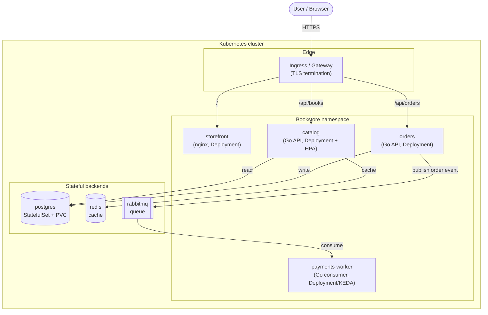

# The Bookstore Guide — Kubernetes from Zero to Production

A standalone, hands-on Kubernetes guide that takes you **from zero to
production** by progressively building, deploying, scaling, securing, observing,
and operating **one realistic microservices application — "Bookstore"** —
across the entire arc. Concepts compound instead of resetting per topic: every
chapter's hands-on section advances the *same* app.

---

## What this guide is

- **Zero-to-production, and deep.** It assumes **no prior Kubernetes
  knowledge** but does not stay shallow — internals are explained
  ("how it works under the hood"), not just "what to type". Containers are
  taught from first principles in Part 00.
- **One worked example throughout.** Every primitive is introduced because the
  Bookstore needs it next, then applied to it immediately.
- **Locally reproducible, free.** Every hands-on step runs on a local
  **kind** or **k3d** cluster with only open-source tooling. Each chapter also
  has explicit `> **In production:**` notes on how it differs on managed cloud
  (EKS/GKE/AKS).
- **Diagrams everywhere.** Mermaid for architecture/flow/lifecycle, ASCII for
  quick inline structure.
- **Cited, never copied.** Each chapter ends with a specific citation into the
  reference library plus the official docs URL.

## Who it's for

Anyone comfortable with the command line and basic Linux/HTTP who wants a
single, coherent path from "what is a container?" to "I can run, deliver, and
operate a multi-service app in production". Also useful as structured
preparation for CKA/CKAD/CKS (see [appendix E](appendix/E-learning-paths.md)).

> **This guide is standalone.** It is intentionally **not linked to any other
> `.md` files** in this repository (those are separate advanced/internals
> notes). Everything you need is inside `full-guide/`.

---

## The Bookstore application

A small but realistic e-commerce system. The source and Dockerfiles are real
and the images actually build — see
[`examples/bookstore/app/`](examples/bookstore/app/README.md). It is kept
intentionally tiny so the focus stays on Kubernetes, not app code.

| Service | Type | Role |
|---|---|---|
| `storefront` | Stateless web UI (nginx static) | Browser UI calling catalog/orders |
| `catalog` | Stateless Go REST API | Book listing; reads Postgres, caches in Redis |
| `orders` | Stateless Go REST API | Place orders; writes Postgres, publishes to RabbitMQ |
| `payments-worker` | Go background consumer | Consumes RabbitMQ, processes payments |
| `postgres` | Stateful DB | Upstream `postgres` image |
| `redis` | Cache | Upstream `redis` image |
| `rabbitmq` | Message queue | Upstream `rabbitmq` image |

### Target architecture



### How the app evolves (the narrative)

1. `catalog` as a single bare **Pod** (Part 01).
2. `catalog` + `storefront` as **Deployments**; **Services** wire them.
3. Config & DB credentials externalized to **ConfigMap/Secret**.
4. **Postgres** as a **StatefulSet** with persistent storage; schema applied by
   a migration **Job**.
5. `redis` cache and `rabbitmq` + `orders` + `payments-worker` added (async path).
6. **Ingress/Gateway** with TLS exposes storefront + APIs.
7. **Scheduling, autoscaling, observability, security** progressively applied.
8. **Packaged** (Helm + Kustomize overlays) and **delivered via Argo CD** with
   a canary rollout.
9. **Capstone:** the full system stood up from zero with GitOps, observed,
   autoscaled, hardened, with a DR runbook.

---

## How chapters are structured

Every chapter follows the same nine-section anatomy, in order:

1. **Title + one-line summary**
2. **Why this exists** — the problem it solves (motivation before mechanism)
3. **Mental model** — a one-paragraph intuition
4. **Diagram(s)** — Mermaid for flow/architecture/lifecycle, ASCII for inline structure
5. **Hands-on with the Bookstore** — runnable, copy-pasteable, builds on the previous chapter
6. **How it works under the hood** — internals depth, not just usage
7. **Production notes** — HA, cloud differences, pitfalls/anti-patterns (`> **In production:**` callouts)
8. **Quick Reference** — key `kubectl` commands + a minimal manifest skeleton + a short checklist
9. **Further reading** — a specific book citation + the official docs URL

### Callout legend

> **In production:** Throughout the guide, a block quote that begins with
> **`In production:`** flags how something differs in a real production / managed
> cloud environment versus the local kind/k3d setup — HA topology, cloud
> provider behavior, scale considerations, and anti-patterns to avoid. When you
> are only learning locally you can skip these; when you go to production, they
> are the important part.

---

## Prerequisites

- Comfort with a Unix-like command line and basic Linux/HTTP concepts.
- **Docker** (or another OCI runtime) — kind and k3d run the cluster in containers.
- **kubectl** — the Kubernetes CLI (install in [Part 00 ch.07](00-foundations/07-local-cluster-setup.md)).
- Either **kind** or **k3d** for a local cluster.
- ~4 GB RAM free for the local cluster + Bookstore.
- (Optional, used in later parts) `helm`, `kustomize` (built into recent
  `kubectl`), and the `argocd` CLI — each installed in the chapter that needs it.

No cloud account is required for any hands-on.

---

## Running the examples locally

Install a local-cluster tool (pick one):

```sh
# kind (Kubernetes IN Docker)
go install sigs.k8s.io/kind@latest
#   or: brew install kind   |   curl -Lo kind https://kind.sigs.k8s.io/dl/latest/kind-$(uname)-amd64 && chmod +x kind

# k3d (k3s in Docker)
curl -s https://raw.githubusercontent.com/k3d-io/k3d/main/install.sh | bash
#   or: brew install k3d
```

Create a cluster:

```sh
# kind
kind create cluster --name bookstore

# k3d (equivalent)
k3d cluster create bookstore

kubectl cluster-info
kubectl get nodes
```

Build and load the Bookstore images (full instructions in
[`examples/bookstore/app/README.md`](examples/bookstore/app/README.md)):

```sh
cd examples/bookstore/app
docker build -t bookstore/catalog:dev         ./catalog
docker build -t bookstore/orders:dev          ./orders
docker build -t bookstore/payments-worker:dev ./payments-worker
docker build -t bookstore/storefront:dev      ./storefront

# kind:
kind load docker-image bookstore/catalog:dev --name bookstore   # repeat per image
# k3d:
k3d image import bookstore/catalog:dev -c bookstore             # repeat per image
```

Tear down when done:

```sh
kind delete cluster --name bookstore     # or: k3d cluster delete bookstore
```

---

## Reading this guide as a rendered site

This guide is authored as plain Markdown — that is the source of truth, and
the GitHub repository tree is the canonical reading experience. The same
content is also published as a rendered **MkDocs Material** site:

- **Live site:** `https://<your-username>.github.io/<your-repo>/`
  (the URL is set in `mkdocs.yml` at the project root; once GitHub Pages is
  enabled on the repo, every push to `main` rebuilds and redeploys the site
  via the `.github/workflows/docs.yml` workflow).
- **Local preview:** from the project root (one level above `full-guide/`)

  ```sh
  pip install -r requirements.txt
  mkdocs serve            # http://127.0.0.1:8000
  # or one-shot build:
  mkdocs build            # writes a static site/ tree
  ```

  Python 3.10+ is recommended. The rendered site adds full-text search,
  Mermaid diagram rendering, light/dark mode, code-copy buttons, tabbed
  blocks, and admonitions — all powered by the Material theme plus the
  `awesome-pages`, `mermaid2`, and `git-revision-date-localized` plugins
  pinned in `requirements.txt`.

The site is a **rendered view** of the Markdown under `full-guide/`. Anything
you read on the site can also be read directly in this directory — chapter
files, code samples in `examples/`, runbooks and templates all live as
plain files in the repository. If something looks off on the site, the
Markdown source is authoritative.

---

## Table of contents

> Chapter files are authored across the build phases; the structure and paths
> below are final and stable. The example app under
> [`examples/bookstore/`](examples/bookstore/) grows cumulatively with the
> chapters.

### Part 00 — Foundations
- [01 — Why Kubernetes](00-foundations/01-why-kubernetes.md)
- [02 — Containers and images](00-foundations/02-containers-and-images.md)
- [03 — Architecture overview](00-foundations/03-architecture-overview.md)
- [04 — Control plane deep dive](00-foundations/04-control-plane-deep-dive.md)
- [05 — Node components](00-foundations/05-node-components.md)
- [06 — The declarative API model](00-foundations/06-declarative-api-model.md)
- [07 — Local cluster setup](00-foundations/07-local-cluster-setup.md)

### Part 01 — Core Workloads
- [01 — Pods](01-core-workloads/01-pods.md)
- [02 — Health and lifecycle](01-core-workloads/02-health-and-lifecycle.md)
- [03 — Resources and QoS](01-core-workloads/03-resources-and-qos.md)
- [04 — ReplicaSets and Deployments](01-core-workloads/04-replicasets-and-deployments.md)
- [05 — StatefulSets](01-core-workloads/05-statefulsets.md)
- [06 — DaemonSets](01-core-workloads/06-daemonsets.md)
- [07 — Jobs and CronJobs](01-core-workloads/07-jobs-and-cronjobs.md)
- [08 — Deployment strategies](01-core-workloads/08-deployment-strategies.md)

### Part 02 — Networking
- [01 — The networking model](02-networking/01-networking-model.md)
- [02 — Services](02-networking/02-services.md)
- [03 — DNS and service discovery](02-networking/03-dns-and-discovery.md)
- [04 — Ingress](02-networking/04-ingress.md)
- [05 — Gateway API](02-networking/05-gateway-api.md)
- [06 — Network policies](02-networking/06-network-policies.md)

### Part 03 — Config and Storage
- [01 — ConfigMaps](03-config-and-storage/01-configmaps.md)
- [02 — Secrets](03-config-and-storage/02-secrets.md)
- [03 — Volumes](03-config-and-storage/03-volumes.md)
- [04 — Persistent storage](03-config-and-storage/04-persistent-storage.md)
- [05 — Stateful data patterns](03-config-and-storage/05-stateful-data-patterns.md)

### Part 04 — Scheduling
- [01 — The scheduler and nodes](04-scheduling/01-scheduler-and-nodes.md)
- [02 — Affinity, taints, and topology](04-scheduling/02-affinity-taints-topology.md)
- [03 — Priority and preemption](04-scheduling/03-priority-and-preemption.md)

### Part 05 — Security
- [01 — Authentication, authorization, RBAC](05-security/01-authn-authz-rbac.md)
- [02 — Pod security](05-security/02-pod-security.md)
- [03 — Supply chain security](05-security/03-supply-chain.md)
- [04 — Secrets and cluster hardening](05-security/04-secrets-and-cluster-hardening.md)

### Part 06 — Production Readiness
- [01 — Observability: metrics](06-production-readiness/01-observability-metrics.md)
- [02 — Logging](06-production-readiness/02-logging.md)
- [03 — Tracing](06-production-readiness/03-tracing.md)
- [04 — Autoscaling](06-production-readiness/04-autoscaling.md)
- [05 — Reliability and disruptions](06-production-readiness/05-reliability-and-disruptions.md)
- [06 — Capacity and cost](06-production-readiness/06-capacity-and-cost.md)

### Part 07 — Delivery
- [01 — Packaging with Helm](07-delivery/01-packaging-helm.md)
- [02 — Packaging with Kustomize](07-delivery/02-packaging-kustomize.md)
- [03 — CI/CD pipeline](07-delivery/03-cicd-pipeline.md)
- [04 — GitOps with Argo CD](07-delivery/04-gitops-argocd.md)
- [05 — Progressive delivery](07-delivery/05-progressive-delivery.md)

### Part 08 — Day-2 Operations
- [01 — Cluster lifecycle](08-day-2-operations/01-cluster-lifecycle.md)
- [02 — Backup and disaster recovery](08-day-2-operations/02-backup-and-dr.md)
- [03 — Troubleshooting playbook](08-day-2-operations/03-troubleshooting-playbook.md)
- [04 — Multi-tenancy and namespaces](08-day-2-operations/04-multi-tenancy-and-namespaces.md)
- [05 — Operators and CRDs](08-day-2-operations/05-operators-and-crds.md)

### Part 09 — Capstone
- [01 — Bookstore end-to-end](09-end-to-end-bookstore/01-bookstore-end-to-end.md)

### Part 10 — Cloud & Managed Kubernetes

> *What changes when the kind/k3d cluster is an **EKS / GKE / AKS** cluster instead.*
> For readers running the Bookstore on a real cloud provider: the shared-
> responsibility split, cloud identity for workloads, cloud CNI/storage/load-
> balancing, and node autoscaling/cost — every concept anchored back to its
> Part 00–09 origin.

- [01 — The managed Kubernetes model](10-cloud-and-managed-kubernetes/01-managed-kubernetes-model.md) — what you actually buy with EKS/GKE/AKS, the shared-responsibility split, control-plane SLAs.
- [02 — Provisioning and infrastructure-as-code](10-cloud-and-managed-kubernetes/02-provisioning-and-iac.md) — `eksctl`/`gcloud`/`az` CLIs vs **Terraform** (remote state, modules) vs **Crossplane**; choosing between them.
- [03 — Cloud identity for workloads](10-cloud-and-managed-kubernetes/03-cloud-identity.md) — **IRSA / Workload Identity / Azure AD Workload Identity** via OIDC federation, no static keys in Pods.
- [04 — Cloud networking and load balancing](10-cloud-and-managed-kubernetes/04-cloud-networking-and-load-balancing.md) — cloud CNIs (VPC-CNI / GKE CNI / Azure CNI / Cilium), CIDR planning, cloud LBs and AWS LBC.
- [05 — Cloud storage and data](10-cloud-and-managed-kubernetes/05-cloud-storage-and-data.md) — cloud CSI drivers (EBS / PD / Azure Disk; EFS / Filestore / Azure Files), snapshots, cloud-managed databases.
- [06 — Node autoscaling, cost & multi-cloud](10-cloud-and-managed-kubernetes/06-node-autoscaling-cost-multicloud.md) — **Cluster Autoscaler vs Karpenter** (NodePool, EC2NodeClass, consolidation), spot/preemptible, multi-AZ/region, OpenCost.

### Part 11 — Advanced Production Patterns

> *The depth tier — for teams running Kubernetes at scale.*
> Building (not just consuming) operators; the admission and APF protections
> the apiserver gives itself; service mesh, secrets-at-scale, multi-cluster
> fleets, chaos engineering, HA control plane / etcd ops, performance & scale,
> and platform engineering.

- [01 — Admission webhooks](11-advanced-production-patterns/01-admission-webhooks.md) — the mutating / validating webhook pipeline, when (and when not) to use Kyverno / ValidatingAdmissionPolicy / a custom webhook.
- [02 — Operator development](11-advanced-production-patterns/02-operator-development.md) — **Kubebuilder / controller-runtime** building a real `BookstoreTenant` CRD; finalizers, conversion webhooks, status conditions, envtest.
- [03 — API Priority and Fairness](11-advanced-production-patterns/03-api-priority-and-fairness.md) — protecting the apiserver: **FlowSchema** + **PriorityLevelConfiguration**, distinguisher methods, the queue model.
- [04 — Service mesh](11-advanced-production-patterns/04-service-mesh.md) — Istio (sidecar + **ambient/waypoint**), Linkerd, **SPIFFE/SPIRE**, mTLS-by-default, L7 traffic management on the Bookstore.
- [05 — Secrets at scale](11-advanced-production-patterns/05-secrets-at-scale.md) — **External Secrets Operator** + **Vault** (and CSI Secrets Store driver), rotation, dynamic secrets.
- [06 — Multi-cluster and fleet](11-advanced-production-patterns/06-multi-cluster-and-fleet.md) — when one cluster stops being enough; **Argo CD ApplicationSet**, Karmada, Cluster API.
- [07 — Chaos engineering](11-advanced-production-patterns/07-chaos-engineering.md) — the chaos loop (hypothesis → blast radius → inject → observe → learn), **Chaos Mesh** experiments against the Bookstore.
- [08 — HA control plane and etcd](11-advanced-production-patterns/08-ha-control-plane-and-etcd.md) — stacked vs external etcd, raft quorum, defrag, backup/restore depth.
- [09 — Performance and scalability](11-advanced-production-patterns/09-performance-and-scalability.md) — control-plane latency budgets, watch cache, kube-proxy modes, eBPF dataplane (Cilium), Pod-startup latency.
- [10 — Platform engineering](11-advanced-production-patterns/10-platform-engineering.md) — Internal Developer Platforms, **Crossplane** (XRD/Composition/claim), **Backstage**, golden paths.

### Part 12 — Kubernetes for Machine Learning

> *Running ML on the same Kubernetes the Bookstore runs on.* The ML workload
> taxonomy mapped to primitives the guide already built, GPUs and accelerators,
> gang scheduling, distributed training, notebooks, online serving (KServe),
> pipelines (Argo Workflows / Kubeflow Pipelines), and the cost/MLOps capstone.
> Every chapter runs CPU-only on kind, with the GPU path explicitly marked.

- [01 — Why ML on Kubernetes](12-kubernetes-for-machine-learning/01-why-ml-on-kubernetes.md) — the ML workload taxonomy (notebooks / training / tuning / batch inference / serving / pipelines) → Kubernetes primitives, and why Kubernetes is the right substrate.
- [02 — GPUs and accelerators](12-kubernetes-for-machine-learning/02-gpus-and-accelerators.md) — the device-plugin model, **NVIDIA GPU Operator** (driver / toolkit / device plugin / DCGM / NFD/GFD), MIG, MPS, time-slicing.
- [03 — Batch and gang scheduling](12-kubernetes-for-machine-learning/03-batch-and-gang-scheduling.md) — why default Job scheduling deadlocks distributed ML; **JobSet**, **Kueue** (ResourceFlavor / ClusterQueue / LocalQueue / Workload), **Volcano**.
- [04 — Distributed training](12-kubernetes-for-machine-learning/04-distributed-training.md) — **Kubeflow Training Operator** (PyTorchJob / TFJob / MPIJob / PaddleJob), **KubeRay** (RayCluster / RayJob / Ray Train), rendezvous + allreduce.
- [05 — Notebooks and interactive ML](12-kubernetes-for-machine-learning/05-notebooks-and-interactive.md) — **JupyterHub on Kubernetes** (z2jh) with per-user PVC-backed singleuser servers and `profileList`.
- [06 — Model serving and inference](12-kubernetes-for-machine-learning/06-model-serving-and-inference.md) — **KServe** (`InferenceService` / `ServingRuntime`, serverless via Knative or `RawDeployment`), Seldon Core, **Triton**, model canary / A-B / shadow.
- [07 — ML pipelines and workflows](12-kubernetes-for-machine-learning/07-ml-pipelines-and-workflows.md) — **Argo Workflows** (`Workflow` / `WorkflowTemplate` / `CronWorkflow`), **Argo Events**, Kubeflow Pipelines, Katib (HPO).
- [08 — ML platform, cost, and MLOps capstone](12-kubernetes-for-machine-learning/08-ml-platform-cost-and-mlops.md) — the MLOps maturity ladder (L0–L3), per-tenant cost with OpenCost, MLflow tracking/registry, drift detection, the full assembled stack.

### Part 13 — Grand Capstone: Bookstore Platform v2

> *The full production e-commerce platform.* Where Part 09's end-to-end
> Bookstore is the **right teaching artifact** for everything Parts 00 - 12
> establish, Part 13 is the **production reality**: N tenants, three regions
> active-active, real OIDC + IRSA + mesh JWT, search via CDC, payments via
> Kafka + outbox + saga, an edge with Gateway API + WAF, a closed ML loop,
> three-pillar observability, OpenCost FinOps, Backstage as the developer
> portal, and a runbook + on-call + DR + chaos discipline. Built as a sibling
> example tree at [`examples/bookstore-platform/`](examples/bookstore-platform/)
> so the v1 Bookstore at [`examples/bookstore/`](examples/bookstore/) stays
> byte-identical and the two can be read side by side.

- [01 — Bookstore 2.0: from toy to platform](13-grand-capstone-bookstore-platform/01-bookstore-2-from-toy-to-platform.md) — what makes a production e-commerce platform on Kubernetes different from v1 across seven dimensions (tenancy / region / identity / delivery / data / ML / day-2), and the reading order for the eleven chapters that follow.
- [02 — Tenancy and Crossplane onboarding](13-grand-capstone-bookstore-platform/02-tenancy-and-crossplane-onboarding.md) — a bookstore owner is a tenant; onboarding is a Crossplane `BookstoreTenant` Composition apply (namespace + Kueue queue + S3 bucket + RDS read-replica + Backstage catalog entry).
- [03 — Multi-region active-active](13-grand-capstone-bookstore-platform/03-multi-region-active-active.md) — three regions, Argo CD `ApplicationSet` propagation, CloudNativePG cross-region `ReplicaCluster` streaming replicas, latency-based DNS failover, a real DR drill.
- [04 — Real auth: Keycloak OIDC + IRSA + Istio JWT](13-grand-capstone-bookstore-platform/04-real-auth-keycloak-irsa-istio-jwt.md) — replace v1's shared HMAC JWT with Keycloak; humans use OIDC code+PKCE, workloads use IRSA, the mesh validates JWTs via Istio `RequestAuthentication` + `AuthorizationPolicy`.
- [05 — Search and product discovery](13-grand-capstone-bookstore-platform/05-search-and-product-discovery.md) — **Meilisearch** on Kubernetes, Postgres → search index via **Debezium** CDC through Strimzi `KafkaConnect`/`KafkaConnector`, per-tenant index isolation.
- [06 — Payments and event sourcing](13-grand-capstone-bookstore-platform/06-payments-and-event-sourcing.md) — Stripe sandbox + the **outbox pattern** + Kafka via **Strimzi** + idempotent `payments-worker` + saga compensation + signed webhook verification.
- [07 — Edge: Istio Gateway + Coraza WAF + per-tenant rate limiting](13-grand-capstone-bookstore-platform/07-edge-gateway-waf-rate-limiting.md) — **Gateway API** at the edge, **Coraza** WAF (ModSecurity-compatible **OWASP CRS**), per-tenant rate limiting via Envoy's local rate limiter.
- [08 — Real ML loop: training → registry → serving → drift → retrain](13-grand-capstone-bookstore-platform/08-real-ml-loop-training-registry-serving-drift.md) — **MLflow** tracking + Model Registry; KServe serving with model canary; **Alibi-Detect** drift; Argo Events drift-triggered retrain — the full MLOps loop, closed.
- [09 — Observability: OpenTelemetry + Loki + Prometheus + Grafana](13-grand-capstone-bookstore-platform/09-observability-otel-tempo-loki-prometheus-grafana.md) — end-to-end **OTel** through the v2 app via the **OpenTelemetry Collector** (OTLP) → **Grafana Tempo** for traces + **Grafana Loki** for logs + Prometheus for metrics, per-tenant Grafana dashboards, Alertmanager routed by tenant / region / severity.
- [10 — Cost: OpenCost per-tenant, per-cluster, per-region](13-grand-capstone-bookstore-platform/10-cost-opencost-per-tenant-finops.md) — **OpenCost** install + per-tenant labels + showback dashboards + budget alerts + the **FinOps Foundation** Inform → Optimize → Operate framework.
- [11 — Backstage developer portal](13-grand-capstone-bookstore-platform/11-backstage-developer-portal-idp.md) — **Backstage** as the developer's entry point: the Scaffolder template for golden-path service creation, the Software Catalog seeded from Argo CD + Crossplane, TechDocs from the platform repo, plugins surfacing CD + dashboards + on-call.
- [12 — Day-2: runbook + on-call + DR drill + chaos game-day](13-grand-capstone-bookstore-platform/12-day-2-runbook-on-call-dr-chaos.md) — the page an on-call engineer opens at 3am; the monthly DR drill (RTO / RPO); the quarterly chaos game-day; the blameless postmortem template — the operational story that turns capabilities into a working system.

### Part 14 — EKS in Production: A-Z

> Operational discipline that turns the cloud-deployed platform into a
> maintainable production system. The chapters take real EKS-ops concerns —
> state hygiene, version lifecycle, addon discipline, storage, logging cost,
> cost guardrails, CI/CD, networking economics, ARM/Graviton, GitOps bootstrap,
> multi-region, supply chain, runtime defense, backup/restore, Cilium/eBPF,
> developer experience — and turn each into a working chapter + concrete
> Terraform artifacts. Closes with the cross-region DR + AWS account baseline
> + 90-day production-readiness runbook capstone.

- [01 — Production-grade Terraform state](14-eks-in-production-a-to-z/01-terraform-state-in-production.md) — why local Terraform state is a one-laptop fiction, the S3 backend with `use_lockfile = true` (Terraform 1.10+ native locking, no DynamoDB), `bootstrap-state.sh`, the four `terraform state` commands, and the blast-radius rule that decides how many state files you actually want.
- [02 — EKS cluster lifecycle](14-eks-in-production-a-to-z/02-eks-cluster-lifecycle.md) — the 14-month standard-support window, the 12-month extended-support window with its $0.50/cluster-hour surcharge, and the three-plane upgrade dance (control plane → managed addons → node pools); the in-place version bump runbook, deprecated-API hunting with `kubent`, and blue-green clusters for multi-version skips.
- [03 — EKS add-on management discipline](14-eks-in-production-a-to-z/03-eks-addon-management.md) — every EKS cluster needs four cluster-critical addons (vpc-cni, kube-proxy, CoreDNS, EBS-CSI) to boot at all; EKS-managed vs self-managed, the `before_compute = true` first-boot CNI race fix, IRSA wiring, and the `resolve_conflicts_on_update` policy for upgrades.
- [04 — Storage classes & EBS in production](14-eks-in-production-a-to-z/04-storage-classes-and-ebs.md) — replace the default gp2 StorageClass with gp3 (20% cheaper, tunable IOPS / throughput, no burst-credit footgun); EBS encryption-at-rest, snapshot lifecycle, the AZ-local reality of EBS, and the `WaitForFirstConsumer` binding mode that keeps Pods + volumes in the same AZ.
- [05 — Logging & metrics cost discipline](14-eks-in-production-a-to-z/05-logging-and-metrics-cost.md) — CloudWatch Logs at $0.50/GB ingested + $0.03/GB-month stored is how a chatty controller turns into the canonical "the cluster cost more than the app" incident; retention caps, cardinality control, Loki-vs-CloudWatch trade-offs, the three cost levers (sample, scrub, retain).
- [06 — Cost guardrails](14-eks-in-production-a-to-z/06-cost-guardrails.md) — three tiers of cost visibility (AWS Budgets for after-the-fact alarms, Cost Explorer for post-mortem analysis, OpenCost for inside-the-cluster per-tenant breakdown) plus the CI-side guardrail (`infracost diff` on every PR) that catches a 50-NAT-gateway plan before it merges.
- [07 — Infrastructure CI/CD + drift detection](14-eks-in-production-a-to-z/07-infrastructure-cicd-and-drift.md) — plan-on-PR, apply-on-merge via GitHub Actions with OIDC trust (no long-lived AWS keys), the production CI/CD shape every EKS Terraform tree should reach in its first month; nightly `terraform plan -detailed-exitcode` drift checks + the "someone changed it in the console" reconciliation runbook.
- [08 — VPC endpoints & egress economics](14-eks-in-production-a-to-z/08-vpc-endpoints-and-egress.md) — NAT gateways cost $0.045/hr plus $0.045/GB processed; gateway endpoints for S3 + DynamoDB are free and skip NAT entirely; interface endpoints for ECR/STS/EC2/CloudWatch-Logs/KMS pay for themselves at ~50 GB/month of pulled data.
- [09 — ARM/Graviton on EKS](14-eks-in-production-a-to-z/09-arm-graviton-on-eks.md) — Graviton (AWS's ARM EC2 line) is ~20% cheaper than the equivalent x86 instance with the same SLA, with one disciplinary requirement: every container image you run must be multi-arch (or arm64-only); the Terraform NodePool move + Docker buildx multi-platform path.
- [10 — GitOps bootstrap on a fresh EKS cluster](14-eks-in-production-a-to-z/10-gitops-bootstrap-fresh-cluster.md) — Argo CD has a chicken-and-egg problem: it reconciles the cluster from Git, but Argo CD itself must first exist; Terraform installs Argo CD as a one-shot bootstrap, then Argo CD takes over via a single root App-of-Apps Application.
- [11 — Multi-region active-active: cloud reality](14-eks-in-production-a-to-z/11-multi-region-active-active-cloud.md) — Part 13 ch.03 walked the shape on kind; this chapter is the cloud reality — real Route 53 latency-based routing, real Global Accelerator (when it beats DNS), real CNPG cross-region streaming over Transit Gateway, real failover drills with measurable RTO/RPO, and the cross-region data path.
- [12 — Supply chain security in production](14-eks-in-production-a-to-z/12-supply-chain-security.md) — the cloud-deployed path of Part 05 ch.03's four-stage trust chain — AWS ECR enhanced scanning, `syft` for SBOM-as-build-artifact, cosign keyless signing in GitHub Actions (OIDC → Fulcio → Rekor — no long-lived keys), and Kyverno `ClusterPolicy.verifyImages` at admission.
- [13 — Runtime defense & container security](14-eks-in-production-a-to-z/13-runtime-defense-and-container-security.md) — admission stops bad images, PSA stops bad Pod specs, signing proves provenance — none can see what happens inside a running container; Falco + Tetragon for syscall-level rules, GuardDuty for EKS Protection for AWS-side anomalies, and the alerting glue (SNS → PagerDuty → human).
- [14 — Backup and restore with Velero](14-eks-in-production-a-to-z/14-backup-and-restore-velero.md) — etcd snapshots, EBS snapshots, RDS PITR, S3 versioning — none of them restore a deleted ConfigMap, a mangled Helm release, or a Namespace someone wiped while testing the GitOps reconciler; Velero snapshots API objects + their PVs to S3 on schedule, with selective and cross-cluster restore.
- [15 — Cilium / eBPF on EKS](14-eks-in-production-a-to-z/15-cilium-ebpf-on-eks.md) — VPC-CNI is solid but has a ceiling (L3/L4-only NetworkPolicy, kube-proxy iptables/IPVS scaling, no flow-level Pod-identity observability); Cilium native routing + Hubble flow visibility + L7-aware NetworkPolicy + kube-proxy replacement on EKS, with the migration runbook.
- [16 — Developer experience for Kubernetes teams](14-eks-in-production-a-to-z/16-developer-experience-for-k8s-teams.md) — a platform whose inner loop is `git push` → wait 8 minutes → check logs → debug → repeat is a platform with a velocity tax; Telepresence + Mirrord + Skaffold + Tilt + Devcontainers as the EKS-flavoured developer-loop toolkit.
- [17 — Cross-region DR + AWS account baseline + 90-day production-readiness runbook](14-eks-in-production-a-to-z/17-cross-region-dr-account-baseline-90-day-runbook.md) — the capstone — synthesising chapters 14.01–14.16 into a structured 90-day onboarding runbook for a team taking over an EKS production platform, with cross-region DR, AWS account baseline (AWS Config conformance pack, IAM Access Analyzer, GuardDuty multi-account), and weekly checkpoints.

### Part 15 — Day-to-Day Production Operations

> The full operational lifecycle: a change moves from developer's branch
> through PR, CI/CD, signing, multi-environment promotion, progressive
> delivery, secrets, rollback, feature flags, hotfix, incident response, and
> day-to-day ops. Closes with the 90-day capstone for a team taking over a
> production platform.

- [01 — The PR-to-production lifecycle](15-day-to-day-production-ops/01-pr-to-production-lifecycle.md) — the mental model of the full ops loop Part 15 is built around; the loop's eight stages (commit → PR → CI → review/merge → GitOps repo update → Argo CD reconcile → progressive rollout → SLO gate → done) and the load-bearing rule it enforces: every change to production is a Git commit; nothing else.
- [02 — Application CI/CD pipelines](15-day-to-day-production-ops/02-application-cicd-pipelines.md) — the application-side pipeline for the Bookstore Platform via GitHub Actions; build caching (Go modules + Docker buildx GHA cache), fail-fast, branch protection rules, the "CI ate my repo" untrusted-PR-with-secrets footgun, GitHub Actions OIDC trust for ECR push (no static AWS keys, ever).
- [03 — Image signing and provenance in CI](15-day-to-day-production-ops/03-image-signing-and-provenance.md) — the CI-side of supply-chain trust — cosign keyless via GitHub Actions OIDC, SBOM via syft bound to the image digest with `cosign attest`, SLSA provenance, the Kyverno `ClusterPolicy` matching OIDC identity (issuer + subject regexp), and the honest audit → enforce migration path.
- [04 — Multi-environment promotion](15-day-to-day-production-ops/04-multi-environment-promotion.md) — the dev → staging → prod pipeline as Git mechanics, not a CI/CD product feature: one Argo CD `ApplicationSet` over the Cluster generator, three Kustomize overlays that differ ONLY in image-tag + secret-source + scale, promotion = a Git PR that bumps `images[].newTag`, environment parity as a hard invariant.
- [05 — Production secrets: Vault + ESO + rotation](15-day-to-day-production-ops/05-production-secrets-vault-eso.md) — a real HA Vault provisioned by Phase 15-R Terraform with KMS auto-unseal, the three-step bootstrap (unseal → init Kubernetes auth method → bind first policy), the multi-tenant `ClusterSecretStore` + per-tenant `ExternalSecret` pattern, Vault token leasing and rotation cadence, dynamic Postgres credentials.
- [06 — Progressive delivery in production](15-day-to-day-production-ops/06-progressive-delivery-in-production.md) — an Argo Rollouts canary in production, gated by an `AnalysisTemplate` querying real Prometheus SLO metrics (success-rate, p99 latency, saturation), auto-promote on green / auto-rollback on red, blue-green for stateful workloads, the SLO-gate handoff between Rollouts and Grafana.
- [07 — Rollback playbook](15-day-to-day-production-ops/07-rollback-playbook.md) — the three rollback layers every production platform needs — code (Argo CD / Argo Rollouts / Helm), data (Postgres PITR / S3 versioning / Velero), config (Argo CD Application git-revert) — with the decision tree that picks the right layer per symptom, and the forward-compatible-schema footgun.
- [08 — Feature flags and dark launches](15-day-to-day-production-ops/08-feature-flags-and-dark-launches.md) — decoupling deploy from release: a binary ships dark (new code in production, disabled by a flag), then a targeted flag flip rolls the feature to a cohort, then wider, then 100%; the four flag use-cases (dark launch / canary by cohort / A-B / kill switch); Flagsmith vs LaunchDarkly vs Unleash vs OpenFeature.
- [09 — Hotfix workflow and breakglass](15-day-to-day-production-ops/09-hotfix-workflow-and-breakglass.md) — the emergency lane when normal CI/CD is too slow to mitigate a P0: branch-protection bypass via repo admin, CI fast-path that keeps `scan` but skips slow integration suites, a breakglass IAM role with 1-hour TTL + every action audited to CloudTrail, and the post-incident cleanup.
- [10 — Incident response & on-call](15-day-to-day-production-ops/10-incident-response-and-on-call.md) — the full lifecycle (detect → triage → resolve → learn), each phase with its operationalising artefact (Alertmanager → PagerDuty, severity matrix, runbook + IC discipline, blameless postmortem); the three production traps — alerts without runbooks, services without owners, and the "we'll write the postmortem next week" trap.
- [11 — Day-to-day production operations](15-day-to-day-production-ops/11-day-to-day-production-ops.md) — the weekly / monthly / quarterly cadence that turns "we ship code" into "we own production": cost reviews every Monday, capacity reviews bi-weekly Friday, on-call reviews weekly, postmortem reviews monthly; scaling decisions, the 90-day check-in, and three production traps.
- [12 — Capstone: the first 90 days running production](15-day-to-day-production-ops/12-capstone-first-90-days.md) — synthesising chapters 15.01–15.11 into a structured 90-day plan for a team taking over a production Bookstore Platform v2: weeks 1–4 (orient + on-call shadowing), weeks 5–8 (own the change discipline), weeks 9–12 (own production), with explicit checkpoints, deliverables, and the readiness scorecard.

### Appendix
- [A — kubectl cheatsheet](appendix/A-kubectl-cheatsheet.md)
- [B — Glossary](appendix/B-glossary.md)
- [C — YAML and API conventions](appendix/C-yaml-and-api-conventions.md)
- [D — Further reading](appendix/D-further-reading.md)
- [E — Learning paths](appendix/E-learning-paths.md)

### Example app & manifests
- [`examples/bookstore/app/`](examples/bookstore/app/README.md) — service source + Dockerfiles
- `examples/bookstore/raw-manifests/` — plain YAML, layered by the early/mid chapters
- `examples/bookstore/helm/bookstore/` — Helm chart (Part 07)
- `examples/bookstore/kustomize/` — base + dev/staging/prod overlays (Part 07)
- `examples/bookstore/argocd/` — Argo CD Application / App-of-Apps (Part 07)
- `examples/bookstore/operators/` — CloudNativePG `Cluster` for the Postgres operator path (Part 08 ch.05)
- `examples/bookstore/cloud/` — cloud-only manifests (e.g. Karpenter `NodePool` / `EC2NodeClass`) (Part 10)
- `examples/bookstore/operator/` — a real Kubebuilder operator for the `BookstoreTenant` CRD (Part 11 ch.02)
- `examples/bookstore/mesh/` — Istio mTLS / canary `HTTPRoute` / `VirtualService` / ambient-mode enrollment (Part 11 ch.04)
- `examples/bookstore/secrets/` — External Secrets Operator + Vault wiring (Part 11 ch.05)
- `examples/bookstore/multicluster/` — Argo CD `ApplicationSet` + Karmada `PropagationPolicy` (Part 11 ch.06)
- `examples/bookstore/chaos/` — Chaos Mesh experiments + a Workflow game day (Part 11 ch.07)
- `examples/bookstore/platform/` — Crossplane Composition/XRD/claim, Backstage template, HA `kind` config (Part 11 ch.10)
- `examples/bookstore/ml/` — GPU jobs, training, notebooks, serving (KServe), pipelines (Part 12)
- [`examples/bookstore-platform/`](examples/bookstore-platform/) — the **v2 platform** sibling tree (tenancy / regions / auth / search / payments / edge / ML / observability / cost / Backstage / runbooks) for Part 13; the v1 `examples/bookstore/` tree above stays byte-identical for Parts 00 - 12

---

## How to use this guide

Read the parts in order — each builds on the last, and the Bookstore manifests
are cumulative. If you only have a week, or you're targeting a certification,
[appendix E](appendix/E-learning-paths.md) gives ordered fast-track and
exam-oriented paths. Keep [appendix A](appendix/A-kubectl-cheatsheet.md) and
[appendix B](appendix/B-glossary.md) open as you work.
