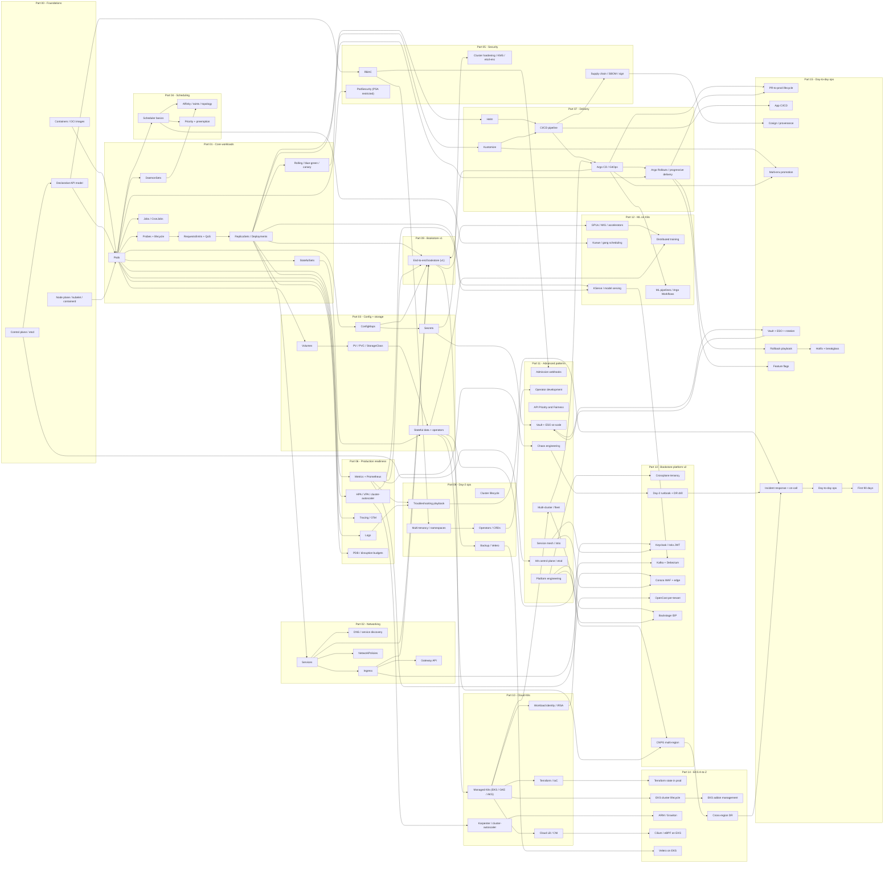

# Appendix F — Concept map, tag index, and reading paths

> 115 chapters is a lot. **This appendix is the index.** It exists so a reader
> standing in front of the table of contents doesn't drown.

There are three different ways to navigate the guide and this appendix exposes
all three:

1. **By concept** — Section 2 is a single Mermaid concept map of "X builds on Y"
   relationships across the guide. If you've learned **X**, the arrows tell you
   what **Y** (and **Z**, and **W**) the rest of the guide says you can attack
   next.
2. **By tag** — Section 3 is an alphabetical tag index. Each chapter carries a
   `<!-- tags: ... -->` HTML comment near its top; this index turns those tags
   inside out so you can ask "show me every chapter about `argo-cd`" or
   "everything tagged `cost`" and get an ordered chapter list.
3. **By goal** — Section 4 is 10 topic-driven reading paths. Each path is an
   ordered, opinionated chapter list with a one-line "why this chapter, why
   here" plus an estimated time-to-complete and a one-sentence outcome
   statement at the end.

These three lenses **complement** [Appendix E — Learning paths](E-learning-paths.md),
which gives the four big role-based arcs (fast-track / zero-to-prod /
exam-prep / SRE-platform). Appendix E is the high-level "which arc do I
follow?"; Appendix F is the fine-grained "for *this specific topic*, in *this
order*, here are the chapters."

A few practical notes before the rest of the appendix:

- **Tags are the source of truth.** Every chapter that participates in the
  index has a single HTML comment in its header block of the form
  `<!-- tags: tag1, tag2, tag3 -->`. The tag list in Section 3 is generated
  *from* those comments — adding a new tag to a chapter is the entire workflow.
- **The concept map is curated, not generated.** Section 2's diagram is hand-
  drawn. It shows the load-bearing edges only (~30 nodes, ~60 edges) — not
  every possible cross-reference. The goal is "what to learn next", not "every
  link that exists." A complete machine-readable cross-reference would be the
  full text of the guide.
- **Reading paths are opinionated.** Section 4 lists 10 paths. Each is *one*
  reasonable order through a slice of the guide — not the only one. If a path
  says "skip chapters X and Y", that's a deliberate scoping decision for the
  named outcome, not a claim that X and Y are unimportant.
- **Single-chapter tags are intentionally omitted from Section 3.** A tag that
  appears in only one chapter (like `coredns`, `falco`, `karpenter`,
  `meilisearch`) provides zero indexing value — it just points back to that
  one chapter, which the reader can already find through the tag's broader
  parent (`networking`, `runtime-defense`, `autoscaling`, `bookstore-v2`).
  Section 3 lists the 77 tags that span 2+ chapters; the 115 single-chapter
  tags remain in the chapter headers for future search/grouping but don't
  clutter the human-readable index.

If you only have time to read one section of this appendix, read **Section 4 —
Reading paths**, find the path closest to your goal, and follow it. Sections 2
and 3 are tools for when a path doesn't quite fit and you need to assemble a
custom route.

---

## Section 2 — The big-picture concept map

The diagram below shows the major architectural relationships in the guide.
Each node is a *concept* (not a chapter) and each edge means "X builds on Y" or
"Y is the next stop after X". Nodes are clustered by Part to make it easier to
trace which part of the guide owns each step.

The map is deliberately incomplete: only the load-bearing edges are drawn.
For example, almost everything in Parts 10-15 implicitly depends on Pods and
Services from Parts 01-02 — but only the *new* concepts that a later part
introduces get their own edges. The rule is "if you don't know **X**, the
chapter introducing **Y** will be hard," and the arrow points from X to Y.



How to read the map: pick a node you already know, follow the outgoing arrows.
That's your shortlist for "what to learn next." If you want a curated *ordering*
of those nodes, jump to Section 4.

---

## Section 3 — Alphabetical tag index

Every chapter that participates in this index carries a
`<!-- tags: tag1, tag2, ... -->` HTML comment near its title. The list below is
the inverse map: for each multi-chapter tag, the chapters that carry it,
sorted alphabetically.

Tags are shown grouped by first letter for navigation. The number in
parentheses after each tag is the count of chapters that carry it. Single-
chapter tags are omitted (115 of them); they remain in chapter headers for
future tooling but don't help indexing.

#### A

**`aks`** (4) — [10.01 — The managed Kubernetes model](../10-cloud-and-managed-kubernetes/01-managed-kubernetes-model.md) · [10.02 — Provisioning and infrastructure-as-code](../10-cloud-and-managed-kubernetes/02-provisioning-and-iac.md) · [10.03 — Cloud identity for workloads](../10-cloud-and-managed-kubernetes/03-cloud-identity.md) · [10.04 — Cloud networking and load balancing](../10-cloud-and-managed-kubernetes/04-cloud-networking-and-load-balancing.md)

**`api-server`** (2) — [00.03 — Architecture overview](../00-foundations/03-architecture-overview.md) · [00.04 — Control plane deep dive](../00-foundations/04-control-plane-deep-dive.md)

**`app-cicd`** (3) — [15.02 — Application CI/CD pipelines](../15-day-to-day-production-ops/02-application-cicd-pipelines.md) · [15.03 — Image signing and provenance in CI](../15-day-to-day-production-ops/03-image-signing-and-provenance.md) · [15.08 — Feature flags and dark launches](../15-day-to-day-production-ops/08-feature-flags-and-dark-launches.md)

**`argo-cd`** (4) — [07.04 — GitOps with Argo CD](../07-delivery/04-gitops-argocd.md) · [11.06 — Multi-cluster and fleet](../11-advanced-production-patterns/06-multi-cluster-and-fleet.md) · [14.10 — GitOps bootstrap on a fresh EKS cluster](../14-eks-in-production-a-to-z/10-gitops-bootstrap-fresh-cluster.md) · [15.04 — Multi-environment promotion](../15-day-to-day-production-ops/04-multi-environment-promotion.md)

**`argo-rollouts`** (3) — [07.05 — Progressive delivery](../07-delivery/05-progressive-delivery.md) · [15.06 — Progressive delivery in production](../15-day-to-day-production-ops/06-progressive-delivery-in-production.md) · [15.07 — Rollback playbook](../15-day-to-day-production-ops/07-rollback-playbook.md)

**`argo-workflows`** (2) — [12.07 — ML pipelines and workflows](../12-kubernetes-for-machine-learning/07-ml-pipelines-and-workflows.md) · [13.08 — Real ML loop: training -> registry -> serving -> drift -> retrain](../13-grand-capstone-bookstore-platform/08-real-ml-loop-training-registry-serving-drift.md)

**`autoscaling`** (5) — [06.04 — Autoscaling](../06-production-readiness/04-autoscaling.md) · [06.06 — Capacity and cost](../06-production-readiness/06-capacity-and-cost.md) · [10.06 — Node autoscaling, cost & multi-cloud](../10-cloud-and-managed-kubernetes/06-node-autoscaling-cost-multicloud.md) · [12.06 — Model serving and inference](../12-kubernetes-for-machine-learning/06-model-serving-and-inference.md) · [15.11 — Day-to-day production operations](../15-day-to-day-production-ops/11-day-to-day-production-ops.md)


#### B

**`backstage`** (2) — [11.10 — Platform engineering](../11-advanced-production-patterns/10-platform-engineering.md) · [13.11 — Developer portal: Backstage scaffolder + software catalog + tech docs](../13-grand-capstone-bookstore-platform/11-backstage-developer-portal-idp.md)

**`batch`** (4) — [01.07 — Jobs and CronJobs](../01-core-workloads/07-jobs-and-cronjobs.md) · [12.03 — Batch and gang scheduling](../12-kubernetes-for-machine-learning/03-batch-and-gang-scheduling.md) · [12.04 — Distributed training](../12-kubernetes-for-machine-learning/04-distributed-training.md) · [12.07 — ML pipelines and workflows](../12-kubernetes-for-machine-learning/07-ml-pipelines-and-workflows.md)

**`bookstore-v2`** (12) — [13.01 — Bookstore 2.0: from toy to platform](../13-grand-capstone-bookstore-platform/01-bookstore-2-from-toy-to-platform.md) · [13.02 — Tenancy model and onboarding via Crossplane](../13-grand-capstone-bookstore-platform/02-tenancy-and-crossplane-onboarding.md) · [13.03 — Multi-region active-active](../13-grand-capstone-bookstore-platform/03-multi-region-active-active.md) · [13.04 — Real auth: Keycloak OIDC + IRSA + Istio JWT](../13-grand-capstone-bookstore-platform/04-real-auth-keycloak-irsa-istio-jwt.md) · [13.05 — Search and product discovery](../13-grand-capstone-bookstore-platform/05-search-and-product-discovery.md) · [13.06 — Payments and event sourcing](../13-grand-capstone-bookstore-platform/06-payments-and-event-sourcing.md) · [13.07 — Edge: Istio Gateway + Coraza WAF + per-tenant rate limiting](../13-grand-capstone-bookstore-platform/07-edge-gateway-waf-rate-limiting.md) · [13.08 — Real ML loop: training -> registry -> serving -> drift -> retrain](../13-grand-capstone-bookstore-platform/08-real-ml-loop-training-registry-serving-drift.md) · [13.09 — Observability: OpenTelemetry traces + Loki logs + Prometheus metrics + Grafana dashboards](../13-grand-capstone-bookstore-platform/09-observability-otel-tempo-loki-prometheus-grafana.md) · [13.10 — Cost: OpenCost per-tenant, per-cluster, per-region](../13-grand-capstone-bookstore-platform/10-cost-opencost-per-tenant-finops.md) · [13.11 — Developer portal: Backstage scaffolder + software catalog + tech docs](../13-grand-capstone-bookstore-platform/11-backstage-developer-portal-idp.md) · [13.12 — Day-2: runbook + on-call playbook + DR drill + chaos game-day](../13-grand-capstone-bookstore-platform/12-day-2-runbook-on-call-dr-chaos.md)


#### C

**`capstone`** (3) — [09.01 — Bookstore end-to-end](../09-end-to-end-bookstore/01-bookstore-end-to-end.md) · [13.01 — Bookstore 2.0: from toy to platform](../13-grand-capstone-bookstore-platform/01-bookstore-2-from-toy-to-platform.md) · [13.12 — Day-2: runbook + on-call playbook + DR drill + chaos game-day](../13-grand-capstone-bookstore-platform/12-day-2-runbook-on-call-dr-chaos.md)

**`ci-cd`** (13) — [05.03 — Supply chain security](../05-security/03-supply-chain.md) · [07.01 — Packaging with Helm](../07-delivery/01-packaging-helm.md) · [07.02 — Packaging with Kustomize](../07-delivery/02-packaging-kustomize.md) · [07.03 — CI/CD pipeline](../07-delivery/03-cicd-pipeline.md) · [07.04 — GitOps with Argo CD](../07-delivery/04-gitops-argocd.md) · [07.05 — Progressive delivery](../07-delivery/05-progressive-delivery.md) · [14.07 — Infrastructure CI/CD + drift detection](../14-eks-in-production-a-to-z/07-infrastructure-cicd-and-drift.md) · [14.12 — Supply chain security in production](../14-eks-in-production-a-to-z/12-supply-chain-security.md) · [14.16 — Developer experience for Kubernetes teams](../14-eks-in-production-a-to-z/16-developer-experience-for-k8s-teams.md) · [15.01 — The PR-to-production lifecycle](../15-day-to-day-production-ops/01-pr-to-production-lifecycle.md) · [15.02 — Application CI/CD pipelines](../15-day-to-day-production-ops/02-application-cicd-pipelines.md) · [15.03 — Image signing and provenance in CI](../15-day-to-day-production-ops/03-image-signing-and-provenance.md) · [15.09 — Hotfix workflow and breakglass](../15-day-to-day-production-ops/09-hotfix-workflow-and-breakglass.md)

**`cilium`** (2) — [10.04 — Cloud networking and load balancing](../10-cloud-and-managed-kubernetes/04-cloud-networking-and-load-balancing.md) · [14.15 — Cilium / eBPF on EKS](../14-eks-in-production-a-to-z/15-cilium-ebpf-on-eks.md)

**`cloud`** (22) — [08.01 — Cluster lifecycle](../08-day-2-operations/01-cluster-lifecycle.md) · [10.01 — The managed Kubernetes model](../10-cloud-and-managed-kubernetes/01-managed-kubernetes-model.md) · [10.02 — Provisioning and infrastructure-as-code](../10-cloud-and-managed-kubernetes/02-provisioning-and-iac.md) · [10.03 — Cloud identity for workloads](../10-cloud-and-managed-kubernetes/03-cloud-identity.md) · [10.04 — Cloud networking and load balancing](../10-cloud-and-managed-kubernetes/04-cloud-networking-and-load-balancing.md) · [10.05 — Cloud storage and data](../10-cloud-and-managed-kubernetes/05-cloud-storage-and-data.md) · [10.06 — Node autoscaling, cost & multi-cloud](../10-cloud-and-managed-kubernetes/06-node-autoscaling-cost-multicloud.md) · [14.01 — Production-grade Terraform state](../14-eks-in-production-a-to-z/01-terraform-state-in-production.md) · [14.02 — EKS cluster lifecycle](../14-eks-in-production-a-to-z/02-eks-cluster-lifecycle.md) · [14.03 — EKS add-on management discipline](../14-eks-in-production-a-to-z/03-eks-addon-management.md) · [14.04 — Storage classes & EBS in production](../14-eks-in-production-a-to-z/04-storage-classes-and-ebs.md) · [14.05 — Logging & metrics cost discipline](../14-eks-in-production-a-to-z/05-logging-and-metrics-cost.md) · [14.06 — Cost guardrails](../14-eks-in-production-a-to-z/06-cost-guardrails.md) · [14.07 — Infrastructure CI/CD + drift detection](../14-eks-in-production-a-to-z/07-infrastructure-cicd-and-drift.md) · [14.08 — VPC endpoints & egress economics](../14-eks-in-production-a-to-z/08-vpc-endpoints-and-egress.md) · [14.09 — ARM/Graviton on EKS](../14-eks-in-production-a-to-z/09-arm-graviton-on-eks.md) · [14.10 — GitOps bootstrap on a fresh EKS cluster](../14-eks-in-production-a-to-z/10-gitops-bootstrap-fresh-cluster.md) · [14.11 — Multi-region active-active: cloud reality](../14-eks-in-production-a-to-z/11-multi-region-active-active-cloud.md) · [14.12 — Supply chain security in production](../14-eks-in-production-a-to-z/12-supply-chain-security.md) · [14.13 — Runtime defense & container security](../14-eks-in-production-a-to-z/13-runtime-defense-and-container-security.md) · [14.15 — Cilium / eBPF on EKS](../14-eks-in-production-a-to-z/15-cilium-ebpf-on-eks.md) · [14.16 — Developer experience for Kubernetes teams](../14-eks-in-production-a-to-z/16-developer-experience-for-k8s-teams.md)

**`cnpg`** (3) — [03.05 — Stateful data patterns](../03-config-and-storage/05-stateful-data-patterns.md) · [08.05 — Operators and CRDs](../08-day-2-operations/05-operators-and-crds.md) · [13.03 — Multi-region active-active](../13-grand-capstone-bookstore-platform/03-multi-region-active-active.md)

**`control-plane`** (2) — [00.03 — Architecture overview](../00-foundations/03-architecture-overview.md) · [00.04 — Control plane deep dive](../00-foundations/04-control-plane-deep-dive.md)

**`core-objects`** (14) — [00.01 — Why Kubernetes](../00-foundations/01-why-kubernetes.md) · [01.01 — Pods](../01-core-workloads/01-pods.md) · [01.02 — Health and lifecycle](../01-core-workloads/02-health-and-lifecycle.md) · [01.03 — Resources and QoS](../01-core-workloads/03-resources-and-qos.md) · [01.04 — ReplicaSets and Deployments](../01-core-workloads/04-replicasets-and-deployments.md) · [01.05 — StatefulSets](../01-core-workloads/05-statefulsets.md) · [01.06 — DaemonSets](../01-core-workloads/06-daemonsets.md) · [01.07 — Jobs and CronJobs](../01-core-workloads/07-jobs-and-cronjobs.md) · [01.08 — Deployment strategies](../01-core-workloads/08-deployment-strategies.md) · [03.01 — ConfigMaps](../03-config-and-storage/01-configmaps.md) · [05.01 — Authentication, authorization, RBAC](../05-security/01-authn-authz-rbac.md) · [05.02 — Pod security](../05-security/02-pod-security.md) · [06.05 — Reliability and disruptions](../06-production-readiness/05-reliability-and-disruptions.md) · [08.05 — Operators and CRDs](../08-day-2-operations/05-operators-and-crds.md)

**`cosign`** (2) — [14.12 — Supply chain security in production](../14-eks-in-production-a-to-z/12-supply-chain-security.md) · [15.03 — Image signing and provenance in CI](../15-day-to-day-production-ops/03-image-signing-and-provenance.md)

**`cost`** (11) — [06.06 — Capacity and cost](../06-production-readiness/06-capacity-and-cost.md) · [10.06 — Node autoscaling, cost & multi-cloud](../10-cloud-and-managed-kubernetes/06-node-autoscaling-cost-multicloud.md) · [12.02 — GPUs and accelerators](../12-kubernetes-for-machine-learning/02-gpus-and-accelerators.md) · [12.05 — Notebooks and interactive ML](../12-kubernetes-for-machine-learning/05-notebooks-and-interactive.md) · [12.08 — ML platform, cost, and MLOps capstone](../12-kubernetes-for-machine-learning/08-ml-platform-cost-and-mlops.md) · [13.10 — Cost: OpenCost per-tenant, per-cluster, per-region](../13-grand-capstone-bookstore-platform/10-cost-opencost-per-tenant-finops.md) · [14.05 — Logging & metrics cost discipline](../14-eks-in-production-a-to-z/05-logging-and-metrics-cost.md) · [14.06 — Cost guardrails](../14-eks-in-production-a-to-z/06-cost-guardrails.md) · [14.08 — VPC endpoints & egress economics](../14-eks-in-production-a-to-z/08-vpc-endpoints-and-egress.md) · [14.09 — ARM/Graviton on EKS](../14-eks-in-production-a-to-z/09-arm-graviton-on-eks.md) · [14.11 — Multi-region active-active: cloud reality](../14-eks-in-production-a-to-z/11-multi-region-active-active-cloud.md)

**`crossplane`** (2) — [11.10 — Platform engineering](../11-advanced-production-patterns/10-platform-engineering.md) · [13.02 — Tenancy model and onboarding via Crossplane](../13-grand-capstone-bookstore-platform/02-tenancy-and-crossplane-onboarding.md)


#### D

**`day-2`** (45) — [05.01 — Authentication, authorization, RBAC](../05-security/01-authn-authz-rbac.md) · [05.02 — Pod security](../05-security/02-pod-security.md) · [05.03 — Supply chain security](../05-security/03-supply-chain.md) · [05.04 — Secrets and cluster hardening](../05-security/04-secrets-and-cluster-hardening.md) · [06.01 — Observability: metrics](../06-production-readiness/01-observability-metrics.md) · [06.02 — Logging](../06-production-readiness/02-logging.md) · [06.03 — Tracing](../06-production-readiness/03-tracing.md) · [06.04 — Autoscaling](../06-production-readiness/04-autoscaling.md) · [06.05 — Reliability and disruptions](../06-production-readiness/05-reliability-and-disruptions.md) · [06.06 — Capacity and cost](../06-production-readiness/06-capacity-and-cost.md) · [08.01 — Cluster lifecycle](../08-day-2-operations/01-cluster-lifecycle.md) · [08.02 — Backup and disaster recovery](../08-day-2-operations/02-backup-and-dr.md) · [08.03 — Troubleshooting playbook](../08-day-2-operations/03-troubleshooting-playbook.md) · [08.04 — Multi-tenancy and namespaces](../08-day-2-operations/04-multi-tenancy-and-namespaces.md) · [08.05 — Operators and CRDs](../08-day-2-operations/05-operators-and-crds.md) · [09.01 — Bookstore end-to-end](../09-end-to-end-bookstore/01-bookstore-end-to-end.md) · [10.01 — The managed Kubernetes model](../10-cloud-and-managed-kubernetes/01-managed-kubernetes-model.md) · [10.02 — Provisioning and infrastructure-as-code](../10-cloud-and-managed-kubernetes/02-provisioning-and-iac.md) · [10.05 — Cloud storage and data](../10-cloud-and-managed-kubernetes/05-cloud-storage-and-data.md) · [10.06 — Node autoscaling, cost & multi-cloud](../10-cloud-and-managed-kubernetes/06-node-autoscaling-cost-multicloud.md) · [11.01 — Admission webhooks](../11-advanced-production-patterns/01-admission-webhooks.md) · [11.02 — Operator development](../11-advanced-production-patterns/02-operator-development.md) · [11.03 — API Priority and Fairness](../11-advanced-production-patterns/03-api-priority-and-fairness.md) · [11.07 — Chaos engineering](../11-advanced-production-patterns/07-chaos-engineering.md) · [11.08 — HA control plane and etcd](../11-advanced-production-patterns/08-ha-control-plane-and-etcd.md) · [11.09 — Performance and scalability](../11-advanced-production-patterns/09-performance-and-scalability.md) · [13.03 — Multi-region active-active](../13-grand-capstone-bookstore-platform/03-multi-region-active-active.md) · [13.12 — Day-2: runbook + on-call playbook + DR drill + chaos game-day](../13-grand-capstone-bookstore-platform/12-day-2-runbook-on-call-dr-chaos.md) · [14.01 — Production-grade Terraform state](../14-eks-in-production-a-to-z/01-terraform-state-in-production.md) · [14.02 — EKS cluster lifecycle](../14-eks-in-production-a-to-z/02-eks-cluster-lifecycle.md) · [14.04 — Storage classes & EBS in production](../14-eks-in-production-a-to-z/04-storage-classes-and-ebs.md) · [14.05 — Logging & metrics cost discipline](../14-eks-in-production-a-to-z/05-logging-and-metrics-cost.md) · [14.06 — Cost guardrails](../14-eks-in-production-a-to-z/06-cost-guardrails.md) · [14.13 — Runtime defense & container security](../14-eks-in-production-a-to-z/13-runtime-defense-and-container-security.md) · [14.14 — Backup and restore with Velero](../14-eks-in-production-a-to-z/14-backup-and-restore-velero.md) · [14.17 — Cross-region DR + AWS account baseline + 90-day production-readiness runbook](../14-eks-in-production-a-to-z/17-cross-region-dr-account-baseline-90-day-runbook.md) · [15.01 — The PR-to-production lifecycle](../15-day-to-day-production-ops/01-pr-to-production-lifecycle.md) · [15.05 — Production secrets: Vault + ESO + rotation](../15-day-to-day-production-ops/05-production-secrets-vault-eso.md) · [15.06 — Progressive delivery in production](../15-day-to-day-production-ops/06-progressive-delivery-in-production.md) · [15.07 — Rollback playbook](../15-day-to-day-production-ops/07-rollback-playbook.md) · [15.08 — Feature flags and dark launches](../15-day-to-day-production-ops/08-feature-flags-and-dark-launches.md) · [15.09 — Hotfix workflow and breakglass](../15-day-to-day-production-ops/09-hotfix-workflow-and-breakglass.md) · [15.10 — Incident response & on-call](../15-day-to-day-production-ops/10-incident-response-and-on-call.md) · [15.11 — Day-to-day production operations](../15-day-to-day-production-ops/11-day-to-day-production-ops.md) · [15.12 — Capstone: the first 90 days running production](../15-day-to-day-production-ops/12-capstone-first-90-days.md)

**`debezium`** (2) — [13.05 — Search and product discovery](../13-grand-capstone-bookstore-platform/05-search-and-product-discovery.md) · [13.06 — Payments and event sourcing](../13-grand-capstone-bookstore-platform/06-payments-and-event-sourcing.md)

**`deployments`** (2) — [01.04 — ReplicaSets and Deployments](../01-core-workloads/04-replicasets-and-deployments.md) · [01.08 — Deployment strategies](../01-core-workloads/08-deployment-strategies.md)

**`dr`** (9) — [08.02 — Backup and disaster recovery](../08-day-2-operations/02-backup-and-dr.md) · [11.06 — Multi-cluster and fleet](../11-advanced-production-patterns/06-multi-cluster-and-fleet.md) · [11.08 — HA control plane and etcd](../11-advanced-production-patterns/08-ha-control-plane-and-etcd.md) · [13.03 — Multi-region active-active](../13-grand-capstone-bookstore-platform/03-multi-region-active-active.md) · [13.12 — Day-2: runbook + on-call playbook + DR drill + chaos game-day](../13-grand-capstone-bookstore-platform/12-day-2-runbook-on-call-dr-chaos.md) · [14.11 — Multi-region active-active: cloud reality](../14-eks-in-production-a-to-z/11-multi-region-active-active-cloud.md) · [14.14 — Backup and restore with Velero](../14-eks-in-production-a-to-z/14-backup-and-restore-velero.md) · [14.17 — Cross-region DR + AWS account baseline + 90-day production-readiness runbook](../14-eks-in-production-a-to-z/17-cross-region-dr-account-baseline-90-day-runbook.md) · [15.07 — Rollback playbook](../15-day-to-day-production-ops/07-rollback-playbook.md)

**`drift`** (3) — [07.04 — GitOps with Argo CD](../07-delivery/04-gitops-argocd.md) · [08.01 — Cluster lifecycle](../08-day-2-operations/01-cluster-lifecycle.md) · [14.07 — Infrastructure CI/CD + drift detection](../14-eks-in-production-a-to-z/07-infrastructure-cicd-and-drift.md)


#### E

**`ebs-csi`** (2) — [10.05 — Cloud storage and data](../10-cloud-and-managed-kubernetes/05-cloud-storage-and-data.md) · [14.04 — Storage classes & EBS in production](../14-eks-in-production-a-to-z/04-storage-classes-and-ebs.md)

**`eks`** (15) — [10.01 — The managed Kubernetes model](../10-cloud-and-managed-kubernetes/01-managed-kubernetes-model.md) · [10.02 — Provisioning and infrastructure-as-code](../10-cloud-and-managed-kubernetes/02-provisioning-and-iac.md) · [10.03 — Cloud identity for workloads](../10-cloud-and-managed-kubernetes/03-cloud-identity.md) · [10.04 — Cloud networking and load balancing](../10-cloud-and-managed-kubernetes/04-cloud-networking-and-load-balancing.md) · [10.05 — Cloud storage and data](../10-cloud-and-managed-kubernetes/05-cloud-storage-and-data.md) · [14.02 — EKS cluster lifecycle](../14-eks-in-production-a-to-z/02-eks-cluster-lifecycle.md) · [14.03 — EKS add-on management discipline](../14-eks-in-production-a-to-z/03-eks-addon-management.md) · [14.04 — Storage classes & EBS in production](../14-eks-in-production-a-to-z/04-storage-classes-and-ebs.md) · [14.09 — ARM/Graviton on EKS](../14-eks-in-production-a-to-z/09-arm-graviton-on-eks.md) · [14.10 — GitOps bootstrap on a fresh EKS cluster](../14-eks-in-production-a-to-z/10-gitops-bootstrap-fresh-cluster.md) · [14.11 — Multi-region active-active: cloud reality](../14-eks-in-production-a-to-z/11-multi-region-active-active-cloud.md) · [14.14 — Backup and restore with Velero](../14-eks-in-production-a-to-z/14-backup-and-restore-velero.md) · [14.15 — Cilium / eBPF on EKS](../14-eks-in-production-a-to-z/15-cilium-ebpf-on-eks.md) · [14.16 — Developer experience for Kubernetes teams](../14-eks-in-production-a-to-z/16-developer-experience-for-k8s-teams.md) · [15.02 — Application CI/CD pipelines](../15-day-to-day-production-ops/02-application-cicd-pipelines.md)

**`eso`** (3) — [03.02 — Secrets](../03-config-and-storage/02-secrets.md) · [11.05 — Secrets at scale](../11-advanced-production-patterns/05-secrets-at-scale.md) · [15.05 — Production secrets: Vault + ESO + rotation](../15-day-to-day-production-ops/05-production-secrets-vault-eso.md)

**`etcd`** (2) — [00.03 — Architecture overview](../00-foundations/03-architecture-overview.md) · [00.04 — Control plane deep dive](../00-foundations/04-control-plane-deep-dive.md)


#### F

**`finops`** (12) — [06.04 — Autoscaling](../06-production-readiness/04-autoscaling.md) · [06.06 — Capacity and cost](../06-production-readiness/06-capacity-and-cost.md) · [10.06 — Node autoscaling, cost & multi-cloud](../10-cloud-and-managed-kubernetes/06-node-autoscaling-cost-multicloud.md) · [12.08 — ML platform, cost, and MLOps capstone](../12-kubernetes-for-machine-learning/08-ml-platform-cost-and-mlops.md) · [13.10 — Cost: OpenCost per-tenant, per-cluster, per-region](../13-grand-capstone-bookstore-platform/10-cost-opencost-per-tenant-finops.md) · [14.01 — Production-grade Terraform state](../14-eks-in-production-a-to-z/01-terraform-state-in-production.md) · [14.05 — Logging & metrics cost discipline](../14-eks-in-production-a-to-z/05-logging-and-metrics-cost.md) · [14.06 — Cost guardrails](../14-eks-in-production-a-to-z/06-cost-guardrails.md) · [14.08 — VPC endpoints & egress economics](../14-eks-in-production-a-to-z/08-vpc-endpoints-and-egress.md) · [14.09 — ARM/Graviton on EKS](../14-eks-in-production-a-to-z/09-arm-graviton-on-eks.md) · [14.17 — Cross-region DR + AWS account baseline + 90-day production-readiness runbook](../14-eks-in-production-a-to-z/17-cross-region-dr-account-baseline-90-day-runbook.md) · [15.11 — Day-to-day production operations](../15-day-to-day-production-ops/11-day-to-day-production-ops.md)

**`foundations`** (13) — [00.01 — Why Kubernetes](../00-foundations/01-why-kubernetes.md) · [00.02 — Containers and images](../00-foundations/02-containers-and-images.md) · [00.03 — Architecture overview](../00-foundations/03-architecture-overview.md) · [00.04 — Control plane deep dive](../00-foundations/04-control-plane-deep-dive.md) · [00.05 — Node components](../00-foundations/05-node-components.md) · [00.06 — The declarative API model](../00-foundations/06-declarative-api-model.md) · [00.07 — Local cluster setup](../00-foundations/07-local-cluster-setup.md) · [05.01 — Authentication, authorization, RBAC](../05-security/01-authn-authz-rbac.md) · [08.01 — Cluster lifecycle](../08-day-2-operations/01-cluster-lifecycle.md) · [10.01 — The managed Kubernetes model](../10-cloud-and-managed-kubernetes/01-managed-kubernetes-model.md) · [11.08 — HA control plane and etcd](../11-advanced-production-patterns/08-ha-control-plane-and-etcd.md) · [12.01 — Why ML on Kubernetes](../12-kubernetes-for-machine-learning/01-why-ml-on-kubernetes.md) · [14.01 — Production-grade Terraform state](../14-eks-in-production-a-to-z/01-terraform-state-in-production.md)


#### G

**`gitops`** (18) — [07.01 — Packaging with Helm](../07-delivery/01-packaging-helm.md) · [07.02 — Packaging with Kustomize](../07-delivery/02-packaging-kustomize.md) · [07.03 — CI/CD pipeline](../07-delivery/03-cicd-pipeline.md) · [07.04 — GitOps with Argo CD](../07-delivery/04-gitops-argocd.md) · [07.05 — Progressive delivery](../07-delivery/05-progressive-delivery.md) · [09.01 — Bookstore end-to-end](../09-end-to-end-bookstore/01-bookstore-end-to-end.md) · [10.02 — Provisioning and infrastructure-as-code](../10-cloud-and-managed-kubernetes/02-provisioning-and-iac.md) · [11.06 — Multi-cluster and fleet](../11-advanced-production-patterns/06-multi-cluster-and-fleet.md) · [11.10 — Platform engineering](../11-advanced-production-patterns/10-platform-engineering.md) · [12.07 — ML pipelines and workflows](../12-kubernetes-for-machine-learning/07-ml-pipelines-and-workflows.md) · [13.11 — Developer portal: Backstage scaffolder + software catalog + tech docs](../13-grand-capstone-bookstore-platform/11-backstage-developer-portal-idp.md) · [14.07 — Infrastructure CI/CD + drift detection](../14-eks-in-production-a-to-z/07-infrastructure-cicd-and-drift.md) · [14.10 — GitOps bootstrap on a fresh EKS cluster](../14-eks-in-production-a-to-z/10-gitops-bootstrap-fresh-cluster.md) · [15.01 — The PR-to-production lifecycle](../15-day-to-day-production-ops/01-pr-to-production-lifecycle.md) · [15.02 — Application CI/CD pipelines](../15-day-to-day-production-ops/02-application-cicd-pipelines.md) · [15.04 — Multi-environment promotion](../15-day-to-day-production-ops/04-multi-environment-promotion.md) · [15.06 — Progressive delivery in production](../15-day-to-day-production-ops/06-progressive-delivery-in-production.md) · [15.08 — Feature flags and dark launches](../15-day-to-day-production-ops/08-feature-flags-and-dark-launches.md)

**`gke`** (2) — [10.01 — The managed Kubernetes model](../10-cloud-and-managed-kubernetes/01-managed-kubernetes-model.md) · [10.03 — Cloud identity for workloads](../10-cloud-and-managed-kubernetes/03-cloud-identity.md)

**`gpu`** (5) — [12.02 — GPUs and accelerators](../12-kubernetes-for-machine-learning/02-gpus-and-accelerators.md) · [12.04 — Distributed training](../12-kubernetes-for-machine-learning/04-distributed-training.md) · [12.05 — Notebooks and interactive ML](../12-kubernetes-for-machine-learning/05-notebooks-and-interactive.md) · [12.06 — Model serving and inference](../12-kubernetes-for-machine-learning/06-model-serving-and-inference.md) · [12.08 — ML platform, cost, and MLOps capstone](../12-kubernetes-for-machine-learning/08-ml-platform-cost-and-mlops.md)


#### H

**`ha`** (2) — [00.04 — Control plane deep dive](../00-foundations/04-control-plane-deep-dive.md) · [04.02 — Affinity, taints, and topology](../04-scheduling/02-affinity-taints-topology.md)


#### I

**`incident-response`** (2) — [15.09 — Hotfix workflow and breakglass](../15-day-to-day-production-ops/09-hotfix-workflow-and-breakglass.md) · [15.10 — Incident response & on-call](../15-day-to-day-production-ops/10-incident-response-and-on-call.md)

**`irsa`** (3) — [10.03 — Cloud identity for workloads](../10-cloud-and-managed-kubernetes/03-cloud-identity.md) · [13.04 — Real auth: Keycloak OIDC + IRSA + Istio JWT](../13-grand-capstone-bookstore-platform/04-real-auth-keycloak-irsa-istio-jwt.md) · [14.03 — EKS add-on management discipline](../14-eks-in-production-a-to-z/03-eks-addon-management.md)

**`istio`** (3) — [11.04 — Service mesh](../11-advanced-production-patterns/04-service-mesh.md) · [13.04 — Real auth: Keycloak OIDC + IRSA + Istio JWT](../13-grand-capstone-bookstore-platform/04-real-auth-keycloak-irsa-istio-jwt.md) · [13.07 — Edge: Istio Gateway + Coraza WAF + per-tenant rate limiting](../13-grand-capstone-bookstore-platform/07-edge-gateway-waf-rate-limiting.md)


#### K

**`kafka`** (2) — [13.05 — Search and product discovery](../13-grand-capstone-bookstore-platform/05-search-and-product-discovery.md) · [13.06 — Payments and event sourcing](../13-grand-capstone-bookstore-platform/06-payments-and-event-sourcing.md)

**`kserve`** (2) — [12.06 — Model serving and inference](../12-kubernetes-for-machine-learning/06-model-serving-and-inference.md) · [13.08 — Real ML loop: training -> registry -> serving -> drift -> retrain](../13-grand-capstone-bookstore-platform/08-real-ml-loop-training-registry-serving-drift.md)

**`kube-proxy`** (2) — [00.05 — Node components](../00-foundations/05-node-components.md) · [02.02 — Services](../02-networking/02-services.md)

**`kueue`** (2) — [12.03 — Batch and gang scheduling](../12-kubernetes-for-machine-learning/03-batch-and-gang-scheduling.md) · [12.04 — Distributed training](../12-kubernetes-for-machine-learning/04-distributed-training.md)

**`kustomize`** (2) — [07.02 — Packaging with Kustomize](../07-delivery/02-packaging-kustomize.md) · [15.04 — Multi-environment promotion](../15-day-to-day-production-ops/04-multi-environment-promotion.md)


#### L

**`l7`** (2) — [02.04 — Ingress](../02-networking/04-ingress.md) · [02.05 — Gateway API](../02-networking/05-gateway-api.md)


#### M

**`mental-model`** (3) — [00.01 — Why Kubernetes](../00-foundations/01-why-kubernetes.md) · [12.01 — Why ML on Kubernetes](../12-kubernetes-for-machine-learning/01-why-ml-on-kubernetes.md) · [13.01 — Bookstore 2.0: from toy to platform](../13-grand-capstone-bookstore-platform/01-bookstore-2-from-toy-to-platform.md)

**`ml`** (9) — [12.01 — Why ML on Kubernetes](../12-kubernetes-for-machine-learning/01-why-ml-on-kubernetes.md) · [12.02 — GPUs and accelerators](../12-kubernetes-for-machine-learning/02-gpus-and-accelerators.md) · [12.03 — Batch and gang scheduling](../12-kubernetes-for-machine-learning/03-batch-and-gang-scheduling.md) · [12.04 — Distributed training](../12-kubernetes-for-machine-learning/04-distributed-training.md) · [12.05 — Notebooks and interactive ML](../12-kubernetes-for-machine-learning/05-notebooks-and-interactive.md) · [12.06 — Model serving and inference](../12-kubernetes-for-machine-learning/06-model-serving-and-inference.md) · [12.07 — ML pipelines and workflows](../12-kubernetes-for-machine-learning/07-ml-pipelines-and-workflows.md) · [12.08 — ML platform, cost, and MLOps capstone](../12-kubernetes-for-machine-learning/08-ml-platform-cost-and-mlops.md) · [13.08 — Real ML loop: training -> registry -> serving -> drift -> retrain](../13-grand-capstone-bookstore-platform/08-real-ml-loop-training-registry-serving-drift.md)

**`mlops`** (3) — [12.07 — ML pipelines and workflows](../12-kubernetes-for-machine-learning/07-ml-pipelines-and-workflows.md) · [12.08 — ML platform, cost, and MLOps capstone](../12-kubernetes-for-machine-learning/08-ml-platform-cost-and-mlops.md) · [13.08 — Real ML loop: training -> registry -> serving -> drift -> retrain](../13-grand-capstone-bookstore-platform/08-real-ml-loop-training-registry-serving-drift.md)

**`multi-cluster`** (2) — [11.06 — Multi-cluster and fleet](../11-advanced-production-patterns/06-multi-cluster-and-fleet.md) · [13.03 — Multi-region active-active](../13-grand-capstone-bookstore-platform/03-multi-region-active-active.md)

**`multi-region`** (4) — [13.03 — Multi-region active-active](../13-grand-capstone-bookstore-platform/03-multi-region-active-active.md) · [13.10 — Cost: OpenCost per-tenant, per-cluster, per-region](../13-grand-capstone-bookstore-platform/10-cost-opencost-per-tenant-finops.md) · [14.11 — Multi-region active-active: cloud reality](../14-eks-in-production-a-to-z/11-multi-region-active-active-cloud.md) · [14.17 — Cross-region DR + AWS account baseline + 90-day production-readiness runbook](../14-eks-in-production-a-to-z/17-cross-region-dr-account-baseline-90-day-runbook.md)

**`multi-tenancy`** (11) — [08.04 — Multi-tenancy and namespaces](../08-day-2-operations/04-multi-tenancy-and-namespaces.md) · [11.10 — Platform engineering](../11-advanced-production-patterns/10-platform-engineering.md) · [12.03 — Batch and gang scheduling](../12-kubernetes-for-machine-learning/03-batch-and-gang-scheduling.md) · [12.05 — Notebooks and interactive ML](../12-kubernetes-for-machine-learning/05-notebooks-and-interactive.md) · [13.02 — Tenancy model and onboarding via Crossplane](../13-grand-capstone-bookstore-platform/02-tenancy-and-crossplane-onboarding.md) · [13.04 — Real auth: Keycloak OIDC + IRSA + Istio JWT](../13-grand-capstone-bookstore-platform/04-real-auth-keycloak-irsa-istio-jwt.md) · [13.05 — Search and product discovery](../13-grand-capstone-bookstore-platform/05-search-and-product-discovery.md) · [13.07 — Edge: Istio Gateway + Coraza WAF + per-tenant rate limiting](../13-grand-capstone-bookstore-platform/07-edge-gateway-waf-rate-limiting.md) · [13.09 — Observability: OpenTelemetry traces + Loki logs + Prometheus metrics + Grafana dashboards](../13-grand-capstone-bookstore-platform/09-observability-otel-tempo-loki-prometheus-grafana.md) · [13.10 — Cost: OpenCost per-tenant, per-cluster, per-region](../13-grand-capstone-bookstore-platform/10-cost-opencost-per-tenant-finops.md) · [13.11 — Developer portal: Backstage scaffolder + software catalog + tech docs](../13-grand-capstone-bookstore-platform/11-backstage-developer-portal-idp.md)


#### N

**`networking`** (11) — [02.01 — The networking model](../02-networking/01-networking-model.md) · [02.02 — Services](../02-networking/02-services.md) · [02.03 — DNS and service discovery](../02-networking/03-dns-and-discovery.md) · [02.04 — Ingress](../02-networking/04-ingress.md) · [02.05 — Gateway API](../02-networking/05-gateway-api.md) · [02.06 — Network policies](../02-networking/06-network-policies.md) · [10.04 — Cloud networking and load balancing](../10-cloud-and-managed-kubernetes/04-cloud-networking-and-load-balancing.md) · [11.04 — Service mesh](../11-advanced-production-patterns/04-service-mesh.md) · [13.07 — Edge: Istio Gateway + Coraza WAF + per-tenant rate limiting](../13-grand-capstone-bookstore-platform/07-edge-gateway-waf-rate-limiting.md) · [14.08 — VPC endpoints & egress economics](../14-eks-in-production-a-to-z/08-vpc-endpoints-and-egress.md) · [14.15 — Cilium / eBPF on EKS](../14-eks-in-production-a-to-z/15-cilium-ebpf-on-eks.md)


#### O

**`observability`** (18) — [06.01 — Observability: metrics](../06-production-readiness/01-observability-metrics.md) · [06.02 — Logging](../06-production-readiness/02-logging.md) · [06.03 — Tracing](../06-production-readiness/03-tracing.md) · [06.04 — Autoscaling](../06-production-readiness/04-autoscaling.md) · [06.05 — Reliability and disruptions](../06-production-readiness/05-reliability-and-disruptions.md) · [07.05 — Progressive delivery](../07-delivery/05-progressive-delivery.md) · [08.03 — Troubleshooting playbook](../08-day-2-operations/03-troubleshooting-playbook.md) · [09.01 — Bookstore end-to-end](../09-end-to-end-bookstore/01-bookstore-end-to-end.md) · [11.03 — API Priority and Fairness](../11-advanced-production-patterns/03-api-priority-and-fairness.md) · [11.07 — Chaos engineering](../11-advanced-production-patterns/07-chaos-engineering.md) · [11.08 — HA control plane and etcd](../11-advanced-production-patterns/08-ha-control-plane-and-etcd.md) · [11.09 — Performance and scalability](../11-advanced-production-patterns/09-performance-and-scalability.md) · [12.02 — GPUs and accelerators](../12-kubernetes-for-machine-learning/02-gpus-and-accelerators.md) · [13.09 — Observability: OpenTelemetry traces + Loki logs + Prometheus metrics + Grafana dashboards](../13-grand-capstone-bookstore-platform/09-observability-otel-tempo-loki-prometheus-grafana.md) · [14.05 — Logging & metrics cost discipline](../14-eks-in-production-a-to-z/05-logging-and-metrics-cost.md) · [14.15 — Cilium / eBPF on EKS](../14-eks-in-production-a-to-z/15-cilium-ebpf-on-eks.md) · [15.06 — Progressive delivery in production](../15-day-to-day-production-ops/06-progressive-delivery-in-production.md) · [15.08 — Feature flags and dark launches](../15-day-to-day-production-ops/08-feature-flags-and-dark-launches.md)

**`on-call`** (3) — [15.10 — Incident response & on-call](../15-day-to-day-production-ops/10-incident-response-and-on-call.md) · [15.11 — Day-to-day production operations](../15-day-to-day-production-ops/11-day-to-day-production-ops.md) · [15.12 — Capstone: the first 90 days running production](../15-day-to-day-production-ops/12-capstone-first-90-days.md)

**`opentelemetry`** (3) — [06.02 — Logging](../06-production-readiness/02-logging.md) · [06.03 — Tracing](../06-production-readiness/03-tracing.md) · [13.09 — Observability: OpenTelemetry traces + Loki logs + Prometheus metrics + Grafana dashboards](../13-grand-capstone-bookstore-platform/09-observability-otel-tempo-loki-prometheus-grafana.md)

**`operators`** (2) — [03.05 — Stateful data patterns](../03-config-and-storage/05-stateful-data-patterns.md) · [11.02 — Operator development](../11-advanced-production-patterns/02-operator-development.md)


#### P

**`platform-engineering`** (29) — [07.01 — Packaging with Helm](../07-delivery/01-packaging-helm.md) · [07.02 — Packaging with Kustomize](../07-delivery/02-packaging-kustomize.md) · [07.03 — CI/CD pipeline](../07-delivery/03-cicd-pipeline.md) · [07.04 — GitOps with Argo CD](../07-delivery/04-gitops-argocd.md) · [08.04 — Multi-tenancy and namespaces](../08-day-2-operations/04-multi-tenancy-and-namespaces.md) · [08.05 — Operators and CRDs](../08-day-2-operations/05-operators-and-crds.md) · [11.01 — Admission webhooks](../11-advanced-production-patterns/01-admission-webhooks.md) · [11.02 — Operator development](../11-advanced-production-patterns/02-operator-development.md) · [11.03 — API Priority and Fairness](../11-advanced-production-patterns/03-api-priority-and-fairness.md) · [11.04 — Service mesh](../11-advanced-production-patterns/04-service-mesh.md) · [11.05 — Secrets at scale](../11-advanced-production-patterns/05-secrets-at-scale.md) · [11.06 — Multi-cluster and fleet](../11-advanced-production-patterns/06-multi-cluster-and-fleet.md) · [11.07 — Chaos engineering](../11-advanced-production-patterns/07-chaos-engineering.md) · [11.08 — HA control plane and etcd](../11-advanced-production-patterns/08-ha-control-plane-and-etcd.md) · [11.09 — Performance and scalability](../11-advanced-production-patterns/09-performance-and-scalability.md) · [11.10 — Platform engineering](../11-advanced-production-patterns/10-platform-engineering.md) · [12.08 — ML platform, cost, and MLOps capstone](../12-kubernetes-for-machine-learning/08-ml-platform-cost-and-mlops.md) · [13.01 — Bookstore 2.0: from toy to platform](../13-grand-capstone-bookstore-platform/01-bookstore-2-from-toy-to-platform.md) · [13.02 — Tenancy model and onboarding via Crossplane](../13-grand-capstone-bookstore-platform/02-tenancy-and-crossplane-onboarding.md) · [13.11 — Developer portal: Backstage scaffolder + software catalog + tech docs](../13-grand-capstone-bookstore-platform/11-backstage-developer-portal-idp.md) · [14.02 — EKS cluster lifecycle](../14-eks-in-production-a-to-z/02-eks-cluster-lifecycle.md) · [14.03 — EKS add-on management discipline](../14-eks-in-production-a-to-z/03-eks-addon-management.md) · [14.06 — Cost guardrails](../14-eks-in-production-a-to-z/06-cost-guardrails.md) · [14.10 — GitOps bootstrap on a fresh EKS cluster](../14-eks-in-production-a-to-z/10-gitops-bootstrap-fresh-cluster.md) · [14.16 — Developer experience for Kubernetes teams](../14-eks-in-production-a-to-z/16-developer-experience-for-k8s-teams.md) · [14.17 — Cross-region DR + AWS account baseline + 90-day production-readiness runbook](../14-eks-in-production-a-to-z/17-cross-region-dr-account-baseline-90-day-runbook.md) · [15.01 — The PR-to-production lifecycle](../15-day-to-day-production-ops/01-pr-to-production-lifecycle.md) · [15.11 — Day-to-day production operations](../15-day-to-day-production-ops/11-day-to-day-production-ops.md) · [15.12 — Capstone: the first 90 days running production](../15-day-to-day-production-ops/12-capstone-first-90-days.md)

**`postmortem`** (4) — [08.03 — Troubleshooting playbook](../08-day-2-operations/03-troubleshooting-playbook.md) · [13.12 — Day-2: runbook + on-call playbook + DR drill + chaos game-day](../13-grand-capstone-bookstore-platform/12-day-2-runbook-on-call-dr-chaos.md) · [15.10 — Incident response & on-call](../15-day-to-day-production-ops/10-incident-response-and-on-call.md) · [15.12 — Capstone: the first 90 days running production](../15-day-to-day-production-ops/12-capstone-first-90-days.md)

**`pr-workflow`** (3) — [15.01 — The PR-to-production lifecycle](../15-day-to-day-production-ops/01-pr-to-production-lifecycle.md) · [15.04 — Multi-environment promotion](../15-day-to-day-production-ops/04-multi-environment-promotion.md) · [15.12 — Capstone: the first 90 days running production](../15-day-to-day-production-ops/12-capstone-first-90-days.md)

**`projected-volumes`** (2) — [03.01 — ConfigMaps](../03-config-and-storage/01-configmaps.md) · [03.03 — Volumes](../03-config-and-storage/03-volumes.md)

**`prometheus`** (2) — [06.01 — Observability: metrics](../06-production-readiness/01-observability-metrics.md) · [13.09 — Observability: OpenTelemetry traces + Loki logs + Prometheus metrics + Grafana dashboards](../13-grand-capstone-bookstore-platform/09-observability-otel-tempo-loki-prometheus-grafana.md)

**`psa-restricted`** (3) — [05.02 — Pod security](../05-security/02-pod-security.md) · [11.01 — Admission webhooks](../11-advanced-production-patterns/01-admission-webhooks.md) · [12.05 — Notebooks and interactive ML](../12-kubernetes-for-machine-learning/05-notebooks-and-interactive.md)


#### R

**`rbac`** (2) — [03.02 — Secrets](../03-config-and-storage/02-secrets.md) · [05.01 — Authentication, authorization, RBAC](../05-security/01-authn-authz-rbac.md)

**`rollback`** (2) — [01.04 — ReplicaSets and Deployments](../01-core-workloads/04-replicasets-and-deployments.md) · [15.07 — Rollback playbook](../15-day-to-day-production-ops/07-rollback-playbook.md)

**`rolling-update`** (2) — [01.04 — ReplicaSets and Deployments](../01-core-workloads/04-replicasets-and-deployments.md) · [01.08 — Deployment strategies](../01-core-workloads/08-deployment-strategies.md)


#### S

**`scheduler`** (2) — [00.04 — Control plane deep dive](../00-foundations/04-control-plane-deep-dive.md) · [04.01 — The scheduler and nodes](../04-scheduling/01-scheduler-and-nodes.md)

**`scheduling`** (5) — [04.01 — The scheduler and nodes](../04-scheduling/01-scheduler-and-nodes.md) · [04.02 — Affinity, taints, and topology](../04-scheduling/02-affinity-taints-topology.md) · [04.03 — Priority and preemption](../04-scheduling/03-priority-and-preemption.md) · [12.02 — GPUs and accelerators](../12-kubernetes-for-machine-learning/02-gpus-and-accelerators.md) · [12.03 — Batch and gang scheduling](../12-kubernetes-for-machine-learning/03-batch-and-gang-scheduling.md)

**`secrets`** (2) — [03.02 — Secrets](../03-config-and-storage/02-secrets.md) · [05.04 — Secrets and cluster hardening](../05-security/04-secrets-and-cluster-hardening.md)

**`secrets-rotation`** (3) — [05.04 — Secrets and cluster hardening](../05-security/04-secrets-and-cluster-hardening.md) · [11.05 — Secrets at scale](../11-advanced-production-patterns/05-secrets-at-scale.md) · [15.05 — Production secrets: Vault + ESO + rotation](../15-day-to-day-production-ops/05-production-secrets-vault-eso.md)

**`security`** (20) — [02.06 — Network policies](../02-networking/06-network-policies.md) · [03.02 — Secrets](../03-config-and-storage/02-secrets.md) · [05.01 — Authentication, authorization, RBAC](../05-security/01-authn-authz-rbac.md) · [05.02 — Pod security](../05-security/02-pod-security.md) · [05.03 — Supply chain security](../05-security/03-supply-chain.md) · [05.04 — Secrets and cluster hardening](../05-security/04-secrets-and-cluster-hardening.md) · [08.04 — Multi-tenancy and namespaces](../08-day-2-operations/04-multi-tenancy-and-namespaces.md) · [09.01 — Bookstore end-to-end](../09-end-to-end-bookstore/01-bookstore-end-to-end.md) · [10.03 — Cloud identity for workloads](../10-cloud-and-managed-kubernetes/03-cloud-identity.md) · [11.01 — Admission webhooks](../11-advanced-production-patterns/01-admission-webhooks.md) · [11.04 — Service mesh](../11-advanced-production-patterns/04-service-mesh.md) · [11.05 — Secrets at scale](../11-advanced-production-patterns/05-secrets-at-scale.md) · [13.04 — Real auth: Keycloak OIDC + IRSA + Istio JWT](../13-grand-capstone-bookstore-platform/04-real-auth-keycloak-irsa-istio-jwt.md) · [13.06 — Payments and event sourcing](../13-grand-capstone-bookstore-platform/06-payments-and-event-sourcing.md) · [13.07 — Edge: Istio Gateway + Coraza WAF + per-tenant rate limiting](../13-grand-capstone-bookstore-platform/07-edge-gateway-waf-rate-limiting.md) · [14.12 — Supply chain security in production](../14-eks-in-production-a-to-z/12-supply-chain-security.md) · [14.13 — Runtime defense & container security](../14-eks-in-production-a-to-z/13-runtime-defense-and-container-security.md) · [15.03 — Image signing and provenance in CI](../15-day-to-day-production-ops/03-image-signing-and-provenance.md) · [15.05 — Production secrets: Vault + ESO + rotation](../15-day-to-day-production-ops/05-production-secrets-vault-eso.md) · [15.09 — Hotfix workflow and breakglass](../15-day-to-day-production-ops/09-hotfix-workflow-and-breakglass.md)

**`slo`** (7) — [06.01 — Observability: metrics](../06-production-readiness/01-observability-metrics.md) · [06.05 — Reliability and disruptions](../06-production-readiness/05-reliability-and-disruptions.md) · [11.07 — Chaos engineering](../11-advanced-production-patterns/07-chaos-engineering.md) · [11.09 — Performance and scalability](../11-advanced-production-patterns/09-performance-and-scalability.md) · [13.09 — Observability: OpenTelemetry traces + Loki logs + Prometheus metrics + Grafana dashboards](../13-grand-capstone-bookstore-platform/09-observability-otel-tempo-loki-prometheus-grafana.md) · [13.12 — Day-2: runbook + on-call playbook + DR drill + chaos game-day](../13-grand-capstone-bookstore-platform/12-day-2-runbook-on-call-dr-chaos.md) · [15.06 — Progressive delivery in production](../15-day-to-day-production-ops/06-progressive-delivery-in-production.md)

**`stateful`** (8) — [01.05 — StatefulSets](../01-core-workloads/05-statefulsets.md) · [03.05 — Stateful data patterns](../03-config-and-storage/05-stateful-data-patterns.md) · [08.02 — Backup and disaster recovery](../08-day-2-operations/02-backup-and-dr.md) · [08.05 — Operators and CRDs](../08-day-2-operations/05-operators-and-crds.md) · [10.05 — Cloud storage and data](../10-cloud-and-managed-kubernetes/05-cloud-storage-and-data.md) · [12.04 — Distributed training](../12-kubernetes-for-machine-learning/04-distributed-training.md) · [13.05 — Search and product discovery](../13-grand-capstone-bookstore-platform/05-search-and-product-discovery.md) · [13.06 — Payments and event sourcing](../13-grand-capstone-bookstore-platform/06-payments-and-event-sourcing.md)

**`storage`** (6) — [03.03 — Volumes](../03-config-and-storage/03-volumes.md) · [03.04 — Persistent storage](../03-config-and-storage/04-persistent-storage.md) · [03.05 — Stateful data patterns](../03-config-and-storage/05-stateful-data-patterns.md) · [10.05 — Cloud storage and data](../10-cloud-and-managed-kubernetes/05-cloud-storage-and-data.md) · [14.04 — Storage classes & EBS in production](../14-eks-in-production-a-to-z/04-storage-classes-and-ebs.md) · [14.14 — Backup and restore with Velero](../14-eks-in-production-a-to-z/14-backup-and-restore-velero.md)

**`supply-chain`** (5) — [05.03 — Supply chain security](../05-security/03-supply-chain.md) · [07.03 — CI/CD pipeline](../07-delivery/03-cicd-pipeline.md) · [14.12 — Supply chain security in production](../14-eks-in-production-a-to-z/12-supply-chain-security.md) · [15.02 — Application CI/CD pipelines](../15-day-to-day-production-ops/02-application-cicd-pipelines.md) · [15.03 — Image signing and provenance in CI](../15-day-to-day-production-ops/03-image-signing-and-provenance.md)


#### T

**`terraform`** (5) — [10.02 — Provisioning and infrastructure-as-code](../10-cloud-and-managed-kubernetes/02-provisioning-and-iac.md) · [14.01 — Production-grade Terraform state](../14-eks-in-production-a-to-z/01-terraform-state-in-production.md) · [14.02 — EKS cluster lifecycle](../14-eks-in-production-a-to-z/02-eks-cluster-lifecycle.md) · [14.03 — EKS add-on management discipline](../14-eks-in-production-a-to-z/03-eks-addon-management.md) · [14.07 — Infrastructure CI/CD + drift detection](../14-eks-in-production-a-to-z/07-infrastructure-cicd-and-drift.md)

**`troubleshooting`** (2) — [04.01 — The scheduler and nodes](../04-scheduling/01-scheduler-and-nodes.md) · [08.03 — Troubleshooting playbook](../08-day-2-operations/03-troubleshooting-playbook.md)


#### V

**`vault`** (2) — [11.05 — Secrets at scale](../11-advanced-production-patterns/05-secrets-at-scale.md) · [15.05 — Production secrets: Vault + ESO + rotation](../15-day-to-day-production-ops/05-production-secrets-vault-eso.md)

**`velero`** (3) — [08.02 — Backup and disaster recovery](../08-day-2-operations/02-backup-and-dr.md) · [14.14 — Backup and restore with Velero](../14-eks-in-production-a-to-z/14-backup-and-restore-velero.md) · [15.07 — Rollback playbook](../15-day-to-day-production-ops/07-rollback-playbook.md)

---

## Section 4 — Topic-driven reading paths

Each path below is an ordered chapter list focused on one goal. The "why"
column is the load-bearing reason for that chapter's place in the path; if you
already know that material, skim and move on. The estimated time assumes a
working developer with general programming experience reading carefully and
trying the examples — not just reading prose.

These paths overlap. A chapter that appears in three different paths gets a
different reason in each — read what's relevant to the path you're on.

### Path 1 — Zero to Kubernetes (5-day intensive, ~25 hours)

The minimum coherent path that gets a working developer to "I can deploy and
operate a real app on Kubernetes." Covers Parts 00-04 only; deliberately
defers security depth, delivery, and day-2.

| # | Chapter | Why here |
|---|---|---|
| 1 | [00.01 — Why Kubernetes](../00-foundations/01-why-kubernetes.md) | The problem K8s solves; declarative vs imperative |
| 2 | [00.02 — Containers and images](../00-foundations/02-containers-and-images.md) | The unit underneath everything |
| 3 | [00.03 — Architecture overview](../00-foundations/03-architecture-overview.md) | The components you'll be talking to |
| 4 | [00.06 — The declarative API model](../00-foundations/06-declarative-api-model.md) | Spec/status; the one mental model |
| 5 | [00.07 — Local cluster setup](../00-foundations/07-local-cluster-setup.md) | kind cluster + kubectl basics |
| 6 | [01.01 — Pods](../01-core-workloads/01-pods.md) | The unit you actually run |
| 7 | [01.02 — Health and lifecycle](../01-core-workloads/02-health-and-lifecycle.md) | Probes — without them, nothing is production-real |
| 8 | [01.03 — Resources and QoS](../01-core-workloads/03-resources-and-qos.md) | Requests/limits keep noisy neighbors off you |
| 9 | [01.04 — ReplicaSets and Deployments](../01-core-workloads/04-replicasets-and-deployments.md) | Self-healing + rolling updates + rollback |
| 10 | [01.07 — Jobs and CronJobs](../01-core-workloads/07-jobs-and-cronjobs.md) | Batch and scheduled work |
| 11 | [02.01 — The networking model](../02-networking/01-networking-model.md) | IP-per-pod and where it comes from |
| 12 | [02.02 — Services](../02-networking/02-services.md) | Stable in-cluster endpoints |
| 13 | [02.03 — DNS and service discovery](../02-networking/03-dns-and-discovery.md) | How service names actually resolve |
| 14 | [02.04 — Ingress](../02-networking/04-ingress.md) | Reach the app from outside |
| 15 | [03.01 — ConfigMaps](../03-config-and-storage/01-configmaps.md) | Externalize configuration |
| 16 | [03.02 — Secrets](../03-config-and-storage/02-secrets.md) | Externalize credentials (with caveats) |
| 17 | [03.03 — Volumes](../03-config-and-storage/03-volumes.md) | Ephemeral data, downward API |
| 18 | [03.04 — Persistent storage](../03-config-and-storage/04-persistent-storage.md) | PV/PVC/StorageClass — surviving pod death |
| 19 | [04.01 — The scheduler and nodes](../04-scheduling/01-scheduler-and-nodes.md) | Why your pod landed where it did |

**You'll be ready to:** deploy a multi-pod web app with persistent storage, expose it over HTTPS, and reason about why it's healthy or broken.

### Path 2 — GitOps end-to-end (~12 hours)

How code reaches production via Git. Covers packaging, the GitOps loop, multi-
environment promotion, progressive delivery, and the cloud-bootstrap variant.

| # | Chapter | Why here |
|---|---|---|
| 1 | [07.01 — Packaging with Helm](../07-delivery/01-packaging-helm.md) | Templated charts, the most common packaging |
| 2 | [07.02 — Packaging with Kustomize](../07-delivery/02-packaging-kustomize.md) | Overlay-based packaging; pairs naturally with GitOps |
| 3 | [07.03 — CI/CD pipeline](../07-delivery/03-cicd-pipeline.md) | The build/test/push side of the pipeline |
| 4 | [07.04 — GitOps with Argo CD](../07-delivery/04-gitops-argocd.md) | Argo CD pulls from Git, reconciles against cluster |
| 5 | [07.05 — Progressive delivery](../07-delivery/05-progressive-delivery.md) | Argo Rollouts: canary, blue-green, analysis |
| 6 | [14.10 — GitOps bootstrap on a fresh EKS cluster](../14-eks-in-production-a-to-z/10-gitops-bootstrap-fresh-cluster.md) | The chicken-and-egg of bootstrapping Argo itself |
| 7 | [15.01 — The PR-to-production lifecycle](../15-day-to-day-production-ops/01-pr-to-production-lifecycle.md) | Where the GitOps loop fits in the daily PR cycle |
| 8 | [15.04 — Multi-environment promotion](../15-day-to-day-production-ops/04-multi-environment-promotion.md) | Promoting one artifact across dev/staging/prod |
| 9 | [15.06 — Progressive delivery in production](../15-day-to-day-production-ops/06-progressive-delivery-in-production.md) | Production-grade canaries with SLO-driven analysis |
| 10 | [15.07 — Rollback playbook](../15-day-to-day-production-ops/07-rollback-playbook.md) | When the canary fails: undo via Git |
| 11 | [13.11 — Backstage developer portal](../13-grand-capstone-bookstore-platform/11-backstage-developer-portal-idp.md) | Self-service GitOps for an internal team |

**You'll be ready to:** wire an app from `git push` to production with progressive rollout, automatic SLO-based rollback, and zero kubectl on the human side.

### Path 3 — Cost optimization (~10 hours)

Where money leaks in a Kubernetes platform and how to plug each leak. Reading
roughly cheapest-fix-first to hardest-fix-last.

| # | Chapter | Why here |
|---|---|---|
| 1 | [06.06 — Capacity and cost](../06-production-readiness/06-capacity-and-cost.md) | The model: requests vs usage vs allocatable |
| 2 | [06.04 — Autoscaling](../06-production-readiness/04-autoscaling.md) | HPA/VPA — right-sizing pods, not nodes |
| 3 | [10.06 — Node autoscaling, cost & multi-cloud](../10-cloud-and-managed-kubernetes/06-node-autoscaling-cost-multicloud.md) | Karpenter vs cluster-autoscaler, spot, multi-cloud |
| 4 | [14.05 — Logging & metrics cost discipline](../14-eks-in-production-a-to-z/05-logging-and-metrics-cost.md) | The observability bill is bigger than you think |
| 5 | [14.06 — Cost guardrails](../14-eks-in-production-a-to-z/06-cost-guardrails.md) | ResourceQuotas, budget alerts, policy |
| 6 | [14.08 — VPC endpoints & egress economics](../14-eks-in-production-a-to-z/08-vpc-endpoints-and-egress.md) | NAT and cross-AZ are silent line items |
| 7 | [14.09 — ARM/Graviton on EKS](../14-eks-in-production-a-to-z/09-arm-graviton-on-eks.md) | 20-40% off node bill, with caveats |
| 8 | [14.11 — Multi-region active-active: cloud reality](../14-eks-in-production-a-to-z/11-multi-region-active-active-cloud.md) | Multi-region doubles much of the bill; here's how |
| 9 | [12.02 — GPUs and accelerators](../12-kubernetes-for-machine-learning/02-gpus-and-accelerators.md) | GPU bin-packing, MIG, time-slicing |
| 10 | [12.08 — ML platform, cost, and MLOps](../12-kubernetes-for-machine-learning/08-ml-platform-cost-and-mlops.md) | ML-specific cost lever: training vs serving |
| 11 | [13.10 — OpenCost per-tenant FinOps](../13-grand-capstone-bookstore-platform/10-cost-opencost-per-tenant-finops.md) | The chargeback / showback story |

**You'll be ready to:** know where every dollar in your K8s bill goes and have the levers to push at least three of them.

### Path 4 — Security top-to-bottom (~14 hours)

From "what an authenticated request looks like" to "the cluster survives a
compromised pod." Reading lowest-layer-first.

| # | Chapter | Why here |
|---|---|---|
| 1 | [05.01 — Authentication, authorization, RBAC](../05-security/01-authn-authz-rbac.md) | The "who can do what" model |
| 2 | [05.02 — Pod security](../05-security/02-pod-security.md) | PSA restricted, dropped capabilities, seccomp |
| 3 | [05.03 — Supply chain security](../05-security/03-supply-chain.md) | SBOM, vulnerability scanning in CI |
| 4 | [05.04 — Secrets and cluster hardening](../05-security/04-secrets-and-cluster-hardening.md) | KMS, etcd-at-rest, the audit log |
| 5 | [02.06 — Network policies](../02-networking/06-network-policies.md) | Default-deny, egress controls |
| 6 | [11.01 — Admission webhooks](../11-advanced-production-patterns/01-admission-webhooks.md) | Policy at admission: Kyverno/Gatekeeper patterns |
| 7 | [11.04 — Service mesh](../11-advanced-production-patterns/04-service-mesh.md) | mTLS, request-level authz, traffic policy |
| 8 | [11.05 — Secrets at scale](../11-advanced-production-patterns/05-secrets-at-scale.md) | Vault, ESO, the rotation story |
| 9 | [13.04 — Real auth: Keycloak + IRSA + Istio JWT](../13-grand-capstone-bookstore-platform/04-real-auth-keycloak-irsa-istio-jwt.md) | End-user OIDC + workload identity together |
| 10 | [14.12 — Supply chain security in production](../14-eks-in-production-a-to-z/12-supply-chain-security.md) | Cosign signing + verification webhook |
| 11 | [14.13 — Runtime defense & container security](../14-eks-in-production-a-to-z/13-runtime-defense-and-container-security.md) | Falco, eBPF-based runtime detection |
| 12 | [15.03 — Image signing and provenance in CI](../15-day-to-day-production-ops/03-image-signing-and-provenance.md) | The CI side of cosign |
| 13 | [15.05 — Production secrets: Vault + ESO + rotation](../15-day-to-day-production-ops/05-production-secrets-vault-eso.md) | The day-2 ops on secret rotation |

**You'll be ready to:** answer a CKS-level question on any of authn, authz, supply chain, runtime, or secrets — and explain why the controls compose.

### Path 5 — Machine learning on Kubernetes (~16 hours)

The full ML-on-K8s arc. Read in order; later chapters assume the earlier ones.

| # | Chapter | Why here |
|---|---|---|
| 1 | [12.01 — Why ML on Kubernetes](../12-kubernetes-for-machine-learning/01-why-ml-on-kubernetes.md) | The case (and the limits) of K8s for ML |
| 2 | [04.02 — Affinity, taints, and topology](../04-scheduling/02-affinity-taints-topology.md) | Required for GPU scheduling |
| 3 | [12.02 — GPUs and accelerators](../12-kubernetes-for-machine-learning/02-gpus-and-accelerators.md) | Device plugin, MIG, time-slicing |
| 4 | [12.03 — Batch and gang scheduling](../12-kubernetes-for-machine-learning/03-batch-and-gang-scheduling.md) | Kueue, JobSet, why default scheduler doesn't fit ML |
| 5 | [12.04 — Distributed training](../12-kubernetes-for-machine-learning/04-distributed-training.md) | Training-operator, PyTorch/TF jobs |
| 6 | [12.05 — Notebooks and interactive ML](../12-kubernetes-for-machine-learning/05-notebooks-and-interactive.md) | JupyterHub, idle-shutdown, multi-tenancy |
| 7 | [12.06 — Model serving and inference](../12-kubernetes-for-machine-learning/06-model-serving-and-inference.md) | KServe, auto-scaling for inference |
| 8 | [12.07 — ML pipelines and workflows](../12-kubernetes-for-machine-learning/07-ml-pipelines-and-workflows.md) | Argo Workflows, Kubeflow Pipelines |
| 9 | [12.08 — ML platform, cost, and MLOps](../12-kubernetes-for-machine-learning/08-ml-platform-cost-and-mlops.md) | The full MLOps loop on K8s |
| 10 | [14.09 — ARM/Graviton on EKS](../14-eks-in-production-a-to-z/09-arm-graviton-on-eks.md) | Cost lever specific to large inference fleets |
| 11 | [13.08 — Real ML loop on bookstore-v2](../13-grand-capstone-bookstore-platform/08-real-ml-loop-training-registry-serving-drift.md) | The end-to-end capstone: train→registry→serve→drift→retrain |

**You'll be ready to:** stand up a Kubeflow-style ML platform on K8s — train, serve, monitor drift, and re-train — and explain to a finance team where the money goes.

### Path 6 — Day-2 operations (~14 hours)

What an SRE or on-call engineer does once the platform is built. Reading is
chronological — from "cluster exists" through "it caught fire at 3am."

| # | Chapter | Why here |
|---|---|---|
| 1 | [08.01 — Cluster lifecycle](../08-day-2-operations/01-cluster-lifecycle.md) | Cluster upgrades, drain, node lifecycle |
| 2 | [08.02 — Backup and DR](../08-day-2-operations/02-backup-and-dr.md) | Velero, restore drills, RPO/RTO |
| 3 | [08.03 — Troubleshooting playbook](../08-day-2-operations/03-troubleshooting-playbook.md) | The structured debugging approach |
| 4 | [08.04 — Multi-tenancy and namespaces](../08-day-2-operations/04-multi-tenancy-and-namespaces.md) | Quota, isolation, the noisy-neighbor problem |
| 5 | [08.05 — Operators and CRDs](../08-day-2-operations/05-operators-and-crds.md) | Operating *operators*, not just writing them |
| 6 | [11.07 — Chaos engineering](../11-advanced-production-patterns/07-chaos-engineering.md) | Practiced failure beats unpracticed |
| 7 | [13.12 — Day-2 runbook + on-call + DR drill](../13-grand-capstone-bookstore-platform/12-day-2-runbook-on-call-dr-chaos.md) | The bookstore-v2 runbook (concrete worked example) |
| 8 | [14.14 — Backup and restore with Velero](../14-eks-in-production-a-to-z/14-backup-and-restore-velero.md) | Cloud-specific Velero (S3 + EBS snapshots) |
| 9 | [14.17 — Cross-region DR + 90-day runbook](../14-eks-in-production-a-to-z/17-cross-region-dr-account-baseline-90-day-runbook.md) | The big-picture DR + production-readiness checklist |
| 10 | [15.09 — Hotfix workflow and breakglass](../15-day-to-day-production-ops/09-hotfix-workflow-and-breakglass.md) | When normal GitOps is too slow |
| 11 | [15.10 — Incident response & on-call](../15-day-to-day-production-ops/10-incident-response-and-on-call.md) | PagerDuty, severity, the IC role |
| 12 | [15.11 — Day-to-day production operations](../15-day-to-day-production-ops/11-day-to-day-production-ops.md) | The non-incident steady-state |
| 13 | [15.12 — Capstone: the first 90 days](../15-day-to-day-production-ops/12-capstone-first-90-days.md) | The 90-day plan to inherit a running platform |

**You'll be ready to:** be on-call for a production K8s platform, run a DR drill quarterly, and write postmortems that nobody hates.

### Path 7 — Cloud (AWS) specifically (~18 hours)

The full EKS-and-AWS arc. Skip Part 10 if you only care about AWS; Part 14 is
AWS-specific top to bottom.

| # | Chapter | Why here |
|---|---|---|
| 1 | [10.01 — The managed Kubernetes model](../10-cloud-and-managed-kubernetes/01-managed-kubernetes-model.md) | What "managed" actually means; cross-cloud baseline |
| 2 | [10.02 — Provisioning and infrastructure-as-code](../10-cloud-and-managed-kubernetes/02-provisioning-and-iac.md) | Terraform vs cdk8s vs Pulumi tradeoffs |
| 3 | [10.03 — Cloud identity for workloads](../10-cloud-and-managed-kubernetes/03-cloud-identity.md) | IRSA / Workload Identity / AAD-pod-identity |
| 4 | [10.04 — Cloud networking and load balancing](../10-cloud-and-managed-kubernetes/04-cloud-networking-and-load-balancing.md) | NLB vs ALB; VPC-CNI; Cilium on cloud |
| 5 | [10.05 — Cloud storage and data](../10-cloud-and-managed-kubernetes/05-cloud-storage-and-data.md) | EBS vs EFS vs S3 + CSI drivers |
| 6 | [10.06 — Node autoscaling, cost & multi-cloud](../10-cloud-and-managed-kubernetes/06-node-autoscaling-cost-multicloud.md) | Karpenter on EKS specifically |
| 7 | [14.01 — Production-grade Terraform state](../14-eks-in-production-a-to-z/01-terraform-state-in-production.md) | The state-management story for IaC at scale |
| 8 | [14.02 — EKS cluster lifecycle](../14-eks-in-production-a-to-z/02-eks-cluster-lifecycle.md) | EKS upgrade choreography (control plane + nodes) |
| 9 | [14.03 — EKS add-on management discipline](../14-eks-in-production-a-to-z/03-eks-addon-management.md) | The matrix of EKS add-ons and how to version them |
| 10 | [14.04 — Storage classes & EBS in production](../14-eks-in-production-a-to-z/04-storage-classes-and-ebs.md) | Per-AZ EBS gotchas, gp3 sizing |
| 11 | [14.07 — Infrastructure CI/CD + drift detection](../14-eks-in-production-a-to-z/07-infrastructure-cicd-and-drift.md) | Atlantis-style TF + drift alerts |
| 12 | [14.08 — VPC endpoints & egress economics](../14-eks-in-production-a-to-z/08-vpc-endpoints-and-egress.md) | NAT is expensive; private endpoints aren't free |
| 13 | [14.10 — GitOps bootstrap on a fresh EKS cluster](../14-eks-in-production-a-to-z/10-gitops-bootstrap-fresh-cluster.md) | Argo bootstrap pattern |
| 14 | [14.11 — Multi-region active-active: cloud reality](../14-eks-in-production-a-to-z/11-multi-region-active-active-cloud.md) | What multi-region actually costs and breaks |
| 15 | [14.13 — Runtime defense & container security](../14-eks-in-production-a-to-z/13-runtime-defense-and-container-security.md) | Falco + GuardDuty + the runtime story |
| 16 | [14.15 — Cilium / eBPF on EKS](../14-eks-in-production-a-to-z/15-cilium-ebpf-on-eks.md) | Cilium chaining or replacing VPC-CNI |
| 17 | [14.16 — Developer experience for K8s teams](../14-eks-in-production-a-to-z/16-developer-experience-for-k8s-teams.md) | What "good DX" on EKS looks like |
| 18 | [14.17 — Cross-region DR + 90-day runbook](../14-eks-in-production-a-to-z/17-cross-region-dr-account-baseline-90-day-runbook.md) | The full AWS production-readiness checklist |

**You'll be ready to:** run a multi-region EKS platform end-to-end — Terraform → cluster → workloads → cost guardrails → DR — and explain every AWS line item on the bill.

### Path 8 — Platform engineering for an internal team (~10 hours)

What "the platform team" actually builds for application teams. The
golden-path / IDP story.

| # | Chapter | Why here |
|---|---|---|
| 1 | [08.04 — Multi-tenancy and namespaces](../08-day-2-operations/04-multi-tenancy-and-namespaces.md) | The isolation primitive your platform leans on |
| 2 | [11.01 — Admission webhooks](../11-advanced-production-patterns/01-admission-webhooks.md) | Policy is how you make defaults stick |
| 3 | [11.02 — Operator development](../11-advanced-production-patterns/02-operator-development.md) | When CRDs beat YAML templates |
| 4 | [11.10 — Platform engineering](../11-advanced-production-patterns/10-platform-engineering.md) | The framing chapter: golden paths, paved roads |
| 5 | [13.02 — Tenancy and Crossplane onboarding](../13-grand-capstone-bookstore-platform/02-tenancy-and-crossplane-onboarding.md) | Self-service tenant provisioning via Crossplane |
| 6 | [13.11 — Backstage developer portal](../13-grand-capstone-bookstore-platform/11-backstage-developer-portal-idp.md) | The UI on top of the platform |
| 7 | [14.06 — Cost guardrails](../14-eks-in-production-a-to-z/06-cost-guardrails.md) | Quotas and budget alerts are platform features |
| 8 | [14.16 — Developer experience for K8s teams](../14-eks-in-production-a-to-z/16-developer-experience-for-k8s-teams.md) | What "good DX" looks like; Skaffold/Tilt/Telepresence |
| 9 | [15.01 — The PR-to-production lifecycle](../15-day-to-day-production-ops/01-pr-to-production-lifecycle.md) | The user-visible interface of the platform |
| 10 | [15.12 — Capstone: the first 90 days](../15-day-to-day-production-ops/12-capstone-first-90-days.md) | What "platform success" looks like 90 days in |

**You'll be ready to:** define a golden path for an internal application team — onboarding, paved-road deploy, observability defaults, cost visibility — and ship it as a product, not a side-project.

### Path 9 — CKAD exam preparation (~20 hours)

Chapters mapped to the CKAD curriculum domains. Read in order; the exam tests
hands-on speed, so try every example.

| # | Chapter | Why here (CKAD domain) |
|---|---|---|
| 1 | [00.06 — The declarative API model](../00-foundations/06-declarative-api-model.md) | Apply / labels / selectors (every domain) |
| 2 | [00.07 — Local cluster setup](../00-foundations/07-local-cluster-setup.md) | kubectl context/imperative — exam speed |
| 3 | [01.01 — Pods](../01-core-workloads/01-pods.md) | App design (~20%); multi-container, init |
| 4 | [01.02 — Health and lifecycle](../01-core-workloads/02-health-and-lifecycle.md) | App observability (~15%); probes |
| 5 | [01.03 — Resources and QoS](../01-core-workloads/03-resources-and-qos.md) | App design; resource requests/limits |
| 6 | [01.04 — ReplicaSets and Deployments](../01-core-workloads/04-replicasets-and-deployments.md) | App deployment (~20%); rolling/rollback |
| 7 | [01.07 — Jobs and CronJobs](../01-core-workloads/07-jobs-and-cronjobs.md) | App deployment; batch |
| 8 | [01.08 — Deployment strategies](../01-core-workloads/08-deployment-strategies.md) | App deployment; blue-green/canary |
| 9 | [02.02 — Services](../02-networking/02-services.md) | Services & networking (~20%) |
| 10 | [02.03 — DNS and service discovery](../02-networking/03-dns-and-discovery.md) | Services & networking |
| 11 | [02.04 — Ingress](../02-networking/04-ingress.md) | Services & networking |
| 12 | [02.06 — Network policies](../02-networking/06-network-policies.md) | Services & networking |
| 13 | [03.01 — ConfigMaps](../03-config-and-storage/01-configmaps.md) | App environment, config (~25%) |
| 14 | [03.02 — Secrets](../03-config-and-storage/02-secrets.md) | App environment, config |
| 15 | [03.03 — Volumes](../03-config-and-storage/03-volumes.md) | App environment, config |
| 16 | [03.04 — Persistent storage](../03-config-and-storage/04-persistent-storage.md) | App environment, config |
| 17 | [06.01 — Observability: metrics](../06-production-readiness/01-observability-metrics.md) | App observability |
| 18 | [08.03 — Troubleshooting playbook](../08-day-2-operations/03-troubleshooting-playbook.md) | Exam survival skill: kubectl describe/logs/events |

**You'll be ready to:** sit the CKAD exam and finish in time. The hands-on speed comes from drilling — read this guide, then time yourself on Killer.sh.

### Path 10 — CKS exam preparation (~18 hours)

Chapters mapped to the CKS curriculum. CKS is hands-on and heavy on Parts 05,
11, and 14. Read in order; do every lab.

| # | Chapter | Why here (CKS domain) |
|---|---|---|
| 1 | [00.04 — Control plane deep dive](../00-foundations/04-control-plane-deep-dive.md) | Cluster setup (~10%); apiserver flags |
| 2 | [00.05 — Node components](../00-foundations/05-node-components.md) | Cluster setup; kubelet, containerd |
| 3 | [05.01 — Authn, authz, RBAC](../05-security/01-authn-authz-rbac.md) | Cluster hardening (~15%); RBAC |
| 4 | [05.02 — Pod security](../05-security/02-pod-security.md) | System hardening (~15%); PSA, capabilities |
| 5 | [05.03 — Supply chain](../05-security/03-supply-chain.md) | Supply chain security (~20%); SBOM, scanners |
| 6 | [05.04 — Secrets & cluster hardening](../05-security/04-secrets-and-cluster-hardening.md) | Cluster hardening; KMS, etcd-at-rest, audit |
| 7 | [02.06 — Network policies](../02-networking/06-network-policies.md) | Cluster hardening; default-deny |
| 8 | [11.01 — Admission webhooks](../11-advanced-production-patterns/01-admission-webhooks.md) | Cluster hardening; OPA/Kyverno/ImagePolicyWebhook |
| 9 | [11.04 — Service mesh](../11-advanced-production-patterns/04-service-mesh.md) | Microservice vulnerabilities (~20%); mTLS |
| 10 | [11.05 — Secrets at scale](../11-advanced-production-patterns/05-secrets-at-scale.md) | Microservice vulnerabilities; Vault/ESO |
| 11 | [14.12 — Supply chain security in production](../14-eks-in-production-a-to-z/12-supply-chain-security.md) | Supply chain; cosign + verification |
| 12 | [14.13 — Runtime defense & container security](../14-eks-in-production-a-to-z/13-runtime-defense-and-container-security.md) | Runtime security (~20%); Falco, sandboxing |
| 13 | [15.03 — Image signing and provenance in CI](../15-day-to-day-production-ops/03-image-signing-and-provenance.md) | Supply chain; CI side |
| 14 | [15.05 — Production secrets: Vault + ESO + rotation](../15-day-to-day-production-ops/05-production-secrets-vault-eso.md) | Microservice vulnerabilities; rotation drills |
| 15 | [08.03 — Troubleshooting playbook](../08-day-2-operations/03-troubleshooting-playbook.md) | Required for exam-time debugging |

**You'll be ready to:** sit the CKS exam. The exam tests speed and recall — drill the kubectl + auditctl + falco invocations until they're muscle memory.

---

## Section 5 — How to extend this appendix

This appendix is currently **maintained by hand**, but the heavy lifting (the
tag index in Section 3) is mechanical. The intent is to migrate Section 3 to a
small generator script in a future phase.

### Adding a tag to a new chapter

Each chapter file has an HTML comment block near the top with structured
metadata, including a `tags:` line. The pattern is:

```markdown
# 14.18 — Some new chapter title

<!-- chapter: 14.18 -->
<!-- part: 14-eks-in-production-a-to-z -->
<!-- tags: cloud, eks, day-2, your-new-tag -->
<!-- estimated_reading_minutes: 45 -->
<!-- prerequisites: 14.10, 14.17 -->
```

Rules:

- One `tags:` comment per chapter.
- Tags are comma-separated, lowercase, hyphen-not-underscore (`secrets-rotation`, not `secrets_rotation`).
- Prefer reusing an existing tag from the list in Section 3 to keep the index dense. A new singleton tag is acceptable for genuinely novel material, but if a broader tag would also apply, add both.
- Tags are *descriptive*, not aspirational — a chapter with one paragraph on Argo CD should not be tagged `argo-cd`.

### Regenerating the tag index (manual recipe)

Until a generator script exists, the tag index in Section 3 is regenerated by:

1. Walk every `full-guide/**/*.md` file.
2. Extract the `<!-- tags: ... -->` comment.
3. Build a `tag -> [chapter, chapter, ...]` map.
4. For each tag with **≥ 2 chapters**, emit a bullet line in the
   `**\`tag\`** (N) — [PP.CC — Title]` + `(<chapter-path>) · ...` format.
5. Group bullets by first letter; sort within each group alphabetically.

A 30-line Python script can do this. When CI gates the appendix (a future
phase), the script would run pre-merge and fail the build on stale content.

### Adding a new reading path

A path in Section 4 has four parts:

1. **Name** — `### Path N — <one-line goal>`
2. **Intro** — 1-2 sentences setting the audience and scoping decision.
3. **Ordered chapter table** — `| # | Chapter | Why here |` with a one-line
   reason per chapter (load-bearing reason, not "because it exists").
4. **Outcome line** — exactly one sentence beginning "You'll be ready to:".

Keep paths *opinionated*. A path that lists 50 chapters with no scoping
decisions has no value over the table of contents.

### Updating the concept map

The Mermaid diagram in Section 2 should be edited when:

- A new Part adds genuinely new concepts (not just chapter-level additions).
- An edge becomes wrong (a chapter is rewritten and a "builds on" relationship reverses).
- The map grows past ~50 nodes — at which point split into per-Part submaps.

Do **not** try to make the map exhaustive. The diagram earns its place by
being legible; cross-references that aren't load-bearing belong in chapter
text, not in the map.
