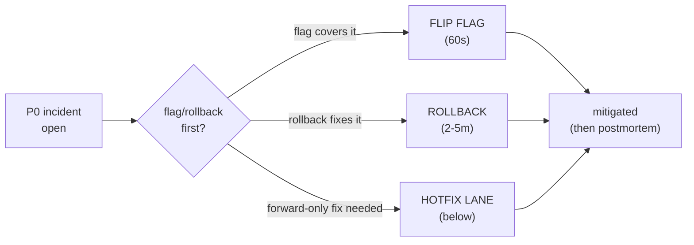

# Runbook — hotfix workflow (emergency change procedure)

> When to reach for this: a **P0 incident** is live; the normal-flow
> CI/CD pipeline (lint → test → scan → sign → push → Argo CD sync) is
> too slow to mitigate. You need to ship code/config in 5-15 minutes,
> not 45-60. This runbook is **the emergency lane**: bypass branch
> protection, use a CI fast-path, ship the fix, then clean up.
>
> **The non-negotiable**: every hotfix is followed by a postmortem +
> a return-to-normal-flow PR + a CloudTrail review. Hotfixes are a
> **tool**, not a **norm**. The "hotfix became normal" anti-pattern is
> what this runbook is most concerned to prevent.

## When NOT to use this runbook

- **P1 / P2 incidents.** The normal pipeline is fast enough; the
  cost of the hotfix (cleanup, audit, postmortem) exceeds the
  benefit.
- **A bad image you want to roll BACK.** Use
  [`../rollback/code-rollback-argocd.md`](../rollback/code-rollback-argocd.md)
  or [`../rollback/code-rollback-rollouts.md`](../rollback/code-rollback-rollouts.md);
  rollback is faster than hotfix and lower risk.
- **A bad config you want to revert.** Use
  [`../rollback/config-rollback-argocd-app.md`](../rollback/config-rollback-argocd-app.md).
- **The fix is unknown.** Hotfix is for shipping a KNOWN fix fast.
  If you don't know the fix yet, you're still in the
  "diagnose" phase of the incident — open the relevant alert runbook,
  not this one.

## When to use this runbook

- **P0**: production is down for ≥ 50% of customers; OR data loss;
  OR safety/regulatory.
- **The fix is known and small** (a one-line code change, a config
  toggle, a feature-flag flip).
- **The normal CI pipeline cannot ship in time** (e.g. the test suite
  takes 30 min; the customer-impact clock is 15).

## Pre-flight (≤ 30 seconds)

Three quick decisions:

1. **Can a feature-flag flip mitigate?** If yes — flip it FIRST
   (`../feature-flags/README.md`). 60 seconds to mitigate; no PR
   needed; no postmortem-debt accrued. **Always try this first.**
2. **Can a rollback mitigate?** If yes — rollback FIRST (see the
   "When NOT to use" section). 2-5 minutes to mitigate.
3. **Hotfix is the right tool when (1) and (2) don't apply.** A
   forward-only fix is required (e.g. the bug is in a brand-new
   feature with no rollback target).

## The hotfix lane



## Step 1 — Declare a hotfix (≤ 60 seconds)

```sh
# In #bookstore-platform-status:
#   "DECLARING HOTFIX — INC-2026-05-20-001 P0
#    Symptom: <one sentence>
#    Approver: <name; an SRE Lead OR Eng Manager>
#    Cleanup-owner: <name; usually the hotfix author>
#    Expected merge ETA: <HH:MM UTC>"
```

The **approver** is named upfront. Without an approver, the bypass
buttons in Step 3 / Step 4 should NOT be used. The **cleanup-owner**
is responsible for the return-to-normal-flow PR within 24 hours and
the postmortem within 48.

## Step 2 — Write the fix (≤ 5 minutes)

```sh
# Branch off main / prod with the conventional hotfix prefix.
git checkout -b hotfix/INC-2026-05-20-001-catalog-nil-deref

# Apply the smallest possible change. ONE concern per hotfix.
# DO NOT bundle "while I'm in here" cleanups; they bypass review.

git diff
# Should be a small, surgical diff. If > 50 lines, you're doing too
# much in one hotfix.

git commit -m "hotfix(catalog): nil-deref on missing tenant header

  INC-2026-05-20-001
  approver: @alice
  cleanup: @bob will open follow-up PR with tests within 24h."
```

The commit message MUST include the incident ID and the approver
handle — the audit trail starts here.

## Step 3 — Branch protection bypass

Branch protection rules normally require:
- ≥ 1 reviewer approval
- All required status checks (lint, test, scan, signature) passing
- Up-to-date with base

For the hotfix lane, **repo admins** can bypass via GitHub's "Merge
without review" option. The Bookstore Platform repo's main branch
allows bypass for the `@platform-admins` team only; admin actions
post to `#bookstore-platform-audit`.

```sh
# Push the branch.
git push origin hotfix/INC-2026-05-20-001-catalog-nil-deref

# Create the PR.
gh pr create \
  --title "HOTFIX: INC-2026-05-20-001 catalog nil-deref on missing tenant header" \
  --body "P0 incident — bypassing normal review.
Approver: @alice
Cleanup-owner: @bob
Cleanup PR: <will follow within 24h>
Postmortem: <will follow within 48h>

The fix is single-line; the bug is documented inline.
"
```

**Do not click "Merge" yet** — the CI fast-path runs first (Step 4).

## Step 4 — CI fast-path

The fast-path workflow (`.github/workflows/hotfix-fastpath.yml`; see
`examples/bookstore-platform/ci/` for the canonical app pipeline)
runs ONLY:

1. **Lint** (gofmt, golangci-lint) — < 2 min.
2. **Unit tests** for the changed package only — < 2 min.
3. **`scan` (Trivy / Snyk) — KEPT** even in fast-path; never bypassed.
4. **Build + cosign sign + push** to ECR — < 4 min.

The fast-path SKIPS:
- Full integration test suite (the slow piece; 15-30 min).
- E2E browser tests.
- Performance regression tests.

These re-run on the cleanup PR (Step 7).

Trigger:

```sh
# The fast-path workflow runs on PRs labeled `hotfix`.
gh pr edit <PR_NUMBER> --add-label hotfix
# This kicks off .github/workflows/hotfix-fastpath.yml; takes ~5 min.

gh pr checks <PR_NUMBER>
# Wait for: lint, unit-changed-package, scan, build-sign-push. All green.
```

If `scan` fails on a new CVE — **stop**. A hotfix that introduces a
CVE is not a hotfix. Flag flip / rollback instead.

## Step 5 — Merge + sync

```sh
# Admin merge (bypasses required reviewers).
gh pr merge <PR_NUMBER> --admin --squash
# Audit log entry posts to #bookstore-platform-audit:
#   "@alice merged PR #4321 (HOTFIX:...) via admin bypass"

# Argo CD sync — usually auto-sync picks it up in <60s, but for a
# hotfix, force the sync to skip the wait.
argocd app sync bookstore-catalog-us-east --prune
argocd app wait bookstore-catalog-us-east --health --sync
# Application healthy + synced -> mitigation in flight.

# (If catalog is deployed via Argo Rollouts canary, the Rollout will
#  ramp 10% → 25% → 50% → 100% over 10-30 minutes. For P0 hotfixes,
#  consider `kubectl argo rollouts set image` + `promote --skip-current-step`
#  to skip the canary entirely. The trade-off: faster mitigation, no
#  canary safety net.)
```

## Step 6 — Verify

Same as any rollback: re-query the metric that triggered the
incident; confirm recovery.

```sh
# Symptom metric, e.g. error rate:
kubectl -n prometheus-system exec -ti prometheus-kube-prometheus-stack-prometheus-0 -- \
  promtool query instant http://localhost:9090 \
  'sum(rate(http_requests_total{service="catalog",code=~"5.."}[5m])) / sum(rate(http_requests_total{service="catalog"}[5m]))'
# Expect: drops below 0.01 within 2-3 minutes.
```

If the symptom does NOT recover, the hotfix was wrong. Roll back
the hotfix (it's just a commit; revert + sync). Do not chain another
hotfix; treat the situation as a new incident.

## Step 7 — Cleanup (within 24 hours)

The cleanup-owner (named in Step 1) opens a follow-up PR:

```sh
git checkout -b cleanup/INC-2026-05-20-001-catalog-tests

# Add the tests that would have caught the bug.
# Add the documentation.
# Add the integration test that runs in the slow pipeline.
# Address any "while I was there" issues SEPARATELY from the hotfix.

gh pr create \
  --title "Cleanup: INC-2026-05-20-001 catalog hotfix - tests + docs" \
  --body "Follows hotfix #4321 in INC-2026-05-20-001.
Includes:
- Regression test for the nil-deref (unit + integration).
- Inline docs explaining the missing-header path.
- A Kyverno policy to prevent the class of bugs (Tier 4 example only).

Reviewers: standard flow; no bypass.
"
```

This PR runs the FULL pipeline (no fast-path); reviewers approve;
merge through the normal flow. The cleanup PR is mandatory.

## Step 8 — Postmortem (within 48 hours)

Open `../runbooks/postmortem-template.md`. Mandatory hotfix-specific
sections:

- **Why was a hotfix needed?** "Normal CI is too slow" is not a
  root cause; "the test suite is 30 min; we need it to be 10 min" is
  an action item.
- **Was branch protection bypass justified?** If 80% of postmortems
  answer "yes, but the hotfix could have been a rollback", → action
  item: train the team on the rollback playbook.
- **Was the breakglass IAM role used?** If so, see `cleanup-after-
  breakglass.md` for the credential-rotation requirements.
- **What's the cleanup PR status?** Linked + merged by the
  postmortem deadline (48h).

## Step 9 — Audit log review (within 1 week)

The hotfix admin-merge + breakglass actions appear in:
- GitHub's audit log (`@platform-admins` actions).
- CloudTrail (every AWS API call made under the breakglass role).
- `#bookstore-platform-audit` (every admin action posts here via
  GitHub App).

A platform-team member (NOT the hotfix author) reviews:

1. Every `admin merge` in the hotfix window — was the approver
   correct?
2. Every breakglass action — was the scope minimal?
3. Any **unrelated** actions in the breakglass session — investigate.

Findings go into the postmortem.

## The footguns

### "I used breakglass and forgot to clean up"

The breakglass role's TTL (`cleanup-after-breakglass.md`) is 1 hour.
After expiry, the credentials are auto-rotated by the Vault auth
method. **But**: the artifacts the breakglass user created (RDS
snapshots, IAM users, S3 buckets) outlive the role. The cleanup
checklist in `cleanup-after-breakglass.md` is mandatory.

### "The hotfix became normal"

If the same engineer ships > 1 hotfix per quarter, the team has a
process bug, not a tool. Mitigations:
- The platform-team's **quarterly review** counts hotfix PRs by
  author; > 4 per quarter is a code-yellow conversation.
- A **rate-limit** on hotfixes: > 3 hotfixes in a 7-day window
  triggers a mandatory team review BEFORE the next one.
- A **CI investment**: most "we hotfixed because CI is too slow"
  has the same fix — make CI faster (parallelise tests, cache deps,
  remove flaky ones). This is the unsexy long-term fix.

### "I bypassed scan because it failed"

The fast-path NEVER skips `scan`. A hotfix that ships a known CVE
is a security event in addition to the original incident.

### "I shipped multiple unrelated changes in one hotfix"

One concern per hotfix. Bundling "while I was there" changes
bypasses review for those changes; that's a process bug masked by
the incident.

## Quick reference

```sh
# 1. Declare in Slack with approver.
# 2. Branch + commit + push.
# 3. Open PR; add `hotfix` label.
# 4. Wait for fast-path CI (~5 min); all green.
# 5. Admin-merge; force Argo CD sync.
# 6. Verify the metric recovers.
# 7. Open cleanup PR within 24h.
# 8. Postmortem within 48h.
# 9. Audit log review within 1 week.
```

## Related runbooks

- [`cleanup-after-breakglass.md`](cleanup-after-breakglass.md) — for
  any hotfix that USED the breakglass IAM role.
- [`breakglass-iam-policy.json`](breakglass-iam-policy.json) — the
  IAM policy for the breakglass role.
- [`../rollback/code-rollback-argocd.md`](../rollback/code-rollback-argocd.md) —
  the rollback path (try this first; it's faster than hotfix).
- [`../feature-flags/README.md`](../feature-flags/README.md) — the
  kill-switch path (try this first; it's faster than rollback).
- [`../runbooks/postmortem-template.md`](../runbooks/postmortem-template.md) —
  the postmortem template for the 48h writeup.

## When this runbook last worked

| Date       | Incident                              | Resolved by                       | Notes |
|------------|---------------------------------------|-----------------------------------|-------|
| 2026-04-02 | INC-2026-04-02-001 catalog nil-deref  | Hotfix; 14 min mitigate-to-merge  | flag flip would have worked too; hotfix author chose forward fix |
| 2026-01-29 | INC-2026-01-29-002 orders saga lock   | Rollback; hotfix path NOT used    | postmortem confirmed rollback was correct call |

> Stale after **90 days** without exercise. Quarterly chaos game-day
> SHOULD include a hotfix-lane drill (a fake P0 + the team runs the
> full sequence in dry-run mode).
